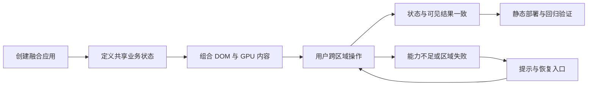

# Rustify UI：融合 Leptos CSR 与 Makepad 的 WebAssembly UI 框架 PRD

> 版本：0.1 · 日期：2026-09-08 · 状态：完整评审草稿，产品范围尚待确认。
> 用户指定参考：`ref/leptos-main`、`ref/makepad-dev`。Rustify UI 为沿用仓库名的工作名称。
> 当前没有框架实现、构建或性能测试结果；本文中的性能数字均为建议验收目标。
> 未写入 SPMS：本会话没有 SPMS 工具，无法读取项目、查重或创建需求。R01–R40、T01–T40 均为本地工作号，不是已分配的 FR/NFR/TC key。
> 本文回答产品做什么、为什么做、怎样验收；接口签名、运行时拓扑、构建链路与实施计划交由后续技术设计。

## 0. 产品定义与阅读说明

让 Rust 开发者在一个浏览器应用里，组合 Leptos CSR 的 Web 界面能力与 Makepad 的 GPU 界面能力，共享应用状态、交互语义和生命周期，交付可部署、可调试、可访问的复杂 UI。

用户已经明确的是融合对象、CSR 和 WebAssembly 方向，以及需要完善详尽的 PRD。用户尚未指定首批应用、融合深度、浏览器范围和发布预算。本文将这些分成已核实事实、产品建议、待确认决策，避免把推测变成用户承诺。

**供评审的推荐产品形态**：面向浏览器中的 IDE、编辑器与数据工作台，提供统一的应用开发体验；保留 DOM 与 GPU 区域的明确能力边界，实现二者协作。允许开发者有意识地选择呈现能力，不承诺任意 HTML/CSS 与任意 Makepad Widget 自动互转。

Q1（融合形态）和 Q2（首批应用）已在会话中提出，尚未获得答复。以下详细需求描述的是这个推荐方案采用后的产品契约，**不是已经拍板的范围**。改变这两项需要重新审视关联条目，不能仅修改文档摘要。

建议评审顺序：§1 事实与目标 → §2 范围和术语 → §3 场景 → §4–6 验收契约 → §7 决策 → §8–9 追踪及落库。

## 1. 背景、事实与目标

### 1.1 谁遇到什么问题

Rust 应用开发者构建复杂 Web 工具时，既需要浏览器表单、路由、文本选择和生态组件，也需要可定制绘制、高密度数据交互与桌面工具式工作区。分别使用两套 UI 能力时，开发者必须解决状态重复维护、焦点互相抢占、输入事件重复处理、跨区域坐标和卸载资源等问题。

组件作者还面临兼容性表达困难：组件可以在浏览器显示，不等于具备浏览器语义；GPU 图形可以响应鼠标，不等于支持输入法或屏幕阅读器。应用交付者需要知道哪些能力可依赖、失败时如何恢复，以及是否需要特殊部署条件。

这些是根据两份参考源码提出的产品问题假设。当前没有用户访谈、市场规模、采用率或现网性能数据，不能据此声称已有付费需求或优于其他框架。

### 1.2 仓库与参考实现核查

本仓库当前跟踪技能及配置文件，没有根级框架源码、Cargo 工作区或既有 PRD；没有找到宿主项目的 CONTEXT/ADR。`ref/` 被 `.gitignore` 忽略，两份参考目录没有各自的 `.git`，因此目录名称不能当作锁定的上游提交。

| 编号 | 本次核实的事实 | 对产品要求的影响 | 证据 |
| --- | --- | --- | --- |
| E01 | Leptos 包声明版本为 0.8.20，工作区 rust-version 为 1.88；CSR、hydrate、SSR 是不同 feature | 本期范围可以限定 CSR；不能把 SSR/hydration 作为已承诺能力 | [Leptos 清单](../ref/leptos-main/leptos/Cargo.toml)、[工作区清单](../ref/leptos-main/Cargo.toml) |
| E02 | `reactive_graph` 提供 signal、派生计算和 effect；effect 采用异步调度 | 需要明确状态变化、异步完成和可见呈现的先后关系 | [响应式系统说明](../ref/leptos-main/reactive_graph/src/lib.rs) |
| E03 | Tachys 当前 `Rndr` 为 DOM；注释说明泛型渲染方案曾因编译问题移除 | “实现一个 Renderer 即可复用全部 Leptos 组件”不是当前可依赖的事实 | [渲染器定义](../ref/leptos-main/tachys/src/renderer/mod.rs) |
| E04 | Leptos `mount_to` 返回管理 owner 和卸载的 handle；`mount_to_body` 会保留生命周期 | 嵌入和销毁必须有明确产品契约，不能只展示一次启动 | [挂载入口](../ref/leptos-main/leptos/src/mount.rs) |
| E05 | Makepad widgets/platform 清单声明 2.0.0；计数器示例采用 `script_mod!`、Widget 事件与显式 render | 参考当前 dev 快照，不能用历史 `live_design!` 示例代表当前融合成本 | [控件清单](../ref/makepad-dev/widgets/Cargo.toml)、[示例](../ref/makepad-dev/examples/counter/src/main.rs)、[Widget](../ref/makepad-dev/widgets/src/widget.rs) |
| E06 | Makepad Web 渲染获取 `webgl2` 上下文 | GPU 浏览器能力检测与不可用提示是必要需求；WebGPU 不是此快照已验证的 Web 后端 | [WebGL 入口](../ref/makepad-dev/platform/src/os/web/web_gl.js) |
| E07 | Makepad Web 存在 window/document 事件处理、隐藏 textarea、blur 后重新聚焦，以及页面级光标操作 | 多实例、宿主共存、Tab 导航和输入法必须独立验收；不能假定 canvas 嵌入即可安全共存 | [Web 交互](../ref/makepad-dev/platform/src/os/web/web.js) |
| E08 | Makepad Web 分支对 `AccessibilityUpdate` 的处理为空；部分平台剪贴板和外部拖出操作不受支持 | 无障碍、复制粘贴和文件交互须按具体路径验证，不能从原生能力推导 Web 全量支持 | [平台操作分派](../ref/makepad-dev/platform/src/os/web/web.rs) |
| E09 | Makepad 工具已有 `--bindgen`、`--no-threads`、压缩和拆分选项；bindgen 路径包含生成 JS 的文本修改 | 存在集成入口，但具体版本组合、单线程运行及融合产物需要验证，不能承诺开箱即用 | [选项](../ref/makepad-dev/tools/cargo_makepad/src/wasm/mod.rs)、[构建逻辑](../ref/makepad-dev/tools/cargo_makepad/src/wasm/compile.rs) |
| E10 | Makepad 含 DataGrid、Dock 等源码 | 可以作为能力参考；存在源码不等于本框架已有封装、Web 兼容性或性能保证 | [DataGrid](../ref/makepad-dev/widgets/src/data_grid.rs)、[Dock](../ref/makepad-dev/widgets/src/dock.rs) |

Leptos 官方区分 CSR 与服务端渲染，并提供 CSR 部署说明；这支持把“浏览器运行、静态资源交付”作为独立产品范围。[CSR 说明](https://book.leptos.dev/csr_wrapping_up.html)、[CSR 部署](https://book.leptos.dev/deployment/csr.html)

浏览器共享内存能力受跨源隔离及权限策略条件影响。因此，普通部署和需要隔离条件的增强能力必须分别声明支持条件，不能仅依据浏览器名称推断可用。[MDN：crossOriginIsolated](https://developer.mozilla.org/en-US/docs/Web/API/Window/crossOriginIsolated)

**证据边界**：以上为源码阅读和官方资料核对，未编译两份参考、未运行融合 PoC、未做浏览器兼容测试。根目录 Leptos `ARCHITECTURE.md` 包含历史 API 名称，产品判断优先采用本次读取的当前代码。选定文件指纹见 [参考快照记录](PRD-WASM-UI-SOURCES.json)。

### 1.3 产品目标

| 目标 | 希望产生的结果 | 采用推荐方案后的完成判据 |
| --- | --- | --- |
| G1 降低接入成本 | Rust 开发者独立完成首个融合应用 | 5 名符合画像的新用户中至少 4 名，在依赖已安装环境下 30 分钟内完成示例修改与本地运行 |
| G2 消除交互分裂 | DOM 与 GPU 内容表现为同一个应用 | 状态、焦点、输入法、叠层和路由关键场景全部通过；10,000 次离散动作无丢失、重复或最终状态分歧 |
| G3 支撑复杂工具 | 高密度场景保持可操作 | §5 固定负载满足 R30 指标，滚动、选择和跨区编辑不因不可见数据量增加失去响应 |
| G4 能够可靠交付 | 应用可部署、诊断并从局部故障恢复 | 支持矩阵必测项全部通过，3 类部署样例可运行，GPU 故障不造成已确认应用数据丢失 |
| G5 可以长期使用 | 团队能够扩展、升级和回归验证 | 公开稳定能力有文档与测试定位方式，3 个示范应用通过验收，版本升级差异有可复现说明 |

采用率、社区人数、下载量和商业收入不列为首个版本的工程验收门槛；产品验证后可另立运营目标。

## 2. 产品范围、规范词与用户

### 2.1 “融合”的承诺层次

| 层次 | 推荐承诺 | 明确的可观察边界 |
| --- | --- | --- |
| 应用层 | 一份业务状态定义、一套生命周期体验，DOM 与 GPU 区域相互驱动 | 不要求业务代码维护两套可独立变更的同义状态 |
| 组件层 | 一致的属性、事件、受控状态、主题和文档表达 | 原生 Leptos 组件仍有 DOM 属性；Makepad 扩展明确标识能力范围 |
| 呈现层 | 页面中组合两类区域，并支持受约束的跨区浮层 | 允许不同区域有不同呈现方式；同一功能必须声明可用范围 |
| 浏览器层 | 路由、焦点、输入法、权限、可访问性与宿主页面协作 | GPU 显示不能替代语义、焦点和辅助技术支持 |
| 交付层 | 一套接入说明可得到完整浏览器应用 | 产物中有少量 JS/HTML/CSS 和资源不违背 wasm-based；不承诺零 JavaScript |

**统一体验的最低验收**：同一应用中从 DOM 修改选中项 → GPU 同步高亮 → 在 GPU 重命名 → DOM 更新名称 → 打开覆盖 GPU 的表单 → 保存后前进/后退仍一致；应用业务代码不需要逐项编写双向状态搬运。

### 2.2 支持能力的表达

每项公开组件能力均标识：稳定支持、实验支持、未支持、不适用四种状态。实验能力不得成为首个完整版本关键场景的唯一实现路径。稳定指本项目声明的兼容契约，不能由上游是否标记 stable 推导。

| 能力类型 | 首个完整版本建议范围 |
| --- | --- |
| Leptos 原生 DOM 内容 | 保留 HTML 语义、CSS、表单、链接、第三方 DOM 组件的声明范围 |
| GPU 区域 | 自定义绘制、命中、状态绑定和 Widget 组合，具备宿主共存能力 |
| 跨区基础能力 | 主题、焦点、受控值、动作、浮层、禁用态、错误态与卸载语义一致 |
| 双呈现组件 | 只对组件目录明确列出的能力承诺语义一致；不承诺字体栅格化逐像素一致 |
| 专用扩展 | 允许直接使用两套上游能力；使用者能够识别哪些操作离开统一契约 |

### 2.3 领域语言

| 规范词 | 本项目含义 | 容易混淆的说法 |
| --- | --- | --- |
| 融合应用 | 在一个浏览器文档内协作使用两种 UI 能力的应用 | 两个 iframe 简单拼接 |
| DOM 区域 | 使用浏览器元素语义的呈现区域 | “普通 UI” |
| GPU 区域 | 使用 Makepad 绘制能力的呈现区域；不限定内部 canvas 数量 | “原生窗口”、任意 GPU API |
| 共享应用状态 | 两类区域读写同一个业务事实，对外只有一个确定的当前值 | 两份状态事后同步 |
| 应用实例 | 有独立挂载、状态和销毁边界的一次应用运行 | GPU 区域、页面、浏览器进程 |
| 呈现确认 | 状态对应的可见结果已出现，可用于测量交互延迟 | effect 被调度或绘图指令已提交 |
| 声明支持范围 | 组件公开支持的属性、交互与环境集合 | 全量兼容上游 |
| 受控组件 | 显示值服从应用传入的当前值，用户动作通知应用决定更新 | 内部值与外部值各自持久存在 |
| 可恢复区域故障 | 可重试且不必放弃整个应用实例的局部能力故障 | 任意 panic 都可被捕获恢复 |

### 2.4 用户与权限边界

| 角色 | 核心任务 | 权限与责任 |
| --- | --- | --- |
| 应用开发者 | 组合界面、绑定状态、接入业务数据 | 决定业务授权和数据保存策略；不能用客户端隐藏按钮替代服务端授权 |
| 组件作者 | 封装组件、主题与 GPU 扩展 | 声明支持范围，提供语义和清理行为；默认视为受信任应用代码 |
| 应用终端用户 | 键盘、鼠标、触控及辅助技术操作 | 按浏览器提示授予文件或剪贴板能力；拒绝后仍可退出、重试或使用替代入口 |
| 集成与交付者 | 嵌入既有站点、部署、排障与升级 | 控制资源来源及部署策略；可关闭调试信息及遥测 |
| 框架维护者 | 维护兼容矩阵和发布质量 | 对稳定契约、已知限制和回归报告负责，不负责下游应用的业务正确性 |

这是 UI SDK，不是多租户业务系统。本期不引入账号、席位、后台 RBAC 或自有数据服务，也不套用 SPMS 平台的业务错误码约定。

### 2.5 优先级与非目标

范围分为 **核心**（缺失即不能称为融合框架）、**完整版本**（满足推荐应用定位所需）、**后续**（本版明确不承诺）。该分层表达产品必要性，不是实施里程碑或排期。SPMS 的 priority 为紧急度，importance 为重要度，二者分别填写；当前无指定上线日期，不使用 urgent。

| 非目标 | 当前处置与去向 | 重新纳入条件 |
| --- | --- | --- |
| SSR、SSG、hydration、服务端函数平台 | 后续独立需求；当前用户明确 CSR | 获得首屏 SEO 或服务端渲染场景 |
| 浏览器与原生桌面/移动端同等首发 | 推荐暂缓；这是 Q2 待确认的范围 | 用户选择跨平台优先后重写兼容矩阵与场景 |
| 全量 Leptos 组件或 HTML/CSS 自动转换为 Makepad | 首版不承诺，后续研究兼容子集 | 明确组件集及新增迁移价值 |
| 全量 Makepad Widget 原样移植到 DOM | 不承诺自动转换；按公开目录适配 | 有具体组件需求与浏览器语义验证 |
| 零 JS、单一 wasm 文件、零复制 | 不作为产品承诺；技术设计决定产物和开销 | 性能证据证明某约束是必要条件 |
| WebGPU、WebXR、3D 游戏引擎、音视频工作站 | 后续专题需求 | 有实际用户与设备预算 |
| 完整 IDE、语言服务器、富文本编辑器、电子表格公式引擎 | 示范应用只验证框架能力；成品另立项 | 成为独立产品目标 |
| 任意 DOM/GPU 像素级交错与任意 3D CSS transform | 首版限于声明的区域和浮层组合 | 有可验证场景并明确命中、裁剪与语义规则 |
| 不受信任插件市场、运行时执行用户任意代码 | 明确不做；受信任扩展不等于沙箱 | 完成独立威胁模型与权限产品设计 |
| 云同步、协同编辑、离线自动保存、业务撤销历史 | 应用负责；框架提供状态与事件能力 | 明确数据语义与冲突策略后独立立项 |
| 手机生产级完整交互及全部移动浏览器 | 推荐作为后续；当前提供窄屏诊断/基本查看 | Q2 选择移动优先或真实场景进入首版 |
| 商业组件商店、可视化搭建器、AI 生成功能 | 不因上游有相关工具而自动纳入 | 单独产品调研及需求批准 |
| 所有 Rust 修改保留全部运行状态的热更新 | 首版只承诺明确的更新与状态重置说明 | 可复现地证明扩展范围可维护 |

## 3. 用户旅程与关键场景

### 3.1 主旅程

1. 应用开发者按照文档创建浏览器应用，运行带 DOM 工具栏与 GPU 内容区的示例。
2. 用一个业务状态描述选中项和属性，添加一个输入控件与一个 GPU 可选对象。
3. 终端用户在 GPU 区域选择对象，在 DOM 表单编辑属性，立即看到一致的呈现。
4. 用户用键盘打开命令、切换面板、输入中文并保存；缩放或拖动分隔栏后仍能准确操作。
5. 开发者构建资源，部署到根路径或子路径，通过深链接打开同一视图。
6. 遇到资源加载或 GPU 故障时，用户看到明确状态，开发者能够定位故障并按契约恢复。



### 3.2 场景与边界

这些场景是待用户评审的场景种子，不代表已经完成用户访谈。

| 场景 | 给定 | 操作 | 可观察结果与压测边界 |
| --- | --- | --- | --- |
| S01 首次接入 | 已安装声明的工具链，开发者首次使用框架 | 创建应用，修改按钮和 GPU 标签并运行 | 按文档完成；失败有具体指引，无须先修改两份上游源码 |
| S02 状态一致 | DOM 属性面板与 GPU 选择视图共用 1,000 项数据 | 两侧交替修改、批量更新、删除选中项 | 两侧值一致，删除后选择规则一致，10000 次离散动作不重复 |
| S03 动态组合 | 100 个有稳定业务 ID 的编辑项 | 反序、插入、移除、切换条件区域 | 身份和编辑值正确；移除项不再响应；重复 ID 有诊断 |
| S04 输入焦点 | DOM 输入、GPU 输入、模态表单和快捷键同时存在 | Tab、中文组词、Esc、复制粘贴、关闭弹窗 | 只有活动控件消费输入，组合期间不误触命令，关闭后焦点可预测 |
| S05 几何与浮层 | 两个滚动容器、可调整面板、GPU 锚点 | 缩放、滚动、拖动分隔栏、打开菜单 | 显示和命中位置一致，浮层不被错误裁剪或穿透 |
| S06 大数据 | 100,000 行表格或 10,000 个 GPU 可交互对象 | 滚动、筛选、排序、框选、跨区编辑 | 数据不截断，结果正确，满足 §5 的独立负载指标 |
| S07 异步竞争 | 请求 A 较慢，请求 B 较快，视图可随时关闭 | 连续搜索、重试、离开视图 | 采用当前查询结果，旧结果不覆盖新结果，已卸载区域无业务回调 |
| S08 多实例宿主 | 同页 2 个应用实例，各含 2 个 GPU 区域，旁边有普通 HTML | 交替操作，关闭其中一个，再操作其余内容 | 焦点、主题和状态不串扰；宿主链接、选择与滚动正常 |
| S09 能力失败 | GPU 不可用、资源 404、图形上下文丢失 | 打开应用、故障期间编辑 DOM 字段、重试 | 故障可见；非故障内容按声明继续使用；恢复后应用状态一致 |
| S10 浏览器授权 | 文件或剪贴板能力被拒绝，另有只读组件 | 复制、导入、取消授权、尝试修改只读值 | 不伪报成功，不绕过授权，不产生修改，保留可行的替代入口 |
| S11 辅助技术 | 键盘用户或屏幕阅读器用户操作示范应用 | 选择、编辑、打开菜单、改变数据、关闭模态框 | 名称、角色、值、错误与焦点顺序可理解，关键任务有非拖拽路径 |
| S12 部署与历史 | 应用部署于 `/` 或 `/tools/demo/`，URL 含视图参数 | 刷新、前进、后退、复制深链接、升级资源版本 | 链接对应视图，无重复导航；部署错误给出可定位说明 |
| S13 扩展与升级 | 自定义 GPU 控件、1 个第三方 DOM 组件、固定上游版本 | 更换主题，卸载，升级受支持版本 | 契约内行为不变；不支持能力和升级差异明确 |
| S14 长时运行 | 固定负载、资源及数据集 | 交互 2 小时并反复挂载、卸载、隐藏、恢复 | 无状态污染或持续资源增长；恢复后无旧输入重放 |
| S15 文本与国际化 | 中英文、阿拉伯文、emoji，缺失或延迟字体 | 切换语言、缩放、选择、删除、输入 | 无乱码；受支持语言排版正确；未支持语言能力明确，内容仍可读取 |

## 4. 功能需求

R01–R28 的 type 均为 `functional`，category 留空。每条包含 3 条物理独立的验收标准，行号分别为 AC1、AC2、AC3；Txx 种子覆盖本条全部三条标准，并不是已经创建的测试用例。标准依赖 §5–6 的统一口径。

### R01 创建、挂载与关闭融合应用

- 范围：核心；priority：high；importance：critical；承接：G1/G4，S01/S08；来源：用户的 wasm 框架诉求分解。
- 背景与行为：开发者需要完整应用入口和可释放的运行边界；能够在指定页面容器中启动、关闭、再次启动。
- 边界与依赖：默认运行不要求业务服务端；禁止将整页占用作为嵌入的隐含条件。依赖声明的浏览器能力，缺失进入 R26 提示。
- 验收标准：
```text
开发者按文档创建示例后，1 个页面中同时显示可操作的 DOM 按钮与 GPU 标签，按钮每点击 1 次，两者显示的同一计数增加 1。
开发者关闭应用再挂载 20 次后，每次只存在 1 份当前界面，当前按钮点击 1 次只触发 1 个应用动作。
开发者把应用挂载到不存在或已被同一应用占用的容器时，收到 1 个可定位的失败结果，页面上已运行实例仍可操作。
```
- 测试种子 T01：前置为空宿主页；创建示例、执行计数、循环关闭重建、传入无效容器；预期计数正确、无残留界面和重复动作、错误不影响已有实例。

### R02 在两类界面之间共享响应式状态

- 范围：核心；priority：high；importance：critical；承接：G2，S02；来源：融合诉求分解。
- 背景与行为：应用开发者以同一业务状态驱动 DOM 与 GPU 展示；两侧动作遵循同一更新规则，派生值保持一致。
- 边界与依赖：不强制所有底层呈现缓存共用一种表示；不把复制缓存暴露成第二个业务事实。依赖 R01。
- 验收标准：
```text
用户对 1000 项数据执行 10000 次预定义的 DOM/GPU 交替增删改动作后，两侧最终数据与独立预期清单完全一致，遗漏和重复动作均为 0。
用户一次确认批量修改 100 项时，两侧在呈现确认后显示相同的最终值，不出现把部分修改当作已完成的成功提示。
开发者将选中项名称及名称长度绑定到两类区域后，连续修改 100 次，每次稳定呈现时名称与派生长度一致，业务示例没有维护第二份可独立修改的名称状态。
```
- 测试种子 T02：前置固定 1000 项及预期动作记录；交替执行单项、批量和派生更新；预期零分歧、零重复，派生值与确认状态一致。

### R03 组合组件并保持动态内容身份

- 范围：核心；priority：high；importance：critical；承接：G2/G5，S03；来源：统一组件体验建议。
- 背景与行为：组件作者可以传递属性、子内容与动作，应用开发者可以条件显示和按业务身份重排组件。
- 边界与依赖：只对声明的跨区组合方式提供身份保证，不把两套上游任意视图类型视为可互换。依赖 R02/R05。
- 验收标准：
```text
用户编辑 100 个带稳定业务 ID 的项目后将列表反序，再插入和删除各 10 项，存活项目的编辑值和选中身份均不串位。
开发者切换条件分支 100 次后，隐藏分支不能接收用户动作，重新出现时的状态符合组件声明的保留或重置策略。
开发者提供 2 个重复业务 ID 时，开发模式给出包含冲突 ID 和组件位置的诊断，不静默把两项合并为同一项。
```
- 测试种子 T03：前置有独立编辑值的有序列表；反序、增删、切换分支并注入重复 ID；预期身份正确、隐藏内容无动作、重复得到诊断。

### R04 定义跨区更新与输入的顺序

- 范围：核心；priority：high；importance：critical；承接：G2/G3，S02/S07；来源：融合一致性建议。
- 背景与行为：开发者能够预期一次动作何时生效；高频连续输入不能冲掉点击、提交等离散操作。
- 边界与依赖：不保证任意中间值都会单独显示；批量确认后的结果及离散动作必须保留。依赖 R02。
- 验收标准：
```text
用户按固定顺序交替从两类区域提交 10000 个带序号的离散动作后，应用可观察的已接受动作序列与输入序列一致，重复和漏项均为 0。
用户连续进行 20 次价格与数量的批量修改后，每次界面在呈现确认时显示相应总额，把旧总额作为此次操作完成结果的次数为 0。
用户在每秒 120 次连续指针更新中提交 20 次点击或保存动作时，20 次离散动作均被处理，最终指针位置与最新输入一致，延迟满足 R30。
```
- 测试种子 T04：前置计数与价格数量示例；回放有序动作、批量修改与连续/离散混合输入；预期动作有序、确认结果自洽、最终位置正确。

### R05 隔离实例并完整结束生命周期

- 范围：核心；priority：high；importance：critical；承接：G2/G4，S08/S14；来源：可嵌入框架建议。
- 背景与行为：同页多个实例和多个 GPU 区域可以独立存在；销毁后结束其对用户和应用的影响。
- 边界与依赖：同源受信任代码之间的实例隔离是行为契约，不是对恶意代码的安全沙箱。依赖 R01/R04。
- 验收标准：
```text
用户在同页 2 个实例、每实例 2 个 GPU 区域中分别执行 100 次独立动作时，未参与实例的值、主题和焦点不因这些动作改变。
开发者销毁其中 1 个实例后再触发其旧计时器、异步完成和输入回放，已销毁实例产生的业务回调及可见更新均为 0，其余实例正常工作。
开发者执行 100 次挂载与卸载循环后，宿主链接、滚动和文字选择全部保持可用，资源稳定性满足 R32。
```
- 测试种子 T05：前置双实例及宿主文本；分别操作、销毁一个、完成旧任务、重复挂载卸载；预期零串扰和迟到回调，宿主可用。

### R06 呈现异步加载、失败与取消

- 范围：核心；priority：high；importance：high；承接：G2/G4，S07；来源：CSR 应用完整性建议。
- 背景与行为：应用能够在 DOM 和 GPU 区域表达加载、成功空集、成功有数据、失败和重试，处理搜索竞争与视图离开。
- 边界与依赖：数据协议与业务缓存由应用选择；取消至少禁止旧结果继续生效，不承诺浏览器已发出的远端操作一定撤回。依赖 R02/R05。
- 验收标准：
```text
开发者提供加载、空集、有数据、失败 4 种结果时，两类区域均可分别显示明确状态，失败时提供 1 个应用定义的重试入口。
用户依次查询 A、B 且 B 先完成时，页面最终只采用 B 的结果；重复 100 组后旧结果覆盖新结果的次数为 0。
用户在请求完成前关闭区域后，迟到成功或失败不会重开区域、改变当前选择或产生该区域业务回调；重复 100 次均成立。
```
- 测试种子 T06：前置可控延迟数据源；回放四态、反序完成、离开视图后完成；预期状态可辨、只采用有效结果、无迟到影响。

### R07 在融合应用内保留 DOM 与 Web 生态能力

- 范围：核心；priority：high；importance：critical；承接：G1/G2/G5，S04/S08/S13；来源：Leptos CSR 约束分解。
- 背景与行为：已有 Leptos 组件和第三方 DOM 内容可以在声明范围内使用，链接、文本选择及原生表单行为可预测。
- 边界与依赖：不承诺任意第三方库都兼容；支持范围及生命周期责任公开。依赖 R01/R05/R12。
- 验收标准：
```text
开发者嵌入 1 个原生 Leptos 表单与 1 个有初始化/销毁行为的第三方 DOM 组件后，两者可与 GPU 区域交替使用，20 次切换无焦点被强行夺回。
用户在非 GPU 宿主区域执行文字选择、链接新标签打开和滚动各 20 次，均保留浏览器预期行为，未被应用全局事件阻止。
开发者移除第三方组件并重建 20 次后，每次只存在 1 份有效组件及动作订阅；组件不支持的能力在接入文档中有明确说明。
```
- 测试种子 T07：前置原生表单、第三方可销毁控件与 GPU 区域；交替输入、浏览器操作、销毁重建；预期 Web 行为保留且无重复动作。

### R08 接入 GPU 绘制与自定义 Makepad 组件

- 范围：核心；priority：high；importance：critical；承接：G2/G3/G5，S02/S06/S13；来源：Makepad 约束分解。
- 背景与行为：组件作者可以在 GPU 区域呈现自定义内容，将属性变化和用户动作接入融合应用。
- 边界与依赖：高级绘制可以使用 Makepad 专有表达；普通应用开发者使用封装组件时不必重复声明同一业务状态。依赖 R02/R05。
- 验收标准：
```text
组件作者提供可选择、可改色的自定义 GPU 控件后，DOM 修改颜色和 GPU 选择动作均可更新共享应用状态，100 次往返结果一致。
开发者同时显示 2 个自定义 GPU 组件并销毁其中 1 个后，另一个仍响应 100 次操作，已销毁组件不再报告动作。
组件目录对每个自定义示例列出属性、动作、主题、输入、无障碍与支持环境 6 类能力状态，未支持能力不标记为稳定支持。
```
- 测试种子 T08：前置双自定义组件示例；改属性、点击、移除、核对能力表；预期状态往返一致、实例独立、能力声明完整。

### R09 协调尺寸、滚动、裁剪与显示比例

- 范围：核心；priority：high；importance：critical；承接：G2/G3，S05；来源：融合布局建议。
- 背景与行为：调整页面布局时，两类区域的显示位置和交互位置应一致；开发者可以表达填充、固定尺寸、最小最大尺寸及溢出规则。
- 边界与依赖：首版验收平移、尺寸变化、滚动及浏览器缩放；任意旋转、3D 变换不在稳定范围。依赖 R01/R08。
- 验收标准：
```text
用户在 1024×768、1440×900、1920×1080 三种 CSS 视口与 100%、125%、200% 缩放下操作 20 个固定锚点时，显示与命中误差均不超过 1 个 CSS 像素。
用户连续调整容器大小并滚动 2 层容器 100 次后，区域内容保持在声明的裁剪边界内，裁剪外点击触发内部动作的次数为 0。
区域从 0×0 或隐藏状态恢复为可见尺寸后，在 500 毫秒内恢复与当前尺寸一致的显示，旧尺寸造成的错位持续帧不超过 2 帧。
```
- 测试种子 T09：前置带网格锚点和双层滚动的示例；遍历尺寸缩放、滚动、隐藏恢复；预期坐标一致、裁剪生效、及时恢复。

### R10 使菜单、弹窗与提示跨区域正确呈现

- 范围：核心；priority：high；importance：critical；承接：G2，S04/S05；来源：融合交互建议。
- 背景与行为：用户能从任一区域打开覆盖另一类区域的菜单、提示与模态窗口，获得一致的遮挡和关闭规则。
- 边界与依赖：按公开的区域/浮层层次组合，不承诺任意两个内部像素层互相交错。依赖 R09/R12。
- 验收标准：
```text
用户从 GPU 锚点打开 DOM 菜单并滚动宿主时，在 R09 尺寸矩阵内菜单锚定误差不超过 1 个 CSS 像素，不被 GPU 区域错误遮挡。
用户在覆盖 GPU 控件的模态窗口中点击 100 次，底层被遮挡控件接收到的业务动作数为 0。
用户连续打开 2 层可关闭浮层并按 Esc 时，每次只关闭最上层；关闭后焦点返回仍存在的触发项，触发项不存在时进入文档声明的备用位置。
```
- 测试种子 T10：前置跨区锚点与双层浮层；滚动、遮挡点击、逐层关闭并删除触发项；预期位置正确、无穿透、焦点恢复明确。

### R11 统一指针、滚轮与拖拽动作

- 范围：核心；priority：high；importance：critical；承接：G2/G3，S05/S06/S10；来源：桌面工具交互建议。
- 背景与行为：用户可通过鼠标、触控板和声明支持的指针设备执行选择、拖动与缩放，跨区域时行为连续。
- 边界与依赖：首版承诺应用内拖拽与浏览器文件导入；拖出到操作系统、笔压和复杂手势另列支持状态。依赖 R09/R12。
- 验收标准：
```text
用户将对象在 DOM 与 GPU 区域之间拖动 100 次，每次有效释放只提交 1 次动作；取消、失焦或目标拒绝时提交次数为 0。
用户在嵌套滚动区操作滚轮时，仅声明消费该动作的区域滚动；达到边界后的继续滚动按文档声明的传播规则执行，20 轮结果一致。
开发者将目标设为禁用或只读后，点击、双击与拖入各 20 次均不修改其业务值，用户仍能通过键盘到达相关说明。
```
- 测试种子 T11：前置可接收、拒绝和只读三类目标；跨区拖动、取消失焦、边界滚动及禁用操作；预期动作至多一次且权限状态有效。

### R12 管理焦点、键盘导航与命令冲突

- 范围：核心；priority：high；importance：critical；承接：G2/G4，S04/S08/S11；来源：融合输入建议。
- 背景与行为：终端用户通过一条可理解的焦点顺序操作全应用；输入控件、浮层、局部命令和应用命令具有明确优先级。
- 边界与依赖：不抢占浏览器保留的不可覆写快捷键。建议优先级为输入组合/文本编辑 → 活动浮层 → 焦点区域 → 应用。依赖 R05/R10。
- 验收标准：
```text
用户用 Tab 与 Shift+Tab 遍历包含 20 个 DOM/GPU 交互项的示例时，每个可达项在相应顺序出现且有可见焦点，不进入隐藏或禁用项。
用户在 DOM 输入框连续输入 100 个字符时，GPU 区域没有焦点夺取和字符消费；切换到 GPU 输入框后反向条件同样成立。
同一快捷键同时注册于活动浮层、焦点区域和应用时，每次只执行最高优先级的 1 个允许命令；关闭区域后其快捷键不再生效。
```
- 测试种子 T12：前置混合焦点链及冲突命令；正反遍历、交替输入、逐层关闭执行快捷键；预期焦点唯一、字符不串流、命令唯一。

### R13 支持中文输入法和可靠文本编辑

- 范围：核心；priority：high；importance：critical；承接：G2/G4，S04/S15；来源：完整 UI 输入建议。
- 背景与行为：用户在公开支持的文本输入组件中进行组词、选择、删除、撤销和提交；组合文本不能成为误提交业务动作。
- 边界与依赖：首版为单行、多行纯文本，不含完整富文本或代码编辑产品；IME 平台组合见 §5。依赖 R12/R17。
- 验收标准：
```text
用户在指定中文拼音输入法矩阵中完成 20 条固定短句的组词、改选与取消后，DOM/GPU 文本值与预期完全一致，无重复提交或丢字。
用户在组词期间按 Enter 或 Esc 时，仅结束或取消当前输入组合，不额外提交表单、关闭外层窗口或执行应用命令；各重复 20 次均成立。
用户对包含中文、组合字符与家庭 emoji 的固定文本执行选择、删除、撤销和跨区焦点切换 20 轮后，文本不出现损坏的编码单元，提交结果与预期一致。
```
- 测试种子 T13：前置系统真实输入法与固定 Unicode 文本；逐句组词取消、Enter/Esc、选择删除撤销切换；预期文本完整且无额外业务动作。合成 composition 事件不能替代人工 IME 验收。

### R14 提供符合浏览器权限的复制与文件交互

- 范围：完整版本；priority：medium；importance：high；承接：G2/G4，S04/S10；来源：工具应用建议。
- 背景与行为：用户可复制和粘贴文本，通过文件选择或拖入导入资源，通过浏览器下载导出应用生成内容。
- 边界与依赖：不承诺任意目录写入、系统剪贴板所有格式或静默授权。依赖 R12/R13/R23。
- 验收标准：
```text
用户在支持授权条件下将含中文与 emoji 的 10000 字符文本在 DOM/GPU 文本组件间复制粘贴，结果与源文本一致；权限拒绝时明确提示失败并保留手动复制路径。
用户选择或拖入 1 个合法文件、1 个超出应用配置上限的文件以及 1 个不支持格式时，分别得到成功、超限和格式错误结果；后两者不会覆盖现有应用数据。
用户导出固定文本与二进制样本各 1 个后，下载内容与预期字节一致；取消文件选择时新增导入动作数为 0。
```
- 测试种子 T14：前置受控权限与应用文件限制；复制粘贴、拒绝授权、三种导入、取消、导出；预期结果诚实、数据不被失败导入破坏。

### R15 为交互内容提供可访问语义和等价操作

- 范围：核心；priority：high；importance：critical；承接：G2/G4，S11；来源：框架完整性建议。
- 背景与行为：屏幕阅读器与键盘用户能够识别控件、理解状态并完成关键任务，GPU 自绘内容具有可访问入口。
- 边界与依赖：不要求每个装饰像素对应语义对象；有业务意义的数据和操作不能仅靠像素或拖拽表达。依赖 R12/R18/R20。
- 验收标准：
```text
用户在指定屏幕阅读器矩阵中访问组件目录时，每个交互组件均可获得正确名称、角色、当前值和禁用/选中状态，缺失必需语义项数为 0。
用户完全使用键盘完成选择对象、修改属性、打开关闭模态框、执行命令和读取错误 5 条旅程，均可成功，无焦点陷阱。
用户访问大型 GPU 数据视图时，可以通过可访问的查询与导航入口找到首项、中间项和末项共 3 个目标并执行与指针相同的主操作，因不可见项目被省略而无法完成任务的次数为 0。
```
- 测试种子 T15：前置组件目录及大数据示例；读出语义、仅键盘完成五旅程、定位三类数据项；预期语义一致、无陷阱、主任务等价可达。

### R16 在两类区域中应用统一主题

- 范围：核心；priority：high；importance：high；承接：G2/G5，S05/S11/S13；来源：统一设计体验建议。
- 背景与行为：组件作者及设计系统维护者可以统一表达颜色、文字、间距、圆角、边框、层级、状态与动效偏好。
- 边界与依赖：统一语义和属性值，不承诺两种文字/图形栅格化逐像素相同；应用可局部覆盖且不能污染相邻实例。依赖 R05/R18。
- 验收标准：
```text
用户切换浅色和深色主题 20 次后，DOM/GPU 组件在 200 毫秒内共同采用当前主题，禁用、焦点、错误和选中 4 类状态均能区分。
开发者局部覆盖 1 个区域的颜色、字号和间距时，同实例其他区域及另一个实例的主题值不改变，20 次切换结果一致。
用户启用减少动态效果后，组件目录中仍然运行的非必要位移动画数为 0，全部任务完成反馈仍可被感知。
```
- 测试种子 T16：前置双实例组件目录；主题切换、局部覆盖、减少动画；预期切换同步、样式不串扰、反馈保留。

### R17 显示多语言文本、字体与方向

- 范围：完整版本；priority：medium；importance：high；承接：G2/G4，S15；来源：通用 UI 完整性建议。
- 背景与行为：应用能替换界面文案、格式化值、声明语言方向并获得明确的字体加载/缺字行为。
- 边界与依赖：首版中英文完整输入和呈现；阿拉伯文 RTL 与 emoji 进入固定呈现样本验收，不承诺所有语言或字体特性。依赖 R09/R13/R23。
- 验收标准：
```text
用户切换中文和英文界面 20 次后，框架自带控件及提示的可翻译文案全部采用所选语言，日期和数字示例采用应用指定格式。
用户查看包含中文、英文、阿拉伯文 RTL、组合字符和 emoji 的 20 条固定样本时，不出现乱码；段落方向、顺序与已评审参考样本一致。
字体加载失败或缺少 1 个指定字符时，用户获得可读后备内容或明确缺字标识，页面仍可输入和导航；字体到达后布局与命中重新满足 R09。
```
- 测试种子 T17：前置固定语言与字体样本；切换语言、核对方向、阻断字体再恢复；预期文案完整、排版达标、失败不使交互失效。

### R18 使用具有完整状态的基础组件目录

- 范围：核心；priority：high；importance：critical；承接：G1/G2/G5，S01/S04/S11/S13；来源：框架产品化建议。
- 背景与行为：开发者有足够基础组件组成实际应用，并能查询每个组件支持的呈现与交互能力。
- 边界与依赖：至少提供按钮、标签、链接、图标、单行输入、多行输入、复选、单选、开关、选择器、滑块、进度、加载提示、提示气泡、菜单、弹窗、标签页、滚动容器 18 类；每类可有明确默认呈现方式。依赖 R12/R13/R15/R16。
- 验收标准：
```text
开发者打开组件目录时，18 类组件均有可运行示例、属性与动作说明，以及 DOM/GPU/跨区支持状态；空白支持项为 0。
用户操作每类组件声明适用的默认、悬停、焦点、激活、禁用、只读、错误、加载状态时，其可见状态与动作规则一致，禁用或只读修改次数为 0。
开发者使用目录中的按钮、标签、输入、复选、滑块 5 类组件组成混合界面后，相同受控值和用户动作语义成立，应用无需因所在区域重写业务规则。
```
- 测试种子 T18：前置完整组件目录；逐类核查示例及能力、状态矩阵、组合五类组件；预期目录齐全、状态正确、业务语义一致。

### R19 组合表单并表达验证与提交结果

- 范围：完整版本；priority：medium；importance：high；承接：G2/G4，S04/S07/S10/S11；来源：工具属性编辑建议。
- 背景与行为：应用开发者组织字段、同步/异步验证、提交状态与错误，用户能定位错误并修正。
- 边界与依赖：校验规则、业务保存接口及跨字段业务事务由应用提供。依赖 R06/R13/R15/R18。
- 验收标准：
```text
用户提交含 10 个字段的混合表单时，必填、格式和跨字段规则失败均显示与字段关联的错误，焦点可到达首个错误字段，失败提交的业务保存次数为 0。
用户快速修改同一字段 20 次且异步验证反序完成时，仅当前值的验证结果影响可提交状态，旧错误覆盖当前值的次数为 0。
用户在保存进行中连续点击提交 20 次时，示例最多产生 1 次并行保存；失败保留已输入值并可重试，成功仅报告 1 次完成结果。
```
- 测试种子 T19：前置有三类校验及受控保存的表单；无效提交、验证竞态、连点提交后失败重试；预期错误可达、结果不陈旧、保存不重复。

### R20 浏览、筛选与操作大量数据

- 范围：完整版本；priority：high；importance：high；承接：G3/G4，S06/S11；来源：桌面级数据工具建议。
- 背景与行为：开发者用列表/树/表格类能力展示大于可见区域的数据，用户可按稳定业务身份选择和编辑。
- 边界与依赖：首版列表与表格保证 R30 数据负载；树提供基本导航；公式引擎、透视分析与服务端分页协议不纳入。依赖 R02/R03/R09/R15。
- 验收标准：
```text
用户浏览 100000 行、20 列、固定样本长度的表格时，可以访问首行、中间行和末行，数据不静默截断，滚动和定位性能满足 R30。
用户选中 10 项后排序、筛选、插入和删除时，存活项按业务 ID 保持选择；已删除项按声明规则清除，隐藏选中项数量有明确呈现。
用户通过键盘或辅助技术定位 1 个当前不可见项目并修改值后，再滚动使其可见，呈现值与已提交值一致，错误信息可被读取。
```
- 测试种子 T20：前置固定大表与选择集；访问三处、执行排序筛选增删、非指针修改不可见项；预期完整可达、身份稳定、性能达标。

### R21 组织可调整的工具工作区

- 范围：完整版本；priority：medium；importance：high；承接：G3/G5，S04/S05/S13；来源：首批工具应用建议，受 Q2 影响。
- 背景与行为：开发者可组织分栏、标签页、可关闭面板与命令入口；用户能调整布局并找到操作。
- 边界与依赖：首版至少分栏、标签切换和面板关闭/恢复；任意停靠树、原生多窗口不是隐含承诺。依赖 R09/R10/R12/R18。
- 验收标准：
```text
用户操作至少 3 个面板、其中包含 DOM 与 GPU 内容的工作区，调整分隔栏 100 次后内容尺寸和输入命中保持正确，面板不小于应用声明的最小尺寸。
用户切换 10 个标签页并关闭当前页时，焦点与活动页按声明规则转移，尚未关闭页面的编辑状态不丢失，关闭页不继续接收命令。
用户通过可搜索命令入口查找并执行 1 个可用操作，得到唯一动作结果；禁用命令可解释其不可用原因，且不因点击或回车执行。
```
- 测试种子 T21：前置三面板十页示例；反复调整、关闭当前页、搜索执行/拒绝命令；预期状态和焦点正确，布局可用，命令不重复。

### R22 使用统一的浏览器导航与深链接

- 范围：核心；priority：high；importance：high；承接：G2/G4，S07/S12；来源：Leptos CSR 应用约束分解。
- 背景与行为：应用能以 URL 表达可分享的视图，并通过浏览器历史在 DOM 与 GPU 发起的导航之间保持一致。
- 边界与依赖：不把全部内存状态自动写入 URL；持久化和刷新后的数据恢复由应用明确选择。依赖 R05/R06/R27。
- 验收标准：
```text
用户从 DOM 与 GPU 入口交替发起 20 次有效导航后，浏览器历史恰好增加 20 项；执行同样数量的前进/后退时，URL 与当前视图一致。
用户直接打开或刷新 3 个有效深链接及 1 个无效路径时，分别得到对应视图及应用定义的未找到页面；根路径和子路径部署结果一致。
用户离开有未提交编辑的页面时，应用可以决定允许或阻止导航；两种路径各重复 20 次，阻止后 URL 与当前内容保持原状态，允许后旧页面接收迟到结果的次数为 0。
```
- 测试种子 T22：前置多路由示例及未提交编辑；交替导航、历史遍历、刷新深链接与拦截；预期历史唯一、URL 一致、生命周期正确。

### R23 装载字体、图像与应用资源

- 范围：核心；priority：high；importance：high；承接：G1/G4，S09/S12/S15；来源：wasm 产品交付分解。
- 背景与行为：开发者可以声明界面所需资源，用户看到加载与失败状态，交付者知道完整产物及体积。
- 边界与依赖：首版至少字体、PNG/JPEG、经过声明的 SVG 使用方式及应用数据文件；任意媒体解码能力需另列。依赖 R01/R06。
- 验收标准：
```text
开发者部署包含字体、图像和应用数据 3 类资源的示例至根路径及子路径后，两类区域均可读取所需资源，错误相对路径数为 0。
用户遇到资源 404、格式损坏或网络中断 3 类失败时，看到对应失败状态与应用可用的重试/替代内容，不永久停留在无解释的加载态。
开发者构建发布产物后，获得按 wasm、JavaScript、样式、字体、图像及其他资源共 6 类分类的字节报告，分类总和与实际交付文件总和一致。
```
- 测试种子 T23：前置三类资源与两种部署前缀；加载、三类故障再恢复、核对产物；预期资源正确、错误可处理、体积透明。

### R24 在开发中定位融合边界问题

- 范围：核心；priority：high；importance：high；承接：G1/G5，S01/S09/S13；来源：开发体验建议。
- 背景与行为：开发者能够识别当前组件和区域、最近动作、应用状态版本、尺寸、焦点及错误来源。
- 边界与依赖：诊断是面向开发者的工具，不在终端用户正常流程展示内部实现。任意 Rust 修改的无损热替换不承诺。依赖 R01/R05/R23。
- 验收标准：
```text
开发者分别触发挂载失败、重复业务 ID、资源加载失败、未支持能力和跨区输入冲突 5 类问题时，每类均得到错误种类、组件或区域位置及可操作建议。
开发者在示例中选择 1 个组件后，可以查看其名称、所属实例/区域、尺寸、焦点状态和最近动作，显示信息与当前界面一致。
开发者修改样式资源或 Rust 业务逻辑时，工具明确显示本次是局部更新还是整页重载，以及运行状态保留或重置；20 次修改不出现标记保留但静默重置的情况。
```
- 测试种子 T24：前置可注入五类错误的示例；逐类触发、查看活动组件、做两类修改；预期诊断可定位，更新与状态说明真实。

### R25 从用户语义定位并回归测试界面

- 范围：核心；priority：high；importance：high；承接：G4/G5，S02/S04/S11/S13；来源：可维护框架建议。
- 背景与行为：维护者可以按稳定语义定位 DOM 和 GPU 交互项，执行操作并等待可观察结果。
- 边界与依赖：不把像素坐标作为唯一自动化入口；自动化键盘/鼠标不能替代真实 IME 和辅助技术验收。依赖 R15/R18。
- 验收标准：
```text
测试者可按稳定测试标识或角色与名称定位 20 个 DOM/GPU 交互项，执行点击、键盘输入和读取受控值，不需要依赖每次变化的屏幕坐标。
测试者修改布局尺寸并切换主题后，同一语义测试连续运行 30 次均能完成，定位到错误业务项的次数为 0。
测试者等待状态更新时，可以等待指定可见值或呈现确认；对已经卸载或不存在的对象操作，在配置的 5 秒内得到明确失败，不能无限等待。
```
- 测试种子 T25：前置语义定位示例；运行二十项操作、换主题尺寸复跑、定位不存在项；预期定位稳定、等待有限、结果可断言。

### R26 在能力失败与运行故障时提供恢复路径

- 范围：核心；priority：high；importance：critical；承接：G4，S09/S14；来源：可靠交付建议。
- 背景与行为：GPU、资源或实例出错时，用户能够判断可继续操作的范围和下一步动作。
- 边界与依赖：可恢复 GPU 故障保留应用持有的数据；整个 wasm 实例 trap 或页面崩溃不承诺自动恢复内存数据。依赖 R02/R05/R23。
- 验收标准：
```text
GPU 能力不可用或初始化失败时，用户在失败被检测后 2 秒内看到原因和替代入口，仍可使用应用声明独立于 GPU 的 DOM 功能，不出现无限白屏。
用户在一次可恢复 GPU 上下文丢失期间修改 10 个 DOM 字段后，图形能力恢复可用起 2 秒内重新呈现当前状态，已确认修改丢失数为 0；重复 20 次均成立。
发生不可恢复实例错误时，宿主能显示 1 个明确重启入口与数据恢复边界说明，不声称未持久化修改已保存；同页其他独立实例继续满足其可用契约。
```
- 测试种子 T26：前置独立实例和受控故障；禁用 GPU、丢失/恢复期间编辑、触发不可恢复错误；预期提示有限时、可恢复状态无损、严重故障如实表达。

### R27 构建并部署普通浏览器可运行的应用

- 范围：核心；priority：high；importance：critical；承接：G1/G4，S01/S09/S12；来源：wasm-based 约束分解。
- 背景与行为：交付者可从声明的开发环境生成完整 Web 产物，了解普通模式与增强能力的部署条件。
- 边界与依赖：推荐普通模式无需跨源隔离即可完成核心场景；这是待验证产品目标，不是从 `--no-threads` 推导的既成能力。依赖 R22/R23/R26。
- 验收标准：
```text
交付者在声明的干净环境按文档构建 3 个示范应用后，能够在标准静态托管中运行核心旅程，普通模式在 crossOriginIsolated 为 false 时仍正常工作。
交付者分别采用站点根路径、站点子路径和既有页面嵌入 3 类部署方式时，资源加载及所声明导航能力均通过；需要历史回退配置时文档明确给出条件。
交付者选择有额外浏览器条件的增强能力但条件不满足时，在启动前或尝试使用时获得明确诊断及普通模式选择；重复 20 次，无说明白屏次数为 0。
```
- 测试种子 T27：前置锁定环境与完整产物；三样例构建、三部署方式、无隔离及缺条件验证；预期基线可用、前提透明、失败可操作。

### R28 通过文档、示例和迁移说明完成采用

- 范围：完整版本；priority：medium；importance：high；承接：G1/G5，S01/S06/S13；来源：完善框架产品建议。
- 背景与行为：开发者需要从概念、能力选择到发布排障的完整路径，已有项目能理解迁移成本。
- 边界与依赖：示例为框架验收载体，不是承诺交付完整 IDE 或商业分析产品。依赖 R01–R27 的声明支持范围。
- 验收标准：
```text
开发者可以运行融合基础示例、属性编辑工作台和大数据交互示例 3 个应用，每个都覆盖至少 1 次 DOM 到 GPU 与 GPU 到 DOM 的状态更新。
文档包含快速开始、融合边界、状态生命周期、输入与无障碍、组件目录、主题、资源与部署、诊断、测试、升级迁移 10 个主题，所有承诺可运行的示例在发布环境通过。
已有 Leptos 应用和已有 Makepad 应用各有 1 份迁移示例，明确可保留内容、需要适配内容和未支持能力；符合画像的新用户达到 G1 的完成比例与时间目标。
```
- 测试种子 T28：前置三样例、两迁移样例与新用户环境；按文档完成操作并计时、核查主题覆盖；预期示例可复现、限制清楚、接入目标达标。

## 5. 验收环境、负载与测量口径

本节是建议验收合同。数值不是已测基线，也不是发布日期承诺；Q1/Q2 确认后，还需由产品负责人和技术负责人接受负载与预算。技术验证若不达标，应带证据调整产品范围或目标，不应把失败样本从报告移除。

### 5.1 浏览器与设备

| 环境 | 建议支持等级 | 验收要求 |
| --- | --- | --- |
| macOS：Chrome、Safari | 完整支持 | 发布冻结日的当前及上一主要版本；硬件、OS、浏览器完整版本写入报告 |
| Windows 11：Chrome、Edge、Firefox | 完整支持 | 发布冻结日的当前及上一主要版本；每个浏览器独立执行功能与故障必测集 |
| Linux 桌面：Chrome、Firefox | 兼容观察 | 首版执行启动及基础操作冒烟；未完成完整矩阵前不能宣传完整支持 |
| iOS Safari、Android Chrome | 预览/后续 | 首版至少有可理解的支持说明或只读入口；不承诺触控编辑、IME 和性能等同桌面 |
| 浏览器无 WebGL2 或 GPU 被禁用 | 降级场景 | 验证能力提示、DOM 可独立任务及显式替代路径；不承诺 GPU 内容自动完整转 DOM |
| 无 wasm 或资源加载被策略阻止 | 启动失败场景 | 在可执行的宿主能力范围提供可读说明；无法运行框架时不承诺其完整交互 |
| 非隔离普通部署 | 核心基线 | 核心场景不得把共享内存、多线程或 WebGPU 作为隐含前置 |
| 需要隔离条件的增强模式 | 可选能力 | 单独列条件、开关、依赖资源和故障路径；不替代普通模式验收 |

当前/上一主要版本是发布时选择测试版本的规则，不是此次已测试的版本列表。验收报告必须把规则替换为具体版本号；如某平台无法取得上一版本，必须在批准支持范围前解决或明确缩小矩阵，不能记为通过。

建议性能机：B-M 为 MacBook Air M1、8 GB；B-W 为 Intel i5-1135G7、16 GB、集成显卡的 Windows 11 笔记本。两者均接电、关闭低电量模式，60 Hz，1440×900 CSS 视口，DPR 1 和 2 分别验证；实际 OS、GPU/驱动、显示器、浏览器版本冻结并记录。若团队使用替代设备，需先重新确认预算，不能直接套用结果。

真实输入法至少包括 macOS 系统简体拼音 + Chrome/Safari，以及 Windows 11 微软拼音 + Chrome/Edge。辅助技术至少包括 VoiceOver + Safari、NVDA + Firefox/Chrome。输入法与辅助技术版本、设置及人工操作记录必须随报告保存。

### 5.2 固定负载

| 负载 | 数据与行为 | 测量边界 |
| --- | --- | --- |
| B0 最小融合样例 | DOM 表单 10 项、GPU 控件 20 项、1 个共享状态、首屏必需字体与图标 | 启动、资源体积、普通交互、空闲 |
| B1 属性工作台 | 3 面板、10 个标签页、1000 个业务对象、20 个可见属性、1 个菜单及模态框 | 跨区一致性、焦点、主题、布局、恢复 |
| B2 大表格 | 100000 行×20 列，每单元格 16 个 ASCII 字符，固定行高与固定列宽；同时可见最多 60 行×12 列 | 完整数据可达、滚动、选中、排序筛选和内存；数据生成/载入时间另记 |
| B3 GPU 场景 | 10000 个可交互矩形，每个含 8 个 ASCII 字符标签；不透明填充、至多 2 层重叠；连续平移与框选 | 每帧呈现、输入延迟和命中；复杂阴影、视频与任意 shader 不混入此基线 |
| B4 多实例与长时 | 2 个实例，每个 2 个 GPU 区域，采用 B0/B1 数据；100 次挂载卸载及 2 小时固定交互 | 状态隔离、重复事件、生命周期和资源趋势 |
| B5 Unicode 样本 | 20 条固定文本，覆盖中文常用字符、英文、阿拉伯文、组合字符与 emoji | 字体资产列入体积，真实 IME 与参考排版人工验收 |

B2 与 B3 分别测量，不能据此宣称同时叠加这两个负载也达到同样预算。数据分布、随机种子、选择动作和预期结果在首次基线建立时冻结；变更需要新的基线标识。

### 5.3 数字如何测

| 指标 | 定义与执行规则 |
| --- | --- |
| 首次可交互 | 从 navigationStart 到 DOM 和 GPU 各完成首次正确呈现，且可接受并显示首个测试动作；单独出现 canvas 或发出绘制指令不算完成 |
| 冷启动 | 新浏览器上下文、缓存与站点存储清空，无 Service Worker 复用；20 Mbps 下载、80 ms RTT、无额外 CPU 节流；release 产物；每组合 30 次，报告全部样本与 p50/p95 |
| 热启动 | 相同产物及所需资源已缓存，新建应用实例；记录服务缓存命中，不与冷启动混合求分位数 |
| 首次可用体积 | 首次可交互前必需的 wasm、JS、HTML、样式、字体、图像、数据及必需延后分片的实际传输体积总和；压缩方式注明；不能把必要资源移至另一个请求来规避统计 |
| 输入到呈现延迟 | 从浏览器事件时间戳到该动作引起的正确可见结果；每次运行至少 1000 个样本；报告 p50/p95/p99。提交绘图命令不能替代可见结果时间 |
| 帧间隔/卡顿 | 活跃交互 60 秒，预热 10 秒；记录有效呈现帧及最长停顿；5 次运行各自计算 p95，5 次都要达标；不将后台暂停帧混入前台指标 |
| 空闲 | B0 稳定、无动画、无请求、无计时业务任务 60 秒；框架报告的呈现次数及应用进程 CPU 增量，基线为相同浏览器空白页 |
| 内存 | 分列 wasm 已提交内存、可测 JS 保留内存和 GPU 资源估算；浏览器进程 RSS 只作辅助。wasm 高水位不回缩不是单独判定泄漏的依据 |
| 稳定性 | 20 轮预热后再测 80 轮相同挂载卸载；关注平台高水位是否持续增长、残留对象和业务影响，显式区分缓存上限与持续泄漏 |
| 正确性 | 使用独立生成的预期动作/数据清单，对最终值、身份、动作次数和呈现结果断言，不能用实现自身输出生成“期望值” |

无法直接测量真实呈现、JS 或 GPU 内存的平台，需要在报告中标记未测并提供替代观测的限制；未测项不自动通过。需要相应证据才能接受性能或资源的发布结论。真实屏幕录制/浏览器 tracing 等方法由测试设计决定。

## 6. 非功能需求

R29–R40 的 type 均为 `non_functional`。每条 category 均为 SPMS 支持枚举，3 条验收标准和同号测试种子均使用 §5 口径。它们与功能需求共同构成完整版本建议门槛。

### R29 控制启动等待与实际交付体积

- category：performance；范围：核心；priority：high；importance：critical；承接：G1/G4，S01/S12。
- 约束与依赖：B0、B1，完整支持浏览器的性能机组合；依赖 R23/R27。预算包括首屏必需字体与代码分片。
- 验收标准：
```text
B0 冷启动首次可交互 p95 不超过 2.5 秒，B1 不超过 5 秒；每个性能机与对应完整支持浏览器组合各测 30 次并独立达标。
B0 首次可用实际压缩传输体积不超过 3 MiB，B1 不超过 8 MiB；报告同时提供未压缩总量及所有必需资源分类，漏计文件数为 0。
B0 与 B1 在资源缓存命中的热启动中，首次可交互 p95 分别不超过 1 秒和 2 秒；启动失败样本单独报告，不作为快速成功样本参与统计。
```
- 测试种子 T29：前置固定 release 产物、限速网络及浏览器矩阵；执行冷热启动各 30 次并汇总网络文件；预期时延及体积满足三条预算且报告完整。

### R30 保持高密度交互的延迟与呈现质量

- category：performance；范围：完整版本；priority：high；importance：critical；承接：G2/G3，S02/S06。
- 约束与依赖：B1/B2/B3 分别执行；依赖 R04/R09/R20；不提出未经对照实验的“比 Leptos/Makepad 快若干倍”。
- 验收标准：
```text
B1 跨区选择与属性编辑的输入到呈现延迟 p95 不超过 50 毫秒、p99 不超过 100 毫秒；每组合至少 1000 个动作，错误动作数为 0。
B2 滚动和 B3 平移/框选在 60 Hz 前台场景下，有效呈现帧间隔 p95 不超过 20 毫秒、超过 50 毫秒的间隔占比不超过 1%；5 次 60 秒运行分别达标。
B2 对固定样本完成单列排序和文本筛选的结果呈现 p95 不超过 500 毫秒，操作期间取消/导航反馈 p95 不超过 100 毫秒，结果与独立预期清单一致。
```
- 测试种子 T30：前置冻结 B1–B3 和动作清单；采集延迟、帧间隔、排序筛选与取消；预期三类预算均通过且结果正确。

### R31 在空闲与不可见时减少无效工作

- category：performance；范围：核心；priority：high；importance：high；承接：G3/G4，S08/S14。
- 约束与依赖：B0 空闲与 B4 隐藏恢复；依赖 R04/R05。业务主动动画和实时任务需单独标识，不纳入无任务基线。
- 验收标准：
```text
B0 稳定空闲 60 秒时，框架主动触发的无内容变化呈现不超过 1 次，归一到单个逻辑核的平均 CPU 增量不超过 1 个百分点。
用户隐藏应用区域或切到后台后，无业务任务的区域在 1 秒内停止主动连续呈现；隐藏 60 秒期间不累计待恢复的旧输入动作。
用户恢复显示后，500 毫秒内展示当前状态且不重放隐藏期间的过时指针轨迹；隐藏/恢复 100 次的业务动作重复数为 0。
```
- 测试种子 T31：前置无动画无请求 B0/B4；空闲采集、隐藏后台、更新当前状态并恢复；预期空闲低开销、无积压、恢复及时。

### R32 使资源使用有界并验证卸载稳定性

- category：performance；范围：核心；priority：high；importance：critical；承接：G3/G4，S06/S08/S14。
- 约束与依赖：固定数据、固定字体与固定图像；依赖 R05/R20/R23。GPU 和 JS 无可比数据时不得以 wasm 单项代替总预算。
- 验收标准：
```text
B0 的 wasm 已提交内存与可测 JS 保留内存合计不超过 128 MiB，B2 不超过 384 MiB；GPU 资源另列，B0 不超过 128 MiB、B2 不超过 256 MiB。
B4 预热 20 轮后连续执行 80 轮相同挂载卸载，结束时 CPU 侧合计内存高水位相对预热基线增长不超过 8 MiB，后 40 轮增长趋势不超过每轮 64 KiB。
卸载全部区域后，保留诊断可识别的已卸载业务组件和持续活跃 GPU 资源数均为 0；允许保留的共享缓存具有文档化上限且不超过本条总预算。
```
- 测试种子 T32：前置固定 B0/B2/B4 与资源测量手段；取稳定峰值、循环挂载卸载、检查保留对象和缓存；预期峰值有界、曲线趋稳、无失活业务残留。

### R33 在长时运行和故障中保护确认状态

- category：reliability；范围：核心；priority：high；importance：critical；承接：G2/G4，S07/S09/S14。
- 约束与依赖：同一个存活应用实例持有的业务状态；依赖 R05/R06/R26。刷新后的持久化状态另由应用负责。
- 验收标准：
```text
B4 连续运行 2 小时、每秒 10 次离散动作并记录独立预期后，崩溃、未处理错误、已确认状态丢失和重复动作数均为 0。
执行资源失败、异步反序完成、区域关闭、可恢复 GPU 丢失 4 类故障各 20 次后，当前存活应用的已确认状态与预期一致；每次故障均有明确结果。
GPU 永久不可用与整个实例 trap 两类故障均在检测后 2 秒内提供声明的用户反馈或宿主反馈，自动重试不超过 3 次且不形成无限重启循环。
```
- 测试种子 T33：前置有期望日志的 B4；长时动作与六类故障注入；预期正确性不丢失、反馈有限时、重试有界。

### R34 提供真实且可回归的环境兼容承诺

- category：compatibility；范围：核心；priority：high；importance：critical；承接：G4/G5，S01/S04/S12/S15。
- 约束与依赖：§5.1 冻结后的浏览器、输入法与辅助技术矩阵；依赖 R13/R15/R27。实验能力单独统计。
- 验收标准：
```text
完整支持矩阵中的每个具体浏览器版本通过 100% 核心功能验收场景，阻塞启动、输入、数据正确性或卸载的已知缺陷数为 0。
真实输入法与辅助技术矩阵中的每个必测组合均完成对应人工用例并附结果，未执行的必测组合数为 0，不用单个浏览器结果代表同内核的全部产品。
发布说明对完整支持、兼容观察、预览和不支持环境逐项列出版本及限制，矩阵中未测项被标记通过的数量为 0。
```
- 测试种子 T34：前置冻结矩阵；逐组合运行自动和人工必测集，对照发布说明；预期覆盖无缺口、失败与未测如实标注。

### R35 让公开控件与示范旅程可访问

- category：usability；范围：核心；priority：high；importance：critical；承接：G2/G4，S11/S15。
- 约束与依赖：官方组件和 3 个示范应用；依赖 R12/R15/R16/R18。以 WCAG 2.2 AA 为评审目标，逐项判断适用性；组件局部合格不自动代表任意下游应用整页合格。[W3C WCAG 2.2](https://www.w3.org/TR/WCAG22/)
- 验收标准：
```text
官方组件与 3 个示范应用的适用 WCAG 2.2 A/AA 成功标准均有人工判定记录，未解决的失败项为 0；不适用项逐项说明依据。
普通文本对比度至少 4.5:1，大号文本至少 3:1，必要非文本视觉信息至少 3:1；200% 文本缩放时核心任务仍可完成，400% 缩放下适用重排内容不丢失。
5 条关键键盘旅程全部可完成，DOM/GPU 语义重复朗读和无标签交互项均为 0；拖拽任务均提供至少 1 条非拖拽操作路径。
```
- 测试种子 T35：前置组件目录、三样例与参考标准；人工审查、对比度缩放、辅助技术/键盘操作；预期适用项全部通过且等价路径完整。

### R36 守住浏览器授权与应用数据边界

- category：security；范围：核心；priority：high；importance：critical；承接：G4/G5，S08/S10/S13。
- 约束与依赖：框架默认产物及官方组件；受信任扩展不作为隔离沙箱。依赖 R14/R23/R24。框架不增加自有账号或远端数据收集服务。
- 验收标准：
```text
默认发布示例仅请求文档声明的应用资源和应用显式配置的数据源，向框架厂商或未知第三方发出的遥测请求数为 0；调试记录中的测试密码和令牌明文数为 0。
用户拒绝文件或剪贴板权限、导入超限文件、输入含脚本片段的普通标签文本时，各类固定样本重复 20 次，未授权读写和脚本执行次数均为 0，全部输入保持数据语义。
发布示例在文档声明的最小 CSP 策略下正常运行，要求允许任意来源脚本或 JavaScript unsafe-eval 的路径数为 0；若运行 wasm 需要相关策略许可则明确列出，缺少许可时不绕过浏览器限制。
```
- 测试种子 T36：前置网络观察、测试秘密、受限权限/CSP 和固定输入集；执行核心旅程及拒绝路径；预期无意外外发、无泄密、授权和策略生效。

### R37 让开发者在可预期时间内完成迭代

- category：usability；范围：完整版本；priority：medium；importance：high；承接：G1/G5，S01/S13。
- 约束与依赖：工具链和依赖已下载，固定参考硬件；依赖 R24/R28。冷依赖下载单独记录，不混入增量构建指标。
- 验收标准：
```text
5 名熟悉 Rust 基础且首次接触框架的参与者中，至少 4 名在 30 分钟内独立完成首次运行、跨区状态修改和本地发布预览，求助原因全部记录。
B0 已完成一次构建后，修改 1 处业务 Rust 逻辑至浏览器可验证新行为的耗时 p95 不超过 15 秒；修改受支持样式资源的耗时 p95 不超过 2 秒，各测 20 次。
针对 R24 的 5 类常见错误，至少 4 名参与者能仅凭诊断与文档在每类 10 分钟内定位到问题配置或组件，误导性成功提示数为 0。
```
- 测试种子 T37：前置新用户任务单、固定环境和错误样本；计时接入、增量修改及排障；预期比例和时延达标，问题有记录。

### R38 明确版本兼容与扩展维护责任

- category：maintainability；范围：核心；priority：high；importance：high；承接：G5，S13。
- 约束与依赖：公开稳定能力和明确锁定的上游组合；依赖 R08/R18/R28。策略为产品建议，具体版本支持周期需在首次发布前冻结。
- 验收标准：
```text
每次发布列出框架版本、Leptos/Makepad 精确来源版本或提交、Rust 工具链、浏览器矩阵、已知差异和补丁清单 6 类信息，缺项为 0。
同一声明兼容版本系列内，3 个官方示例及 2 个迁移示例在升级后通过全部稳定能力回归；任何必须修改应用源码的差异均在升级说明中有前后示例。
稳定公开能力至少提前 2 个兼容发布版本标记弃用，再按已公开的破坏性版本规则移除；确需例外时发布说明明确原因及受影响能力，不静默移除。
```
- 测试种子 T38：前置版本清单及五个示例；核验精确来源、跨版本回归和模拟弃用路径；预期承诺可复现、变更可迁移。

### R39 使诊断有用且开销受控

- category：maintainability；范围：核心；priority：high；importance：high；承接：G4/G5，S09/S13/S14。
- 约束与依赖：开发诊断和发布错误报告；依赖 R24/R25/R36。诊断开销对照使用完全相同负载和产物配置。
- 验收标准：
```text
每条框架错误至少包含错误类型、时间、实例或区域标识、框架版本和可操作建议 5 项；固定 20 个故障样本均可关联到对应区域。
开启基础诊断后，B1 输入到呈现 p95 相对关闭诊断增长不超过 5%；完整事件录制等高开销功能需显式开启，默认开启数量为 0。
默认诊断保留最近不超过 1000 条记录且总占用不超过 4 MiB，超过上限后有明确截断指示，连续运行 2 小时不会无限增长。
```
- 测试种子 T39：前置固定故障和 B1 对照；检查诊断字段、开关对照测量、超限记录；预期可定位、开销有界、截断透明。

### R40 用可复现证据判定可交付性

- category：maintainability；范围：核心；priority：high；importance：critical；承接：G4/G5，S01/S06/S12/S13/S14。
- 约束与依赖：全部声明稳定能力；依赖 R25/R27/R28，证据准备属于后续实现/测试阶段，本 PRD 不伪造结果。
- 验收标准：
```text
每条已批准功能和非功能验收标准至少关联 1 个可执行测试或有步骤与预期的人工用例，覆盖缺口数为 0，未执行用例不标记通过。
两次独立干净构建均可生成能通过 3 个示范应用验收的产物，所用依赖、参数、资源和工具版本可追溯，缺失必需资源数为 0。
每次完整版本发布附功能、性能、兼容、无障碍、故障恢复和已知限制 6 类报告，阻断关键任务或造成数据错误的未解决缺陷数为 0；不可复现结果不作为通过证据。
```
- 测试种子 T40：前置全部需求与发布候选；核验标准到用例覆盖、双干净构建及六类报告；预期证据完整、产物可用、关键缺陷清零。

## 7. 约束、依赖、产品决策与风险

### 7.1 约束来源

| 约束 | 来源与性质 | 实际含义 |
| --- | --- | --- |
| 融合 `leptos CSR（ref/leptos-main） + makepad（ref/makepad-dev）` | 用户原话，已确认 | 两套能力均有实质作用；CSR 是指定范围；参考源码必须参与事实核对 |
| `wasm-based ui 框架` | 用户原话，已确认 | 产品为框架而非单个 Demo；浏览器 wasm 是首要交付目标 |
| `完善详尽的 PRD` | 用户原话，已确认 | 交付完整范围、目标、FR/NFR、验收、场景和追踪，不仅概念介绍 |
| DOM 与 Makepad 当前渲染/输入模型不同 | E02–E09，源码事实 | 同步、输入、生命周期与兼容性不能因放在同页而省略验收 |
| 浏览器平台条件 | 官方资料与 E06/E09 | 共享内存、GPU、权限和资源策略按条件判断，并明确失败行为 |
| 尚无实现与基准数据 | 本仓库现状 | 无法宣称目标已可达或估出可靠排期；需后续验证 |

### 7.2 前置依赖与失败处置

| 依赖 | 影响需求 | 未就绪时的产品处置 |
| --- | --- | --- |
| 固定参考来源和构建兼容组合 | R01/R27/R38/R40 | 保留为研发预览，不宣布可稳定采用；不凭目录名选择滚动上游 |
| 普通模式启动可用 | R27/R29/R34 | 阻止声称支持普通静态部署；向产品负责人呈现增加部署条件或缩小范围的决策 |
| 跨区焦点及 IME 能力成立 | R07/R12/R13/R19 | 文本编辑相关核心场景不能发布；不能用英文键盘 Demo 替代 |
| GPU 业务语义可被辅助技术访问 | R15/R20/R35 | 相应可访问旅程不通过；若采用等价可访问入口，必须验证任务结果相同 |
| 固定设备、测试矩阵与可测呈现时间 | R29–R35 | 先冻结测量合同，性能数值保留为目标；未测不自动通过 |
| 字体资源能合法分发且满足必需字符 | R13/R17/R23/R29 | 替换资源或收敛语言支持范围并重新评审；不靠缺字削减体积 |
| 上游变更影响稳定契约 | R38 | 保留已验证组合；新组合先标实验，回归通过再扩展兼容承诺 |
| SPMS 工具、准确项目及需求写入授权 | §9 | 本地交付完整草稿和建单数据，不把条目写进猜测项目 |

### 7.3 产品决策记录

| 决策 | 状态 | 建议结论 | 其他方案 | 理由与影响 |
| --- | --- | --- | --- | --- |
| D01 CSR 与 wasm 交付 | 用户已给定 | 以浏览器 CSR 框架为任务基础 | SSR/原生作为主范围 | 直接来自用户；影响全篇 |
| D02 融合深度 | 待 Q1 | 统一状态及组件体验，显式 DOM/GPU 能力边界 | Leptos 中仅嵌 GPU；GPU 主体仅借用响应式；全量透明后端替换 | 覆盖两套能力优势并使兼容性可验收；影响 R02–R18/R25 |
| D03 首批应用 | 待 Q2 | 浏览器桌面级工具 | 通用表单/移动优先；Web/原生同等优先 | GPU 与复杂布局需求较清晰；影响 R20/R21、§5 全部预算 |
| D04 普通部署基线 | 待完整评审 | 核心能力无需跨源隔离 | 强制隔离、多线程增强为唯一模式 | 降低嵌入和部署条件；有明确技术验证风险；影响 R27/R29/R34 |
| D05 组件兼容边界 | 待完整评审 | 按目录声明支持，不承诺全部组件自动转换 | 全量兼容；仅暴露裸画布 | 避免隐藏迁移成本，同时要求比简单嵌入更完整；影响 R03/R07/R08/R18 |
| D06 输入与无障碍 | 待完整评审 | 核心场景包含中文 IME、键盘和屏幕阅读器 | 全部延后；只有 DOM 部分可访问 | UI 框架采用后很难再补交互语义；影响 R12–R15/R35 |
| D07 故障保证 | 待完整评审 | 区域可恢复故障保留当前应用状态，实例 trap 明示边界 | 承诺所有 panic 可恢复；故障全部刷新 | 分清能验证的数据边界；影响 R26/R33 |
| D08 指标与冻结 | 待完整评审 | 采用 §5–6 的建议负载和预算，先建立实际基线 | 任意硬件“60 FPS”；仅主观体验 | 让性能能复现并揭露成本；影响全部 NFR |
| D09 首版不含账号和云服务 | 待完整评审 | 框架 SDK；授权、保存及业务后端由应用负责 | 同时提供 BaaS/协同平台 | 保持任务与用户给定范围相称；影响 R06/R14/R19/R36 |

### 7.4 待确认问题与决策顺序

| 问题 | 类型/前置 | 待确认内容 | 推荐与影响 | 决策责任/期限 |
| --- | --- | --- | --- | --- |
| Q1 融合形态 | 阻塞产品定稿；已向用户提问 | 统一框架、Leptos 主导嵌入或 GPU 主导 | 推荐 D02；不同答案改变组件及兼容性验收，不能默认为已同意 | 用户；PRD 定稿前 |
| Q2 首批应用 | 阻塞产品定稿；已向用户提问 | 桌面级浏览器工具、通用/移动 Web 或跨平台同等优先 | 推荐 D03；不同答案改变组件、设备与输入矩阵 | 用户；PRD 定稿前 |
| Q3 完整版本契约 | 阻塞产品定稿；依赖 Q1/Q2 | 评审核心/完整版本清单、部署边界、语言与无障碍、性能预算 | 一次审阅 D04–D09 和 R01–R40 后确认或点名修改；无需再泛化访谈 | 用户及技术负责人；PRD 定稿前 |
| Q4 SPMS 项目 | 阻塞外部落库，不阻塞本地草稿 | 准确 projectId、现有需求与可用工具 | 当前无默认项目；接通后先只读核查再按清单创建/更新 | 项目负责人；SPMS 写入前 |
| Q5 发布名称 | 非阻塞 | 最终框架品牌名称 | 暂用仓库名称 Rustify UI；不影响能力及验收 | 产品负责人角色，具体人待指定；首次对外发布前 |

本稿没有把阻塞问题伪装成默认值。这里的“推荐”是可审阅提案；只有得到明确范围确认后，才能将其改成已定决策。当前尚未进行共同理解确认，不能称为批准或定稿 PRD。

### 7.5 高风险假设及可证伪条件

| 风险 | 证据/未知 | 证明可接受需要什么 | 不成立的后果 |
| --- | --- | --- | --- |
| 两套运行模型相互干扰 | E02/E04/E07 | S02/S07/S08 的确定性、无迟到回调与无焦点抢占 | 融合核心场景不成立，不能仅保留静态演示宣告完成 |
| 将 Tachys 误判为即插即用多后端 | E03 | 公开组件兼容表和真实样例，明确哪些可直接复用 | 重新审视范围及兼容承诺；不能隐含承诺全量替换 |
| 新 Makepad DSL 和上游漂移 | E05/E09 | 固定版本组合、可重现构建和升级差异 | 加大维护成本；发布范围收敛到已验证组合 |
| 中文、emoji 与字体预算冲突 | E07，加上尚未测量 | B5 真实输入与首屏资源一起计入 R29 | 调整体积/启动预算或语言范围，须产品评审 |
| GPU 可访问性差距 | E08 | R15/R35 在完整示范旅程中的人工结果 | 不能宣传完整可访问；关键任务需补足等价路径 |
| 普通部署与 bindgen 兼容未证实 | E09 | 无隔离环境下完整构建/启动/输入/卸载的证据 | D04 需产品决策，不可假定上游选项已解决融合问题 |
| 性能承诺缺少基线 | 当前无 PoC 或测量 | §5 固定环境、全部样本、准确可见结果测量 | 目标仍为目标，不得当作现有性能优势 |
| 故障恢复承诺过宽 | Web 图形能力可丢失，实例错误与区域故障不同 | 丢失/恢复及 trap 分别测试，应用状态所有者边界明确 | 缩小保证并明示恢复边界，不伪报数据保存 |

图形上下文可能处于丢失状态，这是需要专门处理和验证的浏览器情形；本稿由此提出区域故障需求，具体恢复行为仍需要实现证明。[MDN：isContextLost](https://developer.mozilla.org/en-US/docs/Web/API/WebGLRenderingContext/isContextLost)

## 8. 需求追踪与验收闭环

### 8.1 原始诉求的分解与下场

用户原句只有一条，R01–R40 是从该句拆出的工作条目。其中场景、范围和数值为本稿提出的候选内容，不能反过来标成用户已经提出了这些细节。

| 原话片段 | 分解工作号 | 当前下场 |
| --- | --- | --- |
| “融合 leptos CSR + makepad” | R02–R13、R15–R21、R24–R25 | 候选功能，详见逐条验收；推荐融合形态待 Q1/Q2/完整评审 |
| “wasm-based ui 框架” | R01、R14、R22–R23、R26–R28 | 候选功能；覆盖接入、浏览器边界及完整交付 |
| “完善详尽的 PRD”所需可验收性 | R29–R40 | 候选 NFR，类别、数值、范围和用例均已明确，目标待批准 |
| 原生、SSR、透明组件转换等相邻方向 | §2.5 非目标表 | 已显式列出建议去向，待范围评审；没有默默删除隐含争议 |

现状结论：E01–E10 表示上游分别具备的能力与限制；本宿主仓库尚无融合实现，因此不能把任何融合条目标为“已可用”。SPMS 查重未执行，所有候选条目仍是“待查重后判定新建/更新”，不声称全为新建。

### 8.2 工作条目 → 目标/场景 → 验收 → 测试种子

| 工作号 | 类型 | 目标 | 场景 | 验收落点 | 本地测试种子 |
| --- | --- | --- | --- | --- | --- |
| R01 | functional | G1/G4 | S01/S08 | R01 AC1–3 | T01 |
| R02 | functional | G2 | S02 | R02 AC1–3 | T02 |
| R03 | functional | G2/G5 | S03 | R03 AC1–3 | T03 |
| R04 | functional | G2/G3 | S02/S07 | R04 AC1–3 | T04 |
| R05 | functional | G2/G4 | S08/S14 | R05 AC1–3 | T05 |
| R06 | functional | G2/G4 | S07 | R06 AC1–3 | T06 |
| R07 | functional | G1/G2/G5 | S04/S08/S13 | R07 AC1–3 | T07 |
| R08 | functional | G2/G3/G5 | S02/S06/S13 | R08 AC1–3 | T08 |
| R09 | functional | G2/G3 | S05 | R09 AC1–3 | T09 |
| R10 | functional | G2 | S04/S05 | R10 AC1–3 | T10 |
| R11 | functional | G2/G3 | S05/S06/S10 | R11 AC1–3 | T11 |
| R12 | functional | G2/G4 | S04/S08/S11 | R12 AC1–3 | T12 |
| R13 | functional | G2/G4 | S04/S15 | R13 AC1–3 | T13 |
| R14 | functional | G2/G4 | S04/S10 | R14 AC1–3 | T14 |
| R15 | functional | G2/G4 | S11 | R15 AC1–3 | T15 |
| R16 | functional | G2/G5 | S05/S11/S13 | R16 AC1–3 | T16 |
| R17 | functional | G2/G4 | S15 | R17 AC1–3 | T17 |
| R18 | functional | G1/G2/G5 | S01/S04/S11/S13 | R18 AC1–3 | T18 |
| R19 | functional | G2/G4 | S04/S07/S10/S11 | R19 AC1–3 | T19 |
| R20 | functional | G3/G4 | S06/S11 | R20 AC1–3 | T20 |
| R21 | functional | G3/G5 | S04/S05/S13 | R21 AC1–3 | T21 |
| R22 | functional | G2/G4 | S07/S12 | R22 AC1–3 | T22 |
| R23 | functional | G1/G4 | S09/S12/S15 | R23 AC1–3 | T23 |
| R24 | functional | G1/G5 | S01/S09/S13 | R24 AC1–3 | T24 |
| R25 | functional | G4/G5 | S02/S04/S11/S13 | R25 AC1–3 | T25 |
| R26 | functional | G4 | S09/S14 | R26 AC1–3 | T26 |
| R27 | functional | G1/G4 | S01/S09/S12 | R27 AC1–3 | T27 |
| R28 | functional | G1/G5 | S01/S06/S13 | R28 AC1–3 | T28 |
| R29 | non_functional | G1/G4 | S01/S12 | R29 AC1–3 | T29 |
| R30 | non_functional | G2/G3 | S02/S06 | R30 AC1–3 | T30 |
| R31 | non_functional | G3/G4 | S08/S14 | R31 AC1–3 | T31 |
| R32 | non_functional | G3/G4 | S06/S08/S14 | R32 AC1–3 | T32 |
| R33 | non_functional | G2/G4 | S07/S09/S14 | R33 AC1–3 | T33 |
| R34 | non_functional | G4/G5 | S01/S04/S12/S15 | R34 AC1–3 | T34 |
| R35 | non_functional | G2/G4 | S11/S15 | R35 AC1–3 | T35 |
| R36 | non_functional | G4/G5 | S08/S10/S13 | R36 AC1–3 | T36 |
| R37 | non_functional | G1/G5 | S01/S13 | R37 AC1–3 | T37 |
| R38 | non_functional | G5 | S13 | R38 AC1–3 | T38 |
| R39 | non_functional | G4/G5 | S09/S13/S14 | R39 AC1–3 | T39 |
| R40 | non_functional | G4/G5 | S01/S06/S12/S13/S14 | R40 AC1–3 | T40 |

每个 AC 已有同条 T 种子落点。后续测试设计需要把种子展开为具体数据、步骤、工具和证据；本稿不假称 40 个种子已经是 120 条可直接自动执行的测试。

### 8.3 关键场景反查

| 场景组 | 最低承接要求 |
| --- | --- |
| S01 接入 | R01/R18/R27/R28/R29/R37/R40 |
| S02–S03 状态与身份 | R02/R03/R04/R08/R25/R30 |
| S04 输入编辑 | R07/R10/R12/R13/R14/R18/R19/R21/R34 |
| S05 几何与层次 | R09/R10/R11/R16/R21 |
| S06 大数据 | R08/R11/R20/R28/R30/R32/R40 |
| S07 异步竞态 | R04/R06/R19/R22/R33 |
| S08 多实例 | R01/R05/R07/R12/R31/R32/R36 |
| S09 故障 | R23/R24/R26/R27/R33/R39 |
| S10 权限与只读 | R11/R14/R19/R36 |
| S11 可访问性 | R12/R15/R16/R18/R19/R20/R25/R35 |
| S12 部署与导航 | R22/R23/R27/R29/R34/R40 |
| S13 扩展与版本 | R07/R08/R16/R18/R21/R24/R25/R28/R38/R39 |
| S14 长时稳定 | R05/R26/R31/R32/R33/R39/R40 |
| S15 文本国际化 | R13/R17/R23/R34/R35 |

### 8.4 产品验收闸口

以下是可交付性的判定条件，不是开发排期。

1. **范围可采用**：Q1–Q3 得到明确答复，组件和环境支持范围不存在隐含承诺。
2. **融合可操作**：主旅程和所有核心 FR 通过，必须包含跨区输入、真实 IME、无障碍和卸载，不能只完成计数器。
3. **完整版本成立**：纳入发布的完整版本 FR 与全部相关 NFR 通过；删减项经产品评审修改范围后才能排除统计。
4. **证据可复核**：性能报告使用固定口径，兼容和人工测试无漏项，功能正确性来自独立预期。
5. **交付可维护**：发布产物、文档、版本来源、升级说明与故障边界一致；没有虚构测试结果或不明来源版本。

当前五个闸口均未宣称通过；本轮完成的是需求设计工作。

## 9. SPMS 交接与待补字段

### 9.1 本次实际状态

| 项目 | 结果 |
| --- | --- |
| SPMS project_list / project_get | 未执行：本会话没有可调用的 SPMS 工具 |
| requirement_list / pms_search 查重 | 未执行：不能把候选条目标为“查重无同类” |
| 需求、测试用例创建或更新 | 0 条；没有真实 FR/NFR/TC key |
| 项目基本信息回写 | 0 段；没有覆盖任何外部项目资料 |
| 本地候选需求 | 40 条：28 functional + 12 non_functional；共 120 条验收标准 |
| 本地测试种子 | 40 条；每条指向本地需求及 AC1–3 |
| 可供人工建单的字段数据 | [候选建单数据](PRD-WASM-UI-SPMS-DRAFT.json)，包含逐条正文、标准、种子及待补字段 |

候选数据是审阅和人工录入的准备材料，不是可直接发送的 API 批量请求；没有 projectId，没有真实 requirementKey，也不包含自动创建脚本。需要先完成范围确认与外部查重。

### 9.2 接通后的正确顺序

1. 读取真实项目、七段基本信息、需求全量分页和 2–3 条已有范例，确认属于本框架项目。
2. 逐条用具体词搜索候选主题并核对需求池；明确新建、更新、已可用或显式排除，不用猜测项目和 key。
3. 将最终新建/更新清单连同将要回写的七段内容交给用户审阅；已经得到相应授权的动作按授权执行。
4. 新建时固定 type，status 为 draft，acceptanceCriteria 按换行分条且不附 Markdown 前缀；更新既有条目前核对现状。
5. 每条创建成功即记录真实 key，然后创建/关联测试种子；遇到中断先读取结果，不无条件重放非幂等创建。
6. 将本地工作号映射为真实 FR/NFR/TC key，并回填本 PRD 与交接数据；此后以真实需求 key 关联开发计划。

### 9.3 项目基本信息映射

| SPMS 字段 | 审阅后的来源 | 当前状态 |
| --- | --- | --- |
| summary | §0 产品定义首段 | 未写入 |
| background | §1.1 问题及 §1.2 事实摘要 | 未写入 |
| personas | §2.4 角色及 §3 场景摘要 | 未写入 |
| goal | G1–G5，每行一条无列表前缀 | 未写入 |
| nonGoals | §2.5，每行一条含去向 | 未写入 |
| constraints | §7.1 约束来源及已接受的 §7.2 前置 | 未写入 |
| openQuestions | 只允许非阻塞 Q5，每行含默认/责任/期限 | 未写入；Q1–Q3 未解时不能回写为已确定项目 |

### 9.4 需要人工补齐的治理信息

| 字段 | 建议值或处理 | 责任/时间 |
| --- | --- | --- |
| projectId | 读取真实项目后填写，当前空 | 项目负责人；落库前 |
| importance | 每条 R 的建议值已给出，与 priority 独立 | 产品负责人；需求评审前 |
| owner | 具体负责人尚未指定 | 项目负责人；需求批准前 |
| dueDate | 尚无日期承诺，不凭空填写 | 项目负责人；排期阶段 |
| release | 与真实项目版本归属一致 | 项目负责人；落库/规划阶段 |
| 状态流转 | 初始 draft，评审与批准由具备职责的人完成 | 产品负责人；评审时 |
| 附件及证据 | 当前没有运行证据；后续附报告和需要的截图 | 实现/测试负责人；验收前 |
| 点数、Sprint、Issue 和开发计划 | 本 PRD 不估点、不排期、不建 Issue | 需求确认后的规划阶段 |

### 9.5 交给技术设计的输入

技术设计应依据最终需求 key，验证构建兼容、状态与生命周期、输入/无障碍、布局浮层、故障恢复及预算的可行性，再决定实现方式。至少交回每个高风险假设的证据、影响需求及需要重新评审的产品取舍。

本 PRD 不预先规定单/多 wasm 实例、桥接协议、内存共享方式、执行线程、内部模块、统一 DSL、渲染器改造或上游 fork 策略。这些决定应服务于已确认的用户可观察契约，并说明成本与局限。

## 10. 文档维护说明

- 本稿是根据当前两份本地参考源码撰写的第一版完整提案；项目名称、候选范围与预算的状态以 §7 为准。
- 本地证据引用 `ref/`，该目录被 Git 忽略；他人检出本仓库后可能无法打开。来源记录保存本次已读关键文件的 SHA-256；它不是完整源代码归档，也不等于上游 commit。
- [参考快照记录](PRD-WASM-UI-SOURCES.json)与[候选建单数据](PRD-WASM-UI-SPMS-DRAFT.json)是本 PRD 的配套审阅材料；它们均未上传到外部系统。
- 自检应验证工作号唯一、每条 3 个 AC、全部 40 个测试种子与映射存在、NFR category/数值齐全、引用路径有效，并确认没有把草稿、来源事实和实测结果混淆。
- 范围答复到达后，直接修改关联决策与需求，并重新核对场景和验收映射；不重复询问已经确认的事项。
