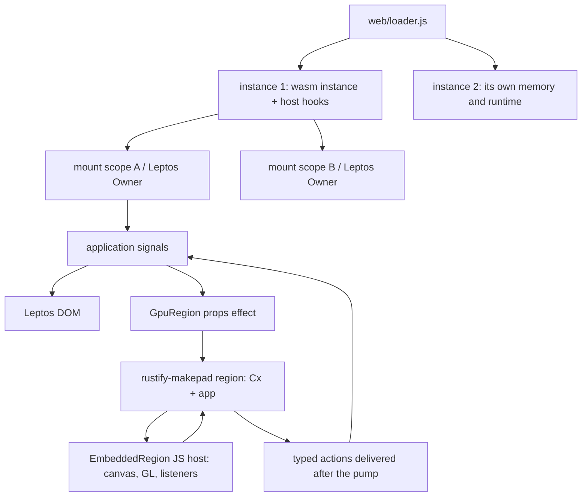

# Architecture

One browser page can run several **instances**, and each instance is a wasm
instance: its own linear memory, its own host hooks, its own diagnostics ring,
its own everything. Inside one instance are **scopes** - the mount points
Leptos owns - and inside a scope are the DOM and the `GpuRegion`s. Leptos owns
the DOM and the application's reactive state; every `GpuRegion` owns a Makepad
`Cx` that draws into a canvas the DOM laid out. The two never share widgets or
state: the application projects state into regions as props and receives typed
actions back.

A trap stops at the instance boundary. Everything in the instance it happened
in is gone - every scope, every region, every task - and nothing outside it is
touched, which is what lets an application be embedded on a page it does not
own.

## Crates and files

| Path | Responsibility |
| --- | --- |
| `crates/rustify-ui` | Public SDK: `mount` / `AppHandle` (container checks, owner cleanup before DOM unmount), `GpuRegion` component (canvas node, region lifecycle, props projection, cleanup), `UiError`, the layer stack (`overlay`), native text sessions (`text`), the theme table and its local overrides (`theme`), asynchronous state and tickets (`task`), the DOM component subset (`components`), the GPU halves of the controls that have one on both sides (`gpu`), and the capability catalogue (`catalog`). |
| `crates/rustify-components` | DOM components for applications: the two class-string macros forked from Rust/UI (`clx!`, `variants!`), the merge rule they share, the current-path seam a link marks itself current from, and the Tailwind input and committed product under `css/`. |
| `crates/rustify-makepad` | Private Makepad integration: `RegionApp` trait, region registry with never-reused ids, pump entry points exported to JS, deferred props application, action outbox delivery, `HostHooks` binding, `web/embedded.js` (JS host for regions). |
| `makepad/` | Hard fork of the Makepad wasm closure. Changed for embedding: `platform/src/os/web/web.js`, `web_gl.js`, `libs/wasm_bridge/src/wasm_bridge.js`, `platform/src/os/web/web.rs`, `platform/src/action.rs`, `platform/src/cx.rs`; trimmed to the browser backend; `tools/cargo_makepad` reduced to the single-threaded browser build. |
| `web/loader.js`, `web/runtime.css` | Page-side boot: wasm instantiation, bridge fingerprint check, host hooks, static failure notice. |
| `xtask` | `doctor`, `build-web`, `serve` (with `--base` and `--fault`), `report-size` (with `--compressed`), `css` (with `--check`), `sources verify`, `verify --suite p1`. |
| `examples/fusion-basic` | Two mount scopes, each with a DOM counter and two GPU regions bound to the same signal. |
| `examples/component-catalog` | The eighteen categories, what each supports and where: a nav, a page per category, a status table, a theme switch, a language switch, and one GPU region that draws the scope's tokens so a theme change can be seen reaching both halves. |
| `examples/property-workbench` | A thousand objects with stable ids: a DOM property panel renames, recolours and deletes the selection, a GPU region draws it, and both sides move the selection through the same rule. Also carries the one fixed-version third-party DOM component (`vendor/nouislider`, `src/third_party.rs`) and the rendered capability catalogue. |
| `tests/browser` | Playwright probes run against the release build. |

## Runtime contracts

- **Region identity.** `RegionId`s come from a monotonic counter and are never reused; a stale id fails every lookup. The JS host carries the id in every export call.
- **Instances.** `boot()` is one instance. The first evaluates the generated glue by static import; each later one evaluates a copy of it under `./bindgen.js?instance=<n>`, because the glue keeps its instance in a module-level binding whose initialiser returns early once it is set - a second `init` of the same module record is a no-op, and a different URL is a different record. All of them share one `WebAssembly.Module`, so there is one compile and one wasm request; what they do not share is linear memory.
- **The instance boundary.** Everything the page hands back is wrapped in a call boundary: an export called after the instance has failed throws `InstanceDead` rather than trapping again, and one that throws `WebAssembly.RuntimeError` reports the failure before rethrowing it. A trap that leaves through a DOM event handler has no code of ours on the stack, so it is attributed by the glue URL in the uncaught error's own stack - each instance has its own. When an instance fails, the host releases what it holds in a fixed order: abort the signal every page-level listener was registered with, take this instance's mark off the address bar, drop the pending tasks, destroy the regions, and only then tell the page. Nothing later in that list can be reached by something earlier in it.
- **Page-level listeners.** `window`, `document` and a scope's container outlive the scope, and `panic = "abort"` runs no destructor. So every listener the SDK puts on one of them is registered with the instance's abort signal as well (`rustify_makepad::listener_options`): dropping is still the normal path, and aborting is the one removal that works when no Rust can run.
- **One address bar, one owner.** The owner is a mark on the document's root element - `data-rustify-url-owner`, valued `<instance>:<scope>` - rather than a flag inside the module. Two instances each have their own copy of everything inside, and each would otherwise conclude it was the only one. The instance number is in the value so that the host can clear the mark of the instance that died and no one else's.
- **Restarting.** A failed instance can be replaced in the same slot at most three times. Every restart evaluates a fresh copy of the glue under a new URL, and a module record lives as long as the document: the dead instance's linear memory is never returned. After the third the only thing left is reloading the page, and the notice says so.
- **Pump.** JS calls `rustify_region_process(region, msg)`; the region's `Cx` is taken out of the registry for the duration of the pump, deferred closures run first inside the same outgoing-message frame (`Cx::process_to_wasm_with`), then Makepad handles the batch. Handlers therefore never observe a borrowed registry, and re-entrant `apply` calls simply queue for the next pump.
- **Props and actions.** `apply(id, f)` queues `f(cx, app)` and asks the host for a pump (coalesced on the microtask queue). Actions pushed into the outbox during a pump are delivered to the application callback after the pump returns, so handlers may write signals or apply new props freely.
- **Presentation.** A pump that only applied props leaves the region wanting to draw, and what Makepad asks for is an animation frame - the next one. The host serves that request itself, at the end of the same microtask, so the picture a projection asked for is in the frame the projection was made in. Without this, two requests fell in one browser frame (the second is dropped as a duplicate while the first is still pending) and a third frame went by unpainted: a region driven once a frame presented every second frame, and a 60 Hz display showed 30. A request made during that draw is a real next frame - an animation running on - and goes back to the browser untouched.
- **Suspending.** A region whose canvas has no area - hidden, `display: none`, a zero-sized box - suspends: it stops presenting and keeps everything it holds, and the application is told, because a region nobody can see is not a broken one. A pump asked for while it is away is remembered and served when it comes back, so the first frame after it returns is the current state rather than the one it left.
- **Resource ledgers.** `stats()` carries two of them. `frames` counts presentations, incremented where a batch binds and clears the canvas; `gpu_bytes` is what the regions' own renderers have allocated - buffers at their last allocated size, textures at width x height x bytes-per-pixel - summed over the instance's live regions and zero once they are gone. Both are accountings the runtime keeps, not readings from the browser or the driver; `docs/compatibility.md` says exactly what the second one does and does not include.
- **Teardown.** `destroy_region` marks the region disposing; if it is idle the JS host releases its browser resources first and the `Cx` is dropped, otherwise the teardown completes when the running pump returns. `AppHandle::dispose` runs the mount scope's reactive cleanups (which destroy its regions) before unmounting the DOM. A `GpuRegion` whose owner was cleaned up before its creation effect ran never creates a region.
- **Process-wide Makepad state.** `Cx::post_action` now targets the `Cx` whose pump is running (the global sender only serves code that runs outside any pump); UI/action signal flags stay global and are polled once per runtime and broadcast to all regions; the live-id interner and widget uid counter are shared by design.
- **Memory views.** Every bridge re-validates its typed-array views of wasm memory on access, because any Rust code in the module (another region, the Leptos application) can grow memory between two calls made through one bridge.
- **Controlled values.** A control never holds the value it shows. In the DOM half, every input event asks the application and then puts the control back in step with whatever the application decided, so a refused value is not left on screen; in the GPU half the widget reports the request and draws the projection that comes back. Disabled and read-only controls ask for nothing at all.
- **Theme.** One table of tokens per scope, written onto the scope's own root through the CSSOM (never a `style` attribute, so a strict `style-src` needs no exception) and handed to regions as props. `ThemeOverride` changes part of it for one area: it writes the properties the patch names onto its own element and removes the ones it stops naming, so everything else inherits and the override can be turned off.
- **A lost GPU context.** The host prevents the loss from being permanent and stops pumping into the dead context; the region publishes `Lost`, is torn down, and is built again on `webglcontextrestored` with the application's current projection applied before the first draw. Nothing the application holds was ever in the region, so nothing is recovered - it is projected.
- **Diagnostics.** One bounded record per runtime, in `diagnostics`: ten registered failure classes each with a next step, a count and a byte ceiling, and a `dropped` counter every report leads with. Entry details are `&'static str`, so a user's text has no path into a log.
- **Message bridge.** The web backend's message list is one Rust function (`web_bridge_js_sources`). The build extracts the generated JS from the wasm with `wasmi` and ships it as an ES module with the fingerprint the wasm also exports; the loader compares both before driving the module. No runtime code generation exists in the shipped JS.

## Build pipeline

1. `cargo-makepad wasm build` (from `makepad/tools/cargo_makepad`, run by xtask): pinned nightly from `rust-toolchain.toml`, generated single-threaded target spec, `build-std`, the fork's link flags with any caller `RUSTFLAGS` appended, resource copy for every dependency crate, in-process `wasm-bindgen`, asserted glue patching (`bindgen_glue.rs`), optional custom-section stripping.
2. `cargo xtask build-web`: clears the output directory, runs step 1, extracts the message bridge, copies `embedded.js`, `loader.js`, `runtime.css` and the example page, writes `build-manifest.json` (build id, schema hash, toolchain, per-file sizes, six-category size report).
3. `cargo xtask serve`: loopback static server with the release CSP, sub-path support and a negative CSP mode.

## Deferred to later milestones

The eighteen-category component catalogue is delivered in P2 M2 (`crates/rustify-components`); `docs/components.md` is printed from it and records what each category supports and what a GPU region draws of it. Routing, workspaces, large data, general cross-region drag, the clipboard and file import are P2 M4 to M6 or later. What P1 measured, and what it could not, is in `docs/reports/p1/`.

## Streams, and why they are named

A scope's action queue holds two kinds of thing. A click, a submit or a cancel
is its own event: dropping or reordering one changes what the application did,
so those are queued in arrival order and never merged. A pointer that keeps
moving is a stream of states rather than a history, so only the latest is worth
delivering - and it must not be able to fill the queue and push a click out of
it.

`Pace::Continuous` carries the stream's name, and that name is load-bearing. One
region can have several streams running at once: where the pointer is, what a
drag would land on, how far a list has scrolled, where it drew its controls.
They supersede *themselves* and nothing else. A single slot for the whole scope
- which is what this was until M6 - means whichever stream reported last
silently ate the others, and the symptom is not a crash but a report that never
arrives: the workbench's region drew its controls, said so, and the scroll
report that followed in the same pump took its place.

Each stream keeps the arrival position of its newest state, so a state still
lands on the correct side of the clicks around it.

## Deciding in the same turn as the event

Some things cannot be decided by the region, because the browser needs the
answer before the region can run. A wheel event is the example: `preventDefault`
has to be called during the event, and by the time the region has been pumped
the browser has already been told.

The shape that works is a *report from the last draw*. The region says where its
scrolling has run out at the moment that is a fact - after it draws - and the
host consults that report synchronously when the next wheel arrives. The
consequence is deliberate: the wheel that reaches an edge is still the region's,
because it is judged against the report from before it arrived. Only the next
one belongs to the page, which is also what a person expects.

The same shape covers anything else where the host must answer immediately and
the region is the only one who knows: report the state, decide from the report,
accept that the answer is one event old.
