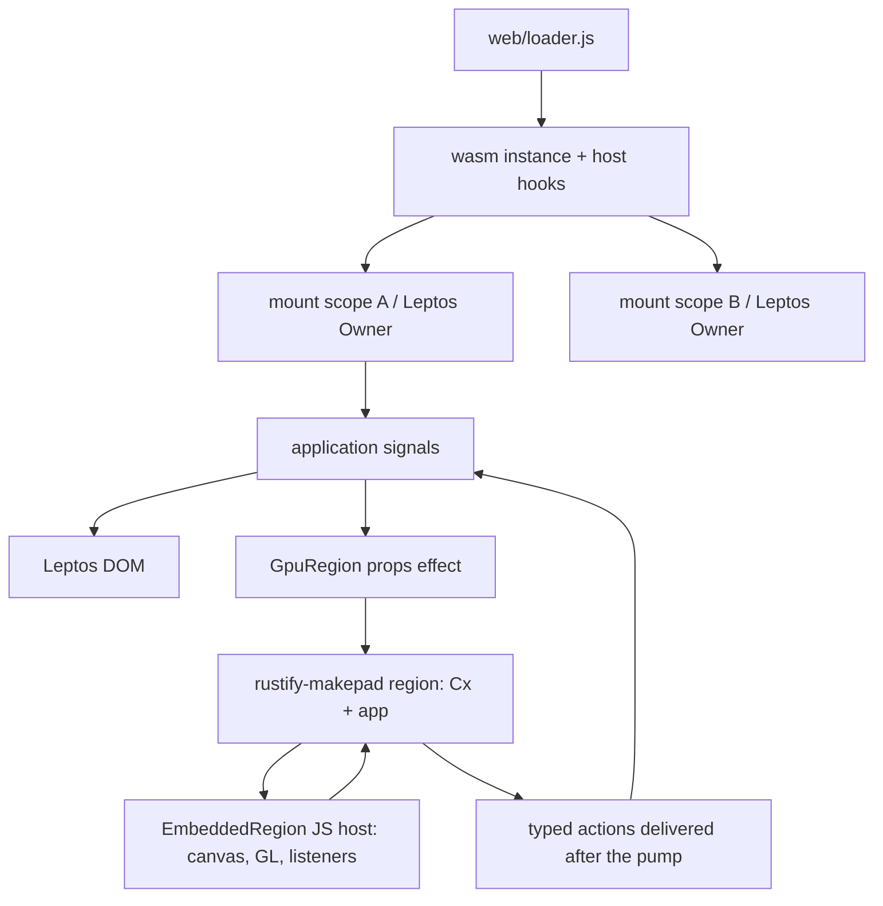

# Architecture (state at the end of P1)

One browser page loads one fusion wasm module. Leptos owns the DOM and the
application's reactive state; every `GpuRegion` owns a Makepad `Cx` that draws
into a canvas the DOM laid out. The two never share widgets or state: the
application projects state into regions as props and receives typed actions
back.

## Crates and files

| Path | Responsibility |
| --- | --- |
| `crates/rustify-ui` | Public SDK: `mount` / `AppHandle` (container checks, owner cleanup before DOM unmount), `GpuRegion` component (canvas node, region lifecycle, props projection, cleanup), `UiError`, the layer stack (`overlay`), native text sessions (`text`), the theme table and its local overrides (`theme`), asynchronous state and tickets (`task`), the DOM component subset (`components`), the GPU halves of the controls that have one on both sides (`gpu`), and the capability catalogue (`catalog`). |
| `crates/rustify-components` | DOM components for applications: the two class-string macros forked from Rust/UI (`clx!`, `variants!`), the merge rule they share, the current-path seam a link marks itself current from, and the Tailwind input and committed product under `css/`. |
| `crates/rustify-makepad` | Private Makepad integration: `RegionApp` trait, region registry with never-reused ids, pump entry points exported to JS, deferred props application, action outbox delivery, `HostHooks` binding, `web/embedded.js` (JS host for regions). |
| `makepad/` | Hard fork of the Makepad wasm closure. Changed for embedding: `platform/src/os/web/web.js`, `web_gl.js`, `libs/wasm_bridge/src/wasm_bridge.js`, `platform/src/os/web/web.rs`, `platform/src/action.rs`, `platform/src/cx.rs`; trimmed to the browser backend; `tools/cargo_makepad` reduced to the single-threaded browser build. |
| `web/loader.js`, `web/runtime.css` | Page-side boot: wasm instantiation, bridge fingerprint check, host hooks, static failure notice. |
| `xtask` | `doctor`, `build-web`, `serve` (with `--base` and `--fault`), `report-size` (with `--compressed`), `css` (with `--check`), `sources verify`, `verify --suite p1`. |
| `examples/fusion-basic` | Two mount scopes, each with a DOM counter and two GPU regions bound to the same signal. |
| `examples/component-catalog` | The eighteen categories, what each supports and where: a nav, a page per category, a status table, a theme switch, a language switch, and one GPU region that draws the scope's tokens so a theme change can be seen reaching both halves. |
| `examples/property-workbench` | A thousand objects with stable ids: a DOM property panel renames, recolours and deletes the selection, a GPU region draws it, and both sides move the selection through the same rule. Also carries the one fixed-version third-party DOM component (`vendor/nouislider`, `src/third_party.rs`) and the rendered capability catalogue. |
| `tests/browser` | Playwright probes run against the release build. |

## Runtime contracts

- **Region identity.** `RegionId`s come from a monotonic counter and are never reused; a stale id fails every lookup. The JS host carries the id in every export call.
- **Pump.** JS calls `rustify_region_process(region, msg)`; the region's `Cx` is taken out of the registry for the duration of the pump, deferred closures run first inside the same outgoing-message frame (`Cx::process_to_wasm_with`), then Makepad handles the batch. Handlers therefore never observe a borrowed registry, and re-entrant `apply` calls simply queue for the next pump.
- **Props and actions.** `apply(id, f)` queues `f(cx, app)` and asks the host for a pump (coalesced on the microtask queue). Actions pushed into the outbox during a pump are delivered to the application callback after the pump returns, so handlers may write signals or apply new props freely.
- **Teardown.** `destroy_region` marks the region disposing; if it is idle the JS host releases its browser resources first and the `Cx` is dropped, otherwise the teardown completes when the running pump returns. `AppHandle::dispose` runs the mount scope's reactive cleanups (which destroy its regions) before unmounting the DOM. A `GpuRegion` whose owner was cleaned up before its creation effect ran never creates a region.
- **Process-wide Makepad state.** `Cx::post_action` now targets the `Cx` whose pump is running (the global sender only serves code that runs outside any pump); UI/action signal flags stay global and are polled once per runtime and broadcast to all regions; the live-id interner and widget uid counter are shared by design.
- **Memory views.** Every bridge re-validates its typed-array views of wasm memory on access, because any Rust code in the module (another region, the Leptos application) can grow memory between two calls made through one bridge.
- **Controlled values.** A control never holds the value it shows. In the DOM half, every input event asks the application and then puts the control back in step with whatever the application decided, so a refused value is not left on screen; in the GPU half the widget reports the request and draws the projection that comes back. Disabled and read-only controls ask for nothing at all.
- **Theme.** One table of tokens per scope, written onto the scope's own root through the CSSOM (never a `style` attribute, so a strict `style-src` needs no exception) and handed to regions as props. `ThemeOverride` changes part of it for one area: it writes the properties the patch names onto its own element and removes the ones it stops naming, so everything else inherits and the override can be turned off.
- **A lost GPU context.** The host prevents the loss from being permanent and stops pumping into the dead context; the region publishes `Lost`, is torn down, and is built again on `webglcontextrestored` with the application's current projection applied before the first draw. Nothing the application holds was ever in the region, so nothing is recovered - it is projected.
- **Diagnostics.** One bounded record per runtime, in `diagnostics`: ten registered failure classes each with a next step, a count and a byte ceiling, and a `dropped` counter every report leads with. Entry details are `&'static str`, so a user's text has no path into a log.
- **Message bridge.** The web backend's message list is one Rust function (`web_bridge_js_sources`). The build extracts the generated JS from the wasm with `wasmi` and ships it as an ES module with the fingerprint the wasm also exports; the loader compares both before driving the module. No runtime code generation exists in the shipped JS.

## Build pipeline

1. `cargo-makepad wasm build` (from `makepad/tools/cargo_makepad`, run by xtask): pinned nightly from `rust-toolchain.toml`, generated single-threaded target spec, `build-std`, the fork's link flags with any caller `RUSTFLAGS` appended, resource copy for every dependency crate, in-process `wasm-bindgen`, asserted glue patching (`bindgen_glue.rs`), optional custom-section stripping.
2. `cargo xtask build-web`: clears the output directory, runs step 1, extracts the message bridge, copies `embedded.js`, `loader.js`, `runtime.css` and the example page, writes `build-manifest.json` (build id, schema hash, toolchain, per-file sizes, six-category size report).
3. `cargo xtask serve`: loopback static server with the release CSP, sub-path support and a negative CSP mode.

## Deferred to later milestones

The eighteen-category component catalogue is delivered in P2 M2 (`crates/rustify-components`); `docs/components.md` is printed from it and records what each category supports and what a GPU region draws of it. Routing, workspaces, large data, general cross-region drag, the clipboard and file import are P2 M4 to M6 or later. What P1 measured, and what it could not, is in `docs/reports/p1/`.
