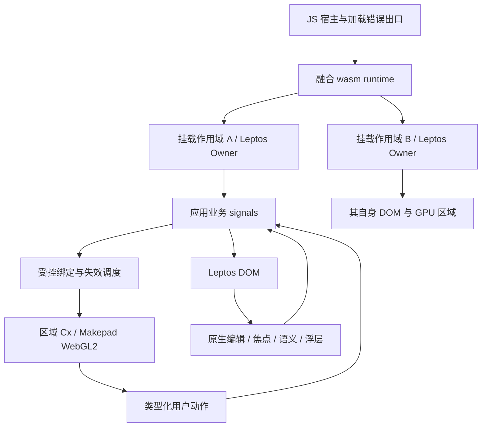

# P1 · Rustify UI · 融合运行基础与研发预览（Leptos CSR + Makepad Web）

> **计划状态：Ready**（M1 已关闭：A-2/A-3/A-4 由探针解除，A-5/A-6 已由用户登记，见「实施进度」）。
>
> 调查基线：2026-09-08 · `21f96a95f31975b39a8ef331eeab7bea319dc698` · 调查开始时工作区 clean；本次仅新增本计划，交付时工作区 dirty。参考源码来自当前被忽略的 `ref/`，不属于该 commit。
> 输入：[PRD v0.1](../PRD-WASM-UI.md)。它仍为评审草稿，未定义“第一期”；用户 2026-09-08 已确认本计划 §0.1 的第一期范围，PRD 层面的 Q1–Q3 与建议预算仍未批准。
> 已读取规则：宿主及祖先目录未发现适用的 AGENTS.md/CLAUDE.md；已读 `ref/makepad-dev/AGENTS.md`，其规则适用于 Makepad 参考树；`ref/ui-main/CLAUDE.md` 只约束该参考树（Rust/UI 组件库，用户决定下一期集成，见 §0.6）。采用 `.agents/skills/dev-plan/SKILL.md` 及配套骨架、架构质量参考。
> 修订：2026-09-08 评审后按用户决定，ADR-2/D3 改为 Makepad 独立快照仓 + git 依赖、Leptos 锁定 crates.io 发布版；新增 F15–F17、A-7（第三轮改为 C-5）；修正 §5.1 DPR 描述。第二轮决定：Chrome 为主、Leptos 不改代码则用 0.8.20 且一旦要改即转 0.9.0-beta 自维护、M1 不拆、Rust/UI 下一期集成。第三轮：A-1 确认解除；Makepad 改为硬分叉并入本仓 `makepad/`，此后不再同步上游。
>
> **建议本期交付：一个可复用的实验 SDK、融合基础示例、属性编辑示例，以及构建、浏览器验证和已知限制报告。** 面向浏览器桌面工具，统一业务状态和组件接入，显式保留 DOM/GPU 边界。
> 本期独特职责：解决两套运行模型在同一页面中的状态、输入、资源及销毁协作。
> **顶层排除：本期不是 PRD 所述完整版本，也不宣称全部“核心”需求已满足；不做透明渲染后端替换、18 类完整组件库或大数据产品。**
>
> 就绪含义：M1 已给出构建、多区域与 CSP 的运行证据（`docs/validation/p1/m1-probes.md`），A-1/A-2/A-3/A-4/A-5/A-6 全部解除，M2–M8 以 M1 的退出证据为入口。Ready 只表示计划可继续实施，不表示任何功能已交付。

## 实施者定位

执行本计划的 agent 是**资深软件工程师**：Kent Beck 式的 TDD 纪律加上《程序员修炼之道》式的精确。本节由骨架原样带入，不随项目改写；开始任何里程碑前先接受以下约定。

- **表达方式**：极简，每句话都可引用。说到代码给文件路径，说到需求或验收给本计划的 ID（需求账本 R-* / NFR-* / C-* / A-*，决策 D* / ADR-*，里程碑 M*）。不写铺垫、不写感想、不复述计划。
- **完成的定义**：没有通过验证的任务不算完成。里程碑退出条件里的测试、断言和走查全部通过，才能在「实施进度」记为完成；验证没跑、失败或环境缺失，就如实记为缺口或阻塞。
- **工作顺序**：先写会失败的测试（红），再写最少的代码让它通过（绿），最后重构；三步不倒序、不合并。里程碑按本计划写的顺序执行，不跳步，不同时开两个未完成的里程碑。
- **源码干净**：注释解释为什么，不解释是什么。源码里不出现工单或需求编号（如 `# FR-12`、`// BUG-42`）、本计划的 R-* / M* 编号、agent 工作流标记或任何规划元数据；追溯关系只记在本计划的「实施进度」和提交说明里。交付的是可直接上生产的代码：干净、最小，没有多余防御、空洞注释或重复样板这类 AI 生成痕迹。

## 实施进度（实施期持续更新）

> 每个里程碑通过全部退出条件后、开始下一个前更新本节；暂停、阻塞或变更设计时同步更新正文。规划完成不计作功能实施完成。

### 恢复快照

- 最近更新：2026-09-08，**M1 已关闭**；下一会话从 M2 开始。
- 当前进度：1/8 个里程碑完成。
- 代码基线：`60828a7`（Makepad 闭包原样导入）→ `0e5c1af`（裁剪为 Web 后端与构建工具）→ `3f8e5c3`（M1 首轮：SDK、示例、xtask、探针、文档）→ 本会话的 M1 收尾提交（`git log -1`）。工作区 clean。
- 已通过的验证（2026-09-08 本机）：`cargo xtask doctor` 8/8 通过；`cargo test --workspace --lib` 3 通过；`cargo test -p xtask` 10 通过；`cd makepad && cargo test` 13 通过（cargo-makepad 10、wasm_bridge 3）；`cargo clippy --workspace --all-targets -- -D warnings` 无警告；`cargo fmt --all -- --check` 通过（`makepad/rustfmt.toml` 禁用 fork 格式化）；`cargo xtask sources verify` 输出 19 改/4 增/212 删（均为本期提交）；`cargo xtask build-web --example fusion-basic --release` 通过；`npm run test:browser` **8/8 通过**。
- M1 退出条件对照：全部满足。新检出不读 ref 可重建 ✔；nightly/CLI/依赖锁定 ✔；路径成员 resources 定位 ✔；导入/裁剪清单随提交 ✔；DOM 按钮改变真实 GPU 内容 ✔（探针 1–3）；双区域互不干扰并能释放 ✔（探针 4–7）；发布探针无 `new Function` ✔（探针 8）；严格 CSP 且 `crossOriginIsolated=false` ✔；报告与 ADR 更新 ✔（`docs/validation/p1/m1-probes.md`）；A-5/A-6 已由用户 2026-09-08 登记 ✔。
- 本会话修复的缺陷：`ToWasmMsgRef::block_skip` 把游标移到 `base + len - 1`，而 JS 写入端把 `len` 记成「从消息起点到本块末尾」的 u64 长度，与 Rust 游标同源。单块消息里错误偏移越过末尾后被 `was_last_block` 吞掉，所以上游从未暴露；从第二块起游标落在块头长度字上，读出垃圾 live id 后越界，即偶发的 `to_wasm.rs:181 index out of bounds`。嵌入场景常产生多块批次（`ResizeObserver` 与 `ToWasmInit`、信号轮询与排队的宿主变更），所以只在这里出现。修复在 `makepad/libs/wasm_bridge/src/to_wasm.rs`，同文件新增单测按 JS 写入布局构造多块消息，旧算术下必失败。
- 同时补上的运行保障：wasm trap 后 Rust 状态不可信（该次泵的 `Cx` 已被移出注册表且无法归还），因此 `EmbeddedRegion.do_wasm_pump` 与信号轮询捕获 trap，停止一切进入 wasm 的调用、不重入模块地释放各区域浏览器资源，并把错误交给宿主 `on_fatal`；`fusion-basic` 在状态元素显示 `RuntimeFatal` 并说明需重载、内存中未保存数据会丢失（D9 边界，不是按实例的 trap 隔离）。区域拿不到 WebGL2 上下文原本静默失败，现由宿主记录（上限 64 条）并被探针 7 每轮断言。
- 基线数字（无预算承诺）：release wasm 7,682,601 B；JS 161,338 B；字体 51,187,844 B（按需加载，首绘只取 IBMPlexSans-Text 181,792 B）；4 区域页面 ready 3.5 s 冷启、0.9 s 热启（headless）；4 区域线性内存 123,994,112 B，6 轮挂载/卸载不增长；空闲 1 pump/s、0 帧/s；页内测得的一轮挂载/卸载：dispose 2–26 ms、mount 调用 <1 ms、两个区域在 353–363 ms 内就绪。headless 探针跑在 SwiftShader 软件 WebGL 上，不是本机 GPU。
- 下一步（M2）：完善 `AppHandle`/`RegionHandle`、embedded 模式、监听/observer/计时器/GL/Cx 释放、代际与错误状态；退出条件为 V1/V3 全部普通行为、2 挂载×2 区域关闭一个其余可操作、旧句柄/迟到消息无回调、100 轮资源与宿主操作检查无功能泄漏。进入前先把 16 ms 信号轮询改为推送（`SignalToUI` 钩子），并审计每区域重复加载字体的内存（4 区域 124 MB 线性内存，`IBMPlexSans-Text.ttf` 每区域各取一次）。
- 本期判断（已写入代码与文档）：Leptos 发布版与参考树在 islands/forms/async derived/stores/macro 内部有代码差异，但 F2/F3/F4 所依赖的文件完全一致，且无需修改 Leptos，按用户「不改代码则用 0.8.20」决定锁定发布版，不切 0.9.0-beta（记录于 `sources.lock.json`）；字体全部保留（`docs/compatibility.md`）；cargo-makepad 裁剪为仅 `wasm build`（去掉 run/热重载服务器、split/brotli/threads/`--small-fonts`），`wasm run` 由 `cargo xtask serve` 替代，index.html 由 xtask 生成；静态桥用 `wasmi` 在构建期执行 wasm 导出生成（§4.1 第 6 条允许的替代）；`makepad/libs/wasm_bridge` 加入 `makepad/` 工具 workspace，使 fork 的宿主单测有一个固定入口。
- Makepad Web 后端在 fork 内修复的上游缺陷（多 Cx 才暴露）：`ToWasmInit` 在窗口创建前索引 `windows[id_zero]` 触发 panic；多桥共享一个 wasm 时 typed-array 视图在内存增长后失效，写入静默丢失（前三个区域收不到 Init）；`ACTION_SENDER_GLOBAL` 只指向最后创建的 Cx；`clear_memory_refs` 置空共享实例的 `_memory`；销毁后的 fetch 回调访问已释放宿主；`ToWasmMsgRef::block_skip` 的多块偏移。
- 当前阻塞：无。A-1/A-2/A-3/A-4/A-5/A-6 全部解除，计划状态为 Ready。

### 完成记录

| Milestone | 完成时间 | 准确完成摘要 | 验证证据 | 代码基线 |
| --- | --- | --- | --- | --- |
| M1 | 2026-09-08 | 固定工程与三项技术探针：Makepad wasm 构建闭包硬分叉进 `makepad/` 并裁剪、Leptos 锁 crates.io 0.8.20、`sources.lock.json`、doctor/build-web/serve/sources 四个 xtask 入口、release 构建与浏览器入口；探针①CSR 与 Makepad 合并且无跨源隔离，②同 wasm 双作用域各两区域的分派与对称销毁（含 F15 全局清单逐项结论），③构建期生成的静态消息桥在严格 CSP 下运行；A-5/A-6 登记完成。未做：M2 起的运行时完善、性能预算承诺。 | `docs/validation/p1/m1-probes.md`；`npm run test:browser` 8/8；`cargo xtask doctor` 8/8；`cargo test --workspace --lib` 3；`cd makepad && cargo test` 13；`cargo test -p xtask` 10；clippy 无警告；fmt 通过 | 本会话的 M1 收尾提交 |

## 0. 需求、范围与决策

### 0.1 第一阶段的完成形态

建议 P1 为**研发预览**：开发者通过一个 SDK 接入，在指定容器中组合 Leptos DOM 与 Makepad GPU 内容；共享业务状态可双向驱动；能编辑中文、操作跨区弹窗、销毁后重新挂载，并在普通静态部署中运行。本期所有新增 SDK 能力均标实验支持，不能成为完整版本已交付的证据。

两份示例共同复用 SDK，业务模型位于示例内：

| 交付物 | 最小内容 | 本期完成判据 |
| --- | --- | --- |
| fusion-basic | DOM 按钮/输入、GPU 标签/按钮/可选对象、主题与卸载入口；另有双挂载宿主夹具 | 双向计数与受控值正确，挂载/卸载可重复，原生链接、滚动、文本选择正常 |
| property-workbench | 1,000 个固定 ID 的对象；DOM 属性面板、GPU 选择视图、原生编辑浮层、菜单及模态表单 | 选择 → 重命名 → 颜色修改 → 弹窗确认 → 删除选中项，结果与独立预期一致；键盘与真实中文输入可完成 |
| 实验 SDK | 挂载句柄、GPU 区域、受控属性/动作、输入与语义代理、主题、错误状态 | 示例中的融合规则集中在 SDK，应用不维护第二份可独立修改的同义业务状态 |
| 可复现交付材料 | 硬分叉来源记录、工具链、构建入口、能力矩阵、六类报告 | 新检出不依赖本机 `ref/`；全部本期验收有证据，失败和未测明确标记 |

**property-workbench 不等同于 PRD B1**：本期不做其 3 面板/10 标签页全部工作区行为；数据规模沿用 R02。只有夹具完全匹配 B0/B1 定义时，才能使用对应名称和预算统计。

用户已于 2026-09-08 确认按上述研发预览范围执行（A-1 解除），浏览器矩阵为 Chrome 为主。PRD 原文及候选建单数据不因本计划自动改成已批准，被延期条目的完整验收定义保持原义。

### 0.2 需求与约束账本

下列带连字符 ID 是本计划的设计账本；不带连字符的 R01–R40 是 PRD 本地工作号。两者都不是 SPMS key。

| ID | 类型/来源 | 本期内容 | 设计/验收落点 | 状态 |
| --- | --- | --- | --- | --- |
| R-1 | 功能；PRD R01/R05/R07 | 可指定容器挂载、卸载及再次挂载；两个挂载作用域各含两个 GPU 区域，普通动作及焦点不串扰 | §2/§5，V1/V3，M2 | 建议纳入 |
| R-2 | 功能；R02/R03/R04/R08 | 单一权威业务状态、类型化动作、批量更新、稳定 ID、自定义可选 GPU 控件 | §2/§5，V2，M3 | 建议纳入 |
| R-3 | 功能；R09/R10/R11/R12 | 容器尺寸/DPR/滚动命中、DOM 浮层、键盘焦点优先级、禁用/只读 | §5/§6，V4，M4 | 部分纳入；通用跨区拖拽后续 |
| R-4 | 功能；R13/R15/R17/R25 | 原生 DOM 文本编辑代理服务 GPU 控件；中文输入；可访问等价操作及语义测试定位 | §6，V5/V6，M5 | 部分纳入；GPU 自绘编辑器后续 |
| R-5 | 功能；R06/R16/R18/R19 | 异步四态/旧结果失效、基础主题、最小受控组件集、应用自定义提交 | §5/§6，V7，M6 | 部分纳入 |
| R-6 | 功能；R23/R24/R26/R27 | 字体/图片/数据加载、普通部署、局部 GPU 失败与重建、开发诊断 | §4/§7/§8，V8/V9，M7 | 部分纳入；实例 trap 隔离后续 |
| R-7 | 功能；R28 | 两份示例、快速开始和明确限制 | §9/§10，V10，M8 | 部分纳入 |
| NFR-1 | 性能；R29/R30/R31/R32 | 建立 release 体积、启动、交互、空闲、内存基线；采样口径复用 PRD §5 | §7/§9，V11/V12 | PRD 预算未批准；基线必交 |
| NFR-2 | 可靠性；R33 | 正常离散动作零丢失/重复；迟到任务失效；GPU 区域重建保留当前状态；故障提示有界 | §5/§8，V2/V3/V8/V12 | 建议纳入 P1 负载 |
| NFR-3 | 兼容/可用性；R34/R35 | 本期声明范围的键盘、IME、屏幕阅读器与浏览器矩阵 | §6/§9，V5/V6/V10 | 矩阵已定：macOS Chrome 为主，Safari 为观察项 |
| NFR-4 | 安全；R36 | 无默认外发遥测、文本不执行代码、不记录输入正文/秘密、不要求 JS unsafe-eval | §4/§7，V9 | 建议纳入 |
| NFR-5 | 可维护性；R24/R37/R38/R39/R40 | 锁定来源、修改可追溯、诊断有界、两次干净构建、需求映射和报告 | §4/§7/§9，V9/V10 | 部分纳入；稳定兼容承诺后续 |
| C-1 | 用户/PRD §7.1 | 融合 Leptos CSR 与 Makepad，首要产物为浏览器 wasm | ADR-1，M1 | 已确认方向 |
| C-2 | 当前仓库 | 新模块建设；没有宿主源码、构建、CI 或可复用业务服务 | §1/§10 | 已核实 |
| C-3 | PRD §7/来源记录/crates.io | 本地参考没有上游 commit；Makepad 2.0.0 未发布（crates.io 最高 1.0.0），Leptos 0.8.20 已发布；15 个文件指纹不能代替完整锁定 | ADR-2/§4，M1 | 已核实缺口 |
| C-4 | PRD §2.4/§2.5 | SDK 不负责账号、业务授权、持久化或不受信任插件执行 | §0.5/§7 | 采用其推荐边界 |
| A-1 | 范围假设 | 用户接受统一体验、桌面浏览器方向和 P1 研发预览范围，包括 §0.6 的延期；浏览器矩阵 Chrome 为主 | 用户 2026-09-08 确认 | 已解除 |
| A-2 | 技术假设 | 固定参考源可构建出 Leptos CSR + Makepad 无共享内存的融合产物 | M1 探针① | 已解除 |
| A-3 | 技术假设 | 同 wasm 内多个 Cx 能经最小修改正确分派与完整释放 | M1 探针②（F15 全局逐项结论）；M2 扩大到 100 轮 | 已解除 |
| A-4 | 安全假设 | Makepad 消息生成可以移至构建期，运行期无需动态执行 JS 字符串 | M1 探针③；V9 在 M7 再验完整产物 | 已解除 |
| A-5 | 验收资源 | 可取得 §9.4 的真实系统输入法和 VoiceOver；中文字体可分发 | 用户 2026-09-08 承诺 M5 前提供环境；字体 OFL 可分发 | 已登记 |
| A-6 | 测量合同 | P1 先交真实性能基线，不将未批准的完整版本预算改写成 P1 承诺 | 用户 2026-09-08 确认只交基线；M8 方法：release 构建、headless 与 Chrome 各测、30 次启动、≥1000 交互采样 | 已登记 |
| C-5 | 用户决定 2026-09-08 | Makepad wasm 构建闭包硬分叉并入本仓 `makepad/`，此后不再同步上游；保留 MIT 版权声明与字体许可 | ADR-2/§4.1，M1 | 已确认 |

### 0.3 决策表

| # | 决策点 | 建议选择 | 含义/影响 | 依据 |
| --- | --- | --- | --- | --- |
| D1 | 呈现形态 | Leptos 保持 DOM；增加 GPU 区域组件，内部用 Makepad | 不修改 Tachys 成通用后端，不承诺组件自动转换 | C-1；当前 `Rndr = dom::Dom` |
| D2 | P1 运行时 | 一个页面加载一个融合 wasm；多个逻辑挂载作用域，各区域独立 Cx/画布 | 状态可在 Rust 中直接引用；共享 wasm 的作用域不具备 trap 隔离 | ADR-1；A-2/A-3 |
| D3 | 上游管理 | Makepad：wasm 构建闭包硬分叉导入本仓 `makepad/`，成为一等源码，此后不同步上游；Leptos：锁定 crates.io 0.8.20，不改其代码 | 修改就是普通提交，无补丁序列与外部仓；本仓承担整个闭包的维护；保留 MIT 声明与来源记录 | ADR-2；C-3/C-5；F17；用户 2026-09-08 决定 |
| D4 | 工程拆分 | 一个公开 SDK crate、一个私有 Makepad 集成 crate、两个示例、一个 xtask | 私有 crate 隐藏上游 Cx/桥/unsafe 所有权；不额外造通用渲染接口或全局事件总线 | §2 的删除测试 |
| D5 | 状态 | 应用持有 Leptos signal；GPU 属性为受控投影缓存，动作由应用回调决定更新 | 不实现第二套 store/响应式图；不在 ScriptVm 中另设业务事实 | R-2；Leptos effect 调度语义 |
| D6 | 编辑与辅助技术 | 使用原生 input/textarea、DOM 语义入口和 DOM 浮层协作 GPU 区域 | 编辑激活时由 DOM 显示文本和光标；自绘编辑算法、Makepad Web 可访问树另期实现 | ADR-3；R-4 |
| D7 | 工具链 | `makepad/tools/cargo_makepad` 作为本仓内部工具 crate 由 xtask 调用并直接修改，冻结 nightly 与 wasm-bindgen CLI/crate | 现有 `--bindgen --no-threads` 只是候选入口；不另行假定 Trunk 可直接接管 | §4；A-2 |
| D8 | 调度 | 同线程动作先入队；安全点按顺序应用，帧刷新只合并失效区域和连续指针最新值 | 避免 Makepad 回调中重入 Cx/RefCell；离散动作不按帧丢弃 | §5；R-2 |
| D9 | 故障边界 | 可恢复区域错误保留业务 state；整 wasm trap 由纯 JS 宿主提示重载 | P1 不承诺共享 runtime 内其他挂载在 trap 后继续工作 | §8；A-1 已接受该阶段边界 |
| D10 | 导航 | 本期宿主页持有 URL/标题；GPU 禁止直接改 history/title | 完整路由与导航拦截统一在后续接入；本期只验证根路径、子路径、嵌入 | R22 延期；Makepad 当前含 history 操作 |

以上 D1/D2/D8/D9 已由 M1 的运行证据支持（探针①②③），D3/D7 与浏览器矩阵为用户明确决定；D4/D5/D6/D10 的落点在 M2–M7，按各里程碑退出条件确认。

### 0.4 ADR-lite

#### ADR-1：先验证单 wasm 直接共享状态

- 状态：**Accepted**（M1 探针①②给出运行证据，A-2/A-3 解除）。P1 保持方案 A；重审条件不变。
- 驱动：R-1/R-2 要求可复用组件和单一状态；C-1 指定两套能力均起作用。
- 共同约束：DOM 保留 Leptos，GPU 保留 Makepad，所有权、销毁及输入都需有测试。

| 维度 | A：同一 wasm 中直接绑定（建议） | B：Leptos 与 GPU 使用独立 wasm |
| --- | --- | --- |
| 接口/成本 | 一个 Rust signal 即可投影到 GPU；需要两套 wasm 导入兼容 | SDK 内传类型化快照/动作，应用仍只持有一份权威状态；增加序列化与协议 |
| 实例与失败 | 逻辑作用域可隔离，但 trap 影响共享 runtime；Cx globals 要审计 | GPU wasm 失败可与 DOM 状态分开；多个 Leptos 实例的隔离仍要设计 |
| 构建/迁移 | bindgen 与 Makepad env 需在同产物兼容，对 wasm-bindgen 版本敏感 | 独立构建容易保留各自入口，资产和版本组合更多 |
| 运行/测试 | 无跨 wasm 业务复制，重入及泄漏需接口测试 | 需测试乱序、过期快照、重复动作、桥断开和重连 |
| 后续代价 | 若转为 B，内部绑定要改；公共受控 props/actions 可尽量保留 | 第一阶段就承担多入口构建、协议与资源重复成本 |

- 建议：优先 A，以 M1 的真实构建和双区域证据决定能否继续。它服务于 P1 预览，不是对完整版本实例隔离要求的终局决定。
- 正面后果：最短路径验证共享状态和受控组件，不预造跨 wasm 消息协议。
- 负面后果：需要修改上游桥和释放能力；共享 runtime 不能满足 PRD R26 AC3 的独立实例 trap 故障边界。
- 重审条件：无隔离构建失败；同 runtime 的 Cx 全局状态无法局部修复；修改扩展至大量非 Web 平台代码；用户要求 P1 即具备独立实例 trap 隔离。任一成立时提交 B 的具体成本和修订计划，不能暗中降为单计数器或强制隔离部署。

#### ADR-2：Makepad 硬分叉并入本仓，Leptos 用发布版

- 状态：**Accepted**（用户 2026-09-08 决定，第三轮）。
- 背景：两个参考目录均无自身 `.git`，上游 commit 未知。F17 核实 crates.io 上 leptos 0.8.20 已发布，而 makepad-widgets 最高发布版本为 1.0.0，参考树的 2.0.0 未发布；两树 LICENSE 均为 MIT，允许复制与修改。计划全部 Leptos 用法只经公开 API：`mount_to` 可重复调用，重复初始化 executor 的错误被忽略（`ref/leptos-main/leptos/src/mount.rs` 第 183 行），Owner/Effect/NodeRef/on_cleanup 均为公开接口，不需要改 Leptos；Makepad 则必须改平台层内部（§4.2）。`ref/makepad-dev` 共 292 MB；platform/draw/widgets 及其非可选依赖构成的 wasm 构建闭包源码约 28 MB，其中非 Web 后端 `platform/src/os/{apple,linux,windows}` 约 4.5 MB；中文字体 LXGW WenKai 两个字重各 18 MB、NotoColorEmoji 10 MB，在 `widgets/fonts` 与 `widgets/resources` 各有一份。
- 备选 A：本仓内 vendor 快照加补丁序列，长期跟随上游。备选 B：找到上游 commit 后 fork 打补丁，SHA 未知当前不可行。备选 C：独立快照仓加 git 依赖，补丁为分支提交。备选 D：把 wasm 构建闭包硬分叉导入本仓成为一等源码，此后不再同步上游。
- 决策：Makepad 用 D，导入到 `makepad/`，保持 platform/draw/widgets/libs/tools 的相对布局，保留 `makepad/LICENSE` 原 MIT 版权声明与字体许可文件，来源记录写入 `sources.lock.json`。Leptos 锁定 crates.io 0.8.20，M1 以 `cargo vendor` 取出发布版与 `ref/leptos-main` 做 diff 核实一致后锁定。用户规则：一旦任何里程碑确需修改 Leptos 源码，改用 0.9.0-beta 同样硬分叉进本仓并自行维护，不在 0.8 上打补丁。
- 导入规则：M1 先以 `cargo tree` 在 wasm target 上得到示例的实际闭包并原样导入，构建通过后再以独立提交裁剪；非 Web 后端、studio、apps、examples、xr 与闭包外 libs 不导入；字体去重只保留一份，字重与 emoji 取舍按 §4.1 第 2 条的中文可读与许可门决定并写入 `docs/compatibility.md`；导入与删除清单随提交记录。
- 正面后果：无补丁序列、无外部仓、无 git 依赖迭代成本；§4.2 的修改都是普通提交，可按 P1 需要直接重构；cargo-makepad 成为内部工具 crate，RUSTFLAGS 与 nightly 问题直接改代码解决；新检出无任何外部来源即可构建。
- 负面后果：本仓承担闭包全部维护，上游后续修复不再自动获得，需要时只能从新检出的上游手工移植并视为新工作；仓库增加约 28 MB 源码加所选字体；Makepad 根 `[patch.crates-io]` 项须复制到本仓根 workspace；导入后 `ref/makepad-dev` 只剩调查基线价值，M1 diff 完成后可由用户删除。
- 重审条件：出现必须回到上游获取的能力（如新的 Web 平台修复）时按手工移植评估成本，不恢复同步；Leptos 出现代码级差异或确需修改时按上述规则切到 0.9.0-beta 硬分叉。P1 不执行 crates.io/GitHub 对外发布。

#### ADR-3：原生编辑器承接跨区文本与语义

- 状态：Proposed。A-5 已登记（用户承诺 M5 前提供真实拼音与 VoiceOver 环境），实现落在 M5。
- 备选 A：保留 Makepad TextInput + 隐藏 textarea，修复全部文本编辑、焦点及辅助技术桥；备选 B：GPU 展示态 + 定位到相同边界的原生 DOM 编辑态，并提供共享语义操作入口。
- 建议：P1 用 B。GPU 控件在编辑期间留出绘制区域，不重复画文本/光标；DOM 控件承担真实 selection、composition 和浏览器编辑行为。
- 正面后果：两套呈现复用受控值契约，先验证中文和辅助技术核心旅程；无需一期自研 Unicode 编辑引擎。
- 负面后果：激活编辑态可能有字形差异，必须重定位、裁剪与处理外部值变更；不能宣传为原生 Makepad TextInput 全能力支持。
- 重审条件：确有 GPU 自绘编辑器需求、复杂变换或排版要求超出原生覆盖层，且有真实 IME/辅助技术矩阵支撑。

### 0.5 职责与事实所有权

| 主体 | 拥有 | 恢复责任及边界 |
| --- | --- | --- |
| 应用/示例 | 业务 signal、校验、动作处理、异步请求、保存策略 | 选择是否接受修改；页面刷新后的恢复由应用负责 |
| Rustify SDK | 挂载生命周期、受控投影、失效调度、焦点/浮层/主题和错误出口 | 清理本作用域；GPU 重建后重新投影最新 state；不复制业务事实 |
| 私有 Makepad 集成 | 区域 Cx、桥、GPU 对象、坐标输入转换、释放安全 | 保证消息只进活区域；拒绝不支持的上游全局能力 |
| Leptos | DOM view、Owner、响应式订阅 | 保留 `UnmountHandle` 并由 SDK 结束；不使用永久泄漏入口 |
| JS 宿主/浏览器 | 模块加载、DOM 原生编辑、权限、CSP、GPU 能力、runtime fatal 提示 | wasm 失效后仍能显示静态错误；不宣称内存数据已保存 |

### 0.6 明确不在本期及后续路线

- **完整 18 类组件、表单框架、复杂工作区**：P2；先基于本期受控组件、焦点及层级接口补齐 R18/R19/R21。
- **10 万行表格、1 万 GPU 对象、树及对应虚拟化性能**：P3；包括 R20、R30 的高密度负载及大数据可访问路径，避免以小样例冒充。
- **完整浏览器历史/深链接/导航阻止**：P2 的 R22；P1 子路径仅指资源正确寻址，不包含任意深链接刷新契约。
- **跨区通用拖拽、程序化剪贴板、文件导入导出**：P2 的 R11/R14；P1 保留原生编辑控件的常规复制粘贴，不提供文件 API。
- **GPU 自绘单行/多行编辑器、阿拉伯 RTL/emoji 完整 GPU 排版**：P2 专项；P1 通过原生编辑态和可读 DOM 等价内容保证数据不损坏。
- **独立 wasm 实例 trap 隔离、完整 GPU 上下文原位重建、增强多线程模式**：进入完整版本前专项完成；P1 用销毁/重建区域恢复，trap 边界见 ADR-1。
- **完整 Windows/Linux/移动矩阵、WCAG 2.2 AA 整体合规、全部 PRD 数值门槛、5 名新用户研究和稳定弃用窗口**：完整版本发布门；不因 P1 通过自动标绿。
- **第三个大数据示范应用、两份完整迁移示例及对外发布**：完整版本交付阶段。P1 文档只交接已实现能力及有限迁移说明。
- **Rust/UI 组件库（`ref/ui-main`）集成**：P2，用户 2026-09-08 决定下一期再集成。P1 不引用其代码，也不为它预留适配层；主题只用 CSS variables 与 GPU props 投影，P2 接入时以本期受控组件契约和 token 命名为对齐对象。
- **SSR/hydration、原生同等首发、WebGPU、自动双后端转换、云服务、业务持久化、不受信任插件**：保持 PRD §2.5 的排除及重新纳入条件。

P2/P3 表示依赖顺序建议，不是已批准版本或排期。PRD 将多项被延期能力定义为“核心”，所以 P1 名称必须带研发预览，不能对外称完整融合框架已经达标。

## 1. 当前事实与改动面

### 1.1 现状与缺口

| # | 事实及状态 | 本次证据/行为 | 设计后果 |
| --- | --- | --- | --- |
| F1 | 已核实·缺口 | 根目录无 Cargo 工作区、源码、CI；Git 历史为技能和 PRD 文档；`.gitignore` 忽略 ref | 工程/测试入口均须新增；没有既有宿主业务代码可复用 |
| F2 | 已核实·足够 | `ref/leptos-main/leptos/src/mount.rs` 的 `mount_to` 创建 Owner 并返回 UnmountHandle，Drop 卸载 view；`mount_to_body` 调用 forget | 复用可持有的 handle；GPU 资源另外清理，不能从 DOM 卸载推导 Cx 已释放 |
| F3 | 已核实·足够 | `ref/leptos-main/reactive_graph/src/lib.rs` 明确 signal 写入立即生效，effect 到异步 tick 执行 | 将状态版本、绘制提交、可见结果分开观测，不能把 effect 完成当呈现确认 |
| F4 | 已核实·缺口 | `ref/leptos-main/tachys/src/renderer/mod.rs` 将 Rndr 固定为 DOM，并解释泛型渲染方案移除原因 | 使用区域组件接入；实现 Renderer trait 不等于获得通用 Leptos 后端 |
| F5 | 已核实·足够/边界 | `ref/makepad-dev/examples/counter/src/main.rs` 使用 script_mod、AppMain、WidgetRef、显式 render 和 handle_actions | 复用当前 Widget/动作范式；示例 ScriptVm counter 不能照搬为第二份业务状态 |
| F6 | 已核实·缺口 | `ref/makepad-dev/platform/src/os/web/web.js` 注册 window mouseup/mousemove、用 pageX/Y、修改 body 滚动及光标；textarea 初始 focus 且 blur 后回抢 | 增加区域坐标/事件所有权及可撤销订阅；默认隐藏输入路径必须在 embedded 模式关闭 |
| F7 | 已核实·缺口 | `ref/makepad-dev/platform/src/app_main.rs` 的 wasm_create_app 用 Box::into_raw(Cx)，所读 wasm 导出未提供对应 destroy；web.js 未见覆盖所有资源的 dispose | 只移除 canvas 会漏 Rust/JS/GPU 生命周期；需新增对称释放和迟到消息校验 |
| F8 | 已核实·缺口 | `ref/makepad-dev/libs/wasm_bridge/src/wasm_bridge.js` 每个桥覆盖 `wasm._bridge`；init_env 的多项回调通过该字段分派 | 多画布不能直接 new 多次；需消除“最后一个 bridge”选中全局状态，验证 Cx 间隔离 |
| F9 | 已核实·缺口 | 同文件 `create_js_message_bridge` 使用 new Function；`ref/makepad-dev/platform/src/os/web/web.rs` 的 wasm_get_js_message_bridge 动态返回消息类源码 | 为不允许 JS unsafe-eval 的部署生成静态 ESM；增加源码/ABI 匹配校验 |
| F10 | 已核实·缺口 | `ref/makepad-dev/platform/src/os/web/web.rs` 的 AccessibilityUpdate 分支为空；同 Web 路径能改 title/history | 语义由本期 SDK 承接，宿主保有导航与标题，不能直接宣称上游 Web 无障碍已足够 |
| F11 | 已核实·足够/边界 | `ref/makepad-dev/platform/src/os/web/web_gl.js` 建立 WebGL2，保存 shader/buffer/texture 等表；未见完整区域销毁/上下文恢复契约 | 可复用绘制实现，须新增释放与重建；有 WebGL2 不代表故障恢复成立 |
| F12 | 已核实·缺口 | `ref/makepad-dev/tools/cargo_makepad/src/wasm/compile.rs` 使用 nightly、custom target、build-std；bindgen 后进行 JS 文本替换且不校验命中；`--bindgen` 时 `bindgen.js` 成为唯一实例化入口，Makepad env 导入靠文本补丁注入，`wasm-bindgen` CLI 从 PATH 调用未锁版本；`RUSTFLAGS` 以环境变量整体覆盖（第 630 行）；单线程 small profile 有 LTO 特例；bindgen 与 split 组合被拒绝 | 锁定准确工具组合、断言转换命中；loader 建立在 wasm-bindgen init 之上；`.cargo/config.toml` 的 rustflags 会被屏蔽，须补丁 cargo-makepad 追加；不引入未经验证的分片/LTO组合 |
| F13 | 已核实·足够/边界 | `docs/PRD-WASM-UI-SOURCES.json` 中 15 个文件 SHA-256 本次全部匹配；两个上游 commit 为空 | 原 PRD 引用仍对应当前字节；没有完整源档案或运行证据 |
| F14 | 未核实·阻塞 | 没有融合构建、普通部署、多 Cx 共存或真实 IME 测量 | 用 M1–M5 逐步解除；本计划不能标 Ready |
| F15 | 已核实·缺口 | Rust 进程级全局：`wasm_check_signal` 导出无 cx 参数（`ref/makepad-dev/platform/src/os/web/web.rs` 第 1259 行）；`ACTION_SENDER_GLOBAL` 为全局 Mutex，创建 Cx 时覆盖（`platform/src/action.rs` 第 9 行、`cx.rs` 第 429 行）；`STUDIO_WEB_SOCKET_THREAD_SENDER`、`gpu_texture.rs` 的 thread_local、`shader_error`/`devtools` 槽位、`live_id` 全局驻留表 | 多 Cx 时信号轮询互相清空、动作落到错误 Cx；§4.2 新增“Rust 全局归属”修改域，作为 M1 探针②的逐项检查清单；`live_id` 驻留幂等可共享 |
| F16 | 已核实·足够/边界 | `wasm_create_app` 每次调用 `init_websockets`（`platform/src/app_main.rs` 第 439 行）；wasm 下 `STUDIO_HOST` 环境变量不可得，studio websocket 记为 disabled 不外连，但仍 spawn 线程并覆盖全局发送端 | NFR-4 默认无外发成立；embedded 构造跳过该调用，并入 F15 清单 |
| F17 | 已核实·足够 | crates.io：leptos 0.8.20 发布于 2026-06-25，0.9.0-beta 发布于 2026-07-18；makepad-widgets 最高发布版本 1.0.0（2025-05-13），参考树 2.0.0 未发布；两树 LICENSE 均为 MIT；cargo-makepad 对非路径依赖靠各资源 crate 的 build.rs 写出的 `.path` 文件定位 resources（`tools/cargo_makepad/src/utils.rs` 第 251 行） | Leptos 可直接锁定发布版；Makepad 只能持有快照；git 依赖下 resources 定位在 M1 验证；0.8/0.9 线选择列为开放问题 |

环境调查：本机 rustc/cargo 为 1.96.0；装有 stable、nightly-2026-05-20、1.95.0 以及 wasm32-unknown-unknown target；PATH 未发现 wasm-bindgen CLI。此清单只是调查事实，不是已验证工具组合，也不应要求新开发者复刻本机的全部工具链。

### 1.2 拓扑与文件清单

以下全部为 **★拟新增**，M1 前不存在；不是已提供的工具或模块。

| 路径 | 责任 | 首次落点 |
| --- | --- | --- |
| `Cargo.toml`、`Cargo.lock`、`rust-toolchain.toml`、`.cargo/config.toml` | workspace；Leptos 锁 crates.io 0.8.20，`makepad/` 各 crate 为路径成员并在根复制其 `[patch.crates-io]` 项；固定 nightly、xtask alias；rustflags 不放在 `.cargo/config.toml`（会被 cargo-makepad 覆盖） | M1 |
| `makepad/` | 硬分叉的 Makepad wasm 构建闭包，保持 platform/draw/widgets/libs/tools/cargo_makepad 相对布局；含 `makepad/LICENSE` 与字体许可；导入/裁剪规则见 ADR-2 | M1 |
| `sources.lock.json` | Makepad 导入来源记录：导入日期、declared version 2.0.0、upstream commit unknown、导入文件清单指纹；Leptos crates.io 版本、checksum 及与参考树的 diff 结论 | M1 |
| `crates/rustify-ui/src/lib.rs` | 唯一公开 SDK 导出 | M2 |
| `crates/rustify-ui/src/mount.rs`、`crates/rustify-ui/src/region.rs` | AppHandle、区域状态、销毁 | M2 |
| `crates/rustify-ui/src/binding.rs`、`crates/rustify-ui/src/scheduler.rs` | 受控属性/动作、代际校验、失效合并与重入控制 | M3 |
| `crates/rustify-ui/src/focus.rs`、`crates/rustify-ui/src/overlay.rs` | 焦点、命令优先级、几何及浮层 | M4 |
| `crates/rustify-ui/src/text.rs`、`crates/rustify-ui/src/semantics.rs` | 原生编辑态、可访问等价入口 | M5 |
| `crates/rustify-ui/src/components/`、`crates/rustify-ui/src/theme.rs` | 最小组件与主题 | M6 |
| `crates/rustify-ui/src/diagnostics.rs` | 错误登记、有限诊断环、默认脱敏 | M2 最小错误，M7 完整 |
| `crates/rustify-makepad/src/lib.rs` | 私有 Cx 所有权、Widget 注册、props/actions 接口及安全封装 | M1 起 |
| `crates/rustify-makepad/web/embedded.js` | 在构造前选择 embedded 模式、桥注册与释放、禁止页面副作用 | M1 起 |
| `web/loader.js`、`web/runtime.css` | 模块加载、fatal 提示及隔离样式 | M1 起 |
| `examples/fusion-basic/`、`examples/property-workbench/` | 两份真正复用 SDK 的应用 | M1/M3 起 |
| `xtask/src/main.rs` | 来源校验、构建/静态桥生成、静态预览服务、体积报告和验收入口 | M1 起 |
| `tests/browser/`、`tests/fixtures/`、`package.json`、`package-lock.json`、`playwright.config.ts` | 浏览器行为/故障测试与独立预期夹具，固定测试依赖 | M1 起 |
| `.github/workflows/verify.yml` | 清单、单元/浏览器验证及 release 构建；不冒充真实系统 IME | M1 起 |
| `docs/compatibility.md`、`docs/quickstart.md`、`docs/architecture.md` | 版本、能力边界、输入、资源、使用及升级说明 | M1 起 |
| `docs/validation/p1/`、`artifacts/p1/` | 受版本控制的测量合同/报告摘要；大体积原始样本及日志为生成产物 | M1/M8 |

F6–F12、F15 引用的上游路径在导入后加 `makepad/` 前缀即为修改目标；每项修改是本仓普通提交，提交说明写明对应的 §4.2 修改域与回归入口，不再维护补丁序列。宿主 `.gitignore` 需要新增 target、测试输出及生成产物规则；ref 在 M1 diff 完成前保留为只读调查参考。不改 `.agents`/`.claude` 技能内容。

## 2. 模块、接口与依赖

以下为拟定接口契约，类型名用于后续实现定位，尚未存在对应 API。

| 模块 | 调用者 | 入口与不变量 | 接缝/隐藏复杂度 | 依赖及验证面 |
| --- | --- | --- | --- | --- |
| mount | 应用/宿主 | `mount(container, config, view_factory) -> Result<AppHandle, MountError>`；容器必须存在、可使用、未占用；返回后 DOM 已建立，GPU 可能仍在 Starting | AppHandle 持有 Leptos UnmountHandle、区域及清理集合；`dispose()` 幂等，Drop 兜底 | 进程内；V1/V3 通过公开挂载/销毁观察 |
| region | Leptos GPU 区域组件 | `GpuRegion` 接受稳定 region key、适配组件、受控 props 和动作 callback；状态为 Starting/Ready/Suspended/Failed/Disposed | 每个区域一个 Cx/画布；不向应用公开裸指针或 JS bridge | 私有 Makepad 接口；真实浏览器 V1/V8 |
| binding/scheduler | 多个基础组件及自定义控件 | `ReadSignal<Props>` 驱动投影；`on_action(Action)` 只提议修改；`BindingHandle` 随 Owner 清理 | 代际、动作顺序、重入、dirty 合并；不重新包装所有 Leptos signal API | 进程内；独立期望序列 V2 |
| makepad 集成 | region | `create_region / apply_props / drain_actions / resize / suspend / destroy_region`；使用受检句柄并携带 generation | 对称释放、消息泵、WebGL 资源及 Widget 差异；平台桥仅此处接触 unsafe | 本地上游，使用真实实现；生命周期纯状态逻辑可单测 |
| focus/overlay/text | 组件 | 焦点项含稳定 key、角色、名称、disabled/readOnly、DOM 所属；浮层按栈拥有输入 | 原生控件编辑、IME、退出恢复、几何重定位、语义重复控制 | 浏览器真实 DOM；V4/V5/V6 |
| diagnostics | 上述模块/开发者 | `UiError` 包含 kind、时间、作用域/区域、版本、建议；`inspect` 返回当前几何/焦点/版本概要 | 默认不记录 props、文本、令牌或完整事件载荷 | 进程内；V9 的字段、容量及隐私检查 |
| xtask/loader | 开发者/静态宿主 | 构建须检查来源记录和依赖锁；loader 先挂静态状态再初始化 wasm | 静态消息桥/资产 base URL/失败提示/清单 | 构建期文件系统与浏览器；V9/V10 |

组件作者实现一个窄接口，提供 **props 的应用、actions 的提取、几何和语义元数据、释放**；不要求实现 DOM renderer、业务 store 或通用平台服务。高级 Widget 作者可依赖明确版本的 Makepad crate，但超出该接口的能力须在目录标实验/未支持。

删除测试：mount 删除后，所有示例都要重复处理销毁；binding 删除后，每个组件都要重复订阅/代际/重入；focus 删除后，每个跨区组件都要重复命令与编辑规则；makepad 集成删除后，Cx 所有权和 JS 差异泄漏到 SDK 多处。因此这些模块承载实际复杂度。第一期不建立 backend trait、任意 transport adapter、通用资源缓存或业务数据访问层。

## 3. 内存模型与兼容边界

本期没有数据库、schema 迁移或后台服务。刷新/重载不自动恢复内存业务数据。

| 对象 | 字段/不变量 | 生命周期与权威 |
| --- | --- | --- |
| 应用 state | 应用类型、稳定业务 ID、受控字段；示例删除选中项后选择归空 | 应用创建；GPU 只读投影，销毁区域不销毁应用 state；销毁应用结束其 Owner |
| App/Region handle | runtime ID、作用域 ID、slot、generation、状态 | 挂载分配；销毁先失效 generation，再取消任务/释放；旧句柄不因 slot 复用重新有效 |
| GPU props cache | 最新版本、显示字段、dirty 标记 | 可丢弃/重建；应用不能单独把它当 store 修改；恢复后全量读取当前 signal |
| Action envelope | 作用域/区域、generation、单调接受序号、类型化 action | 事件进入时捕获归属；失效前校验；离散动作处理后释放，不建立无限动作历史 |
| 文本编辑会话 | 当前组件、开始版本、composition 状态、DOM 原生草稿 | 草稿是未确认编辑；composition 完成后提议修改。外部受控值在组合期间变化则结束该编辑并显示最新值/冲突提示，不用旧草稿覆盖 |
| 异步票据 | 所属 Owner/generation、请求序号 | 应用可以真实 abort；SDK 保证无效票据不再更新/回调，不承诺撤销服务端动作 |
| 诊断环 | 元数据条目数和字节数同时有界 | 上限取 PRD R39：1,000 条且 4 MiB；超限淘汰旧条并显示截断；不含业务正文 |

本期外部兼容承诺只涉及实验 API 和静态产物。生成 JS、wasm、桥 schema 与资源绑定同一个 build ID；混用时启动失败并提示重新部署，不能以旧 JS 驱动新 ABI。进入稳定版本前再落实 PRD R38 的兼容系列与弃用窗口。

## 4. 构建、集成与外部契约

### 4.1 固定来源和构建流水线

1. M1 按 ADR-2 导入规则把 Makepad wasm 构建闭包硬分叉导入 `makepad/`：先原样导入 `cargo tree` 得到的闭包并构建通过，再以独立提交裁剪；保留 `makepad/LICENSE` 与字体许可，在 `sources.lock.json` 记录导入日期、declared version、upstream commit（无证据填 unknown）与导入文件指纹。Leptos 用 `cargo vendor` 取 crates.io 0.8.20 与 `ref/leptos-main` 做 diff，仅清单/注释差异则锁定发布版；出现代码差异则按 ADR-2 重审条件处理。
2. 保留 Makepad 资源与许可证。字体选择以中文可读和合法分发为门，不使用 `--small-fonts` 隐藏必需字符缺口。
3. 根 workspace 启用 Leptos CSR；选定精确 nightly，记录 rust-src/custom target 需要项。`makepad/tools/cargo_makepad` 当前硬编码 `rustup run nightly`，导入后直接改为读取本仓锁定的 nightly，不能只新增 rust-toolchain 文件就声称锁定生效。它还以环境变量整体覆盖 `RUSTFLAGS`（F12），改为在自身标志之后追加调用方已有的 RUSTFLAGS，getrandom 0.3 的 `wasm_js` cfg 等靠此传入。cargo-makepad 作为 workspace 内部工具 crate 由 xtask 以 `cargo run -p cargo-makepad` 调用，不安装到 PATH。
4. 以 cargo-makepad 的 `wasm build --bindgen --no-threads --release` 为候选构建路径，wrapper 传入示例包；精确命令、输出位置在 M1 验证后写入 quickstart。固定 wasm-bindgen crate 与 CLI 的同一兼容版本；缺失/不匹配立即失败。路径成员下 cargo-makepad 经 `cargo tree` 直接得到本地路径来定位各资源 crate 的 resources/fonts（F17），M1 确认。
5. 不启用 split/split-functions、自定义 small profile 或增强线程。CLI 中有关生成 JS 的每项转换要校验预期结构及转换结果；上游格式漂移必须报 BuildContractMismatch，不能“替换了零次也成功”。
6. 构建期以当前 wasm 导出的消息源码和相同 Widget 注册生成静态 ESM：在一次性的构建浏览器中创建 Cx、读取消息定义、封装为静态函数模块，导出后释放探针实例；运行产物通过显式 import 加载。生成结果必须与当前 build/schema 指纹相符，消息定义若依赖运行时数据或不可完整导出，则 A-4 未解除，不得手写一份会漂移的协议副本。
7. 组装 JS/wasm/CSS/字体/图像/数据和 build manifest；六类原始字节报告及实际传输记录分别输出。安装依赖和下载工具仅在实施期进行，本次不执行。

这里的构建浏览器是受控的开发工具，用于执行上游既有消息生成入口；发布产物本身不得执行动态 JS 字符串。若 M1 证明可以直接从 Rust 消息定义生成同等模块，可替换生成工具，但其协议一致性与 CSP 验收不变。

### 4.2 必须补齐的 Makepad Web 契约

| 修改域 | 精确处理 | 漏做结果 |
| --- | --- | --- |
| embedded 初始化 | 构造前注入模式及 container；不自动聚焦 textarea，不绑定默认全局鼠标/键盘消费，不修改宿主滚动/标题/历史/全屏 | 首次构造已经污染页面，事后覆盖 handlers 无法完整撤销 |
| Cx/bridge 归属 | 去掉依赖 `wasm._bridge` 最后写入值的分派。时间/日志交给 runtime 公共宿主；区域消息明确 region handle；同步泵使用可恢复的当前调用上下文 | 多区域时事件、错误或回调落到错误 Cx |
| 异步与外围能力 | 定时器/绘制完成等捕获所属 region/generation。GPU 直接网络、媒体、MIDI、XR、定位在 P1 禁用并返回 UnsupportedCapability；业务请求由 Leptos 应用发起 | 隐式网络全局单例绕过归属；能力探测触发不必要权限/请求 |
| Rust 释放 | 补充区域 destroy 导出；注册表校验句柄；停止新调用、处理/释放待发消息、终结 App/Cx 及持有的 Widget 引用后回收分配；审计闭包/Rc 环 | 仅 Box::from_raw 并不证明关联引用、任务或 GPU 资源已经全部结束 |
| JS/GPU 释放 | 保存每个 listener 的撤销函数；移除观察器/textarea/style；取消 rAF、timeout、interval；释放 GL 对象表，断开 bridge/memory 引用 | DOM 移除了但全局监听、轮询或显存继续增长 |
| 静态消息桥 | 移除发布路径 new Function，显式注入生成消息类；校验 build/schema 一致 | CSP 拒绝启动，或旧桥解析新 wasm 导致数据错误 |
| 几何与输入 | 从 client 坐标转换到区域 CSS 局部坐标；按 DPR 建 backing store；仅处理归属范围内的 pointer/键盘 | canvas 非全屏时显示与命中错位、宿主事件被拦截 |
| Rust 全局归属 | `wasm_check_signal` 增加 cx 参数或按 Cx 分槽；`ACTION_SENDER_GLOBAL`、studio 线程发送端改为按 Cx 持有；embedded 构造跳过 `init_websockets`；`gpu_texture`/`shader_error`/`devtools` 全局逐项判定共享或分槽（F15/F16） | 第二个 Cx 创建即覆盖第一个的动作通道，两个桥的信号轮询互相清空 |

这些是 F6–F12、F15、F16 的精确增量，不是已存在配置项。修改直接落在本仓 `makepad/` 的对应路径，原 `ref/` 在 M1 前保持调查基线。

### 4.3 配置和部署

新增 MountConfig 拟包含 `asset_base_url`、初始主题、语言、开发诊断开关和错误回调；应用不传任意 wasm 内存地址。资源路径以 loader 所属 build manifest 的 URL 为基准解析，不以当前页面 history 路径猜测。

调度器另提供两个可配置的工程默认值：每个作用域最多暂存1,024个离散动作，每次任务最多处理64个，再让出执行机会；这两个数字是本计划的初始设计选择，不是PRD性能承诺。指针最新值独立存储，不占离散动作队列。队列满时当前动作返回Backpressure且不分配接受序号，显示未执行/可重试结果；已接受队列仍按序完成。V2增加超限及让出执行机会的接口断言，M8根据测量决定是否调整默认值并记录原因。

新增 xtask 预览服务默认绑定回环地址并由系统分配空闲端口，输出实际 URL；允许显式指定端口，冲突直接退出。不存在仓库既有端口或 env 契约可继承，不新建秘密环境变量。

普通模式必须实测 `crossOriginIsolated === false`、wasm memory 非 SharedArrayBuffer 且核心旅程可运行。跨源隔离会影响共享内存能力，不能用工具选项代替运行证据。[MDN：crossOriginIsolated](https://developer.mozilla.org/en-US/docs/Web/API/Window/crossOriginIsolated)

发布策略使用外部 ESM，脚本来源限同源，wasm 所需许可单独声明；禁止脚本 `unsafe-eval`、任意来源或为绕过策略增加 blob 动态模块。`wasm-unsafe-eval` 与 JavaScript `unsafe-eval` 不是同一权限；Function 构造器受后者约束。[MDN：script-src](https://developer.mozilla.org/en-US/docs/Web/HTTP/Reference/Headers/Content-Security-Policy/script-src)

最终 CSP 在 M1 探针和 M7 完整资产上验证后登记。样式需要的动态属性/注入样式单独记录，不声称脚本限制等同于禁止所有内联样式。删除 wasm 所需许可的负向用例必须显示可读启动失败，不能自动放宽 CSP。

## 5. 核心机制

### 5.1 挂载与关闭

闸门顺序固定为：容器有效/未占用 → 同步保留占用权 → 创建 Leptos Owner 与 DOM 状态出口 → 检查浏览器/GPU能力 → 装载资源/建 Cx → 首次完整绘制。前两步失败不修改已有实例；后续失败释放本次部分资源并显示区域错误，仍可使用独立 DOM 功能。

AppHandle 与 RegionHandle 均幂等关闭。关闭顺序：标记 Disposing 并增加 generation → 取消订阅、输入捕获和异步票据 → 关闭浮层/编辑会话 → 结束该 Cx 消息泵并释放 Rust/JS/GPU 资源 → 卸载 Leptos DOM/Owner → 释放容器占用。若关闭发生在事件回调内部，先失效，待当前调用退出再回收 Cx；不得在栈上仍有引用时释放。

零尺寸/隐藏区域进入 Suspended，暂停无业务需要的主动绘制；恢复时重取尺寸和最新 props。销毁与上下文丢失不是同一个状态，不通过隐藏维持已销毁对象。Makepad当前start_signal_poll有16 ms轮询，尺寸/DPR变化只靠window的resize与orientationchange监听（web.js第1361–1362行）；embedded模式改用容器ResizeObserver，按启用能力审计轮询是否需要，暂停时停止不必要轮询，销毁时全部撤销，不能只停rAF。

### 5.2 状态、动作与帧

1. 原生 DOM 或 GPU 用户事件进入统一归属检查；验证 region generation、控件存在、disabled/readOnly、当前输入/浮层归属。失败不进入业务回调，记录必要元数据。
2. 为接受的离散动作按到达顺序分配序号并加入同线程队列。在 Makepad 处理事件期间只收集动作，返回安全点后调用应用回调，避免再借用同一个 Cx。
3. 应用修改唯一 signal。一次批量业务修改作为单次受控模型更新，并在完成后推进状态版本；派生值由 Leptos 计算。effect 读取最新 props、记录 dirty，不为每个字段逐次立即重绘。
4. 一帧只刷新当前 dirty 区域；连续指针移动可仅保留该区域最新值，点击/提交/取消不合并。队列容量和任务让出按§4.3执行，不能接受后静默丢弃；P1 固定正常负载下不应触发拒绝路径。
5. GPU 属性应用完成不等于可见结果。调试指标区分 accepted_version、applied_version、draw_submitted_version；不把 submitted 命名为 presented。测试必须同时断言 DOM 值和实际 GPU 画面/输出。
6. 组件移除后关闭 BindingHandle；所有排队项、异步结果和帧回调再次检查 generation。重挂载不会消费之前的输入。

不引入跨线程队列、网络重放或分布式幂等表。本期 exactly-once 指固定浏览器事件序列的单 runtime 接受/处理计数，不是对崩溃恢复后的持久化投递保证。

### 5.3 身份、异步与受控语义

- 稳定 key 标识组件身份，数据列表以业务 ID 查询，不以位置复用编辑状态；重复 key 在开发模式报告组件路径和冲突值，并拒绝不明确的绑定。
- 组件展示当前 props，用户动作通知应用；应用拒绝修改时显示仍回到传入值，GPU 内部不能留下另一份永久值。
- 异步四态为 Loading/Empty/Ready/Error；请求票据只允许当前 generation 和最新请求序号提交。替换或离开视图立即失效旧票据；即使 fetch 无法取消，迟到回调仍不得生效。
- 示例保存/校验由应用代码完成，进行中只保留一个有效提交；不把本期最小示例逻辑扩展为通用表单引擎。

## 6. 前端、输入与语义

### 6.1 几何、滚动与层级

采用 DOM 布局决定区域矩形，Makepad 在该局部矩形内布局绘制。ResizeObserver 监听容器；浏览器缩放、DPR、祖先滚动变化刷新测量。转换使用 clientX/clientY 减 getBoundingClientRect 原点，GPU backing store 按 CSS 尺寸乘 DPR；不要直接把 pageX/Y 当局部坐标。

P1 支持平移、resize、双层滚动和浏览器缩放；旋转、3D transform 保持未支持。显示裁剪与命中裁剪使用同一有效区域。0×0 不创建无意义绘制任务，恢复后按 PRD R09 的 500 ms/至多 2 帧错位目标验证。

浮层为 DOM：常规 tooltip/menu 随区域边界挂载，模态层使用作用域所属 overlay root。锚点包含 region/generation、业务 key 和局部 rect，滚动/删除后重新定位或关闭。模态激活时禁用本作用域底层事件，两个嵌套浮层 Esc 每次只关闭栈顶；归还仍存在触发项，否则到本作用域约定入口，不跳到别的应用。

### 6.2 焦点和文本

命令顺序：composition/原生编辑 → 活动浮层 → 焦点区域 → 本作用域应用命令。只有最高优先级允许的命令执行一次；浏览器保留快捷键和宿主非消费事件继续传播。

原生 input/textarea 是实际编辑控件，拥有标签、selection、composition、撤销及错误描述。GPU 文本组件在展示态自行绘制，进入编辑态后让出对应矩形，使用原生控件显示完整文本及光标；覆盖层跟随滚动、裁剪和 DPR 变化。关闭/销毁时先结束组合会话再释放。

组合中的 Enter/Esc 只用于组合，不提交表单、不关闭模态框；去重以原生 input/composition 的最终值为依据，禁止 input 与 compositionend 各发送一次同义提交。组合期间不把外部 props 写回 textarea 打断输入；若业务从外部改变同字段，用明确的会话失效结果结束编辑，不悄悄覆盖新业务值。

禁用项不进入 Tab 序列；只读项按原生语义允许读取/选择，不能修改。Makepad 默认隐藏 textarea 路径在本期嵌入模式关闭，不能与原生代理同时争夺焦点。

### 6.3 组件与主题

| 本期组件 | 呈现方式 | 受控/交互边界 |
| --- | --- | --- |
| Button、Label、Checkbox、Slider | DOM 与经适配的 GPU 版本 | 相同 value/disabled/readOnly/actions 语义；GPU 提供真实可访问控制入口 |
| TextField、TextArea | DOM；GPU 展示 + 原生编辑态 | 明确标混合编辑能力，不称纯 GPU 文本编辑器 |
| Menu、Dialog、Loading/ErrorView | DOM，可跨 GPU 区域 | 层级、焦点及错误读出由 SDK 管理 |
| 自定义可选对象视图 | Makepad GPU + DOM 等价选择/编辑入口 | 支持稳定业务 ID、颜色及选择；不是通用数据表格 |

这是为两个真实示例选择的子集，不计作 R18 的 18 类目录。每项记录属性、动作、主题、输入、无障碍、环境六类支持状态。保留原生 Leptos children；第三方 DOM 组件仅选择一个有真实初始化/销毁行为的固定版本样本在 M6 验证，不泛称生态兼容。

主题只包含实际使用的语义 token：背景、前景、强调、边框、错误、焦点环、字号、间距、圆角和减少动画偏好。DOM CSS variables 与 GPU props 投影使用同一份值；局部覆盖随作用域继承，不修改全局 body。浅深主题切换沿用 R16 的 20 次及 200 ms 验证。

### 6.4 可访问性和自动化

每个有业务意义的 GPU 控件拥有唯一语义入口；原生控件激活时由它承担语义，不再保留会重复朗读的镜像。GPU canvas 的装饰像素不进入辅助技术树。对象视图提供可见的 DOM 查询/选择/修改入口，与指针操作调用同一业务动作。

语义定位只能用于找对象及读取公开状态。GPU 指针测试根据该对象当前 rect 发真实浏览器输入，并检查实际画面；不能通过隐藏按钮调用 action 就宣称 GPU 命中通过。对已销毁/不存在对象的等待使用 PRD R25 的 5 秒上限，明确返回 NotFound/Disposed/Timeout。

P1 验证五条键盘旅程：选择对象、编辑属性、打开/关闭模态框、执行命令、读取错误。用真实 macOS 拼音验证 20 条中文短句和 Unicode 编辑，用 VoiceOver+Chrome 检查名称/角色/值/状态、焦点及重复朗读。自动化合成 composition 只覆盖事件规则，不能替代真实输入法结果。

## 7. NFR、安全与运行保障

| ID | P1 验收策略 | 目标/未知与机制 | 失败处置 |
| --- | --- | --- | --- |
| NFR-1 | 基线必交，完整版本数字保留对照 | 使用 PRD §5 的 release、独立预期、原始样本及分项内存方法；R29 的 3/8 MiB、2.5/5 s 等只对完全匹配 B0/B1 且已批准的合同判定 | 无真实呈现时间或目标设备时标未测；不能以 effect/rAF 两次回调代替真实呈现 |
| NFR-2 | 正确性及恢复为 P1 硬门 | R02/R04 的 10,000 离散动作；R05 的 100 轮挂载；区域失败检测后 2 s 提示；恢复从当前 state 投影；自动重试默认 0 次，用户显式重试 | 错误/丢失/重复即阻塞对应里程碑；不通过调大预算掩盖数据错误 |
| NFR-3 | 本期矩阵内有实际人工结果 | macOS Chrome 固定版本为通过门、真实拼音；VoiceOver+Chrome；缩放与键盘访问；Safari 为观察项 | 未测环境不宣布支持；Safari 观察结果只登记不阻塞；Windows 必测矩阵保留完整版本闸口 |
| NFR-4 | 发布产物的网络/CSP/输入检查 | 默认只取声明同源资源；业务网络由应用显式提供；普通文本用文本接口，不插 HTML 或拼成 script_mod/JS 源码；GPU 外围能力默认拒绝 | 不申请无关权限；不放宽 CSP；不把原始错误载荷或编辑正文写日志 |
| NFR-5 | 构建/诊断证据可恢复 | source/build/schema/工具版本可追溯；环同时 ≤1,000 条和 ≤4 MiB；生成桥变化立即报错 | 缺必要清单或静态桥失配停止构建/启动；超限诊断明确截断 |

P1 小型示例不冒充 B0/B1/B4。长时验证可采用相同动作频率和周期形成 **P1 固定夹具**：2 小时、每秒 10 次动作（沿用 R33），但报告必须注明与 PRD 全量负载差异。100 轮卸载的资源趋势按 R32 的 20 轮预热/80 轮采样及后 40 轮趋势分别报告；没有可测 JS/GPU 数据时不宣称总内存预算通过。

诊断最低字段：错误类型、时间、runtime/作用域/区域标识、框架 build 版本、建议；可选记录状态版本、尺寸与焦点 key。错误类型统一登记在 diagnostics 模块，至少含 InvalidContainer、OccupiedContainer、UnsupportedCapability、AssetLoadFailed、BuildContractMismatch、GpuInitFailed、GpuContextLost、Backpressure、Disposed、RuntimeFatal。用户界面呈现原因与下一步，不暴露内部指针、堆栈或版本调试面板。

没有账号/租户服务端，不新造 RBAC、审计后端、指标服务或遥测基础设施。只读/禁用属于本地交互语义，应用业务授权仍应由其服务端执行。

## 8. 失败模式、发布与回滚

| 触发 | 影响范围 | 数据后果 | 用户表现 | 检测 | 恢复/补偿 | 验证 |
| --- | --- | --- | --- | --- | --- | --- |
| 容器缺失/重复挂载 | 本次挂载 | 不动已有 state | 可定位失败，原应用正常 | mount 前置检查 | 修正容器后重试 | V1 |
| 字体/资源 404、损坏或中断 | 依赖该资源的区域 | 不覆盖业务 state | 明确失败或可读 DOM 后备 | loader/解码结果 | 显式重试，恢复后重算布局 | V8/V9 |
| WebGL2 缺失/初始化失败 | GPU 区域 | 应用 state 保留 | 2 s 内提示，DOM 独立操作可继续 | capability/error 回调 | 保留替代入口；用户重试 | V8 |
| context lost | 受影响区域 | props cache 作废，应用 state 保留 | 暂停 GPU 输入，显示可恢复状态 | 画布直接监听丢失事件 | 结束旧 Cx/GL 资源，重建区域并投影当前值；能力可用后按 R26 2 s 对照 | V8 的 20 次注入 |
| GPU 回调重入或旧 generation | 当前动作/旧区域 | 不得产生第二次修改 | 旧动作不执行；开发诊断可定位 | 消息安全点、handle 检查 | 不重放旧消息，当前区域继续 | V2/V3 |
| 异步 A 晚于 B 返回 | 原请求 | 不采用 A | 保持 B 的结果 | request/generation 检查 | 无需重试旧请求 | V7 |
| 组合输入与命令冲突 | 活动编辑会话 | 不得重复提交或损坏编码 | 组合完成后继续编辑 | isComposing/编辑状态/焦点归属 | 按会话契约提交或取消 | V5 |
| 桥与 wasm 不匹配/CSP 拒绝 | 当前 runtime 初始化 | 未创建新业务状态 | 静态宿主显示启动失败 | loader catch、schema/build 校验及 CSP 记录 | 部署匹配资源集合，不放宽策略 | V9 |
| 整个共享 wasm trap | 本 runtime 的全部挂载 | 未保存内存状态可能丢失 | JS 宿主 2 s 内提示重载及数据边界 | 所有受管同步入口和异步任务的 fatal 出口 | 停止后续调用、释放可由 JS 清理资源；用户重载；不进入损坏 wasm 执行析构 | V8；不算 R26 AC3 达标 |
| 持续资源增长 | 当前页面，可能影响后续区域创建 | 通常无立即数据丢失 | 长时性能退化 | V12 的资源计数/趋势 | 阻止预览候选通过，定位未关闭句柄/缓存；不靠定时整页刷新掩盖 | V3/V12 |

WebGL 上下文丢失事件必须在各 canvas 上监听，不能依赖冒泡；`WEBGL_lose_context` 可用于真实丢失注入。[MDN：webglcontextlost](https://developer.mozilla.org/en-US/docs/Web/API/HTMLCanvasElement/webglcontextlost_event)

发布顺序（实施期准备，当前不发布）：先构建不可变产物目录 → 校验 manifest/许可/桥 → 两份示例和嵌入夹具验收 → 更新指向该 build 的 HTML/配置。HTML 避免长期缓存，版本资源按不可变路径缓存；保留上一套完整产物，避免 JS/wasm 混版。

回滚条件为启动、数据正确性、输入、CSP 或卸载关键缺陷。回滚由发布负责人将入口指回前一完整 build，代码用版本控制整体回退；不在线替换正在运行的 wasm。无数据库迁移；页面重载可能丢失未保存内存状态，提示必须诚实。没有历史版本时撤下失败预览并保留静态说明，不存在可宣称的数据自动恢复。

## 9. 验证

### 9.1 行为与接口验证清单

以下 V 编号是开发验收分组，不是假称已经创建的 SPMS 测试用例。测试期按 PRD 的 AC 展开数据与步骤，测试期望独立于实现生成。

| ID | 入口/操作 | 必须观察的结果 | 需求及退出点 |
| --- | --- | --- | --- |
| V1 | 正常/不存在/重复容器；20 次关闭再挂载；双挂载各两区域 | 单动作单响应，失败不影响已运行内容，DOM/GPU 真实可操作 | R-1；M1/M2 |
| V2 | 1,000 项、10,000 个带序号 DOM/GPU 动作；100 项批量更新；120 Hz 移动夹杂20次点击/保存；反序100项、增删各10项及重复 ID | 接受顺序/最终业务值与独立预期一致；派生值一致；GPU 画面显示当前值；无 key 串位/静默覆盖 | R-2；M3 |
| V3 | 双挂载各两区域操作；销毁一个后触发旧 timer/future/指针；100 次挂载卸载；检查宿主链接/滚动/选择 | 其他区域正常，旧回调为0，资源对象与监听恢复基线；无 active GPU 对象残留 | R-1/NFR-2；M2/M8 |
| V4 | R09 三视口×100/125/200%缩放、20锚点；双层滚动100次；0尺寸恢复；两层浮层及100次遮挡点击；20项Tab/Shift+Tab | ≤1 CSS px误差，裁剪外不命中；恢复≤500 ms/至多2错位帧；模态无穿透、Esc只关顶层、焦点归属正确 | R-3；M4 |
| V5 | 真实 macOS 拼音20短句；Enter/Esc组词20轮；Unicode选择/删除/撤销/切焦；组合期间外部值更新 | 无丢字/重复提交/命令冲突；受控值及原生编辑一致；外部修改不被旧草稿覆盖 | R-4；M5 |
| V6 | VoiceOver+Chrome及纯键盘五旅程；20项语义定位；改尺寸/主题后30轮；不存在对象等待 | 名称/角色/值/状态正确、无重复朗读/陷阱；GPU真实指针与等价DOM路径结果相同；失败≤5 s | R-4/NFR-3；M5/M8 |
| V7 | 四态、100组A/B反序请求、100次卸载前完成；受控值拒绝；局部主题20次；第三方DOM组件20次重建 | 旧回调为0，失败/重试明确，禁用只读不修改；主题不串扰；第三方无重复订阅 | R-5；M6 |
| V8 | WebGL2禁用、资源三类失败、20次上下文丢失/恢复并在期间修改10字段；共享runtime trap | 原因/替代入口有限时；区域重建后当前状态无损；trap仅保证宿主提示并明确共享影响范围 | R-6/NFR-2；M7 |
| V9 | 普通静态根/子路径/既有页面嵌入；无隔离；限制CSP；错版JS/wasm；含脚本普通文本；网络及诊断超限 | 无隐藏线程前提、无JS动态执行、无未知外发/秘密；资源总和准确；错误有界、截断透明 | R-6/NFR-4/NFR-5；M1/M7 |
| V10 | 两份示例各两次独立干净构建；根据文档修改并预览 | 来源/工具/参数/资源可追溯；构建不读取ref；各产物均通过本期验收，所有未测如实登记 | R-7/NFR-5；M8 |
| V11 | 固定release/网络条件测启动、体积、输入可见结果、空闲；原始样本保留 | 不把小负载冒充B0/B1，不把提交当呈现；30次启动、至少1000交互样本等口径沿用PRD §5并明确适用范围 | NFR-1；M8 |
| V12 | P1夹具2小时、每秒10离散动作；挂载20轮预热/80轮测量；隐藏恢复100次；诊断开关对照 | 零丢失/重复/迟到回调；内存/GL资源/监听无持续泄漏；不可测项不得宣告预算通过 | NFR-1/NFR-2/NFR-5；M8 |

### 9.2 集成及故障验证

M1 起使用真实浏览器和真实 WebGL2，不用 mock renderer 作为融合成立的证据。单元测试只覆盖纯动作顺序、代际、身份、受控状态和诊断容量等行为。异步竞态使用可控 Promise/数据夹具；网络失败用测试服务器或浏览器路由注入。

GPU 正确性采用真实点击、稳定样本截图/颜色区域及语义值共同核对。屏幕截图/像素读取验证内容正确，不自动提供准确输入到呈现时刻；trace/可见帧采样方法须在 M1–M8 的测量合同中固定，无法测量时对应性能项为未测。

### 9.3 拟新增执行入口

当前根目录没有这些命令；实现者在相应里程碑补齐后才能记录“执行通过”。

| 命令 | 责任/落点 |
| --- | --- |
| `cargo xtask doctor` | M1：输出固定工具、`makepad/` 来源记录与许可证文件、Leptos 版本、浏览器及必需资源检查；不静默安装依赖 |
| `cargo xtask build-web --example fusion-basic --release` | M1：包装经核实的cargo-makepad调用、生成静态桥、完整资产及manifest |
| `cargo xtask build-web --example property-workbench --release` | M3起：第二份示例同一构建链 |
| `cargo xtask serve --example fusion-basic --base /tools/demo/` | M1/M7：静态资源、严格CSP、非隔离及子路径；打印实际回环端口 |
| `cargo xtask verify --suite p1` | M8：来源、静态、原生单元、release wasm及浏览器自动化汇总；人工项未交证据则报告缺口 |
| `cargo fmt --all -- --check` | workspace自身Rust格式，vendor作为外部workspace排除 |
| `cargo test --workspace --lib` | 可在宿主执行的纯逻辑接口测试；浏览器代码按target分离 |
| `cd makepad && cargo test` | M1起：硬分叉内可在宿主执行的单测（cargo-makepad、wasm_bridge 消息布局）；该工具 workspace 独立于根 workspace |
| `cargo clippy --workspace --all-targets -- -D warnings` | workspace宿主静态检查；不能替代custom wasm target的构建 |
| `npm ci`、`npm run test:browser` | 固定Playwright安装与自动浏览器测试；浏览器可执行版本写报告 |
| `cargo xtask report-size --example fusion-basic` | M7：六类完整产物字节总和；真实网络传输报告另行采集 |

不以 `--all-features` 同时启用 CSR/SSR/hydrate；不以 native cargo check 成功代替 Web 构建。Makepad 参考规则的 `--remote` 在 wasm 是 no-op，P1 UI 验收使用浏览器工具；运行/性能均使用 release 产物，测试后结束自建服务和浏览器。

### 9.4 真实环境与人工验证

用户 2026-09-08 决定 **Chrome 为主**：P1 仅对 M1 冻结的 **macOS Chrome 一个具体版本**声明“研发预览已验证”，两份示例、普通部署、输入和卸载全部以它为通过门。macOS Safari 降为观察项：M8 用同一 build 走一遍主路径并记录结果，失败只登记不阻塞，不宣称已验证。真实拼音在 Chrome 上验；辅助技术用 VoiceOver+Chrome，Safari 上的 VoiceOver 结果作为观察记录。Playwright Chromium 做持续回归，但不自动等同 Chrome 产品版本的实测。

Windows 11 的 Chrome/Edge/Firefox、微软拼音和 NVDA 仍保留 PRD 的完整版本必测要求，本期标未测/后续；Linux/移动环境不宣称完整支持。用户已确认研发预览范围，PRD §5.1 的当前/上一版本完整矩阵留待完整版本，不改 M5/M8。

人工记录至少包含实际设备、OS、浏览器、IME/辅助技术版本、build ID、步骤、预期、结果及证据定位。无人具备对应环境时，不用合成事件替代，不记录通过。

M8对当前组件和两份示例另做适用性走查：普通文本4.5:1、大字3:1、必要非文本信息3:1的对比度，以及200%文本缩放和400%下适用内容的重排。这些数值沿用PRD R35，属于本期示例的检查；不据此宣称完整WCAG 2.2 AA评审通过。减少动态效果启用后无非必要位移动画，仍保留操作结果反馈。

## 10. 里程碑（每步可独立验收）

只给顺序和退出条件，不给未经验证的人日、故事点或上线日期。当前无人员投入与构建基线；M1 后根据实际修改面及环境再排期。本计划不创建 Sprint/Issue。

| # | 里程碑 | 具体交付/依赖 | 验证与退出条件 |
| --- | --- | --- | --- |
| M1 | 固定工程与三项技术探针 | 实施授权后，按ADR-2导入规则把Makepad闭包硬分叉进`makepad/`（保留许可与来源记录、复制patch项、先原样后裁剪）、Leptos crates.io锁定、sources.lock、doctor、release构建、浏览器入口；探针①CSR与Makepad合并、无隔离启动；②同wasm双Cx分派及对称销毁，含F15全局清单逐项结论；③静态消息桥与限制CSP；登记环境/字体/测量合同 | 新检出无外部来源即可重建且构建不读取ref；准确nightly/CLI/依赖被锁定；路径成员下resources定位成立；导入/裁剪清单随提交；DOM按钮改变真实GPU内容；双区域互不干扰并能释放；发布探针无new Function依赖；严格CSP且crossOriginIsolated=false。提交报告与ADR更新；任一失败保持Blocked，不进入M2 |
| M2 | 可嵌入与可销毁运行时 | 在M1已证实组合上完善AppHandle/RegionHandle、embedded模式、监听/observer/计时器/GL/Cx释放、代际与错误状态 | V1/V3全部普通行为；2挂载×2区域，关闭一个其余可操作；旧句柄/迟到消息无回调；100轮资源和宿主操作检查无功能泄漏 |
| M3 | 共享状态与受控GPU组件 | binding/scheduler、自定义可选对象Widget、稳定ID、第二份示例基础；复用Leptos signals | V2全项；DOM与GPU双向往返；应用只有一份权威业务state；重入与批量错误回归通过 |
| M4 | 几何、浮层与焦点 | resize/DPR/滚动/裁剪、DOM菜单/模态栈、Tab与命令归属、disabled/readOnly | V4全项；20个锚点/焦点项可测；无穿透、无宿主焦点抢占；不依赖默认Makepad隐藏textarea |
| M5 | 原生文本编辑和可访问旅程 | text/semantics、单多行编辑态、语义定位和DOM等价入口、中文字体及人工记录 | V5/V6当前功能全项；真实Chrome拼音、VoiceOver+Chrome通过（Safari为观察项）；组合不误提交、焦点可达、无重复语义；字体来源明确 |
| M6 | 最小组件、异步和主题 | §6.3组件子集/能力目录、四态及取消票据、浅深主题、一个固定版本第三方DOM组件；完善属性编辑示例 | V7全项，两个示例通过选择→编辑→确认主路径；未实现的18类目录项明确未支持；主题切换后复跑V6定位 |
| M7 | 普通部署、错误恢复与诊断 | 资源base URL/完整产物报告、根/子路径/嵌入、GPU故障重建、fatal宿主、CSP/网络检查、有界诊断 | V8/V9全项；恢复当前state，错误提示有限时；JS不依赖unsafe-eval，默认无未知外发；错版资产拒绝；运行时共享trap限制写入目录 |
| M8 | 研发预览验收与交接 | 两份示例双干净构建；P1浏览器/人工矩阵；性能/内存/2小时基线；快速开始/能力/架构/升级限制；需求矩阵及报告 | V1–V12适用项全部有结果；本期功能、数据、CSP、输入与卸载关键缺陷为0；V10/V11/V12证据齐全；不能测的预算标未测并按A-6处理；交付六类报告。更新进度8/8后才可称P1完成 |

依赖链为 M1 → M2 → M3 → M4 → M5 → M6 → M7 → M8。失败先修本里程碑；阶段中产生的构建、行为或范围变化回写 ADR/映射表，不跳过退出条件。M8 的六类报告为功能、性能、兼容、无障碍、故障恢复、已知限制；P1 报告只对本期范围作结论。

## 11. 风险、开放问题与就绪状态

| 项目 | 影响 | 责任/解除办法 | 最晚确认点 | 是否阻塞 |
| --- | --- | --- | --- | --- |
| A-2 准确来源和工具组合 | 普通部署可能无法链接/启动；非隔离是待证目标 | 已解除：M1 探针①，`cargo xtask build-web` + 8/8 浏览器用例 | M1退出 | 否 |
| A-3 多Cx及释放 | `_bridge`/全局状态、Box原始指针和Rc闭包可能导致串扰/泄漏 | 已解除：M1 探针②与 F15 逐项结论；M2 扩大到 100 轮 | M1退出，M2扩大验证 | 否 |
| A-4 动态消息源码 | CSP不满足、构建期生成消息不完整 | 已解除：M1 探针③，schema hash 与 manifest 一致，产物无 `new Function`/`eval(` | M1退出 | 否 |
| A-5 真实输入/字体资源 | 合成测试不能证明真实IME；无合法字体不能交付 | 已登记：用户承诺 M5 前提供拼音与 VoiceOver 环境；字体 OFL | M1登记，M5退出 | 对M5是 |
| A-6 P1性能与支持合同 | PRD建议预算尚未批准，当前无目标硬件或真实呈现测法 | 已登记：只交基线；M8 方法已冻结（release、headless 与 Chrome、30 次启动、≥1000 交互采样） | M1登记，M8退出 | 否 |
| 硬分叉自有代码面 | 本仓承担约28 MB闭包源码的维护；上游修复不再自动获得 | M1按ADR-2导入规则裁剪并记录导入/删除清单；P1只改§4.2必需路径，不做无关重构；需要上游能力时手工移植并计入新工作 | 每个里程碑退出 | 否 |
| Leptos参考树与发布版差异 | 若参考树含未发布改动，锁定crates.io会改变已核实事实 | M1做diff；有代码差异则Leptos改为0.9.0-beta硬分叉进本仓（ADR-2重审条件） | M1退出 | 否，M1内解决 |
| Leptos需改代码 | 触发用户规则：转0.9.0-beta硬分叉进本仓自行维护，binding/scheduler返工 | 实施中一旦出现，先记录原因与替代方案再切换（ADR-2） | 各里程碑退出 | 否，规则已定 |
| 同runtime trap影响全部挂载 | 与完整PRD独立实例故障边界不等价 | A-1已接受P1预览限制；完整版本前重审多wasm隔离 | 完整版本设计前 | 否 |
| 修改扩散到非Web平台代码 | 硬分叉后无同步成本，但改到跨平台架构说明区域/Cx设计有误 | M1/M2按修改模块/unsafe面积记录，触及跨平台架构则重审ADR-1 | 每个里程碑退出 | 风险，不凭空设数字阈值 |
| SPMS项目/工具缺失 | 无法取得真实需求key | 本期只保留本地PRD工作号，不猜项目、不外部写入 | 后续需关联时 | 不阻塞本地计划 |
| 人员/时间未知 | 无可信日历排期 | M1后按实际工作及可用资源另排 | 排期前 | 不阻塞设计 |

- 最终状态：**Ready**。范围已确认，M1 已关闭并解除 A-2/A-3/A-4，A-5/A-6 已由用户登记。Ready 只表示可继续实施 M2–M8，不表示任何功能已交付。
- 退回 Blocked 的条件：某个里程碑的退出条件反证 ADR-1 的方案 A（共享 runtime 无法隔离或释放），或 A-5 的真实环境到 M5 仍不可得，或 A-6 的测量方法在 M8 被推翻；届时更新正文、ADR 和顶部快照。
- 本轮已做：阅读PRD及相关规则、核对上游行为、校验15个参考文件指纹、检查本机工具清单、查阅浏览器官方资料、编写并静态校验计划。2026-09-08 评审修订：逐条复核 F2–F13 与源码一致；查 crates.io 发布状态与 LICENSE；按用户决定改写 ADR-2/D3；新增 F15–F17、A-7 与 §4.2 全局归属修改域；修正 §5.1 DPR 描述。第二轮用户决定已回写：Chrome 为主（§9.4/NFR-3/V6/M5）、Leptos 不改代码锁 0.8.20 且改则转 0.9 beta（ADR-2）、M1 不拆、Rust/UI 下一期集成（§0.6）。第三轮：A-1 确认解除；Makepad 改为硬分叉并入本仓 `makepad/` 不再同步上游（ADR-2/D3/D7/§1.2/§4.1/M1），闭包约 28 MB、中文字体两字重各 18 MB 与 emoji 10 MB 已量化。
- 文档自检：R01–R40共40条逐项映射、8个里程碑及0/8快照一致；实施者定位与骨架原文一致。路径脚本报告的10个缺失路径均在§1.2标为拟新增，所有引用的现有参考路径存在；新文件另用无索引diff检查空白格式。
- 本轮未做：未安装依赖、未构建或运行融合应用、未作性能/浏览器/IME/辅助技术验收、未创建SPMS记录、未修改PRD范围或实现代码。计划中的V/M均为未来工作。

## 12. 已知坑与历史教训

- `ref/makepad-dev/AGENTS.md` 明确当前脚本语法采用 script_mod；具体调用签名优先核当前counter/widget源码，规则文件中的旧例子不可直接照抄。
- Tachys 当前通用渲染泛型已经移除，F4 排除了“补一个Renderer就完成融合”的错误工作量假设。
- Makepad 无线程选项仍经nightly/custom target构建，F12说明Leptos的最低Rust版本不等于融合可用工具链。
- bindgen生成JS会被文本改写，固定CLI版本仍须断言转换与最终导入/返回形态，不能只看命令exit 0。
- `wasm._bridge` 以及默认全局输入把多区域问题前置到M1；不能等组件库完成后才验证第二块画布。
- Box::into_raw、匿名window监听、poll_timer和GL对象表都必须有对称结束路径，卸载HTML不等于释放runtime。
- `new Function` 与发布CSP的冲突是本次新增调查结论，原PRD列出目标但尚未给实现，不能误记为已经解决。
- cargo-makepad 以环境变量整体覆盖 RUSTFLAGS（compile.rs 第 630 行），`.cargo/config.toml` 的 rustflags 不生效；getrandom 0.3 的 `wasm_js` cfg 等必须经修改后的 `makepad/tools/cargo_makepad` 追加传入。
- Makepad 根 `Cargo.toml` 的 `[patch.crates-io]`（bitflags/smallvec/windows-link）只在 workspace 根生效，导入为路径成员后本仓根 `Cargo.toml` 必须复制这些 patch 项指向 `makepad/libs/…`，否则同名 crate 出现两份。
- Rust 侧全局（`wasm_check_signal` 无 cx 参数、`ACTION_SENDER_GLOBAL` 等，见 F15）与 JS 侧 `_bridge` 同为多 Cx 阻塞点，探针②必须两侧一起核，不能只验 JS 分派。
- PRD R13要求真实IME，R35要求实际辅助技术；自动化脚本成功不能代替这些人工证据。
- PRD §2.5 的“核心/完整版本”是产品必要性而非迭代划分；本计划的延期不能改变原PRD条目的完整验收定义。

## 13. 需求 → 设计 → 验证映射

### 13.1 PRD R01–R40 的第一期去向

“覆盖/部分”均表示**计划覆盖程度，当前完成数为0**。未批准的PRD标准保持原义；只要有AC延期、环境缩减或负载不同，就不把整条标为一期完整验收通过。

| PRD | P1范围与延期边界 | 设计/里程碑 | 验证/去向 |
| --- | --- | --- | --- |
| R01 | 覆盖三条挂载/重挂/错误容器行为 | R-1，§5.1，M2 | V1 |
| R02 | 覆盖1,000项/10,000动作、100项批量、派生值一致 | R-2，§5.2，M3 | V2 |
| R03 | 覆盖已声明组合的稳定ID、分支切换和重复ID诊断 | R-2，§5.3，M3 | V2，加100次条件分支切换及隐藏动作断言 |
| R04 | 覆盖顺序/批量/连续离散混合输入；R30延迟全目标后续 | R-2/NFR-1，M3/M8 | V2/V11；部分 |
| R05 | 双挂载×双区域、迟到消息和卸载行为；共享runtime不冒充独立trap域，R32总预算后续 | R-1，ADR-1，M2/M8 | V3/V12；部分 |
| R06 | 覆盖四态、100组反序、100次关闭后完成 | R-5，§5.3，M6 | V7 |
| R07 | 原生表单/一个固定第三方组件/宿主浏览器行为 | R-1/R-5，M2/M6 | V3/V7；只声明所测组件 |
| R08 | 覆盖自定义选中/颜色控件往返、双组件销毁、六类能力表 | R-2/R-5，M3/M6 | V2/V3/V7，100次往返及存活组件100次操作 |
| R09 | 覆盖声明平移/尺寸/缩放/双滚动/隐藏恢复矩阵 | R-3，§6.1，M4 | V4 |
| R10 | 覆盖GPU锚点DOM菜单、遮挡、双层Esc/焦点归还 | R-3，§6.1，M4 | V4 |
| R11 | 消费区域、滚轮和禁用/只读验证；通用跨区拖拽及文件导入后续 | R-3，M4；P2 | V4，补20轮边界滚轮传播/禁用动作；部分 |
| R12 | 覆盖20项焦点链、两侧100字符及命令优先级；GPU输入走原生代理 | R-3/R-4，M4/M5 | V4/V5 |
| R13 | macOS真实拼音、纯文本/Unicode与命令冲突；Windows矩阵和自绘编辑后续 | R-4，ADR-3，M5 | V5；部分 |
| R14 | 原生文本手动复制粘贴仅保留浏览器行为；程序化权限/文件导入导出后续 | §0.6；P2 | 不计整条通过 |
| R15 | 本期组件语义/五键盘旅程；大数据三目标完整可达后续 | R-4，§6.4，M5 | V6；部分，P3补大数据 |
| R16 | 当前组件主题/局部覆盖/减少动画；完整目录后续 | R-5，§6.3，M6 | V7，减少动画断言；部分 |
| R17 | 必要中英文、Unicode完整原生输入及可读DOM后备；全部翻译/RTL/GPU排版后续 | R-4/R-6，M5/M7；P2 | V5/V8；部分 |
| R18 | 受控组件子集及能力目录；18类完整组件与状态矩阵后续 | R-5，§6.3，M6；P2 | V7；部分 |
| R19 | 属性编辑示例的失败/单次提交；10字段通用验证体系后续 | R-5，§5.3，M6；P2 | V7；部分，不计完整表单框架 |
| R20 | 完整大数据列表/树/表格与10万行预算后续 | §0.6；P3 | 延期，不能用1,000对象示例替代 |
| R21 | 基础CSS区域布局仅作示例；3面板/10页/工作区命令体系后续 | §0.6；P2 | 延期 |
| R22 | 完整历史、深链接和导航阻止后续；本期禁止GPU擅自改URL | D10；P2 | V9核无副作用；不计导航契约通过 |
| R23 | 当前字体/图片/数据，失败与六类体积；完整SVG等格式目录后续 | R-6，§4，M7 | V8/V9；部分 |
| R24 | 五类错误、组件/区域inspect和明确整页重载说明；局部热更新工具后续 | R-6/NFR-5，M7 | V9，20次重载状态提示走查；部分 |
| R25 | 本期20项定位/30轮主题布局回归/5s失败等待；全组件语义后续 | R-4，§6.4，M5/M8 | V6；部分 |
| R26 | 能力提示/当前状态区域重建；独立实例trap隔离未满足 | R-6，ADR-1/§8，M7 | V8；部分，完整版本前解故障域 |
| R27 | 两示例根/子路径/嵌入、普通模式；三示例/完整导航/增强模式后续 | R-6，§4，M7 | V9/V10；部分 |
| R28 | 两示例和已实现主题文档；第三示例/两迁移样例/新用户目标后续 | R-7，M8；完整版本 | V10；部分 |
| R29 | 建立本期启动/体积基线；完整B0/B1矩阵及建议预算未批准 | NFR-1，§7，M8 | V11；测量，未声称预算达标 |
| R30 | 本期跨区可见交互样本；完整B1/B2/B3负载预算后续 | NFR-1，M8；P3 | V11；测量/延期 |
| R31 | 当前夹具空闲/隐藏/恢复、500ms与无重放行为；CPU完整机型预算后续 | NFR-1，§5，M8 | V11/V12；部分 |
| R32 | 对称释放、100轮趋势及分项内存；B0/B2全矩阵/总预算后续 | NFR-1/NFR-2，M2/M8 | V3/V12；部分 |
| R33 | P1夹具2小时及区域故障正确性；完整B4与独立实例trap契约后续 | NFR-2，§8，M7/M8 | V8/V12；部分 |
| R34 | 固定macOS Chrome为通过门、Safari观察，真实拼音/VoiceOver+Chrome；完整版本矩阵后续 | NFR-3，§9.4，M5/M8 | V5/V6/V10；部分 |
| R35 | 当前组件/两示例键盘与辅助技术、对比度和200%/400%适用重排；三示例完整AA评审后续 | NFR-3，§6，M5/M8 | V6及人工适用性/对比度记录；部分，不宣称合规认证 |
| R36 | 文本/网络/日志/CSP纳入；文件和程序化剪贴板因功能延期暂不适用 | NFR-4，§4/§7，M7 | V9；部分，启用文件能力时补权限矩阵 |
| R37 | 构建/迭代耗时记录和诊断文档；5人研究/完整时间预算后续 | NFR-5，M8；完整版本 | V10/V11；部分 |
| R38 | 硬分叉来源记录/工具/实验限制；跨兼容版本及2次弃用窗口后续 | NFR-5，ADR-2/§3，M1/M8 | V10；部分 |
| R39 | 错误字段/20故障样本/有界环；本期负载诊断开销对照，B1≤5%全预算后续 | NFR-5，§7，M7/M8 | V9/V12；部分 |
| R40 | P1全部验收映射/两示例双干净构建/六报告；完整PRD与三示例总门后续 | NFR-5，§9/§10，M8 | V10；部分 |

### 13.2 计划约束与假设闭环

| ID | 设计落点 | 验证/解除办法 | 当前结果 |
| --- | --- | --- | --- |
| R-1 / R-2 | §2/§5 | V1/V2/V3，M2/M3 | 有设计，待实施 |
| R-3 / R-4 | §6、ADR-3 | V4/V5/V6，M4/M5 | 有设计，待范围及真实环境 |
| R-5 / R-6 / R-7 | §4/§5/§6/§8 | V7/V8/V9/V10，M6–M8 | 有设计，子集明示 |
| NFR-1 | §7/§9 | V11/V12、A-6确认 | 测量合同已定（只交基线），M1 已给首批基线 |
| NFR-2 / NFR-3 | §5/§6/§8 | V2/V3/V5/V6/V8/V12 | 有设计，完整版本范围另验 |
| NFR-4 / NFR-5 | §4/§7/§9 | V9/V10、M1静态桥探针 | A-4 已解除；完整产物检查在 M7 |
| C-1 | D1/ADR-1 | M1实际融合产物 | 已由 M1 探针①证实 |
| C-2 | §1/§10 | 新建命令不冒称已有，M1建立工程 | 已核实 |
| C-3 | ADR-2/§4 | 硬分叉来源记录 + crates.io版本锁定，ref不可用的新检出构建 | 已完成：`sources.lock.json` 1455 文件，构建不读 ref |
| C-4 | §0.5/§0.6/§7 | 网络/权限/持久化边界走查 | 建议范围已写清 |
| A-1 | §0.1/§0.6 | 用户 2026-09-08 确认研发预览范围与 Chrome 为主矩阵 | 已解除 |
| A-2 / A-3 / A-4 | ADR-1/§4 | M1三探针、失败保留证据并重审 | 已解除（M1 探针①②③，8/8 浏览器用例） |
| A-5 | ADR-3/§9.4 | 环境版本/字体许可与M5真实人工结果 | 已登记：用户 2026-09-08 承诺 M5 前提供拼音与 VoiceOver 环境 |
| A-6 | §7/§9 | P1基线策略/夹具/测量方法确认并执行 | 已登记：只交基线；M8 方法为 release 构建、headless 与 Chrome 各测、30 次启动、≥1000 交互采样 |
| C-5 | ADR-2/§4.1 | M1导入闭包、保留许可、记录来源并以新检出构建验证 | 已执行完毕 |
