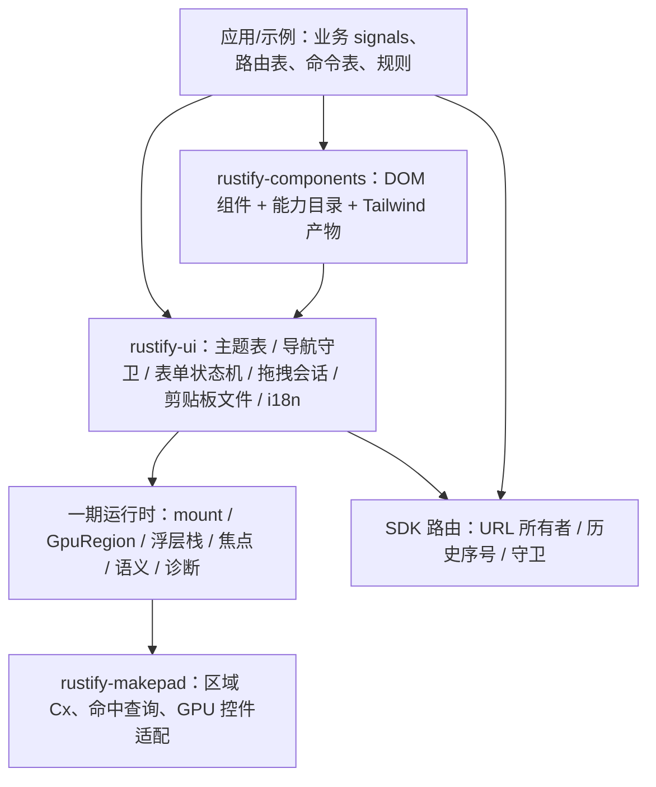

# P2 · Rustify UI · 组件目录、表单、导航与工作区（Leptos CSR + Makepad Web · Rust/UI 子集硬分叉接入）

> **计划状态：In progress**（A-1、A-2 均已解除：用户 2026-09-10 判定一期完成并要求后续只做二期。**本文件是唯一的工作入口**，`P1-WASM-UI.md` 已封板，不要再从那里开工）。
>
> 调查基线：2026-09-09 · `465f18081e5bf9bd38fc4bf79d68fb1314e10c6f` · 调查开始时工作区 clean；本次仅新增本计划。参考源码来自被忽略的 `ref/`（`ref/ui-main` 18 MB、`ref/leptos-main` 12 MB、`ref/makepad-dev` 293 MB），不属于该 commit。
> 输入：[PRD v0.1](../PRD-WASM-UI.md)（仍为评审草稿，Q1–Q3 与建议预算未批准）；[P1 计划](P1-WASM-UI.md)。**P1 实施状态：3/8 里程碑关闭（M1/M2/M3）**（P1 快照 2026-09-09）；M4–M8（几何/浮层/焦点、原生文本与语义、组件子集/异步/主题、部署/恢复/诊断、验收）均未开始。本计划不把 P1 未交付的能力写成已有事实。
> 已读取规则：宿主根目录无 AGENTS.md/CLAUDE.md；`ref/ui-main/CLAUDE.md` 及其各 crate 的 CLAUDE.md 只约束该参考树的维护者发布流程，对本仓无约束；`ref/makepad-dev/AGENTS.md` 已在 P1 读取。采用 `.claude/skills/dev-plan/SKILL.md` 与配套骨架、架构质量参考。
> 修订：2026-09-09 评审后核实 7 条意见全部成立并回写：ADR-6 由 leptos_router 改为 SDK 自研最小路由（页面 URL 唯一所有者、作用域内锚点拦截、`history.state` 序号计算位移，F12/F13/F26）；拖拽会话绑定查询序号与目标身份（§5.4）；提交请求绑定代际并等待异步验证（§5.3）；样式隔离改为 utilities 前缀 + 作用域限定手写 CSS，并把宿主控件样式不变纳入 V1（ADR-5/F28）；滚轮改为宿主同步边界判定，宿主桥修改列入 M6（§5.4 第 5 步/F27）；NFR-1 的 B1 对照值改为 5 s/8 MiB/2 s。
>
> **建议本期交付：在一期运行时之上交付应用骨架层——18 类组件目录（DOM 全部、GPU 声明子集）、表单、浏览器导航与深链接、可调整工作区、跨区拖拽/剪贴板/文件、多语言与固定文本样本；三个示例（fusion-basic 回归、property-workbench 升级为 PRD B1 形态、新增 component-catalog）；Rust/UI（`ref/ui-main`）子集以硬分叉方式接入。**
> 本期独特职责：把一期的挂载/状态/浮层/焦点/语义/主题运行时，组装成开发者可直接搭应用的组件与骨架，并让示例达到 PRD 完整版本定义的 B1 负载形态。
> **顶层排除：本期不做大数据（R20/R30 的 B2/B3）、独立 wasm 实例 trap 隔离、Windows/Linux/移动矩阵、WCAG 2.2 AA 整体合规、GPU 自绘文本编辑器、对外发布；本期通过不等于 PRD 完整版本达标。**

## 实施者定位

执行本计划的 agent 是**资深软件工程师**：Kent Beck 式的 TDD 纪律加上《程序员修炼之道》式的精确。本节由骨架原样带入，不随项目改写；开始任何里程碑前先接受以下约定。

- **表达方式**：极简，每句话都可引用。说到代码给文件路径，说到需求或验收给本计划的 ID（需求账本 R-* / NFR-* / C-* / A-*，决策 D* / ADR-*，里程碑 M*）。不写铺垫、不写感想、不复述计划。
- **完成的定义**：没有通过验证的任务不算完成。里程碑退出条件里的测试、断言和走查全部通过，才能在「实施进度」记为完成；验证没跑、失败或环境缺失，就如实记为缺口或阻塞。
- **工作顺序**：先写会失败的测试（红），再写最少的代码让它通过（绿），最后重构；三步不倒序、不合并。里程碑按本计划写的顺序执行，不跳步，不同时开两个未完成的里程碑。
- **源码干净**：注释解释为什么，不解释是什么。源码里不出现工单或需求编号（如 `# FR-12`、`// BUG-42`）、本计划的 R-* / M* 编号、agent 工作流标记或任何规划元数据；追溯关系只记在本计划的「实施进度」和提交说明里。交付的是可直接上生产的代码：干净、最小，没有多余防御、空洞注释或重复样板这类 AI 生成痕迹。

## 实施进度（实施期持续更新）

> 本节是跨对话恢复入口。每个里程碑通过全部退出条件后、开始下一里程碑前必须更新；实施暂停、阻塞或偏离计划时也要刷新快照。若实现改变了计划事实或决策，同步修订正文对应章节。

### 恢复快照

- 最近更新：2026-09-10。**M1 已完成并通过全部退出条件**（`--project=component-catalog` 9/9）。下一个是 M2。
- 当前进度：**1/8**（M1 关闭）。
- 当前状态：In progress。A-1、A-2 都已解除；D1/D2/D3/D5 与 ADR-4–7 已接受，D13/ADR-5 已按 M1 的实测修正（见下）。
- 最近完成（本计划）：**M1 · 契约对齐与组件工程，已关闭**。八个提交 `153f67c`→`fb3cc96`：① 核对 P1 M4–M7 六个实际接口并回写 §2.1（四处与假设不同，各自写明 P2 怎么办）；② Rust/UI 两个宏「原样导入 → 重写」两步提交，`sources.lock.json.rust_ui` 双向校验（说是原样的必须字节一致，说重写的必须不一致）；③ **修正 D13/ADR-5**：`tw_merge` 的 `prefix` 选项**不能设**——v4 的 `prefix(rui)` 在变体之前，该选项期待 v3 的位置；默认设置下 `rui` 作为首个变体参与合并，结果正确（5 条单测）；④ token 扩到 19 色 4 度量 + Tailwind 输入与提交产物 + `cargo xtask css [--check]`（第一次跑就抓到目录页的类没编译进产物）；⑤ 第三个示例 `component-catalog`（18 类导航、能力页、总表、主题/语言切换、一个只画 token 的 GPU 区域）+ 第三个 Playwright project + 宿主原生控件对照夹具（与「不加载我们样式表的同样标记」逐属性比对，结论：我们的两张样式表对宿主原生控件零影响）+ CI 增项。
- 下一步：**M2 · 18 类组件目录**。第一步按 §2.1 的结论：把能力目录从 `crates/rustify-ui/src/catalog.rs` 搬进 `crates/rustify-components`，与 18 类组件放在同一个提交里（搬空的目录没有意义），`docs/components.md` 随之改由新目录生成；然后按 §1.2 的文件清单逐个「原样导入 → 重写」，浮层类建在 P1 的浮层栈上，退出条件见 §10 的 M2 行。
- 当前阻塞：无。
- 代码基线：`736b668`（一期收尾）→ `153f67c`、`b14b2fb`、`a92c8dc`、`2e435e1`、`07ce3e0`、`5edcc31`、`fa0e5a4`、`fb3cc96`（M1）→ `1a479ef`、`a3a555c`（一期的脚本堆泄漏修复，二期同样受益：区域在两次泵之间攒够 20,000 条垃圾就清扫一次）。工作区 clean。

### 完成记录

| Milestone | 完成时间 | 准确完成摘要 | 验证证据 | 代码基线 |
| --- | --- | --- | --- | --- |
| M1 | 2026-09-10 | 契约对齐与组件工程：核对并回写 §2.1；`rustify-components` 建起（两个 Rust/UI 宏原样导入后重写，去 leptos_router、去 nightly、加 test_id）；`sources.lock.json.rust_ui` 双向校验；D13 按实测修正（tw_merge 不设 prefix）；token 扩表 + Tailwind 输入与产物 + `cargo xtask css [--check]`；第三个示例 component-catalog 与第三个 Playwright project；宿主控件计算样式对照；CI 增项。未做：18 类组件本身与目录搬迁（M2）、路由（M4） | `docs/validation/p2/m1.md`；`npx playwright test --project=component-catalog` 9/9；`cargo test --workspace --lib` 65；`cargo test -p xtask` 14；clippy/fmt 通过；`cargo xtask css --check` 无漂移；`cargo xtask sources verify` 通过；`cargo xtask doctor` 10/10 | `fb3cc96` |

## 0. 需求、范围与决策

### 0.1 第二阶段的完成形态

建议 P2 为**应用骨架层预览**：开发者用一份组件目录与表单/导航/工作区能力搭出桌面级浏览器工具；DOM 侧组件源自 Rust/UI 子集的硬分叉并重写为 CSP 兼容、受控、有语义的版本；GPU 侧按声明子集提供对应控件；三份示例共同复用 SDK 与组件 crate。本期新增能力仍标实验支持。

| 交付物 | 最小内容 | 本期完成判据 |
| --- | --- | --- |
| component-catalog（新增示例） | 18 类组件各有可运行示例、属性/动作说明、DOM/GPU/跨区支持状态；状态矩阵；主题切换；语言切换；B5 文本样本页 | R18 AC1–3、R16 AC1–3、R17 AC1–2 在此验收；能力表无空白项 |
| property-workbench（升级到 B1） | 3 面板（对象列表、GPU 视图、属性表单）、10 个标签页、1,000 个对象、20 个可见属性、1 个菜单与 1 个模态框、命令入口、深链接 `/objects/:id`、跨区拖拽、导入/导出 | 与 PRD §5.2 B1 定义逐项匹配后才可用 B1 名称；R19/R21/R22/R11/R14 在此验收 |
| fusion-basic | 只做回归与嵌入夹具，不扩功能 | 一期全部浏览器用例继续通过 |
| `crates/rustify-components` | Rust/UI 子集硬分叉 + SDK 浮层栈上的重写组件 + 能力目录数据 + Tailwind 产物 | 零内联脚本/样式；每个组件有六类能力声明与语义 |
| SDK 增量 | 路由守卫、表单状态机、拖拽会话、剪贴板/文件、i18n、主题 token 表 | 纯逻辑可在宿主单测；浏览器行为有 Playwright 用例 |
| 可复现交付材料 | Rust/UI 导入记录、Tailwind 产物漂移检查、能力表/文档生成、B1 基线报告、六类报告 | 两次干净构建通过；未测项如实标注 |

**B1 的边界**：B1 是 PRD 的负载定义，不是性能预算已批准（A-3）。M8 交 B1 的启动/体积/延迟基线并与 R29/R30 目标对照，不设通过门，除非用户在 M8 前批准预算。

### 0.2 需求与约束账本

带连字符 ID 是本计划账本；不带连字符的 R01–R40 是 PRD 本地工作号。两者都不是 SPMS key。

| ID | 类型/来源 | 本期内容 | 设计/验收落点 | 状态 |
| --- | --- | --- | --- | --- |
| R-1 | 功能；PRD R18/R16/R15(AC1)/R25 | 18 类组件目录：DOM 全部、GPU 声明子集；默认/悬停/焦点/激活/禁用/只读/错误/加载状态；六类能力声明；统一主题与局部覆盖；每个交互组件名称/角色/值/状态；20 项语义定位 | §2/§5.1/§6.1/§6.3，V1–V4，M1/M2 | 建议纳入 |
| R-2 | 功能；R19 | 表单：字段关联错误、焦点到首个错误、异步验证反序不覆盖当前值、保存单飞与失败保留输入 | §5.3，V5，M3 | 建议纳入 |
| R-3 | 功能；R22/R27(AC2) | 浏览器历史与深链接：20 次交替导航恰好 20 条历史；3 个深链接 + 1 个 404；根/子路径一致；离开拦截允许/阻止各 20 次；GPU 发起的导航经应用 | §5.2/ADR-6，V6，M4 | 建议纳入 |
| R-4 | 功能；R21 | 工作区：≥3 面板分隔栏 100 次且不小于最小尺寸；10 标签页关闭/焦点转移/状态保留；可搜索命令入口与禁用原因 | §6.2，V7，M5 | 建议纳入；任意停靠树不纳入 |
| R-5 | 功能；R11/R14 | 跨区拖拽 100 次单次提交、取消/失焦/拒绝 0 次；嵌套滚轮传播 20 轮；禁用/只读不修改；程序化复制粘贴与授权拒绝路径；文件导入三态与取消；导出字节一致 | §5.4/§5.5/ADR-7，V8/V9，M6 | 建议纳入；拖出到 OS、笔压手势不纳入 |
| R-6 | 功能；R17 | 中英文案切换 20 次；日期数字按应用格式；20 条 B5 样本无乱码且方向正确；字体失败缺字标识与恢复 | §5.6/§6.4，V10，M7 | 建议纳入；全部语言/字体特性不纳入 |
| R-7 | 功能；R28（部分） | 三示例各覆盖 DOM↔GPU 双向更新；组件目录、表单、导航、工作区、i18n 五个文档主题 | §9.4，V12，M8 | 部分纳入；迁移示例与新用户研究后续 |
| NFR-1 | 性能；R29/R30（B1 部分） | B1 真实负载的冷/热启动、首次可用体积、跨区选择与属性编辑输入到呈现延迟 p95/p99 基线；对照 PRD 目标不设门 | §7，V11，M8 | 预算未批准；基线必交 |
| NFR-2 | 可靠性；R33/R06 | 迟到验证结果、离开后迟到导航结果不生效；拖拽 0 重复提交；提交单飞；导航拦截后 URL 与内容一致 | §5/§8，V5/V6/V8 | 建议纳入 |
| NFR-3 | 兼容/可用性；R34/R35 | macOS Chrome 通过门、Safari 观察；目录组件语义与三示例 5 条键盘旅程；对比度与 200%/400% 缩放走查 | §6.3/§9.4，V4，M8 | 矩阵沿用 P1 |
| NFR-4 | 安全；R36 | 发布 CSP 不放宽；组件零内联脚本/样式；文件导入上限与格式在读取前拒绝；授权拒绝不伪报；含脚本文本保持数据 | §4.3/§5.5，V1/V9 | 建议纳入 |
| NFR-5 | 可维护性；R38/R39/R40 | Rust/UI 导入记录与许可；tw_merge/tailwindcss 锁定；能力表与文档由同一数据生成并查漂移；新增错误种类登记；六类报告 | §4/§9.5，V1/V12 | 建议纳入；稳定弃用窗口后续 |
| C-1 | P1 ADR-2/D3 | Leptos 锁 crates.io 0.8.20 且不改其源码；不引入需要修改源码才能满足需求的 Leptos 系 crate；一旦需改则整线转 0.9.0-beta 硬分叉 | ADR-6/§4.2，M1/M4 | 已确认规则 |
| C-2 | P1 §4.3/`xtask/src/serve.rs` | 发布 CSP `default-src 'none'; script-src 'self' 'wasm-unsafe-eval'; style-src 'self'; … base-uri 'none'` 不放宽 | ADR-4/ADR-5/§4.3 | 已核实 |
| C-3 | 用户 2026-09-08（P1 §0.6） | Rust/UI（`ref/ui-main`）本期集成；MIT 许可；registry 不是可发布 crate | ADR-4，M1 | 已确认 |
| C-4 | PRD §2.4/§2.5 | 不做账号、业务持久化、不受信任插件；只读/禁用是本地交互语义 | §0.4/§7 | 沿用 |
| C-5 | P1 D10；`makepad/platform/src/os/web/web.js` 356–401、548–552 | GPU 区域在嵌入模式下已拒绝改 URL/history/title；导航只能由应用发起 | §5.2 | 已核实 |
| A-1 | 范围假设 | 用户确认 §0.1 交付形态、§0.5 延期与 §0.3 关键决策（D2 Rust/UI 接入方式、D3 CSS 管线、D5 路由方案） | 用户 2026-09-09 指示「按照 docs/plan/P2-WASM-UI.md 完成开发」，即按本计划所写的建议选择实施；D1/D2/D3/D5 与 ADR-4–7 据此转为已接受 | 已解除 |
| A-2 | 前置假设 | P1 M4–M8 按 P1 计划关闭：浮层栈/锚点、焦点与命令优先级、原生编辑态与语义入口、受控组件子集与主题 token、异步票据、诊断环与错误种类 | P1 进度 8/8；P2 M1 第一项即核对实际接口并回写 §2 | **部分解除**（2026-09-09 第二轮）：P2 M1 依赖的六个接口全部已交付并通过自动验证；P1 形式上仍是 4/8，只欠四份人工记录 |
| A-3 | 测量合同 | PRD 预算仍未批准；P2 只交 B1 基线与对照，不把 R29/R30 数字写成门 | 用户确认；M8 前 | 开放（默认沿用 P1 A-6） |
| A-4 | 验收资源 | M8 需真实 VoiceOver+Chrome、真实拼音（表单与命令面板中文）、阿拉伯文/emoji 参考样本评审人 | 用户承诺；M7 前 | 开放 |
| A-5 | 技术假设 | 以 `history.state` 中的 SDK 序号计算位移并 `history.go(-delta)` 反向恢复，在 Chrome 对多项跳转（`go(-3)`）、重复 URL、恢复期间连续后退均可靠且不产生重复历史项 | M4 首个探针；失败则守卫降级为只覆盖单步并写入已知限制 | 开放 |
| A-6 | 技术假设 | `--cfg=web_sys_unstable_apis` 可经 cargo-makepad 追加 RUSTFLAGS 生效，使 web-sys 0.3.105 的 Clipboard `read_text/write_text` 可用 | M6 首个探针；失败则改用宿主 JS 薄封装 | 开放 |

### 0.3 决策表

| # | 决策点 | 建议选择 | 含义/影响 | 依据 |
| --- | --- | --- | --- | --- |
| D1 | 组件层形态 | 新增 `crates/rustify-components`（DOM 组件、能力目录数据、Tailwind 类字符串）；GPU 对应控件按 P1 M6 的适配落点扩展 | SDK crate 不含 Tailwind；应用只依赖组件 crate；三次以上调用方（三个示例）成立共享 | R-1；§2 删除测试 |
| D2 | Rust/UI 接入方式 | 子集硬分叉进组件 crate 并重写（ADR-4）；不用 `ui add` 逐应用复制、不依赖 registry | 浮层类组件改建在 SDK 浮层栈上；纯 Rust 组件保留 class 字符串与 `data-name` | C-2/C-3；F3–F7 |
| D3 | CSS 管线 | Tailwind v4 CLI 生成的 CSS 提交进仓，`cargo xtask css` 再生成并查漂移；不引入 preflight 与 Rust/UI 的 `@layer base`（ADR-5） | `build-web` 不依赖 Node；宿主页面样式不被重置 | F8/F9；R07 宿主共存 |
| D4 | 主题事实来源 | Rust token 表（sRGB）为唯一来源：挂载时经 CSSOM 写到作用域根的 CSS 变量，同一表投影为 GPU props；变量名沿用 Rust/UI（`--background`、`--primary`、`--border`、`--destructive`、`--ring`、`--radius`…） | 不在运行期解析 oklch；深色以作用域根 `data-theme="dark"` 触发，暗色变体只匹配本 SDK 属性 | F8/F10；R16 AC2；`crates/rustify-ui/src/mount.rs` 的 `data-rustify-scope` |
| D5 | 路由 | SDK 自研最小路由（ADR-6）：页面 URL 只有一个所有者作用域，锚点拦截只在作用域根，历史项在 `history.state` 带 SDK 序号；非所有者作用域用内存 location | 不引入 leptos_router；Rust/UI `Link`/`Button href` 改读 SDK location；宿主链接与第二个作用域不触碰 URL | F11–F14/F26 |
| D6 | 深链接资源寻址 | `build-web --base <path>` 把 `index.html` 的相对引用改写为以 base 开头的绝对路径；`serve --spa` 对未知路径回退 `index.html` | CSP `base-uri 'none'` 禁止 `<base>`；构建与部署 base 必须一致，不一致启动即失败 | F15；R22 AC2/R27 AC2 |
| D7 | 工作区归属 | 分栏/标签页/命令入口为 DOM 组件，GPU 区域只是面板内容；不用 Makepad Dock 承载跨类型面板 | 布局由 Leptos 决定（P1 D1）；GPU 区域尺寸变化走一期 ResizeObserver 路径 | F17；P1 §6.1 |
| D8 | 跨区拖拽 | SDK 拖拽会话基于指针事件（ADR-7）；HTML5 DnD 只用于 OS 文件拖入 DOM 投放区 | Makepad Web 无 DnD；GPU 目标通过区域命中查询应答 | F18/F19 |
| D9 | 剪贴板 | `navigator.clipboard` 经 web-sys（A-6）；失败/拒绝时给出手动路径（选中原生控件文本由用户按键复制）；GPU 文本走一期原生编辑态 | 不复活 Makepad 隐藏 textarea 路径 | F20 |
| D10 | 表单校验 | 规则由应用以函数提供，SDK 只管理字段错误、代际与单飞；不引入 `validator` 派生 | 示例手写规则；不承诺通用表单引擎 | PRD R19 边界 |
| D11 | 图标 | 组件 crate 提供 `Icon` 容器与目录所需的少量内联 SVG；不依赖 crates.io `icons`（强制 `leptos/nightly`） | 应用可传任意 SVG 子节点 | F6 |
| D12 | 浏览器矩阵 | 沿用 P1：macOS Chrome 固定版本通过门，Safari 观察 | Rust/UI Popover 的 CSS anchor positioning 不被采用，矩阵不因此变化 | P1 §9.4；F7 |
| D13 | 样式隔离 | Tailwind utilities 带 `rui` 前缀；变量与手写 CSS 选择器一律限定在 `[data-rustify-scope]` 之下；宿主控件计算样式在挂载前后不变作为 V1 断言 | 宿主自己的 Tailwind 类与原生控件不受影响；Rust/UI 类字符串导入时做前缀改写。**M1 修正**：`tw_merge` 的 `prefix` 选项**不设**——v4 的 `prefix(rui)` 把前缀放在变体之前（`rui:hover:bg-x`），而该选项期待的是 v3 的位置（变体之后）。默认设置下 `rui` 被当作首个变体解析，合并结果与无前缀时一致（`crates/rustify-components/src/macros/mod.rs` 的五条单测） | F28；R07 AC2 |
| D14 | 滚轮消费 | 宿主 wheel 处理器按区域最近一次上报的边界状态同步决定是否 `preventDefault`：未到边界或策略为 `stop` 则消费，到边界且策略为 `propagate` 则不消费也不投递 | 需要分叉新增区域→宿主的边界上报消息；DOM 嵌套容器用 `overscroll-behavior` | F27 |

D1/D2/D3/D5 由用户在 A-1 中一并确认，2026-09-09 已确认；其余为工程决策，在对应里程碑退出时确认。

### 0.4 ADR-lite

#### ADR-4：Rust/UI 以子集硬分叉方式接入，浮层类组件在 SDK 浮层栈上重写

- 状态：Accepted（A-1 已于 2026-09-09 解除）。
- 背景与驱动：C-3 要求本期集成 Rust/UI；C-2 要求零 `unsafe-inline`。核实（F3–F7）：Rust/UI 是复制粘贴式 registry 而非 crate（`ref/ui-main/README.md` 第 8 行）；`ref/ui-main/app_crates/registry/src/ui/` 89 个文件 12,316 行；其中 19 个组件用 `format!` 拼装内联 `<script>`、22 个注入 `<style>`、35 处 `style=` 属性；Dialog 无 `open` 属性、Switch/Tabs 非受控；无 `role="dialog"`/`tablist`/`tab`、无焦点陷阱与 roving tabindex；Popover/HoverCard 依赖 CSS anchor positioning。P1 M4/M5 已在 SDK 内设计浮层栈、焦点优先级与语义入口。
- 备选 A：`ui add` 把组件复制进每个示例——三份重复、内联脚本原样进入、SDK 不拥有组件契约，淘汰。备选 B：作为 crate 依赖——registry 未发布且带 SSR/演示依赖，不可行。备选 C：子集硬分叉进 `crates/rustify-components`，纯 Rust 组件保留 class 字符串与 `data-name`，浮层类（Dialog/Menu/Select/Tooltip/Command/Popover）在 SDK 浮层栈上重写并只借用其视觉 class，缺失的受控属性与 ARIA 补齐。备选 D：不接 Rust/UI，自写 CSS——违背用户决定并放弃现成设计系统。
- 决策：C。导入规则：只导入 §1.2 列出的文件；每个导入文件在 `sources.lock.json` 新增 `rust_ui` 节记录来源路径、导入日期、SHA-256 与「原样/重写」标记；保留 `crates/rustify-components/LICENSE-RUST-UI`（MIT，Max Wells）。`leptos_ui` 的 `clx!`/`variants!` 宏源码（`ref/ui-main/crates/leptos_ui/src/`）同样硬分叉进组件 crate，去掉对 `leptos/nightly` 特性的依赖，并把 `variants!` 的 `href` 分支从 `::leptos_router::hooks::use_location` 改为读取 SDK 的 location 上下文（ADR-6）；`ui/link.rs` 的 `<A>` 改为 SDK `Link`。`tw_merge` 0.1.21 作为 crates.io 依赖（纯 Rust，不依赖 Leptos）。**M1 实测修正**：不启用它的 `prefix` 选项——它期待 v3 的前缀位置（变体之后），而 v4 的 `prefix(rui)` 在变体之前；默认设置下 `rui` 作为首个变体参与解析，冲突判定与无前缀时一致（见 D13）。
- 正面后果：组件契约、语义与 CSP 合规由本仓拥有；一期浮层/焦点/语义投资被复用；三个示例只依赖一个组件 crate。
- 负面/中性后果：本仓承担约 2,700 行原样代码与约 2,300 行重写代码的维护；不再跟随 Rust/UI 上游；`data-name` 与 Tailwind 类字符串成为长期约定。
- 重新评估触发：Rust/UI 发布可依赖的受控、无内联脚本版本；或 P1 M4 的浮层栈不足以承载菜单/选择器（届时比较改用 Rust/UI 的 JS 方案与 CSP 的冲突成本）。

#### ADR-5：Tailwind v4 产物提交进仓，不引入 preflight 与全局 base 层

- 状态：Accepted（A-1 已于 2026-09-09 解除）。
- 背景与驱动：Rust/UI 全部样式是 Tailwind v4 类字符串（`package.json` 锁 `tailwindcss ^4.1.13`），依赖 `@theme inline`/`@utility`/`@custom-variant` 等 v4 语法；`ref/ui-main/style/tailwind.css` 第 218–291 行的 `@layer base` 设 `html { overflow: hidden; height: 100dvh }` 与 body 内边距，`@import "tailwindcss"` 默认带 preflight。去掉 preflight 仍不够：utilities 是全局类选择器，会与宿主自己的 Tailwind 构建同名冲突；Rust/UI 手写的 `ref/ui-main/style/slider.css` 第 2 行直接匹配全页 `input[type="range"]`（评审探针 2026-09-09：作用域外滑块 `appearance` 由 auto 变为 none、高度由 16 px 变为 10 px）。R07/R27 要求嵌入既有页面时宿主样式不被改写；C-2 要求样式来自同源文件。
- 备选 A：构建期在 `build-web` 中调用 Tailwind CLI——`build-web` 从此依赖 Node，与 P1 quickstart 的构建前提冲突。备选 B：生成产物提交进仓，`cargo xtask css` 调用 `npx @tailwindcss/cli` 再生成，CI 以 `--check` 查漂移——Node 只在改动类字符串时需要。备选 C：放弃 Tailwind，手写 CSS——需重写全部 Rust/UI 类字符串，失去接入意义。
- 决策：B，并加三层隔离（D13）。输入文件 `crates/rustify-components/css/rustify.tailwind.css` 只 `@import "tailwindcss/theme.css" layer(theme)` 与 `@import "tailwindcss/utilities.css" layer(utilities)`，不导入 preflight，不复制 Rust/UI 的 `@layer base`；utilities 以 Tailwind v4 `prefix(rui)` 生成（`rui:bg-primary`），导入 Rust/UI 类字符串时机械加前缀，`tw_merge` 以其 `prefix` 选项配置（`ref/ui-main/crates/tw_merge/tw_merge/src/lib.rs` 第 78 行）；`@source` 指向组件 crate 与三个示例的 `.rs`；token 默认值定义在 `[data-rustify-scope]` 而非 `:root`；暗色变体定义为 `@custom-variant dark (&:is([data-rustify-scope][data-theme="dark"] *))`；`ref/ui-main/style/slider.css`（140 行）等 Rust/UI 手写 CSS 并入同一输入文件时，每条选择器改写为 `[data-rustify-scope] input[type="range"]` 这类作用域后代选择器，不保留任何裸元素/属性选择器。产物 `crates/rustify-components/css/rustify.css` 由 `build-web` 复制进产物目录并计入 css 类体积。`tw-animate-css` 仅在重写后仍使用其类名时引入，M1 决定并记录。前缀在分层导入上的确切语法与 `tw_merge` 前缀合并的正确性在 M1 首个提交验证，失败则退回「无前缀 + 作用域后代选择器包裹 utilities」并记录。
- 正面后果：宿主页面不受重置影响；宿主自己的 Tailwind 类与原生控件不受组件样式影响；深色主题按作用域生效且对宿主 `.dark` 免疫；构建前提不变。
- 负面/中性后果：仓库多一份生成产物（预计数十 KB）；类字符串带前缀后与 Rust/UI 上游 diff 不再直观；改类字符串后忘记再生成会被 CI 拦下而不是静默失效；`tw_merge!` 在运行期合并类字符串，成本在 M8 计入 B1 基线。
- 验收：V1 在挂载前后读取宿主 `input[type="range"]`、`button`、`a`、`input[type="text"]` 的计算样式（`appearance`、高度、字体、颜色）并断言相等；双挂载与宿主 `.dark` 同时存在时断言不串扰。
- 重新评估触发：产物体积或运行期合并开销在 B1 基线中显著（M8 报告）；或需要 Tailwind 插件生态。

#### ADR-6：SDK 自研最小路由，页面 URL 只有一个所有者

- 状态：Accepted（A-1 已于 2026-09-09 解除；A-5 仍待 M4 首个探针）。
- 背景与驱动：R22 要求历史唯一、深链接、根/子路径与离开拦截；R07 AC2 要求宿主链接保留浏览器行为；R05 要求同页双挂载不串扰；C-1 禁止修改 Leptos 系源码。核实（F11–F14、F26）：crates.io 有 `leptos_router` 0.8.15；`Router` 硬编码 `BrowserUrl::new()`（`ref/leptos-main/router/src/components.rs` 第 87 行），location provider 不可替换；它的锚点点击监听注册在 `window`（`router/src/location/history.rs` 第 161 行），只判同源与 base（`router/src/location/mod.rs` 第 350–360 行），没有挂载容器归属判断——根路径部署时宿主页面的同源链接也会被它接管，两个作用域各挂 `Router` 时两个监听器都会导航；`popstate` 直接写入 URL 信号（`history.rs` 第 170–200 行）且 `complete_navigation` 用应用传入的 state 覆盖 `history.state`（第 226、236 行），SDK 无法给历史项打序号；浏览器历史可一次跨多项（`history.go(-3)`），URL 不能唯一标识历史项，因此没有序号就无法把被拒绝的跳转恢复到原位。Rust/UI 的 `Link` 与 `variants!` 生成的 `href` 分支调用 `::leptos_router::hooks::use_location`（`ref/ui-main/crates/leptos_ui/src/variants.rs` 第 222 行）。
- 备选 A：`leptos_router` + 外侧守卫——宿主链接接管与多项跳转恢复两个问题都无法在其外侧解决，只能靠「宿主链接必须带 `rel="external"`」之类的宿主契约兜底，淘汰。备选 B：SDK 自研最小路由：`crates/rustify-ui/src/router.rs` 拥有 pushState/replaceState/popstate、base、路径模式匹配（静态段与 `:param`）、未匹配回退、`use_location/use_params/navigate/Link`；锚点监听挂在作用域根而非 `window`；每个 SDK 创建的历史项在 `history.state.rustify.index` 带单调序号。备选 C：自研路由但仍用 leptos_router 做匹配——`Router` 一创建就注册 `window` 监听，无法只取匹配部分，不可行。
- 决策：B。规则：一个页面只有一个「URL 所有者」作用域（`MountConfig { url_owner: true, base }`），第二个所有者在 `mount` 前置闸失败并返回 `UiError::UrlOwnerConflict`，已运行实例不受影响；非所有者作用域（嵌入既有页面、同页第二个实例）使用内存 location，`navigate()` 只改内存信号，不写历史；宿主页面的链接与滚动不经过 SDK。守卫在 P2 只服务「离开有未提交编辑的视图」（R22 AC3）。
- 正面后果：宿主链接与第二个作用域从机制上不可能被路由接管；历史项序号让拒绝后的恢复位移可计算；不引入需要外侧绕行的依赖；Rust/UI 的 `href` 分支改读 SDK location 即可。
- 负面/中性后果：不提供嵌套路由、`ProtectedRoute`、表单动作与服务端重定向；依赖 leptos_router 上下文的第三方组件不可用（记入 `docs/compatibility.md`）；SDK 创建之前已存在或宿主自行 pushState 的历史项没有序号，守卫对它们不生效（只剩 `beforeunload` 覆盖整页卸载），作为已知限制写入 `docs/navigation.md`。
- 重新评估触发：出现需要嵌套路由或必须复用依赖 leptos_router 的生态组件的应用；届时以「URL 所有者 + base 分离」契约重新评估 leptos_router。

#### ADR-7：跨区拖拽由 SDK 指针会话承载，不用 HTML5 DnD

- 状态：Accepted（A-1 已于 2026-09-09 解除）。
- 背景与驱动：R11 要求 DOM↔GPU 拖动 100 次每次至多 1 次提交，取消/失焦/拒绝 0 次提交。核实（F18/F19）：Makepad Web 后端不产生 `Event::Drag/Drop`（`makepad/platform/src/os/web/web.rs` 第 739–742 行 `StartExternalDragging` 直接报错），`dock.rs`/`reorder_list.rs` 的拖动实际靠指针事件；嵌入区域对 `pointerdown` 调用 `setPointerCapture`（`web.js` 第 1527–1549 行），指针离开画布后事件仍投递给该画布。
- 备选 A：HTML5 DnD——画布不能做细粒度目标、Makepad 无消费者、拖影与 `dataTransfer` 语义不受控。备选 B：SDK 会话：起点（DOM 元素或 GPU 动作 `DragStart{payload}`）→ SDK 在 `document` 层跟踪指针（GPU 起点时先释放画布捕获）→ 每次移动用 `elementFromPoint` 命中 DOM 目标，或向指针下的区域发 `DragOver{local}` 查询、区域以动作应答 accept/reject →释放时对「最后一次确认的目标」提交恰好一次 `Drop{payload}`；Esc、`pointercancel`、窗口 `blur`、`visibilitychange` 均取消且 0 提交。
- 决策：B。OS 文件拖入只作用于 DOM 投放区（HTML5 `drop`），不进 GPU。
- 正面后果：一处状态机拥有「至多一次」规则；GPU 目标与 DOM 目标同一契约；一期 `Pace::Continuous` 得到第二个真实生产者。
- 负面/中性后果：GPU 目标应答经泵异步到达，释放时以最后确认为准，最后一段移动后未应答则视为无目标；拖影为 DOM 元素。
- 重新评估触发：需要拖出到操作系统或跨页面拖拽（届时 HTML5 DnD 另立）。

### 0.5 职责与事实所有权

| 主体 | 拥有 | 恢复责任及边界 |
| --- | --- | --- |
| 应用/示例 | 业务 signal、校验规则、保存动作、路由表、命令表、文件上限与格式、导入结果的采纳、文案目录 | 决定接受哪些修改；导航被阻止后的提示文案；刷新后恢复 |
| `rustify-components` | 组件外观、状态矩阵、ARIA 与键盘、能力声明、Tailwind 产物 | 组件只显示传入值并回报动作；不持有第二份业务值 |
| Rustify SDK（`rustify-ui`） | 主题 token 表、导航守卫、表单状态机、拖拽会话、剪贴板/文件出口、i18n 上下文、错误种类 | 作用域清理时结束会话与守卫；不复制业务事实 |
| 私有 Makepad 集成 | GPU 控件适配、区域命中查询、主题 props 投影 | 只答复活区域；拒绝 GPU 内改 URL/剪贴板/文件 |
| SDK 路由（URL 所有者作用域） | 页面 URL、历史项序号、锚点拦截、路径匹配、导航守卫 | 只有一个所有者；非所有者作用域与宿主链接不经过它；SDK 之前的历史项不在守卫范围 |
| 浏览器/宿主 | 权限提示、剪贴板与文件系统、历史栈、字体加载 | 拒绝授权时应用给替代路径；SDK 不绕过 |

一句话：组件只呈现、SDK 只裁决顺序与失败、应用拥有业务事实。

### 0.6 明确不在本期及后续路线

- **10 万行表格、1 万 GPU 对象、树与虚拟化、B2/B3 预算（R20/R30）**：P3。分叉内 `makepad/widgets/src/portal_list.rs`（Fenwick 树按可见范围绘制）与 `data_grid.rs`（双轴虚拟化）已存在，P3 直接评估，本期不预留接口。
- **独立 wasm 实例 trap 隔离、GPU 上下文原位重建、增强多线程**：完整版本前专项；本期沿用 P1 D9。
- **GPU 自绘单行/多行编辑器**：保持 P1 ADR-3 的原生编辑态；本期 GPU 文本控件仍是「展示 + 原生编辑」。
- **完整 icons 集（1,635 个组件）、Rust/UI 的 charts/date_picker/carousel/sonner/data_grid**：不导入；目录只需 18 类。
- **Windows/Linux/移动矩阵、WCAG 2.2 AA 整体评审、两份迁移示例、5 名新用户研究、稳定弃用窗口、对外发布**：完整版本发布门。
- **局部热更新工具（R24 AC3）、完整 SVG 使用方式目录（R23）**：后续；本期只在文档写明整页重载语义。
- **拖出到操作系统、笔压与复杂手势、任意 3D 变换**：不纳入。
- **SSR/hydration、WebGPU、自动双后端转换、云服务、业务持久化、不受信任插件**：保持 PRD §2.5。

### 0.7 对 P1 未完成里程碑的对齐建议（不修改 P1 计划）

以下建议供 P1 M4–M8 实施者参考，目的是让 P2 M1 的契约对齐不必返工；采纳与否由 P1 实施者在其进度中记录。

1. M6 主题 token 直接采用 Rust/UI 变量名（`--background/--foreground/--primary/--primary-foreground/--secondary/--muted/--accent/--destructive/--border/--input/--ring/--radius`），值存 sRGB；作用域根属性用 `data-theme="light|dark"`。
2. M4 浮层锚点接口接受 `{region, generation, key, local_rect}` 的同时接受 DOM 元素锚点；P2 的菜单/提示/选择器都走同一栈。
3. M5 语义定位以 `data-testid` + role/name 为入口；组件 crate 会为每个组件透传 `test_id`。
4. M6 的异步票据类型（P1 §3「异步票据」）设为公开 API；P2 表单的异步校验与导航后的迟到结果都用它。
5. M7 的错误种类枚举保持可扩展；P2 新增 `UrlOwnerConflict`、`NavigationRestoreFailed`、`ClipboardDenied`、`FileTooLarge`、`UnsupportedFileType`、`ImportAborted`，以及信息级的 `NavigationBlocked`、`NavigationBusy`、`DragCancelled`。
6. M4 的 `Pace::Continuous` 生产者（拖动）与 P2 拖拽会话共用同一投递路径。

## 1. 当前事实与改动面

### 1.1 现状与缺口

| # | 状态 | 事实与证据 | 设计后果 |
| --- | --- | --- | --- |
| F1 | 已核实·足够 | SDK 现有公开面：`mount/AppHandle/MountConfig`（`crates/rustify-ui/src/mount.rs`，容器属性 `data-rustify-scope`）、`GpuRegion` 带 `props/on_action/state/refused/class/test_id`（`region.rs`）、`ActionSink/Binding/submit_all`（`binding.rs`）、`Scheduler` 队列 1,024/批 64（`scheduler.rs`）、`UiError` 三个变体（`diagnostics.rs`）；私有 `RegionApp/create_region/apply/destroy_region/defer`（`crates/rustify-makepad/src/wasm/`） | P2 在此之上新增模块，不改既有签名；`RegionApp::handle_event` 的 outbox 是 GPU 侧应答拖拽/命中查询的唯一出口 |
| F2 | 已核实·部分交付 | 2026-09-09 复核：`overlay.rs`、`text.rs`、`components.rs`、`gpu.rs`、`theme.rs`（含 `ThemePatch`/`ThemeOverride`）、`task.rs`、`catalog.rs` 都已存在并通过验证；语义入口没有独立的 `semantics.rs`，它由 `catalog.rs` 加各控件自身的角色/名称承担；M7 的诊断环仍不存在 | A-2；P2 M1 第一项仍是核对 P1 实际交付的接口并回写 §2，引用 M7 的地方标「P1 待交付」 |
| F3 | 已核实·缺口 | Rust/UI 为复制粘贴 registry（`ref/ui-main/README.md` 第 8 行），`app_crates/registry` 版本 0.1.0 不可发布；`leptos_ui` 0.3.22、`tw_merge` 0.1.21、`icons` 0.18.3 在 crates.io（2026-09-09 `cargo info` 核实，MIT）；`leptos_ui` 与 `icons` 的清单启用 `leptos/nightly` | ADR-4：硬分叉子集；`tw_merge` 作依赖；`leptos_ui` 宏源码分叉进组件 crate；不依赖 `icons` |
| F4 | 已核实·缺口 | `ref/ui-main/app_crates/registry/src/ui/` 中 19 个文件输出 `format!` 拼装的内联 `<script>`（dialog/select/dropdown_menu/context_menu/menubar/command/popover/sheet/drawer/hover_card/navigation_menu/carousel/action_bar/multi_select 等）、22 个注入 `<style>`、35 处 `style=`；`dropdown_menu.rs` 第 29 行用 `document.currentScript`；8 个组件的脚本调用 `window.ScrollLock`（`ref/ui-main/app_crates/registry/src/hooks/use_scroll_lock.rs`） | 这些组件不能原样导入；浮层类在 SDK 浮层栈重写，`style=` 改为类或 CSSOM |
| F5 | 已核实·缺口 | Rust/UI 受控性与语义（路径相对 `ref/ui-main/app_crates/registry/src/`）：`Switch` 内部 `RwSignal`（`ui/switch.rs` 第 19 行）无回调；`Tabs` 只有 `default_value`（`ui/tabs.rs` 第 40–46 行）无 `role`；`Dialog` 无 `open` 属性（`ui/dialog.rs` 第 37 行）且全库无 `role="dialog"`/`aria-modal`/焦点陷阱；`Tooltip` 无 ARIA、纯 hover；`Input` 的 `disabled/readonly` 是非响应式 `bool`（`ui/input.rs` 第 40–41 行）；`Checkbox` 是完整受控范式（`ui/checkbox.rs` 第 5–12 行） | 导入后统一为 P1 M6 受控契约：`value: Signal<T>`、`on_change: Callback<T>`、`disabled/readonly: Signal<bool>`；补 ARIA 与键盘 |
| F6 | 已核实·足够 | Rust/UI 纯 Rust、无内联脚本的组件（路径相对 `ref/ui-main/app_crates/registry/src/`）：button（`variants!`）、label、input、textarea、checkbox、radio_button、switch、slider（需 `ref/ui-main/style/slider.css` 140 行）、progress、spinner、tabs、scroll_area、table、badge、card、separator、kbd、toast_custom；`form.rs`（322 行，依赖 `validator`）与 `field.rs`（179 行）；`data_grid.rs` 999 行含 ARIA grid | 原样导入的候选集合；表单只借用 Field/错误关联的结构，不引入 `validator` |
| F7 | 已核实·缺口 | Rust/UI 浮层定位（路径相对 `ref/ui-main/app_crates/registry/src/`）：Popover/HoverCard 用 CSS anchor positioning + Popover API（`ui/popover.rs` 第 99–141 行，Firefox 无实现）；Select/DropdownMenu 用内联 JS 的 `getBoundingClientRect` 翻转 | 不采用；锚点定位由 P1 M4 浮层栈提供 |
| F8 | 已核实·缺口 | Rust/UI 主题：`ref/ui-main/style/tailwind.css` 第 19–85 行在 `:root` 定义 oklch token，第 87–150 行 `.dark` 覆盖，第 14 行 `@custom-variant dark (&:is(.dark *))`，第 218–291 行 `@layer base` 改写 `html/body` | D4/ADR-5：token 定义在 `[data-rustify-scope]`，暗色变体绑定本 SDK 属性，不导入 base 层 |
| F9 | 已核实·缺口 | Tailwind v4 为硬依赖（`ref/ui-main/package.json` 第 17–21 行），仓库现有 `package.json` 只含 Playwright 与 pngjs；`xtask/src/build.rs` 只复制 `index.html/app.js/app.css` 与运行时文件 | 新增 `@tailwindcss/cli` devDependency 与 `cargo xtask css`；`build-web` 复制组件 CSS |
| F10 | 已核实·足够 | Tachys 静态 `style` 属性走 `Rndr::set_attribute(el, "style", …)`（`ref/leptos-main/tachys/src/html/style.rs` 第 287 行），在 `style-src 'self'` 下被拒绝（P1 M3 已踩坑）；`style:x=` 走 CSSOM 不受限 | 组件禁止 `style="…"`；必要的动态值用 `style:` 指令或类 |
| F11 | 已核实·边界 | `leptos_router` 0.8.15 提供 `Router base`、`Routes`、`use_navigate(NavigateOptions{replace,scroll,state})`、`use_params/use_query`（`ref/leptos-main/router/src/{components,hooks,navigate}.rs`）；`Router` 硬编码 `BrowserUrl`（`components.rs` 第 87 行），无只取匹配不取监听的入口 | ADR-6 不采用；本期路由能力以 R22 三条为界 |
| F12 | 已核实·缺口 | 锚点点击处理器检查 `ev.default_prevented()` 后才 `prevent_default` 并导航（`router/src/location/mod.rs` 第 311、367 行）；只判同源与 base（第 350–360 行）；监听注册在 `window`（`history.rs` 第 161 行），无挂载容器归属判断 | 根路径部署时宿主链接会被接管，双 `Router` 互相竞争；SDK 锚点监听改挂作用域根（ADR-6） |
| F13 | 已核实·缺口 | `popstate` 回调直接 `url.set(new_url)`（`history.rs` 第 170–200 行），无拦截点；`complete_navigation` 用应用 state 调 `push_state_with_url/replace_state_with_url`（第 226、236 行），SDK 无法在历史项上打序号 | 拒绝后的位移不可计算；SDK 自研路由在 `history.state` 写序号（§5.2） |
| F14 | 已核实·足够 | leptos_router 无 `beforeunload`/导航确认能力（grep `block|confirm|beforeunload` 无命中） | 离开页面的浏览器确认由 SDK 注册 `beforeunload`，只在守卫有未提交编辑时启用 |
| F15 | 已核实·缺口 | 示例 `index.html` 用相对引用 `./runtime.css`、`./app.js`（`examples/fusion-basic/index.html` 第 7–11 行），`app.js` 以 `import.meta.url` 解析 wasm；发布 CSP `base-uri 'none'`；`xtask/src/serve.rs` 未知路径返回 404、无 `index.html` 回退，`build.rs` 无 `--base` | 深链接 `/tools/demo/objects/42` 会把相对引用解析到 `/tools/demo/objects/`；D6 构建期改写为绝对路径并给 serve 加 `--spa` |
| F16 | 已核实·足够 | Makepad 分叉 `widgets/src` 91 个文件未裁剪：`button/label/link_label/icon/check_box（含 Toggle，第 261、354 行）/radio_button/slider/drop_down/tab_bar（可关闭标签，第 39 行）/scroll_bars/loading_spinner/text_input/popup_menu/modal/tooltip/splitter/dock/portal_list/data_grid/file_tree/command_text_input`；动作枚举 `DropDownAction`（`drop_down.rs` 第 479 行）、`RadioButtonAction`（第 298 行）、`SliderAction`（`slider.rs` 第 1496 行）、`TextInputAction`（`text_input.rs` 第 3417 行） | GPU 声明子集有现成 Widget；菜单/模态/提示在 GPU 内标「不适用（使用 DOM 浮层）」 |
| F17 | 已核实·边界 | Makepad `dock.rs`（2,252 行）与 `splitter.rs` 只在单个 `Cx` 内布局 GPU 内容 | D7：跨类型面板的工作区由 DOM 承载 |
| F18 | 已核实·缺口 | Makepad Web 无 HTML5 DnD 与外部拖拽（`web.rs` 第 739–742 行）；`Event::Drag/Drop` 在 Web 从不产生 | ADR-7 |
| F19 | 已核实·足够/边界 | 嵌入区域 `pointerdown` 调用 `setPointerCapture`，`pointerup` 释放（`web.js` 第 1527–1549 行）；坐标为画布局部 CSS px | GPU 起点的拖拽会话须先释放捕获；DOM 目标用 `elementFromPoint` |
| F20 | 已核实·缺口 | Makepad Web 剪贴板只经隐藏 textarea 且嵌入模式关闭（`web.js` 第 171–183 行）；`CxOsOp::CopyToClipboard` 报错（`web.rs` 第 731–733 行）；文件对话框未实现（`web.rs` 第 942–944 行）；web-sys 0.3.105 的 `Clipboard::read_text/write_text` 需 `--cfg=web_sys_unstable_apis`（`~/.cargo/registry/src/*/web-sys-0.3.105/src/features/gen_Clipboard.rs`） | D9/A-6；文件用 web-sys `File/FileReader/Blob/Url/HtmlAnchorElement`（同版本已含） |
| F21 | 已核实·足够 | Makepad 文本栈：`rustybuzz` 整形、`unicode_bidi` 双向（`makepad/draw/src/text/shaper.rs` 第 193、213 行，含仅 LTR 快路径）、彩色 emoji 栅格条纹路径（`draw/src/text/glyph_raster_image.rs`）；字体 LXGW WenKai 两字重 19.07/18.55 MB、Noto Color Emoji 10.64 MB，每区域按需懒取 | R17 AC2 的 GPU 侧可验；正确性以人工对照参考样本为准（A-4） |
| F22 | 已核实·缺口 | Makepad Web 无 `webglcontextlost/restored` 监听（只在销毁时主动 `loseContext`，`web_gl.js` 第 65–68 行）；`AccessibilityUpdate` 分支为空（`web.rs` 第 738 行） | 前者属 P1 M7；后者维持 P1 D6：语义由 DOM 等价入口承担 |
| F23 | 已核实·足够 | `js_sys::Intl`（`js-sys-0.3.105/src/lib.rs` 第 10183 行）可用于日期/数字格式化 | R17 AC1 不引入 i18n 库 |
| F24 | 已核实·足够 | 测试基础：Playwright 两个 project（4173/4174，`playwright.config.ts`），`tests/browser/support.ts` 的像素比对与 `settle`；CI `.github/workflows/verify.yml` 构建两示例并跑浏览器用例；页内测量与页内派发原则（P1 记录） | 新增第三个 project（4175）与 P2 spec；规模/时延断言在 `page.evaluate` 内完成 |
| F25 | 未核实·阻塞 | 未构建含 tw_merge 的融合产物、未在 Chrome 验证按序号反向恢复、未验证 `web_sys_unstable_apis` 经 cargo-makepad 追加、未验证 Tailwind v4 前缀产物在严格 CSP 下的运行与 tw_merge 前缀合并 | M1/M4/M6 的首个探针逐项解除 |
| F26 | 已核实·缺口 | 浏览器历史一次可跨多项（`history.go(-3)`），同一 URL 可对应多个历史项；评审探针（2026-09-09）：`/d` → `go(-3)` → `/a`，用 `go(+1)` 恢复只回到 `/b`，再试一次只到 `/c` | 恢复必须按序号差计算位移（§5.2 第 4 步、A-5） |
| F27 | 已核实·缺口 | 嵌入区域 wheel 处理器在投递前无条件 `e.preventDefault()`（`makepad/platform/src/os/web/web.js` 第 1562–1563 行），之后收到的边界动作无法恢复父容器滚动 | D14：区域上报边界状态，宿主同步判定；宿主桥修改列入 M6 |
| F28 | 已核实·缺口 | `ref/ui-main/style/slider.css` 第 2 行以全局 `input[type="range"]` 选择器设样式；Tailwind utilities 为全局类名；`tw_merge` 提供 `prefix` 选项（`ref/ui-main/crates/tw_merge/tw_merge/src/lib.rs` 第 78 行） | D13：utilities 前缀 + 手写选择器作用域限定；V1 断言宿主控件计算样式不变 |

### 1.2 拓扑与文件清单

★ 拟新增；☐ P1 计划中尚未存在，P2 依赖其交付；其余为现有路径。

| 路径 | 责任 | 首次落点 |
| --- | --- | --- |
| `crates/rustify-components/Cargo.toml`、`src/lib.rs` ★ | DOM 组件 crate；依赖 `rustify-ui`、`leptos`、`tw_merge`（不依赖 leptos_router） | M1 |
| `crates/rustify-components/src/macros/{clx.rs,variants.rs}` ★ | 自 `ref/ui-main/crates/leptos_ui/src/` 硬分叉的宏，去掉 nightly 特性依赖 | M1 |
| `crates/rustify-components/src/catalog.rs` ★ | 能力目录数据：每组件六类能力 × {Stable, Experimental, Unsupported, NotApplicable}，DOM/GPU/跨区三列 | M1 骨架，M2 填满 |
| `crates/rustify-components/src/{button,label,link,icon,input,textarea,checkbox,radio,switch,select,slider,progress,spinner,tooltip,menu,dialog,tabs,scroll_area}.rs` ★ | 18 类 DOM 组件；来源标记见 `sources.lock.json` | M2 |
| `crates/rustify-components/src/form/{provider,field,submit}.rs` ★ | 表单 DOM 包装：错误关联、聚焦首错、提交按钮状态 | M3 |
| `crates/rustify-components/src/workspace/{splitter,panel_tabs,command_palette}.rs` ★ | 工作区 DOM 组件 | M5 |
| `crates/rustify-components/src/{drop_zone,file_picker}.rs` ★ | OS 文件拖入区与文件选择入口 | M6 |
| `crates/rustify-components/css/rustify.tailwind.css` ★、`css/rustify.css` ★（生成产物） | Tailwind 输入与提交的产物 | M1 |
| `crates/rustify-components/LICENSE-RUST-UI` ★ | Rust/UI MIT 声明 | M1 |
| `crates/rustify-ui/src/theme.rs` ☐→扩展 | token 表 sRGB；CSSOM 写变量；GPU 投影；局部覆盖 | P1 M6 交付，P2 M1 对齐命名 |
| `crates/rustify-ui/src/router.rs` ★ | 最小路由：URL 所有者与内存 location、base、路径匹配、`Routes/Link/use_location/use_params/navigate`、历史项序号、作用域根锚点拦截、守卫与 `popstate` 恢复、`beforeunload` | M4 |
| `crates/rustify-ui/src/form.rs` ★ | 字段错误集、验证代际、提交单飞（纯逻辑，宿主单测） | M3 |
| `crates/rustify-ui/src/drag.rs` ★ | 拖拽会话状态机（纯逻辑）+ 浏览器跟踪（wasm） | M6 |
| `crates/rustify-ui/src/{clipboard.rs,files.rs}` ★ | 剪贴板与文件导入/导出出口 | M6 |
| `crates/rustify-ui/src/i18n.rs` ★ | `Locale` 上下文、框架自带文案 zh-CN/en、`Intl` 格式化 | M7 |
| `crates/rustify-ui/src/diagnostics.rs` | 新增错误种类（§0.7 第 5 条） | M3–M6 |
| `crates/rustify-makepad/src/widgets/` ☐→扩展 | GPU 声明子集：Radio、Toggle、Progress、Spinner、Icon、DropDown（实验）、TabBar（实验）、ScrollBars；命中查询 `HitQuery` 动作；滚动边界上报 | P1 M6 建立落点，P2 M2/M6 扩展 |
| `makepad/platform/src/os/web/web.js`、`web.rs`、`crates/rustify-makepad/web/embedded.js` | M6：新增区域→宿主的滚动边界上报消息；wheel 处理器按边界状态与策略同步决定是否 `preventDefault` 与投递（D14） | M6 |
| `examples/component-catalog/` ★（`Cargo.toml`、`src/main.rs`、`index.html`、`app.js`、`app.css`） | 第三个示例 | M1 |
| `examples/property-workbench/src/` | 升级为 B1：面板、标签页、20 属性表单、命令入口、路由、拖拽、导入导出 | M3–M6 |
| `xtask/src/{css.rs,catalog.rs}` ★、`build.rs`、`serve.rs`、`main.rs` | `css [--check]`、`catalog --write docs/components.md [--check]`、`build-web --base`、`serve --spa`、`verify --suite p2` | M1/M4/M8 |
| `package.json`、`package-lock.json` | 新增 `@tailwindcss/cli`、`tailwindcss` devDependencies，版本锁定 | M1 |
| `sources.lock.json` | 新增 `rust_ui` 节 | M1 |
| `tests/browser/p2-{catalog,theme,semantics,form,navigation,workspace,drag,clipboard-files,i18n}.spec.ts` ★、`playwright.config.ts` | 第三个 project（4175）与 P2 用例 | M1 起 |
| `docs/{components.md,forms.md,navigation.md,workspace.md,i18n.md}` ★、`docs/compatibility.md`、`docs/quickstart.md`、`docs/architecture.md` | 文档；`components.md` 由能力目录生成 | M2–M8 |
| `docs/validation/p2/` ★ | 各里程碑报告与 B1 基线 | M1 起 |
| `.github/workflows/verify.yml` | 增加 `css --check`、`catalog --check`、第三示例构建与用例 | M1 |

不改 `makepad/widgets`、`makepad/draw`；`makepad/platform/src/os/web/` 只在 M6 为滚动边界上报（必需）与拖拽命中查询（确需时）新增消息，静态桥随之重新生成，并记录在提交说明。不改 `.agents`/`.claude`。

## 2. 模块、接口与依赖

以下为拟定契约；标 ☐ 的入口以 P1 实际交付为准。**§2.1 是 M1 第一项核对的结果**，与本表冲突时以 §2.1 为准。

| 模块 | 调用者 | 入口与不变量 | 接缝/隐藏复杂度 | 依赖及验证面 |
| --- | --- | --- | --- | --- |
| components（18 类） | 应用 | 受控：`value: Signal<T>`、`on_change: Callback<T>`；`disabled/readonly: Signal<bool>`；`class`、`test_id` 透传；显示值只来自 props，用户动作只通知 | Tailwind 类合成、ARIA、键盘、状态矩阵集中在组件内；不持有第二份值 | 进程内 + 浏览器；V2/V4 |
| overlay 类组件（Tooltip/Menu/Dialog/Select/CommandPalette） | 应用 | `open: Signal<bool>`、`on_open_change`；锚点为 DOM 元素或 GPU 锚点（☐ P1 M4）；Esc 只关栈顶、焦点归还触发项 | 定位/裁剪/焦点陷阱由 ☐ 浮层栈拥有；组件只提供内容与视觉 | 浏览器；V2/V4/V7 |
| catalog | 目录示例、xtask | `CATALOG: &[ComponentCapability]`；六类能力 × 三列均非空是单测不变量 | 文档生成与目录页共用同一数据 | 宿主单测 + `catalog --check` |
| theme（☐ 扩展） | mount、组件、GPU 适配 | `Theme { tokens: TokenTable }`；`ThemeScope::override(subset)` 只作用于本作用域子树；切换写 CSS 变量与 GPU props 同一批 | oklch→sRGB 在仓库内一次完成；运行期不解析 | 单测（表完整性）+ V3 |
| router | 应用、Link、mount | `MountConfig { url_owner, base }`；同页第二个所有者在 `mount` 前置闸返回 `UrlOwnerConflict`；`Routes`（静态段与 `:param`，未匹配回退）；`use_location()`、`use_params()`；`navigate(to, {replace}) -> Done | Blocked | Busy`；`Link`；`NavigationGuard::register(has_unsaved: Signal<bool>)`；所有者作用域的历史项在 `history.state.rustify.index` 单调递增；非所有者只改内存 location | 锚点拦截只在作用域根；按序号差恢复、恢复期间并发处理、`beforeunload` 启停 | 宿主单测（匹配、序号/位移、恢复状态机）+ V6；A-5 探针 |
| form（纯逻辑） | 表单组件 | `FormState::new(fields)`; `set_value(field, v)` 推进代际并清除该字段错误与 pending；`validate_async(field, gen, result)` 只接受最新代际；`can_submit()` = 无 pending ∧ 当前代际无错误 ∧ 非 submitting；`submit()`：先同步与跨字段规则，再若有 pending 则把提交请求绑定到当前代际并等待，代际变化即作废；保存至多一次 | 代际、pending、提交请求、单飞、错误集合 | 宿主单测 + V5 |
| drag（纯逻辑 + 浏览器） | 组件、GPU 适配 | `DragSession::start(source, payload) -> session_id`；`query(target_id) -> query_seq`（同一时刻至多一个未答查询）；`answer(session_id, query_seq, accept|reject)` 只接受当前会话与最新序号；`leave()` 清空确认；`release()` 等待未答查询后至多提交一次；`cancel()`；终态后任何事件与应答被丢弃 | 目标确认与失效、应答乱序、取消源、捕获释放、拖影 | 宿主单测（状态机含乱序）+ V8 |
| clipboard/files | 组件、应用 | `copy(text) -> Result<(), ClipboardDenied>`；`paste() -> Result<String, _>`；`import(FileLimits{max_bytes, accept}) -> ImportResult{Ok, TooLarge, Unsupported, Aborted}`；`export(name, bytes)` | 读取前先按 `File.size/type` 拒绝；导出用 Blob URL 并在下载后 revoke | 浏览器；V9 |
| i18n | 组件、应用 | `provide_locale(Signal<Locale>)`；`t(key)` 先查应用目录再查框架目录；`format_number/format_date` 走 `Intl` | 框架文案两语；缺键返回键名并记诊断（开发模式） | 单测 + V10 |
| makepad 适配扩展 | components（GPU 列） | `HitQuery{local: DVec2} -> HitAnswer{accept|reject|none}` 作为区域动作；GPU 控件 props/actions 与 DOM 同名 | 只答复活区域；不在 GPU 内实现浮层 | 浏览器；V2/V8 |
| xtask css/catalog/build/serve | 开发者/CI | `css [--check]` 漂移即失败；`catalog --check` 文档漂移即失败；`build-web --base` 改写引用并写进 manifest；`serve --spa` 回退 `index.html`，`--base` 与 manifest 不一致时拒绝启动 | 构建期把 base 固定进产物 | xtask 单测 + V6/V12 |

删除测试：删掉 components crate，三个示例各自复制 18 类组件与 ARIA；删掉 router 守卫，每个有未提交编辑的视图各自处理锚点/popstate；删掉 form 状态机，每个表单重复代际与单飞；删掉 drag 会话，DOM 与 GPU 各写一套「至多一次」。以上四处承载真实复杂度。不建立通用中间件管线、通用数据表格抽象或状态管理库。

### 2.1 与 P1 实际接口的核对（M1 第一项，2026-09-09）

逐个读 `crates/rustify-ui/src/` 的公开面，与上表对照。结论：**六个依赖接口全部存在**，四处与上表的假设不同，按下表处理。

| P1 实际接口 | 位置 | 与 §2 假设的差异 | P2 的处理 |
| --- | --- | --- | --- |
| `mount(container, MountConfig { scope }, view) -> Result<AppHandle, UiError>` | `mount.rs:17,47` | `MountConfig` 只有 `scope` 一个字段，没有 `url_owner`/`base` | M4 增字段而不是换类型；`UrlOwnerConflict` 走 `mount` 现有的前置闸（容器无效/被占用之后再判所有者） |
| `Layer{ modal, anchor: Signal<Anchor>, on_close, class, test_id, children }`；`Anchor::{Region{canvas, rect}, Element(_), Centred}`；`use_overlay() -> Option<OverlayStack>`；`OverlayStack::{overlay_root, depth, top, close_top}` | `overlay.rs:81,499,178` | 没有 `open: Signal<bool>`/`on_open_change`：层的存在与否由应用「渲染或不渲染」表达，`on_close` 是栈请求它消失 | 浮层类组件对外仍给 `open`/`on_open_change`（P2 的组件契约），内部用条件渲染 + `on_close` 映射到这个栈；不新开第二套浮层 |
| `Theme` 15 个 token（`--background/--foreground/--primary/--primary-foreground/--secondary/--muted/--accent/--destructive/--border/--input/--ring/--radius/--font-size/--spacing/--motion-duration`），`ThemedScope`/`ThemeOverride`/`use_theme_values` | `theme.rs:15,84,252,284` | §0.7 第 1 条已被采纳，名字对得上；但 Rust/UI 的类字符串还要 `--secondary-foreground`、`--accent-foreground`、`--muted-foreground`、`--destructive-foreground`、`--card`、`--popover`、`--success`、`--warning` 及其 foreground | M1 扩表（加字段，不改已有名字），并在 `theme.rs` 的单测里断言「token 表与 `rustify.tailwind.css` 的变量名一一对应」——这条不变量本来就在 §3 |
| `Load`/`Requests`/`Ticket` 公开；`Ticket::deliver` 只在票据仍是最新时写入 | `task.rs:18,65,104` | 与假设一致（§0.7 第 4 条已采纳） | 表单异步校验与导航后的迟到结果直接用 |
| `ErrorKind::ALL` 10 类，每类带 `suggestion`；`Diagnostic` 的 `detail` 是 `&'static str`，可变部分是类型化字段；`Diagnostics::set_recording` 可关 | `diagnostics.rs:45,148,230` | 只有「错误」一个级别，没有信息级；P2 需要 `NavigationBlocked/NavigationBusy/DragCancelled` 不计入错误数 | M4 在 `ErrorKind` 上加一个 `severity()`（`Error`/`Info`），信息级不进错误计数也不改现有 10 类的行为；这是加法，不是改写 |
| `TextEdit{ anchor, value, multiline, on_commit, on_cancel, on_invalidated, class, test_id }` | `text.rs:64` | 与假设一致 | 表单字段与命令面板搜索框复用它；GPU 侧文本编辑不另写 |
| `Pace::Continuous` 已有真实生产者（区域的 Hover） | `pace.rs`、`object_region.rs` | 与假设一致（§0.7 第 6 条） | 拖拽会话共用同一投递路径 |
| DOM 组件子集 `Button/Label/TextField/TextArea/Checkbox/Slider/LoadView`，props 形如 `label: String`、`value: Signal<T>`、`on_*`、`disabled/read_only: Signal<bool>`、`test_id` | `components.rs:39–284` | 多数没有 `class` 透传，因为 P1 不引 Tailwind | 这七个是 P1 两个示例的组件，**保持不动**；18 类目录在 `rustify-components` 里新写，`class` 与 `tw_merge` 只存在于新 crate |
| 能力目录 `CATALOG`（18 类 × 三列 × 六类能力，无 `Unknown`），`markdown()` 生成 `docs/components.md` | `catalog.rs:114,371,379` | 两个 crate 各有一份目录会漂移 | M2 把目录**搬进** `rustify-components` 并删掉 `rustify-ui` 里的这一份；在此之前（M1）不复制第二份，`docs/components.md` 仍由 P1 的那份生成 |

两条因此确定的实施顺序：`theme.rs` 的 token 扩表在 M1 与 Tailwind 输入文件同一个提交里做（否则 `css --check` 与单测会互相指责）；`catalog.rs` 的搬迁在 M2 与 18 类组件同一个提交里做（搬空的目录没有意义）。

## 3. 内存模型与兼容边界

本期无数据库与 schema 迁移；URL 只承载视图参数（R22 边界），刷新后的数据恢复由应用决定。

| 对象 | 字段/不变量 | 生命周期与权威 |
| --- | --- | --- |
| Token 表 | 每 token：名称、light/dark sRGB 值、GPU 是否投影；单测断言与 `rustify.tailwind.css` 中的变量名一一对应 | 编译期常量；作用域覆盖只存差异，随作用域清理 |
| ComponentCapability | 组件名、六类能力 × 三列状态、示例 test_id；无 `Unknown` | 编译期常量；`catalog --check` 与文档同步 |
| FormState | 字段→{value, error, gen, pending}；`submitting: bool`；`submit_request: Option<gen>`；`dirty: bool`；不变量：保存只在 `can_submit()` 为真时调用 | 随视图 Owner；离开视图时被守卫读取 `dirty` |
| RouterState（所有者作用域） | `base`、`current: {url, index}`、`next_index`、`guards: Vec<Signal<bool>>`、`restoring: Option<{target_index, attempts}>`；不变量：SDK 创建的每个历史项 `history.state.rustify.index` 唯一且单调 | 随作用域；初始 `replaceState` 写入 index 0（重载时沿用已有序号）；清理时注销监听与 `beforeunload` |
| DragSession | `session_id`、`source`、`payload`、`confirmed: Option<{target, query_seq}>`、`pending_query: Option<{target, query_seq}>`、`state ∈ {Idle, Dragging, Releasing, Released, Cancelled}`；不变量：`Released` 至多提交一次；`confirmed` 只能来自当前会话最新序号的 accept | 每次拖拽新建；作用域清理即取消 |
| ImportResult | `Ok{bytes,name,mime}` / `TooLarge{size,limit}` / `Unsupported{mime}` / `Aborted`；失败不产生业务数据 | 一次导入；应用决定采纳 |
| Locale 上下文 | `locale: Signal<Locale>`；应用目录 + 框架目录 | 随作用域；切换只改信号 |
| 路由参数 | `objects/:id` 的 id 为业务 ID 字符串；无效 id 进入应用定义的未找到页 | URL 权威；内存选择随路由推导 |

兼容承诺：组件 crate 为实验 API；`sources.lock.json` 的 `rust_ui` 节与 `rustify.css` 同 build 一起发布；base 写入 `build-manifest.json`，serve/部署不一致即拒绝。

## 4. 构建、集成与外部契约

### 4.1 Rust/UI 导入规则

1. M1 只导入 §1.2 列出的组件源码与 `leptos_ui` 两个宏文件；每个文件先原样导入并构建，再以独立提交重写（去 `style=`、补受控与 ARIA、接入浮层栈）；提交说明写「原样导入 / 重写」与来源路径。
2. `sources.lock.json.rust_ui` 记录：来源 `ref/ui-main`（无 VCS 元数据）、导入日期、每文件来源路径与 SHA-256、导入后是否重写、许可文件路径。`cargo xtask sources verify` 扩展到该节。
3. 不导入：内联脚本类组件的 JS 片段、`ref/ui-main/app_crates/registry/src/hooks/use_scroll_lock.rs`、`ref/ui-main/public/app_components/*.js`、`ref/ui-main/style/Animate.css`、`highlight_code.css`、charts/date_picker/carousel/sonner/data_grid/drag_and_drop（后者是 HTML5 DnD 包装，与 ADR-7 冲突）。
4. RTL：导入时把物理类改为逻辑类（`ml-`→`ms-`、`left-`→`start-`，规则见 `ref/ui-main/public/docs/rtl.md` 与 `ref/ui-main/crates/ui-cli/src/command_add/rtl.rs`），组件不再依赖 `dir` 之外的方向假设。
5. 前缀与作用域：导入的每个类字符串按 D13 加 `rui:` 前缀（与 RTL 改写同一遍机械转换，转换规则有单测）；导入的手写 CSS 每条选择器改写为 `[data-rustify-scope]` 后代选择器。
6. 路由耦合：`variants!` 的 `href` 分支与 `ui/link.rs` 改为 SDK location 上下文，去掉对 `leptos_router` 的引用。

### 4.2 依赖与锁定

| 依赖 | 版本 | 用途 | 规则 |
| --- | --- | --- | --- |
| `tw_merge`（`variant` 特性） | `=0.1.21` | 类字符串合并（配置 `rui` 前缀） | 纯 Rust；不启用 Leptos 特性 |
| `tailwindcss`、`@tailwindcss/cli` | 4.1.x，`package-lock.json` 锁定 | 生成 `rustify.css` | 只在 `cargo xtask css` 使用 |
| `web-sys` | 现有 `=0.3.105` | Clipboard/File/Blob/Url/DragEvent/DataTransfer | 新增 features；`web_sys_unstable_apis` 只为 Clipboard（A-6） |
| `js-sys` | 现有 `=0.3.105` | `Intl` | 无新增 |

不启用 `leptos/nightly`；不引入 `leptos_router`（ADR-6）、`icons`、`validator`、`leptos-use`、`leptos_meta`（标题由宿主页持有，P1 D10）。

### 4.3 CSP、base 与部署

- CSP 字符串与 P1 一致（`xtask/src/serve.rs` Strict）。组件与三示例的产物必须零内联 `<script>`/`<style>`/`style=`；V1 在三示例上复跑 P1 探针 8 的 CSP 报告断言，并新增静态扫描：产物 HTML 与 JS 中出现 `<script>` 内联体、`style=` 或 `new Function` 即失败。
- `build-web --base /tools/demo/`（默认 `/`）改写 `index.html` 中的 `href/src` 为 `base + 文件名`，并把 base 写入 `build-manifest.json`；`app.js` 继续用 `import.meta.url` 解析 wasm（模块 URL 已是绝对）。`serve --base` 读取 manifest，不一致直接退出；`serve --spa` 对 base 下无扩展名的未知路径返回 `index.html`，有扩展名的仍 404。
- `docs/navigation.md` 写明静态托管的历史回退条件（R27 AC2）：根路径、子路径各给一份 nginx 与本地 serve 的等价配置。
- 文件导出使用 `Blob` + `Url::create_object_url_with_blob` + `HtmlAnchorElement.download`；`default-src 'none'` 是否影响下载在 M6 首个探针核实，若被拦截则在 Strict 增加 `blob:` 到最小必要指令并记录到 `docs/compatibility.md`，不放宽 script/style。

## 5. 核心机制

### 5.1 主题与组件契约

1. 挂载时 `theme` 把 token 表按当前 `data-theme` 经 `style.setProperty` 写到作用域根；组件的 Tailwind 类只引用 `var(--…)`；GPU 区域在同一批 effect 内收到 `ThemeProps`（子集：背景、前景、强调、边框、错误、焦点环、字号、间距、圆角、减少动画）。切换的可观察结果：DOM 计算样式与 GPU 像素同帧变化；R16 的 200 ms 以页内 `performance.now()` 测。
2. 局部覆盖：`ThemeScope` 组件在其子树根再写一次差异变量与一份差异 props；不触碰 `body`/`html`。
3. 受控契约（沿用 P1 M6）：显示值只来自 `value`；`on_change` 只提议；`disabled` 项不进 Tab 序列且不触发动作；`readonly` 允许选择/读取；错误态由 `aria-invalid` 与 `aria-describedby` 关联错误文本。
4. 状态矩阵由类字符串表达（`data-state`、`aria-*`、`:hover/:focus-visible/:disabled`）；目录页对每类组件逐状态截图并断言 `data-state` 与动作计数。

### 5.2 导航

1. URL 所有者：`MountConfig { url_owner: true, base }` 的作用域拥有页面 URL；`mount` 前置闸顺序为容器有效/未占用 → 所有者唯一（进程内单槽）→ 其余一期步骤；第二个所有者失败返回 `UrlOwnerConflict`，不改动已运行实例。base 由 loader 从 `build-manifest.json` 读出并经 `boot()` 交给应用。非所有者作用域（既有页面嵌入、同页第二个实例）得到内存 location：`Routes`/`Link`/`navigate()` 都能用，但只改内存信号，不读写历史，不注册任何 `window` 监听。
2. 路由表：`Routes` 由应用定义，支持静态段与 `:param`、未匹配回退视图；`use_params()` 返回当前匹配的参数；查询串以 `use_location().search` 原样提供。
3. 程序化导航一律经 SDK `navigate()`：守卫 `Blocked` 时不改 URL 也不改视图，返回给调用方（应用显示保留/放弃提示）；恢复期间（第 5 步）返回 `Busy`；GPU 发起的导航是区域动作 → 应用回调 → `navigate()`，GPU 从不触碰 history（C-5）。
4. 锚点：监听挂在所有者作用域根（冒泡阶段），只处理本作用域内的 `<a>`，条件与浏览器惯例一致（主键、无修饰键、同源、在 base 下、无 `target`/`download`/`rel="external"`、未被 `preventDefault`）；宿主页面的链接不经过 SDK。守卫拒绝时 `preventDefault()` 且不导航；允许时 `preventDefault()` 后 `pushState({rustify:{index: next}}, url)`。
5. 历史项与恢复：所有者初始化时若 `history.state.rustify.index` 缺失则 `replaceState` 写入 0；每次 push 写入单调递增序号。`popstate` 到达时读取新项序号：无守卫拒绝 → 更新 `current` 与视图；守卫拒绝且新项带序号 → `history.go(current.index − new.index)` 并进入 `restoring{target: current.index, attempts: 1}`，恢复期间的 `popstate` 若序号仍不等则再按差值 `go` 并计数，`attempts` 达到 3 仍不等则放弃恢复、记录 `NavigationRestoreFailed` 错误并接受新位置；新项无序号（SDK 之前的项或宿主自建项）→ 不拦截，记信息级诊断。恢复期间 `navigate()` 返回 `Busy`，锚点点击被 `preventDefault` 并记信息级诊断。
6. 视图离开：允许导航后旧视图的异步票据（☐ P1 M6）立即失效，迟到结果不改变新视图；`beforeunload` 只在任一守卫的 `has_unsaved` 为真时注册。
7. 深链接：`objects/:id` 直接打开时应用从参数推导选择；无效 id 显示未找到并保留导航。
8. 不提供：嵌套路由、路由级鉴权、表单动作、服务端重定向；依赖 leptos_router 上下文的第三方组件记入 `docs/compatibility.md` 为不支持。

### 5.3 表单

1. `FormState` 持有字段值与错误；每次 `set_value` 推进该字段代际并清除旧错误；同步规则立即执行。
2. 异步验证由应用返回 future；SDK 用 ☐ 异步票据封装，完成时只有代际等于当前才写入错误；反序完成 20 次的断言在宿主单测与浏览器各做一次。
3. 可提交条件只在一处定义：`can_submit()` = 非 `submitting` ∧ 无字段 pending ∧ 当前代际无错误。`submit()` 的顺序：`submitting` 为真 → 返回 `Busy`，保存 0 次；跑全部同步规则与跨字段规则，任一失败 → 聚焦首个错误字段（DOM 顺序），保存 0 次；有字段 pending → 把提交请求绑定到当前各字段代际并返回 `Pending`，等最后一个 pending 以相同代际完成后再判定：无错误则保存恰好一次，有错误则聚焦首错且保存 0 次；等待期间任一字段代际变化则请求作废（用户改了值，要重新提交）；全部通过 → 保存一次。保存失败保留全部输入并显示可重试；成功只报告一次。提交按钮的禁用/加载态由 `can_submit()` 与 `submitting` 驱动，但服务端语义仍以 `submit()` 内的判定为准。
4. 表单组件把 `FormState` 映射为 `aria-invalid`、`aria-describedby`、错误文本与提交按钮的禁用/加载态；不重写业务规则。

### 5.4 拖拽与滚轮

1. 起点：DOM 元素的 `pointerdown` + 移动阈值，或 GPU 区域动作 `DragStart{payload, local}`。GPU 起点时 SDK 先让宿主释放画布指针捕获，再在 `document` 层跟踪 `pointermove/pointerup/pointercancel`。
2. 目标确认与失效：每次移动先解析指针下的目标身份（DOM 元素或区域 + 局部坐标）。目标身份与 `confirmed.target` 不同（包括移到空白处）时立即清空 `confirmed`。DOM 目标同步询问 `accepts(payload)`，accept 则 `confirmed = {target, seq}`，reject 则保持为空。区域目标发出 `HitQuery{session_id, query_seq, local, payload_kind}`，同一会话同一时刻至多一个未答查询，新的查询使旧序号作废；区域以 `HitAnswer{session_id, query_seq, accept|reject}` 应答，会话或序号不匹配的应答被丢弃；accept 且序号为最新才写入 `confirmed`，reject 则清空。禁用/只读目标始终 reject。
3. 释放：`release()` 进入 `Releasing`：若无未答查询，按 `confirmed` 提交恰好一次 `Drop{payload}`（DOM 回调或区域 `Drop` 动作）或 0 次；若最新查询未答，等该序号的应答到达再判定（区域在处理查询的同一泵内应答；区域先行销毁则按 0 次结束），不接受更早序号的应答。Esc、`pointercancel`、`blur`、`visibilitychange` 进入 `Cancelled`，0 次。终态后任何事件与应答被丢弃。必测序列：接受目标 A → 拒绝目标 B 释放 = 0 次；A → 空白释放 = 0 次；A 的迟到 accept 在移到 B 之后到达 = 丢弃；释放时最新查询未答、随后 accept = 1 次、随后 reject = 0 次。
4. 拖影：DOM 元素随指针移动（`style:transform`），不进入命中（`pointer-events: none`）。
5. 滚轮（D14）：区域在每次绘制后向宿主上报四个方向的边界状态与该区域声明的策略（`stop`/`propagate`）；宿主 wheel 处理器在投递前同步判定：未到该方向边界或策略为 `stop` → `preventDefault()` 并投递（现状）；到边界且策略为 `propagate` → 既不 `preventDefault()` 也不投递，浏览器把滚动交给父容器。首次到边界的那一次 wheel 仍由区域消费。DOM 嵌套滚动容器以 `overscroll-behavior: contain`（`stop`）或默认（`propagate`）表达同一规则。宿主桥修改（`web.js`/`web.rs` 新消息与 `embedded.js` 边界缓存）随 M6 提交，静态桥重新生成。

### 5.5 剪贴板与文件

1. 复制：`clipboard::copy(text)` 调 `navigator.clipboard.writeText`；被拒绝或不可用时返回 `ClipboardDenied`，组件显示「已选中文本，请按 ⌘C 复制」并把文本选中在原生控件中，不伪报成功。粘贴：原生控件的 `paste` 事件是默认路径；程序化 `readText` 只用于非文本控件的显式「粘贴」按钮，拒绝同样给手动路径。GPU 文本控件复用一期原生编辑态，无 GPU 内剪贴板。
2. 导入：`<input type=file accept=…>` 与 DOM 投放区（HTML5 `drop`）共用 `files::import(limits)`；先按 `File.size` 与 `type/扩展名` 拒绝，再读取；取消选择返回 `Aborted` 且新增导入动作 0 次；失败结果不写入业务状态。
3. 导出：`files::export(name, bytes)` 生成 Blob URL 触发下载后 `revoke`；字节一致性由测试下载文件比对。
4. 含 `<script>` 片段的普通文本经受控值进入 DOM 文本节点，不做 HTML 解释；不进入 `script_mod!`/JS 源码。

### 5.6 多语言与文本

1. `Locale` 上下文：`zh-CN`/`en`；框架自带文案（错误、重试、关闭、未执行、导入结果等）随 SDK；应用文案由应用目录提供；切换只改信号，组件重读。
2. 格式化：`format_number/format_date` 走 `Intl`，格式选项由应用传入。
3. 方向：`dir` 属性写在作用域根或局部容器；组件类为逻辑属性；GPU 区域文本走 Makepad 的 bidi/整形（F21），B5 的 20 条样本在目录页 DOM 与 GPU 并排呈现。
4. 字体失败：DOM 侧 `font-display: swap` 与系统后备；GPU 侧字体资源失败由一期 M7 的 `AssetLoadFailed` 路径报告，区域文本回退到内置拉丁字体并显示缺字标识（`□` 或应用文案）；字体到达后布局与命中重新满足 R09（复跑一期 V4 锚点子集）。

## 6. 前端、输入与语义

### 6.1 组件目录（component-catalog）

- 信息架构：左侧 18 类导航（DOM 路由），每类一页：示例（DOM 列、GPU 列、跨区列）、属性/动作说明、六类能力状态、状态矩阵演示；顶部主题/语言切换；`/samples` 为 B5 样本页；`/status` 为能力总表。
- 每个示例控件带稳定 `data-testid`；GPU 列的控件在同页给出等价 DOM 入口（一期语义规则）。
- 状态：目录页无远端数据；加载/错误态只演示组件本身。

### 6.2 工作区（property-workbench → B1）

- 布局：`Splitter` 三面板（对象列表 | GPU 视图 | 属性表单），横向分隔栏可拖动，每面板 `min_size` 由应用声明，达到最小后分隔栏不再移动；分隔栏可键盘操作（方向键，步进由组件声明）。GPU 区域尺寸变化走一期 ResizeObserver；100 次调整后用 20 个锚点复核命中（一期 V4 子集）。
- 标签页：`PanelTabs` 受控（`active`、`on_activate`、`on_close`）；10 个标签页对应 10 组对象过滤视图；关闭当前页时活动页按声明规则（右邻优先，否则左邻）转移，焦点随之；未关闭页的编辑草稿由应用状态保留；关闭页不再接收命令。
- 命令入口：`CommandPalette` 用 ☐ 浮层栈 + 一期命令优先级；命令表由应用提供 `{id, label, enabled: Signal<bool>, reason}`；禁用命令可见、显示原因、Enter/点击不执行；执行结果唯一。中文输入在搜索框内走原生编辑态。
- 菜单与模态：沿用一期 M4 的 DOM 浮层；从 GPU 锚点打开的上下文菜单在 B1 中至少一处。

### 6.3 可访问性与自动化

- 每类组件的 ARIA：Dialog `role="dialog" aria-modal` + 焦点陷阱 + 归还；Menu `role="menu"/"menuitem"` + roving tabindex + 方向键；Tabs `tablist/tab/tabpanel` + 方向键；Tooltip `role="tooltip"` + 焦点触发；Select `combobox/listbox/option`；Switch `role="switch"`；Slider 原生 `input[type=range]`；Progress `progressbar`。
- 五条键盘旅程（选择对象、修改属性、打开/关闭模态框、执行命令、读取错误）在升级后的 B1 上重跑；新增「拖拽任务的非拖拽路径」（对象移动到分组的菜单命令）。
- 语义定位：`data-testid` + role/name；30 轮尺寸/主题变化复跑定位用例；不存在对象 5 s 内失败（一期规则）。
- 对比度与缩放：目录组件默认主题的普通文本 ≥4.5:1、大字 ≥3:1、非文本 ≥3:1；200% 文本缩放下 B1 五旅程可完成；400% 下目录页内容重排不丢失。人工走查记录在 `docs/validation/p2/`。

### 6.4 文本样本与输入

- B5 样本页 20 条固定文本（中文常用字、英文、阿拉伯文 RTL、组合字符、家庭 emoji），DOM 与 GPU 并排；参考渲染图由评审人提供（A-4），人工判定方向、顺序与乱码。
- 真实拼音在表单字段与命令面板搜索框各验 5 条短句（子集，完整 20 条已在一期 M5）；组合期间 Enter/Esc 不提交表单、不执行命令、不关闭浮层。

## 7. NFR、安全与运行保障

| ID | P2 验收策略 | 目标/未知与机制 | 失败处置 |
| --- | --- | --- | --- |
| NFR-1 | B1 基线必交，对照不设门 | B1 冷/热启动 30 次、首次可用体积六类、跨区选择与属性编辑 ≥1,000 样本 p50/p95/p99；页内测量；与 R29 的 B1 目标（冷启动 p95 5 s、首次可用压缩体积 8 MiB、热启动 p95 2 s；2.5 s/3 MiB/1 s 是 B0 的值，不适用）与 R30（50/100 ms）逐项对照写入报告 | 未能测真实呈现时标未测；预算未批准前不因超出而阻塞 M8，但报告必须列出 |
| NFR-2 | 正确性硬门 | 迟到验证 0 次覆盖；导航拦截 40 次 URL/内容一致；拖拽 100 次提交计数恰好 100、取消 0；提交单飞 20 次最多 1 次并行 | 任一失败阻塞对应里程碑 |
| NFR-3 | Chrome 通过门 + 人工 | 固定 Chrome 版本；VoiceOver+Chrome 走目录 18 类与 B1 五旅程；Safari 观察 | 未测环境不宣布支持 |
| NFR-4 | 产物与运行检查 | 三示例 CSP 报告 0；静态扫描 0 内联；导入超限/格式在读取前拒绝；授权拒绝路径 20 次无未授权读写；含脚本文本 20 次无执行 | 不放宽 CSP；发现内联即阻塞 M1/M2 |
| NFR-5 | 可追溯 | `sources.lock.json.rust_ui`；`css --check`、`catalog --check` 进 CI；新增错误种类在 `diagnostics.rs` 登记并含五项字段；两次干净构建 | 漂移或缺记录即 CI 失败 |

诊断：新增错误 `UrlOwnerConflict/NavigationRestoreFailed/ClipboardDenied/FileTooLarge/UnsupportedFileType/ImportAborted` 走一期 M7 的错误环与五项字段；`NavigationBlocked/NavigationBusy/DragCancelled` 为信息级，不进错误计数。诊断默认不记录剪贴板正文、文件内容与表单值。

安全：无新增网络出口；文件只在浏览器内存处理；导出不经服务端；只读/禁用仍是本地语义。

## 8. 失败模式、发布与回滚

| 触发 | 影响范围 | 数据后果 | 用户表现 | 检测 | 恢复/补偿 | 验证 |
| --- | --- | --- | --- | --- | --- | --- |
| 守卫拒绝 popstate 后恢复失败（序号不回到原位） | 当前作用域 | 无 | 地址栏与视图短暂不符 | 恢复状态机比对序号；3 次仍不等记 `NavigationRestoreFailed` | 放弃恢复并接受新位置；A-5 判定 | V6：`go(-3)`、重复 URL、恢复期间连续后退各 20 次 |
| 宿主链接或第二个作用域触发路由 | 宿主页 | 无 | 宿主导航被劫持 | V6 断言宿主链接走浏览器默认、非所有者不改 URL；第二个所有者 `mount` 失败 | 机制上不可达（监听只在作用域根） | V6 |
| 跳转到无序号历史项（SDK 之前/宿主自建） | 当前作用域 | 未提交编辑可能丢失 | 视图随 URL 变化 | 信息级诊断 | 已知限制；`beforeunload` 只覆盖整页卸载 | V6 记录 |
| 允许导航后旧视图的异步结果迟到 | 旧视图 | 不写入新视图 | 无 | 票据代际 | 无需 | V6 |
| 异步验证反序完成 | 该字段 | 旧结果丢弃 | 显示当前值的结果 | 代际 | 无需 | V5 |
| pending 或异步失败时提交 | 该表单 | 保存 0 次 | 等待或聚焦首错 | `can_submit()`/提交请求代际 | 请求作废后用户重提 | V5：pending 中提交、异步失败后提交、修改后立即提交 |
| 保存中连点提交 | 该表单 | 至多 1 次保存 | 按钮加载态 | `submitting` | 失败保留输入 | V5 |
| 拖拽中窗口失焦/`pointercancel`/Esc | 该会话 | 0 提交 | 拖影消失 | 会话终态 | 用户重拖 | V8 |
| 拖拽经过接受目标后在拒绝/空白处释放；应答乱序或迟到 | 该会话 | 0 提交；迟到应答被丢弃 | 无提交 | 目标身份变化清空确认；会话/序号校验 | 无需 | V8 必测序列 |
| GPU 目标最新查询未答时释放 | 该会话 | 等该序号应答后至多 1 次 | 至多一帧延迟 | `Releasing` 状态 | 区域销毁则 0 次 | V8 |
| 区域到边界后 wheel 仍被消费 | 宿主容器 | 无 | 父容器不滚动 | V8 边界 20 轮 | D14 同步判定 | V8 |
| 剪贴板被拒绝/不可用 | 该动作 | 无 | 手动复制路径 | Promise 拒绝 | 用户手动 | V9 |
| 导入超限/格式错误 | 该导入 | 不写入 | 明确错误 | 读取前检查 | 重选 | V9 |
| 导出 Blob 被 CSP 拦截 | 导出功能 | 无 | 下载不开始 | M6 探针与 CSP 报告 | 按 §4.3 增加最小指令 | V9 |
| Tailwind 产物漂移 / 文档漂移 | 构建 | 无 | 样式缺失 | `css --check`/`catalog --check` | 再生成 | CI |
| 导入了含内联脚本的组件 | 该页面 | 无 | 功能不响应 | CSP 报告、静态扫描 | 重写 | V1 |
| base 不一致（构建 `/` 部署 `/tools/demo/`） | 启动 | 无 | 启动失败并说明 | manifest 与 serve 比对；loader 检查 `import.meta.url` 前缀 | 重新构建 | V6 |
| 标签页关闭后命令仍投递 | 该页 | 可能误改 | — | 命令归属检查（一期优先级） | 关闭即注销 | V7 |
| 字体失败 | 该区域文本 | 无 | 缺字标识 | `AssetLoadFailed` | 重试后重排 | V10 |

发布顺序与回滚沿用 P1 §8：不可变产物目录 → manifest/许可/桥/base 校验 → 三示例验收 → 更新入口；回滚指回前一完整 build。本期无持久化，无迁移。

## 9. 验证

### 9.1 行为与接口验证清单

| ID | 入口/操作 | 必须观察的结果 | 需求及退出点 |
| --- | --- | --- | --- |
| V1 | 三示例严格 CSP 启动；产物静态扫描；`css --check`/`catalog --check`；主题切换；宿主页含原生 `input[type=range]`/`button`/`a`/`input[type=text]` 与 `.dark` 类时挂载两个作用域 | CSP 报告 0、内联 0；漂移 0；DOM 与 GPU 同批变色；宿主控件挂载前后计算样式（`appearance`、高度、字体、颜色）相等；宿主 `.dark` 不改变作用域主题 | NFR-4/NFR-5/R-1；M1 |
| V2 | 目录 18 类：每类示例、能力表、状态矩阵；5 类组件组成混合界面 | 能力表无空白；禁用/只读修改 0；DOM/GPU 相同受控值与动作语义 | R-1（R18 AC1–3）；M2 |
| V3 | 浅深主题 20 次；局部覆盖 20 次；减少动画 | 200 ms 内两侧采用；四类状态可区分；另一作用域不变；非必要位移动画 0 | R-1（R16）；M2 |
| V4 | 每交互组件名称/角色/值/状态；20 项定位；尺寸/主题 30 轮；不存在对象等待 | 缺失语义 0；定位错误 0；≤5 s 失败 | R-1（R15 AC1/R25）；M2/M8 |
| V5 | 10 字段表单：必填/格式/跨字段；同字段 20 次反序验证；pending 中提交、异步失败后提交、修改后立即提交各 20 次；保存中连点 20 次 | 错误关联与聚焦首错；同步失败保存 0 次；旧错误覆盖 0；pending 中保存 0 次且结果到达后按最新代际恰好保存 1 次或 0 次；异步失败保存 0 次；并行保存 ≤1；失败保留值 | R-2；M3 |
| V6 | DOM/GPU 交替导航 20 次；前进后退 20 次；`history.go(-3)`、同一 URL 多个历史项、恢复期间连续后退各 20 次；3 深链接 + 1 无效；根与 `/tools/demo/`；有未提交编辑时允许/阻止各 20 次；宿主页面同源链接与第二个作用域（非所有者）各 20 次；第二个所有者挂载；base 不一致启动 | 历史恰好 +20；URL 与视图一致；阻止后序号与 URL/内容回到原位、无重复历史项；未找到页；两前缀一致；允许后迟到结果 0；宿主链接走浏览器默认且 SDK 无导航、非所有者不改 URL；第二个所有者返回 `UrlOwnerConflict` 且原实例可用；不一致拒绝启动 | R-3/R05/R07；M4 |
| V7 | 3 面板 100 次分隔栏；10 标签页切换与关闭；命令入口搜索/执行/禁用 | 尺寸与命中正确、不小于最小尺寸；焦点与活动页按规则；草稿保留；禁用不执行且有原因 | R-4；M5 |
| V8 | DOM↔GPU 拖动 100 次（页内派发）；取消/失焦/拒绝各 20 次；§5.4 第 3 步的必测序列（接受→拒绝释放、接受→空白释放、迟到应答、释放时未答）各 20 次；嵌套滚轮 20 轮（DOM 容器与 GPU 区域各到边界后继续滚动）；禁用/只读 20 次 | 提交计数恰好 100；取消与必测序列的提交数按规则为 0/1；到边界后父容器按策略滚动或不滚动；值不变且键盘可达说明 | R-5（R11）；M6 |
| V9 | 10,000 字符中文+emoji 复制粘贴；授权拒绝；合法/超限/格式错误导入；取消；导出文本与二进制 | 一致；拒绝提示与手动路径；三态正确且失败不写入；取消 0 动作；字节一致 | R-5（R14）/NFR-4；M6 |
| V10 | 中英切换 20 次；B5 20 条样本；阻断字体再恢复 | 框架文案与格式随语言；无乱码、方向与参考一致（人工）；缺字标识与恢复后命中 | R-6；M7 |
| V11 | B1 冷/热启动 30 次；体积六类；≥1,000 次跨区选择/属性编辑延迟 | 基线与对照表；未测项标注 | NFR-1；M8 |
| V12 | 三示例双干净构建；文档五主题；六类报告 | 可追溯；未测如实 | R-7/NFR-5；M8 |

### 9.2 集成与回归

一期全部浏览器用例（m1-probes 8、m2-runtime 11、m3-state 2、m3-workbench 17，以及 M4–M8 新增）在每个 P2 里程碑退出时复跑；property-workbench 升级过程中一期 `snapshot()` 契约保持向后兼容或同步更新用例。规模与时延断言在 `page.evaluate` 内完成并计数应用接受的动作（一期规则）。

### 9.3 NFR 与故障注入

导航守卫：Playwright 用 `page.goBack()` 与页内 `history.back()`/`history.go(-3)` 触发 popstate，恢复期间再派发一次 `history.back()` 检查并发；宿主链接用真实 `<a>` 并断言页面发生浏览器导航而非 SDK 路由。异步反序与 pending：可控 Promise 夹具，测试在 resolve 前后分别调用 `submit()` 并计数保存。拖拽：页内派发指针事件，GPU 应答用测试缝延迟或乱序投递。拖拽取消：页内派发 `pointercancel`、`window.dispatchEvent(new Event('blur'))`、`visibilitychange`。滚轮：页内派发 `wheel` 并读取父容器 `scrollTop`。剪贴板拒绝：`context.grantPermissions([])` 与覆盖 `navigator.clipboard.writeText` 为拒绝。字体失败：`page.route` 拦截字体 URL。CSP：复用一期探针 8 的报告采集。宿主样式：挂载前后 `getComputedStyle` 快照比对。

### 9.4 真实环境与人工验证

沿用 P1 §9.4：macOS Chrome 固定版本通过门，Safari 观察。人工项：VoiceOver+Chrome 目录 18 类与 B1 五旅程；真实拼音在表单与命令面板；B5 样本对照参考渲染；对比度与 200%/400% 缩放。记录含设备、OS、浏览器、辅助技术版本、build ID、步骤与结果。

### 9.5 静态校验与执行入口

| 命令 | 责任/落点 |
| --- | --- |
| `cargo xtask css [--check]` | M1：Tailwind 产物生成与漂移检查 |
| `cargo xtask catalog --write docs/components.md [--check]` | M2：能力表文档生成与漂移检查 |
| `cargo xtask build-web --example component-catalog --release [--base /tools/demo/]` | M1/M4 |
| `cargo xtask serve --example property-workbench --release --spa [--base …]` | M4 |
| `cargo xtask verify --suite p2` | M8：来源、静态、单元、三示例构建与浏览器用例汇总 |
| `cargo test --workspace --lib` | 新增 theme/catalog/form/drag/router/i18n 纯逻辑单测 |
| `cargo clippy --workspace --all-targets -- -D warnings`、`cargo fmt --all -- --check` | 组件 crate 纳入 |
| `cargo xtask sources verify` | 含 `rust_ui` 节 |
| `npx playwright test --project=component-catalog` | 分 project 运行（一期经验：整套同跑会被系统杀掉） |

## 10. 里程碑（每步可独立验收）

| # | 里程碑 | 具体交付/依赖 | 验证与退出条件 |
| --- | --- | --- | --- |
| M1 | 契约对齐与组件工程 | 前置：A-1/A-2 解除。核对 P1 M4–M7 实际接口并回写 §2；新建 `rustify-components`、分叉 `leptos_ui` 宏（去 nightly、去 leptos_router）、导入 §1.2 纯 Rust 子集（原样→重写两步提交，含 `rui:` 前缀与 RTL 改写、手写 CSS 作用域改写）、`tw_merge` 锁定并验证前缀合并；Tailwind 输入与产物、`css --check`；token 表对齐 Rust/UI 变量名；`component-catalog` 骨架（导航、主题/语言切换、能力表页）；`sources.lock.json.rust_ui`；Playwright 第三 project；CI 增项 | V1 全项：三示例严格 CSP 启动、内联 0、漂移 0；主题切换 DOM/GPU 同批；宿主控件计算样式不变、宿主 `.dark` 不串扰；一期用例全部通过；`docs/validation/p2/m1.md` |
| M2 | 18 类组件目录 | 18 类 DOM 组件（含浮层类在浮层栈上的重写与 ARIA/键盘）；GPU 声明子集（Radio/Toggle/Progress/Spinner/Icon/ScrollBars 稳定，DropDown/TabBar 实验）；能力表填满；`catalog --check` 与 `docs/components.md`；状态矩阵演示 | V2/V3/V4 当前项；R18 AC1–3、R16 AC1–3、R15 AC1、R25 AC1–2；无 `Unknown`/空白 |
| M3 | 表单 | `form.rs` 状态机 + 表单组件；property-workbench 属性面板扩为 20 个可见属性的表单；新增错误种类登记 | V5 全项；宿主单测覆盖代际与单飞；一期 m3-workbench 用例通过 |
| M4 | 导航与深链接 | A-5 探针先行（序号恢复：`go(-3)`、重复 URL、恢复期间连续后退）；`router.rs`（所有者/内存 location、匹配、序号、锚点拦截、守卫、`beforeunload`）与宿主单测；`MountConfig { url_owner, base }` 与 `UrlOwnerConflict`；`build-web --base`、`serve --spa`；property-workbench 路由 `objects/:id` 与未找到页；fusion-basic 双挂载夹具增加宿主链接与非所有者用例；`docs/navigation.md`（含无序号历史项的已知限制） | V6 全项；根与子路径各跑一遍；探针失败则守卫降级为单步并把限制写入文档与 §11 |
| M5 | 工作区（B1 形态） | Splitter/PanelTabs/CommandPalette；property-workbench 达 B1 定义（3 面板、10 标签页、1,000 对象、20 属性、菜单+模态、命令入口）；`docs/workspace.md` | V7 全项；一期 V4 锚点子集在 100 次调整后复核；B1 定义逐项对照表 |
| M6 | 拖拽、剪贴板与文件 | A-6 探针先行；`drag.rs` 会话（会话号、查询序号、目标失效、`Releasing`）与 GPU `HitQuery/HitAnswer`；宿主桥：区域滚动边界上报消息与 wheel 同步判定（`web.js`/`web.rs`/`embedded.js`，静态桥重生成）；`clipboard.rs`/`files.rs`；投放区与文件选择组件；property-workbench 对象跨区拖到分组、导入/导出 | V8/V9 全项（含必测序列与边界滚轮）；`cd makepad && cargo test` 与桥指纹校验通过；CSP 报告仍为 0；导出下载字节比对 |
| M7 | 多语言与文本样本 | `i18n.rs`、框架文案 zh-CN/en、`Intl` 格式；目录 `/samples` 页；字体失败缺字与恢复；`docs/i18n.md` | V10 全项（样本方向/乱码为人工判定，A-4） |
| M8 | 二期验收与交接 | 三示例双干净构建；VoiceOver/拼音/样本人工记录；对比度与缩放走查；B1 基线与对照报告；文档更新（quickstart/architecture/compatibility/components/forms/navigation/workspace/i18n）；六类报告；`verify --suite p2` | V1–V12 适用项全部有结果；本期功能、CSP、输入、导航、拖拽关键缺陷 0；未测项标注；进度 8/8 后才可称 P2 完成 |

依赖链 M1 → M2 → M3 → M4 → M5 → M6 → M7 → M8。M4 与 M6 各以探针开头，探针失败先重审 ADR 再继续。

## 11. 风险、开放问题与就绪状态

| 项目 | 影响 | 责任/解除办法 | 最晚确认点 | 是否阻塞 |
| --- | --- | --- | --- | --- |
| A-1 范围与关键决策未确认 | 交付形态、第三示例、Rust/UI 接入方式、CSS 管线、路由方案 | 用户 2026-09-09 确认按本计划实施 | P2 M1 前 | 否（已解除） |
| A-2 P1 未完成 | P2 M1 依赖 P1 M4–M7 接口；M6/M7 决定 GPU 适配落点与 token | 接口已全部交付并通过自动验证；P1 到 8/8 仍需四份人工记录 | P2 M1 前 | 否（部分解除，偏离已记录在恢复快照） |
| A-3 预算未批准 | M8 只交基线与对照 | 用户确认或批准 R29/R30 作为门 | M8 前 | 否（默认沿用 P1 A-6） |
| A-4 人工资源 | VoiceOver、拼音、阿拉伯文/emoji 参考样本与评审人 | 用户承诺 | M7 前 | 对 M7/M8 是 |
| A-5 按序号反向恢复 | 守卫对多项跳转/重复 URL/并发后退的可靠性 | M4 探针；失败则守卫降级为单步并写入已知限制 | M4 内 | 否，M4 内解决 |
| A-6 `web_sys_unstable_apis` | 剪贴板实现路径 | M6 探针；失败改宿主 JS 薄封装 | M6 内 | 否 |
| Rust/UI 重写量 | 约 2,300 行浮层类重写 + ARIA 补齐 + 前缀/RTL/作用域改写 | M1 按文件逐个「原样→重写」提交，M2 逐类验收；改写规则有单测 | M2 退出 | 否 |
| 自研路由能力边界 | 无嵌套路由；依赖 leptos_router 的生态组件不可用 | 记入 `docs/compatibility.md`；ADR-6 重审条件 | M4 退出 | 否 |
| Tailwind 前缀与 tw_merge | 分层导入上的前缀语法未验证；前缀合并**已验证**（2026-09-09，D13 修正：`tw_merge` 的 `prefix` 不设，`rui` 作为首个变体参与合并） | 分层导入的前缀语法在 M1 的 CSS 提交里验证；失败退回作用域包裹 utilities | M1 内 | 否 |
| 滚动边界上报的桥变更 | 静态桥指纹变化、`web.rs` 消息表修改 | M6 随一期 `cargo test` 与指纹校验；只加消息不改现有布局 | M6 内 | 否 |
| Blob 下载与 CSP | 导出功能 | M6 探针；最小指令增量记录 | M6 | 否 |
| `tw_merge!` 运行期开销 | B1 延迟基线 | M8 测量；超出时改为编译期常量类 | M8 | 否 |
| 一期 property-workbench 用例契约变化 | 回归 | 升级时同步更新 `snapshot()` 与用例 | M3–M6 | 否 |
| SPMS 工具缺失 | 无真实需求 key | 只用 PRD 工作号 | 后续 | 不阻塞 |

- 最终状态：**Blocked（已记录偏离并开始 M1）**。A-1 已解除；A-2 只剩四份人工记录，P2 M1 依赖的接口已全部交付并通过自动验证。除此之外无实施前置。
- 退回 Blocked 的条件：A-5 探针失败且自研路由方案未被接受；A-4 到 M7 仍不可得；P1 M4–M7 交付接口与 §2 差异导致 D4/D7 不成立。
- 本轮已做：读 PRD 与 P1 计划；核实 SDK 现有源码与 xtask/CI/测试基础；核实 `ref/ui-main` 结构、许可、消费模型、18 类组件、主题、CSP 冲突、受控性与语义；核实 Makepad 分叉 Widget 清单与 Web 后端在拖放/剪贴板/文件/历史/IME/上下文丢失/无障碍/wheel 上的现状；核实 leptos_router 0.8.15 的 base、`window` 锚点监听、popstate 与守卫缺口；核实 crates.io 版本（leptos_router 0.8.15、leptos_meta 0.8.6、leptos_ui 0.3.22、tw_merge 0.1.21、icons 0.18.3）；核实 web-sys/js-sys 的 Clipboard/File/Intl 绑定；核实示例 `index.html` 相对引用与 serve 无回退。2026-09-09 评审修订：核实 7 条评审意见（宿主链接接管、拖拽目标失效、提交未查异步状态、样式隔离不足、多项历史跳转、wheel 无条件 preventDefault、B1 对照值）全部成立并回写 ADR-5/ADR-6、D13/D14、§5.2–§5.4、§8、V1/V5/V6/V8、M1/M4/M6。
- 本轮未做：未安装依赖、未构建含 tw_merge 的产物、未运行浏览器验证、未修改 P1 计划或实现代码、未创建 SPMS 记录。评审探针中的滑块样式与 `go(-3)` 观察结果来自评审方，本次未复现。

## 12. 已知坑与历史教训

- Tachys 静态 `style="…"` 走 `setAttribute`，严格 CSP 下被拒（P1 M3 已踩）；组件只能用类或 `style:` 指令。Rust/UI 有 35 处 `style=`，导入时逐处改。
- Rust/UI 19 个组件的内联 `<script>` 是 `format!` 拼装，无法用 hash/nonce 放行；只能重写。`dropdown_menu.rs` 的 `document.currentScript` 与 `window.ScrollLock` 全局也随之消失。
- Rust/UI 的 `@layer base` 会把 `html` 设为 `overflow: hidden`；一旦导入，宿主页面滚动即失效（R07 AC2 反例）。
- Tailwind `dark` 变体默认匹配任意 `.dark` 祖先；宿主页面若用 shadcn 风格 `.dark`，SDK 组件会被动变暗。变体必须绑定本 SDK 的作用域属性。
- `leptos_ui`/`icons` 清单强制 `leptos/nightly`，特性统一会改变整个工作区的 Leptos 特性集；只分叉宏源码、不引 `icons`。
- `variants!` 生成的 `href` 分支引用 `::leptos_router::hooks::use_location`；分叉宏时改为 SDK location 上下文，否则组件 crate 被迫依赖 leptos_router。
- leptos_router 的锚点监听挂在 `window`，只判同源与 base：根路径部署下宿主链接会被接管，双 `Router` 互相竞争；`Router` 一创建就注册监听，无法只取匹配部分。这是 ADR-6 不采用它的直接原因。
- 浏览器历史一次可跨多项，同一 URL 可对应多个历史项；不给历史项打序号就无法把被拒绝的跳转恢复到原位（F26）。
- `base-uri 'none'` 禁止 `<base>`；深链接下相对资源引用会解析到子路径，必须在构建期写死 base（F15）。
- 嵌入区域的 wheel 处理器无条件 `preventDefault()`（F27）；「到边界后转交父容器」必须在事件到达时同步决定，事后动作救不回来。
- 去掉 Tailwind preflight 不等于样式隔离：utilities 是全局类名，Rust/UI 的 `slider.css` 用裸 `input[type="range"]` 选择器（F28），会改宿主滑块外观。
- Makepad 嵌入区域对 `pointerdown` 设置指针捕获；GPU 起点的拖拽若不先释放，DOM 目标永远收不到指针。
- Makepad Web 的剪贴板/隐藏 textarea 在嵌入模式被整体关闭（一期决定）；不要试图复活它，走 `navigator.clipboard` 与原生编辑态。
- web-sys 0.3.105 的 `Clipboard::read_text/write_text` 在 `web_sys_unstable_apis` 之后；cargo-makepad 以追加方式接受 RUSTFLAGS（一期 F12 修正），cfg 从 xtask 传入。
- Playwright 进程测到的时延是页内的 10–30 倍；整套浏览器用例同跑会被本机杀掉；构建时不要覆盖正在服务的目录（一期记录）。
- PRD 的 B1 是负载定义而非预算批准；只有夹具逐项匹配 §5.2 后才能用 B1 名称，预算仍待 A-3。

## 13. 需求 → 设计 → 验证映射

### 13.1 PRD R01–R40 的第二期去向

「覆盖/部分」是计划覆盖程度，当前完成数为 0。一期已覆盖的条目在本期只做回归，不重复计入。

| PRD | P2 范围与延期边界 | 设计/里程碑 | 验证/去向 |
| --- | --- | --- | --- |
| R01/R02/R04/R05/R06/R09/R10/R12/R13/R23/R24/R26/R27 | 一期范围，本期回归；R27 AC2 的历史回退条件本期补齐 | P1；D6，M4 | 一期用例回归；V6 |
| R03 | 一期覆盖；目录页新增条件分支切换 100 次示例 | M2 | V2 |
| R07 | 一期覆盖；目录页把 Rust/UI 派生组件与原生表单混用作为第三方 DOM 组件样本之一 | M2 | V2 |
| R08 | 一期覆盖；GPU 声明子集扩展并列入六类能力表 | M2 | V2 |
| R11 | 覆盖跨区拖拽、滚轮传播、禁用/只读；拖出 OS 不纳入 | R-5，ADR-7，M6 | V8 |
| R14 | 覆盖复制粘贴授权路径、三类导入、取消、导出 | R-5，§5.5，M6 | V9 |
| R15 | 覆盖 AC1（目录组件语义）与 AC2（B1 五旅程）；AC3 大数据三目标 P3 | R-1，§6.3，M2/M8 | V4；部分 |
| R16 | 覆盖三条（目录 + 双作用域） | R-1，§5.1，M2 | V3 |
| R17 | 覆盖三条（框架文案两语、B5 样本、字体失败）；全部翻译与所有语言不纳入 | R-6，§5.6，M7 | V10；部分 |
| R18 | 覆盖三条 | R-1，§6.1，M2 | V2 |
| R19 | 覆盖三条 | R-2，§5.3，M3 | V5 |
| R20 | 延期 P3 | §0.6 | — |
| R21 | 覆盖三条（B1 工作区） | R-4，§6.2，M5 | V7 |
| R22 | 覆盖三条 | R-3，ADR-6，M4 | V6 |
| R25 | 覆盖三条（目录 20 项、30 轮、5 s） | R-1，§6.3，M2/M8 | V4 |
| R28 | 三示例与五个文档主题；迁移示例与新用户目标后续 | R-7，M8 | V12；部分 |
| R29/R30 | B1 基线与对照；B2/B3 P3；预算未批准 | NFR-1，M8 | V11；测量 |
| R31/R32 | 一期覆盖；本期只复跑一期 V12 子集确认组件层无新增泄漏 | M8 | 一期 V12 子集 |
| R33 | 新增：迟到验证/导航结果、拖拽取消、单飞 | NFR-2，§8 | V5/V6/V8 |
| R34 | 沿用一期矩阵 | NFR-3 | V4/人工 |
| R35 | 目录组件与 B1 五旅程、对比度、缩放；整体 AA 后续 | NFR-3，§6.3，M8 | V4/人工；部分 |
| R36 | 新增文件与剪贴板的权限矩阵、含脚本文本、CSP 静态扫描 | NFR-4，§4.3/§5.5 | V1/V9 |
| R37 | 迭代耗时记录随 M8；新用户研究后续 | M8 | V12；部分 |
| R38 | Rust/UI、tw_merge、tailwindcss 来源锁定；弃用窗口后续 | NFR-5，§4 | V1/V12；部分 |
| R39 | 新增错误种类五项字段 | NFR-5，§7 | V9 |
| R40 | 本期映射、双干净构建、六类报告；完整 PRD 总门后续 | NFR-5，M8 | V12；部分 |

### 13.2 计划账本闭环

| ID | 设计落点 | 验证/解除办法 | 当前结果 |
| --- | --- | --- | --- |
| R-1 | ADR-4/ADR-5，§5.1/§6.1/§6.3，M1/M2 | V1–V4 | 有设计，待 A-1/A-2 |
| R-2 | §5.3，M3 | V5 | 有设计 |
| R-3 | ADR-6，D6，§5.2，M4 | V6，A-5 探针 | 有设计，待探针 |
| R-4 | D7，§6.2，M5 | V7 | 有设计 |
| R-5 | ADR-7，D8/D9，§5.4/§5.5，M6 | V8/V9，A-6 探针 | 有设计，待探针 |
| R-6 | §5.6/§6.4，M7 | V10，A-4 | 有设计，待人工资源 |
| R-7 | §9.4/§9.5，M8 | V12 | 有设计 |
| NFR-1 | §7，M8 | V11，A-3 | 测量合同沿用 P1 |
| NFR-2 | §5/§8 | V5/V6/V8 | 有设计 |
| NFR-3 | §6.3/§9.4 | V4/人工 | 矩阵已定 |
| NFR-4 | §4.3/§5.5 | V1/V9 | 有设计 |
| NFR-5 | §4/§9.5 | V1/V12、CI | 有设计 |
| C-1 | ADR-6/§4.2 | `doctor` 版本检查 | 规则已定 |
| C-2 | ADR-4/ADR-5/§4.3 | V1 静态扫描与 CSP 报告 | 已核实 |
| C-3 | ADR-4/§4.1 | `sources.lock.json.rust_ui` | 已确认 |
| C-4 | §0.5/§7 | 走查 | 沿用 |
| C-5 | §5.2 | V6 核 GPU 不改 history | 已核实 |
| A-1 | §0.1/§0.3/§0.5 | 用户确认 | **阻塞** |
| A-2 | §1.1 F2，§2 | P1 8/8 + M1 核对回写 | 部分解除：接口齐备，欠四份人工记录 |
| A-3 | §7 | 用户确认 | 开放 |
| A-4 | §6.4/§9.4 | 用户承诺 | 开放 |
| A-5 | ADR-6/§5.2 第 5 步 | M4 探针（`go(-3)`、重复 URL、恢复期间连续后退） | 开放 |
| A-6 | D9 | M6 探针 | 开放 |
| — | **不在本期：大数据/虚拟化、trap 隔离、完整矩阵与 AA、GPU 自绘编辑器、完整图标集、迁移示例、对外发布** | §0.6 | 排除 |
