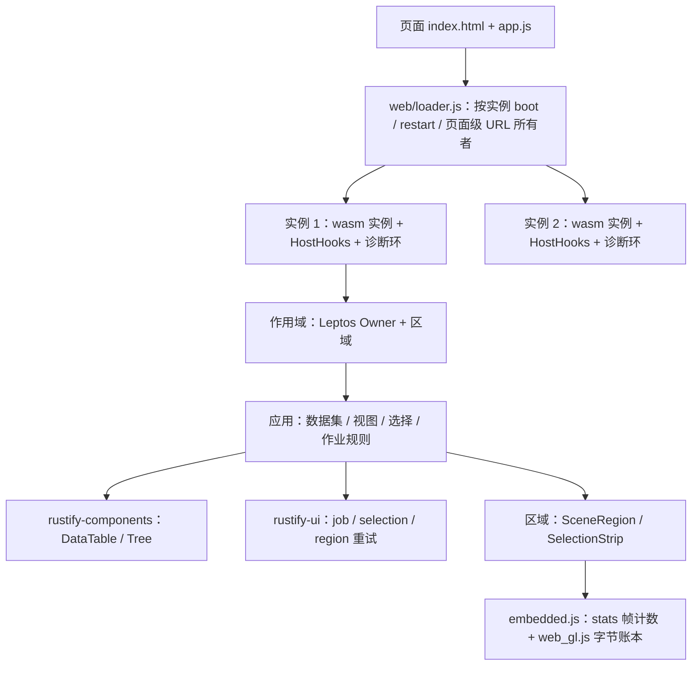

# P3 · Rustify UI · 大数据、长时运行与实例边界（Leptos CSR + Makepad Web · B0/B2/B3/B4 负载成为夹具与门）

> **计划状态：Ready**（用户 2026-09-11 确认 A-1：§0.1 交付形态、§0.6 延期清单、ADR-8 实例隔离形态与 ADR-9 表格呈现层均按本计划所写执行。2026-09-11 评审修订：接受 9 条意见——实例内存保留、trap 调用边界、trap 后的监听与 URL 清理、让出机制、作业版本、平移增量、有效呈现帧门、探针退路与退出条件、M2 验收拆分——修订落在 D4/D14/D15、ADR-8、§2、§3、§5、§7–§13；M1 探针从四个增为五个，各有失败时的既定退路与分支后的退出条件，不需要再回来重议。Ready 只表示可以开工，不表示任何功能已交付）。
>
> 调查基线：2026-09-11 · `0f4ceae2c67e192d8663094fe747509e73c1c5a3` · 工作区 clean；本次仅新增本计划。参考源码 `ref/` 被忽略且本期不再需要：Rust/UI 已硬分叉进 `crates/rustify-components`，Makepad 已硬分叉进 `makepad/`。
> 输入：[PRD v0.1](../PRD-WASM-UI.md)（完整版本仍为评审草稿）；[P1 计划](P1-WASM-UI.md)（Closed）；[P2 计划](P2-WASM-UI.md)（Closed，10/10；其 §0.6 把大数据、B2/B3 预算与实例 trap 隔离点名给后续）。R29/R30 的 B1 列已于 2026-09-11 被用户批准为门，本期沿用同一测量合同把 B0/B2/B3 列接进去。
>
> **建议本期交付：PRD §5.2 剩下的四个固定负载全部成为可运行夹具，并把它们的预算接进已批准的门——B0（fusion-basic 达最小融合样例定义）、B2（10 万行 × 20 列表格，DOM 窗口化）、B3（1 万个 GPU 可交互矩形）、B4（2 个实例 × 2 个区域、100 次挂载卸载、2 小时固定交互）；第四个示例 data-workbench 作为 PRD R28 的「大数据交互示例」；实例级 trap 隔离（一个实例 trap 不带走同页另一个）；空闲/隐藏/资源/长时/故障矩阵的可观测断言。**
> 本期独特职责：让「数据比可见区域大得多」和「跑得比一次会话长得多」这两件事有真实负载、独立预期与门；把 P1 D9 留下的「共享 wasm 一起死」边界改成实例边界。
> **顶层排除：本期不做 Windows/Linux/移动矩阵、WCAG 2.2 AA 整体评审、两份迁移示例、5 名新用户研究、稳定弃用窗口、局部热更新（R24 AC3/R37 AC2）、GPU 自绘文本编辑器、多线程/共享内存增强模式、对外发布；本期通过不等于 PRD 完整版本达标。**

## 实施者定位

执行本计划的 agent 是**资深软件工程师**：Kent Beck 式的 TDD 纪律加上《程序员修炼之道》式的精确。本节由骨架原样带入，不随项目改写；开始任何里程碑前先接受以下约定。

- **表达方式**：极简，每句话都可引用。说到代码给文件路径，说到需求或验收给本计划的 ID（需求账本 R-* / NFR-* / C-* / A-*，决策 D* / ADR-*，里程碑 M*）。不写铺垫、不写感想、不复述计划。
- **完成的定义**：没有通过验证的任务不算完成。里程碑退出条件里的测试、断言和走查全部通过，才能在「实施进度」记为完成；验证没跑、失败或环境缺失，就如实记为缺口或阻塞。
- **工作顺序**：先写会失败的测试（红），再写最少的代码让它通过（绿），最后重构；三步不倒序、不合并。里程碑按本计划写的顺序执行，不跳步，不同时开两个未完成的里程碑。
- **源码干净**：注释解释为什么，不解释是什么。源码里不出现工单或需求编号（如 `# FR-12`、`// BUG-42`）、本计划的 R-* / M* 编号、agent 工作流标记或任何规划元数据；追溯关系只记在本计划的「实施进度」和提交说明里。交付的是可直接上生产的代码：干净、最小，没有多余防御、空洞注释或重复样板这类 AI 生成痕迹。

## 实施进度（实施期持续更新）

本节由骨架原样带入，不随项目改写。它是跨对话恢复的**唯一**入口：新对话只读仓库规则、本计划正文、本节和当前工作树，就要能确认已完成事实、验证基线与下一步。

**回写时机（硬性顺序）**：某个里程碑的退出条件全部跑绿之后，**下一个动作就是回写本节**——早于向用户报告完成、早于开始下一个里程碑、早于提交代码。实施暂停、被阻塞、发现计划偏差或本轮对话即将结束时，同样先刷新快照再停。

**为什么不能攒到本期收尾一次补**：证据（命令、断言数、实测数字、走查结论）只有刚跑完时是准确的，事后补写的是记忆；而对话中断、上下文耗尽或用户新开对话时，没回写的里程碑对下一个实施者等于没做过——它会照着「下一步」把已完成的工作重做一遍。所有里程碑共用同一个完成时间和同一个代码基线，就是攒着补写的痕迹。

**开工前先读**：每个里程碑动手前，先读本节的「下一步」与最新一行完成记录，与 `git status` / 工作树核对。记录与工作树冲突时先查明真相再改本节，不能凭记录覆盖用户改动，也不能凭工作树臆断已完成。

**一次回写 = 三个动作**，缺一不算回写：

1. 重写「恢复快照」全部 7 行，不是只改「最近完成」。
2. 「完成记录」追加该里程碑一行（首次追加时删掉占位行）；既有行只在纠正事实时修改，不写重复流水。
3. 实现与计划不一致时（范围、决策、接口、数据、风险或退出条件有变），同步修订正文对应章节，并在快照的「当前状态」里点明改了哪一节。进度区不是绕过计划一致性的补丁堆。

**记完成的门槛**：退出条件全部通过才可记完成。验证没跑、跑红或因环境缺失跳过，就如实写进「当前状态」/「当前阻塞」，不写“基本完成”“应该可用”。

**回写后自查**，三条都对才算回写完：「当前进度 n/N」的 N 等于里程碑表行数、n 等于完成记录里的里程碑行数；「最近完成」等于完成记录最新一行；新增行的「验证证据」与「代码基线」都不是空或 `—`。

### 恢复快照

- 最近更新：2026-09-11（M1 完成并回写）
- 当前进度：1/8 个里程碑完成
- 当前状态：M1 已完成，退出条件全部跑绿。五个探针各有数字与决定：A-2（裸 DOM 网格 p95 16.70–16.80 ms）、A-5（二次实例化、导出调用与 DOM 处理器两种真实 trap 的归属、重启后的内存保留量全部成立）、A-6（CDP `Runtime.getHeapUsage` 与 `TaskDuration` 可读）、A-7（排序 p95 45–57 ms）成立；A-3 只有有头 Chrome 成立，已按 §11 分支表「A-3 只有有头通过」执行。**新发现 F24**：每帧驱动一次相机时场景每两帧才呈现一次，SwiftShader 与有头 Chrome 比值相同，是调度性质不是光栅器能力——已进 §11 风险表并写进 M4 的交付。正文修订：§0.2 的 A-2/A-3/A-5/A-6/A-7 五行、ADR-8 与 ADR-9 状态、D5、D8、§1.1 的 F21 与新增 F24、§1.2 文件清单三处、§3 场景范围改为 13,050 × 3,996、§9.3、§10 的 M1/M2/M4 三行、§11 风险表、§13.2
- 最近完成：**M1 · 探针与负载冻结**（2026-09-11）
- 下一步：M2 · 表格、树与选择——`crates/rustify-ui/src/selection.rs` 与单测；`crates/rustify-components/src/data_table/{mod,window,keys}.rs` 与 `tree.rs`；能力目录两行 + `catalog --check`、`css --check`；data-workbench `/table` 视图（表格、树、详情表单含编辑写回与 `version` 递增、概览带 `StripRegion`、插入/删除）；`docs/data.md` 初稿。注意 M1 只交付了当时有调用方的 API：`Dataset` 的插入/删除/写回/按行取 ID 随 M2 的调用方一起加，`scene_layout::{within,pick}` 随 M4 的框选与命中一起加。退出条件见 §10
- 当前阻塞：无。A-4（VoiceOver 人工记录或用户豁免）仍开放，最晚 M8 确认
- 代码基线：`a6968ca`（M1 实现；本次回写为其后的文档提交）

### 完成记录

| Milestone | 完成时间 | 准确完成摘要 | 验证证据 | 代码基线 |
| --- | --- | --- | --- | --- |
| M1 | 2026-09-11 | 探针与负载冻结。`stats().frames`（呈现计数）与 `defer` 的 MessageChannel 让出落在 `embedded.js`——**呈现计数不动分叉**：`FromWasmBeginRenderCanvas` 派发在嵌入区域对象上，覆写即可计到同一批呈现，D8 与 §1.2 已按此改。`web/loader.js` 改为按实例 `boot`（首个实例走静态导入，其后动态求值 `./bindgen.js?instance=n`、共用同一个 `WebAssembly.Module`）+ 导出调用边界（fatal 后抛 `InstanceDead`，`RuntimeError` 先 `enter_fatal` 再重抛）+ 按 glue URL 归属页面级 `error` + 每实例 `AbortController` + 上限 3 次的 `restart()` + `release_container()`；fusion-basic 加真实 trap 出口（`fusion_basic_trap()` 与处理器内 panic 的按钮）与第二实例容器。新增 `examples/data-workbench` 骨架：数据集（xorshift32 固定种子、100,000 × 20 × 16 字节、FNV-1a 校验和）、场景布局与视口剔除的 `SceneView`/`SceneRegion`、可分片的稳定归并排序、路由与测试出口；`tests/browser/{dataset,loads}.ts` 孪生与冻结的负载定义；`budgets.ts` 增 B0/B2/B3 段（M1 只写数值与边界，不断言）；第四个 project（4178）与 CI 显式 project 清单。**五个探针的结论见 §0.2 与 `docs/validation/p3/m1.md`**：四个成立，A-3 走「只有有头通过」分支；另发现 F24（场景每两帧才呈现一次）交给 M4。只交付有调用方的 API：数据集的写入、场景的框选与命中、排序的进度随 M2–M4 的调用方一起加 | `docs/validation/p3/m1.md`；`--project=data-workbench` **7/7**（含严格 CSP 下启动 0 违规、孪生哈希与 1,000 采样相等、排序结果逐行相等）；六个既有 project 全绿：`fusion-basic` **56/56**、`property-workbench` **129/129**、`component-catalog` **46/46**、`budget` **4/4**（冷 p95 162 ms、首载 2,772,456 B、B1 时延 p95 41.7 ms，P2 为 42.2 ms，让出机制换成消息端口没有代价）、`workbench-deep` **6/6**、`deployment` **6/6**；`cargo test --workspace --lib` 158、`-p data-workbench` 13、`-p xtask` 23；`cd makepad && cargo test` 与脚本 VM 测试通过；clippy `-D warnings` / fmt 通过；`cargo xtask sources verify` 通过（分叉未改动）；`cargo xtask build-web --example data-workbench --release` 通过 | `a6968ca` |

## 0. 需求、范围与决策

### 0.1 第三阶段的完成形态

建议 P3 为**负载与边界期**：P1 交付了运行时，P2 交付了应用骨架并把 B1 变成门；P3 把 PRD §5.2 剩下的 B0/B2/B3/B4 全部做成夹具，用与 B1 同一份测量合同（页内计时、独立预期、一台机器一个浏览器、边界写明）把它们的预算接进 `tests/browser/budgets.ts`，并把「一个实例出错，同页其他实例继续」从文档边界变成机制。

| 交付物 | 最小内容 | 本期完成判据 |
| --- | --- | --- |
| data-workbench（新增第四示例） | 100,000 行 × 20 列固定样本的窗口化表格（首/中/末可达、排序/筛选/取消、按业务 ID 选择、分组树导航、跳行与查找入口）；10,000 个 GPU 矩形的场景（平移、框选、命中、按标签查找）；两个视图共享一份按 ID 的选择；表格视图旁一条 GPU 选择概览带；DOM↔GPU 各至少一次 | R20 AC1–3、R15 AC3、R30 AC2/AC3 在此验收；数据集与预期清单由独立实现生成 |
| fusion-basic（升级为 B0） | DOM 表单 10 项（P1 组件子集）、一个区域内 20 个 GPU 控件、1 个共享状态、首屏字体；双实例模式（2 实例 × 2 区域 = B4）；真实 trap 入口（导出调用与 DOM 处理器内 panic 各一） | R29 B0 列、R31 三条、R32 AC1/AC2、R33 AC1 在此验收 |
| property-workbench | 不扩功能；R39 AC2 的诊断开销对照在此测；B1 门继续通过 | 一期、二期全部浏览器用例继续通过 |
| SDK 增量（`crates/rustify-ui`） | 分片作业（排序/筛选/查找，可取消，按时间预算切片，每片前校验数据版本）、按 ID 的选择集、GPU 区域启动的有界重试、页面级监听改经实例信号注册、实例隔离的 loader 契约 | 纯逻辑宿主单测；浏览器行为有 Playwright 用例 |
| 组件增量（`crates/rustify-components`） | 窗口化数据表格（`role="grid"`、行数/行号语义、漫游焦点、键盘导航）、基本树 | 零内联脚本/样式；能力目录补两行 |
| 宿主与分叉增量 | `web/loader.js` 按实例启动、导出调用边界、trap 归属与实例资源清理、有上限的重启；`crates/rustify-makepad/web/embedded.js` 的 `defer` 改 MessageChannel 让出、`stats()` 增加帧计数与 GPU 字节账本；`makepad/platform/src/os/web/web_gl.js` 的分配/释放点记账 | 分叉改动为普通提交并登记；桥指纹校验通过 |
| 门与交付材料 | `budgets.ts` 增加 B0/B2/B3 段与「不覆盖什么」；三个新 Playwright project；`cargo xtask verify --suite p3`；六类报告与需求矩阵 `docs/reports/p3/`；`docs/data.md`；架构/兼容文档更新 | 两次干净构建；未测项如实标注 |

**负载名称的边界**：只有夹具逐项匹配 PRD §5.2 的定义后才能用 B0/B2/B3/B4 的名字；B2 与 B3 分别测量，不宣称叠加达标；数据分布、随机种子、动作清单在 M1 冻结并带基线标识，改动即换标识。

### 0.2 需求与约束账本

带连字符 ID 是本计划账本；不带连字符的 R01–R40 是 PRD 本地工作号。两者都不是 SPMS key。

| ID | 类型/来源 | 本期内容 | 设计/验收落点 | 状态 |
| --- | --- | --- | --- | --- |
| R-1 | 功能；PRD R20 AC1–3、R25 | B2 表格：100,000 行可达首/中/末且不静默截断；选中 10 项后排序/筛选/插入/删除，存活项按 ID 保持选择、删除项清除、隐藏选中数呈现；键盘/AT 定位一个不可见项并修改，滚动可见后值一致、错误可读；20 项语义定位 | ADR-9，§5.1–§5.3/§6.1，V2/V3，M2/M3 | 建议纳入 |
| R-2 | 功能；PRD R08/R11/R15 AC3 | B3 场景：10,000 矩形 + 8 字符标签、不透明、至多 2 层重叠；连续平移与框选；命中正确；可访问查询入口定位首/中/末三个目标并执行与指针相同的主操作 | §5.4/§6.2，V4，M4 | 建议纳入 |
| R-3 | 功能；PRD R28 AC1、§5.2 B0/B4 | 第四示例 data-workbench，DOM↔GPU 各至少一次；fusion-basic 达 B0 定义；B4 夹具 = 2 实例 × 2 区域，B0 数据 | D1/D9，§6，V6，M6 | 建议纳入 |
| R-4 | 功能；PRD R26 AC3、R05 AC2、R33 AC3 | 实例隔离：一个实例 trap（经宿主入口、导出调用或 DOM 事件处理器）后宿主显示重启入口与数据边界说明，本实例的页面级监听与 URL 所有权由 loader 清理，同页其他实例继续满足可用契约；页面 URL 所有者跨实例唯一；重启次数有界（D14）；GPU 永久不可用时 2 s 内反馈且自动重试 ≤ 3 次、不形成循环 | ADR-8，D14/D15，§5.5，V5，M5 | 建议纳入；用户拍板 |
| R-5 | 功能；PRD R31 | 空闲 60 s 主动呈现 ≤ 1 次、CPU 增量 ≤ 1 个百分点；隐藏后 1 s 内停止主动呈现、60 s 不积压旧输入；恢复 500 ms 内展示当前状态且不重放；100 次隐藏/恢复重复动作 0 | §5.6，V6，M6 | 建议纳入 |
| R-6 | 功能；PRD R28 AC2（部分）、R24 | `docs/data.md`（窗口化、作业、选择、可访问入口）；`docs/architecture.md`/`docs/compatibility.md` 写入实例模型与资源账本；六类报告与需求矩阵 `docs/reports/p3/` | §9.5，V8，M8 | 部分纳入；迁移示例与新用户研究后续 |
| NFR-1 | 性能；PRD R29 B0 列、R30 AC2/AC3 | B0 冷启动 p95 ≤ 2.5 s、热 ≤ 1 s、首载压缩 ≤ 3 MiB；B2 滚动与 B3 平移/框选**有效呈现**帧间隔（§9.3 定义：内容版本前进的相邻呈现之间）p95 ≤ 20 ms 且 > 50 ms 占比 ≤ 1%（5 次 60 s 各自达标）；B2 单列排序与文本筛选结果 p95 ≤ 500 ms、取消反馈 p95 ≤ 100 ms、结果与独立清单一致 | §7，V8，M8；数值只写在 `tests/browser/budgets.ts` | **沿用已批准的门**（A-3 于 P2 关闭）；环境边界见 A-3 与 §7 |
| NFR-2 | 资源；PRD R32 | B0 wasm 已提交 + JS 保留 ≤ 128 MiB，B2 ≤ 384 MiB；GPU 估算 B0 ≤ 128 MiB、B2 ≤ 256 MiB；B4 预热 20 轮后 80 轮挂载卸载增长 ≤ 8 MiB、后 40 轮 ≤ 64 KiB/轮；卸载后残留业务组件与活跃 GPU 资源 0，共享缓存上限文档化 | §5.7，V6，M6 | 建议纳入；GPU 为账本估算 |
| NFR-3 | 可靠性；PRD R33 | B4 连续 2 h、10 次/s，崩溃/未处理错误/已确认状态丢失/重复 0；资源失败、异步反序、区域关闭、可恢复 GPU 丢失 4 类各 20 次后状态与预期一致；GPU 永久不可用与实例 trap 2 s 内反馈、重试 ≤ 3 | §5.5/§8，V5/V7，M5/M7 | 建议纳入 |
| NFR-4 | 兼容/可用性；PRD R34/R35 | macOS Chrome 固定版本为门；B2/B3 的三目标键盘旅程自动化；VoiceOver 对同一旅程的人工记录 | §6.3/§9.4，V4/V8，M8 | 矩阵沿用 P1/P2；人工项见 A-4 |
| NFR-5 | 安全；PRD R36 | 无新增网络出口（数据集在内存生成）；CSP 不放宽；第二份 wasm 实例仍是同源同产物；含脚本文本进表格单元格仍是数据 | §4.2，V2/V5 | 建议纳入 |
| NFR-6 | 可维护性；PRD R38/R39/R40 | 分叉改动（`web_gl.js` 账本、`web.js` 帧计数）登记；新增诊断种类含五项字段；诊断开启对 B1 输入到呈现 p95 的增长 ≤ 5%（R39 AC2）；两次干净构建；映射与报告 | §4/§7/§9.5，V7/V8，M7/M8 | 建议纳入 |
| C-1 | P1 ADR-2/D3 | Leptos 锁 crates.io 0.8.20 且不改源码；窗口化表格只用公开 API（signals、`<For>`、`NodeRef`） | §5.3/ADR-9 | 已确认规则 |
| C-2 | P1 §4.3；`xtask/src/serve.rs` | 发布 CSP 不放宽（`default-src 'none'; script-src 'self' 'wasm-unsafe-eval'; style-src 'self'; …`）；动态导入带查询串的同源模块在 `script-src 'self'` 下允许 | ADR-8/§4.2 | 已核实 |
| C-3 | P1 C-5/ADR-2；`sources.lock.json` | Makepad 分叉是一等源码，改动为普通提交，来源记录与 `cargo xtask sources verify` 保持一致 | §4.1 | 已确认 |
| C-4 | PRD §5.1「非隔离普通部署」；P1 M1 探针① | 普通模式 `crossOriginIsolated` 为 false：无 SharedArrayBuffer、无线程；大数据作业只能在主线程分片 | D4/§5.2 | 已核实 |
| C-5 | PRD §5.3「正确性」 | 预期动作/数据清单由独立实现生成，不能用实现自身输出当期望值 | §3.1/§9.3 | 已确认 |
| C-6 | P2 M10；`makepad/draw/src/text/layouter.rs` 第 240、270 行 | 整形器与排版器各 4,096 条缓存；耐久测量必须先走完工作集；标签数超过缓存容量会持续换出 | §5.4/§12 | 已核实 |
| A-1 | 范围假设 | 用户确认 §0.1 交付形态、§0.6 延期清单、ADR-8（实例隔离形态）与 ADR-9（B2 表格在 DOM 窗口化） | 用户 2026-09-11 确认「A-1 ok」，即按本计划所写的建议选择实施；D1/D2/D4/D6 与 ADR-8/ADR-9 据此转为已接受 | **已解除** |
| A-2 | 技术假设 | DOM 窗口化表格在 60 × 12 可见单元格、行元素复用下，滚动帧间隔 p95 ≤ 20 ms（本机 Chrome） | M1 探针①（2026-09-11）：裸 DOM 网格 768 个文本节点、每帧滚 3 行，有效呈现间隔 p95 **16.80 ms**、> 50 ms 占比 **0%**、601 次驱动 601 次呈现 | **已解除·成立**：ADR-9 保持备选 A（DOM 窗口化），GPU DataGrid 不再是本期可能走的路 |
| A-3 | 测量环境 | B3 帧门在 headless SwiftShader 上不可代表 PRD 性能机；用 `channel: "chrome"` 的有头 Chrome 跑帧门；CI 不跑有头 project | M1 探针②（2026-09-11）：同一场景、同一驱动，headless SwiftShader p95 **50.10 ms**、> 50 ms 占比 13.9%；有头 Chrome 152.0.7977.84 p95 **17.60 ms**、占比 0% | **已解除·只有有头通过**（§11 分支表「A-3 只有有头通过」）：B3 帧门只在有头 `budget-data` 跑，CI 不跑；`budgets.ts`「在哪跑」已写明 |
| A-4 | 验收资源 | VoiceOver + Chrome 对 B2/B3 三目标旅程的人工记录；用户 2026-09-11 曾豁免 P2 的 VoiceOver 其余项，本期只要求新增旅程，或由用户再次豁免 | `docs/validation/p3/manual/voiceover-data.md`；M8 | 开放 |
| A-5 | 技术假设 | 同一份编译后的模块可在同页实例化两次、各自 `boot`；DOM 事件处理器内的 trap 能由 `error.stack` 中的 glue URL 归属到实例 | M1 探针③（2026-09-11）：两个实例线性内存互不相同（118.3 MB + 2.6 MB）、1 次 wasm 请求 2 次 glue 请求；导出调用 trap 抛 `RuntimeError` 后本实例 fatal、再调用得 `InstanceDead`；DOM 处理器 trap **成功归属本实例**；另一实例两次都 100/100 接受动作；重启一次后旧实例线性内存在 `HeapProfiler.collectGarbage` 后**仍可达** | **已解除·完全成立**：ADR-8 保持备选 B，D15 不需要退路，D14 的「保留量有上限」被实测证实 |
| A-6 | 测量手段 | Playwright Chromium 下 `performance.memory.usedJSHeapSize`（或 CDP `Runtime.getHeapUsage`）与 CDP `Performance.getMetrics` 的 `TaskDuration` 可读 | M1 探针④（2026-09-11）：`performance.memory.usedJSHeapSize` 可读但被量化（实测 10,000,000 整数）；CDP `Runtime.getHeapUsage` 可读且精确（7,340,180）；CDP `Performance.getMetrics` 的 `TaskDuration` 可读；`stats().memory` 67,633,152 | **已解除·成立**：JS 堆以 CDP `Runtime.getHeapUsage` 为准，`performance.memory` 只作旁证；无未测项 |
| A-7 | 技术假设 | 以 MessageChannel 让出、每片 8 ms 时间预算的分片作业，100,000 行 × 16 字节键的单列排序（初排 + 归并）在 headless Chrome 上端到端 p95 ≤ 500 ms，且作业片不把滚动帧持住 | M1 探针⑤（2026-09-11）：20 次 p95 **57.2 ms**、中位 44.1 ms、中位 6 片；同跑的空 rAF 循环帧间隔 p95 16.70 ms；结果与孪生实现逐行相等 | **已解除·成立**，余量约 8 倍；片预算保持 8 ms |

### 0.3 决策表

| # | 决策点 | 建议选择 | 含义/影响 | 依据 |
| --- | --- | --- | --- | --- |
| D1 | 示例形态 | 新增 `examples/data-workbench` 承载 B2 与 B3；fusion-basic 升级为 B0 并提供 B4 双实例模式；不改 property-workbench 功能 | PRD R28 AC1 的三个示范应用之「大数据交互示例」；B0/B4 落在最小示例上，其首载体积最小 | R-3；PRD §5.2 |
| D2 | B2 呈现层 | DOM 窗口化表格（ADR-9）；GPU 只承担旁边的选择概览带 | 语义、键盘、IME、文本选择、对比度全是 DOM 原生；GPU DataGrid 备选保留在 ADR-9 | A-2；P1 D6 |
| D3 | 数据集与预期 | 数据集由 Rust 在内存生成（xorshift32、固定种子、36 字符字母表、16 字节定长单元格）；TypeScript 用同一算法再生成一份，作为排序/筛选/框选的独立预期 | 无网络、无数据文件；两份实现互为校验（哈希对齐单测） | C-5；§3.1 |
| D4 | 大数据作业 | 主线程分片作业（`crates/rustify-ui/src/job.rs` ★）：每步一个 `defer` 任务、按 8 ms 时间预算切片（行数只作上限）、每片开始前校验数据版本、以一期票据取消；`defer` 的让出改为 MessageChannel（F2：150 次链式 `setTimeout(0)` 实测 716–743 ms）；不用 Worker、不用线程 | 无第二份 wasm、无 32 MB 数据拷贝；取消是票据失效，结果只在完成时整体写入；版本变了的片不读数据 | C-4；A-7；P1 `task.rs` |
| D5 | 帧门环境 | B2 滚动帧门 headless；B3 帧门**只在有头 Chrome 跑**（A-3 探针②：headless SwiftShader p95 50.10 ms，有头 17.60 ms），作为独立 project `budget-data`，CI 明确不跑 | 一台机器一个浏览器的边界照旧写在 `budgets.ts` | A-3；PRD §5.1 |
| D6 | 实例隔离 | 每个应用实例一份 wasm 实例（ADR-8）；作用域仍是实例内的挂载 | 「实例」= PRD 的应用实例；trap 只带走本实例；B4 的「2 个实例」按此定义 | R-4；A-5 |
| D7 | GPU 启动重试 | `GpuRegion` 在拿不到 WebGL2 上下文时以 0/250/750 ms 三次重试，全部失败才 `Failed`；上下文丢失后的重建仍由 `webglcontextrestored` 驱动、不轮询 | 从首次失败到最终提示 < 2 s；不会无限重启 | R33 AC3；`crates/rustify-ui/src/region.rs` |
| D8 | 资源账本 | `web_gl.js` 在 `bufferData`/`texImage2D`/`deleteBuffer`/`deleteTexture` 处记字节并由 `stats()` 暴露 `gpu_bytes`（M6）；`frames` 不动分叉——`FromWasmBeginRenderCanvas` 派发在嵌入区域对象上，在 `embedded.js` 覆写即可计到同一批呈现（M1 已落）；CPU 侧 = `wasm._memory.buffer.byteLength` + CDP `Runtime.getHeapUsage`（A-6 探针：`performance.memory` 被量化，只作旁证） | GPU 为估算（PRD 允许），文档写明估算口径 | NFR-2；F10；A-6 |
| D9 | B0 的组件来源 | B0 的 10 项 DOM 表单只用 `rustify-ui` 一期组件（`TextField/TextArea/Checkbox/Slider/Button/Label/LoadView`），不引入 `rustify-components` 与 Tailwind 产物 | 首载体积不涨；R29 B0 的 3 MiB 门有余量 | NFR-1；F14 |
| D10 | 选择集归属 | `crates/rustify-ui/src/selection.rs` ★ 拥有「删除即清除、排序筛选保留、隐藏计数按当前视图」三条规则；表格、场景、概览带三个消费者共用 | 三个真实调用方成立共享 | R-1/R-2 |
| D11 | 树 | 基本树只做 DOM `role="tree"` + 展开/折叠 + 方向键，两层固定分组（10 × 10），点击分组即筛选作业；不虚拟化 | 给 PRD R20「树提供基本导航」一个真实用处，不造通用树 | R20 边界 |
| D12 | 浏览器矩阵 | 沿用 P1/P2：macOS Chrome 固定版本通过门，Safari 观察 | 不因本期变化 | NFR-4 |
| D13 | 门的运行纪律 | 帧门、内存门与 2 h 耐久各自单独 project，一次只跑一个，机器上不并跑 cargo | P1/P2 记录：整套同跑会被杀、CPU 争用让时延翻倍 | §12 |
| D14 | 实例重启的生命周期 | 每次 `restart()` 用新的 glue URL 求值一份新 glue 并实例化；死实例的 ES 模块记录与其 `wasm` 绑定随文档存活、线性内存不释放（F22）；每个实例槽最多重启 3 次，之后提示只剩「重新加载页面」；B4 的 100 轮是**两个长期存活实例内的作用域挂载/卸载**，不重建实例 | 保留量有上限且写进文档：≤ 3 × 单实例线性内存（P2 测得 B1 起步 39.6 MB）；不改生成的 glue。备选「xtask 给生成的 glue 追加释放入口后原 URL 重 `init`」被否决：glue 的 `CLOSURE_DTORS`（模块级 `FinalizationRegistry`）会把死实例闭包的析构打到同一绑定上的新实例 | F22；R26 AC3 只要求一个重启入口 |
| D15 | trap 的调用边界与实例归属 | loader 把 `boot()` 返回的 `app` 包成调用边界：每个导出在 `runtime.fatal` 后拒绝调用，抛出 `WebAssembly.RuntimeError` 时先 `enter_fatal` 再重抛；loader 按实例监听 `window` 的 `error`/`unhandledrejection`，`RuntimeError` 按 `error.stack` 里的 glue URL 归属实例；每实例一个 `AbortController`，SDK 在 `window`/`document`/容器上的监听一律带其 `signal` 注册，`enter_fatal` 先 `abort()` 再清区域；页面级 URL 所有者属性带实例号，由 loader 在 fatal 时清除 | Rust 的 `Drop` 在 abort 后不运行（F8），清理必须在 JS 侧；归属不成立时（探针③）DOM 处理器 trap 记为页面级并进入两实例 fatal、写进 `docs/compatibility.md` | F7/F8/F9/F22；R26 AC3 |

D1/D2/D4/D6 由用户在 A-1 中一并确认（2026-09-11 已确认）；其余为工程决策，在对应里程碑退出时确认。D14 的重启上限（3 次）是产品可见的建议值，用户可在 M5 开工前改；未改则按 3 实施。

### 0.4 ADR-lite

#### ADR-8：每个应用实例一份 wasm 实例，由 loader 实例化

- 状态：Accepted（A-1 已于 2026-09-11 解除；A-5 探针已于 2026-09-11 在 M1 跑通，二次实例化、三种真实 trap 的归属与重启后的内存保留量全部符合本节预期，见 `docs/validation/p3/m1.md`）。
- 背景与驱动：R26 AC3 要求「同页其他独立实例继续满足其可用契约」，R33 AC3 要求 trap 后 2 s 内反馈且不循环；P1 D9/ADR-1 选择了单 wasm 多作用域并明确「共享 runtime 不能满足 R26 AC3 的独立实例 trap 边界」。核实：`crates/rustify-makepad/web/embedded.js` 的 `create_host_hooks` 已经是「每个 runtime 一个对象」（`regions`/`tasks`/`runtime.fatal` 都在闭包内，`enter_fatal` 只销毁本 runtime 的区域）；`crates/rustify-makepad/src/wasm/host.rs` 的 `HOOKS`/`REGIONS` 是 `thread_local!`，随 wasm 实例各有一份；`web/loader.js` 的 `boot()` 用 `WebAssembly.compileStreaming` 编译一次、`init({ module_or_path: module }, env)` 实例化一次，但 `bindgen.js` 是静态导入且其模块级 `wasm` 绑定只有一份，生成的 `__wbg_init`/`initSync` 以 `if(wasm!==undefined)return wasm` 守卫——同一份 glue 第二次 `init` 是空操作而不是覆盖，且 glue 没有释放入口（F22）；`window.makepad_resource_base` 是页面级全局但只表示部署路径，两个实例同一部署。`crates/rustify-ui/src/router.rs` 第 498–528 行的 URL 所有者槽位是 `thread_local!`，即**每个 wasm 实例一个槽**——两个实例各自都能成为所有者，这与 R22「一个页面只有一个所有者」冲突，必须改成页面级。
- 备选 A：保持单 wasm，R26 AC3 后半句继续作为文档边界——零改动，但完整版本前这条 AC 永远是 partial。备选 B：loader 对每个应用实例调用一次实例化：首个实例用现有静态导入；后续实例以 `import(new URL("./bindgen.js?instance=" + n, import.meta.url))` 动态求值一份新的 glue（`wasm_bridge.js` 的状态是 `init_env` 闭包局部与 `as_current` 内保存/恢复的 `WasmBridge.current`，`message_bridge.js` 只造类，两者已核实不需要二次求值），共用同一个 `WebAssembly.Module`；每个实例有自己的线性内存、`HostHooks`、诊断环、路由槽；URL 所有者改为页面级（`document.documentElement` 上的 `data-rustify-url-owner` 属性，`claim_url` 先查它再占本实例槽）；`boot()` 返回值增加 `instance` 编号与 `restart()`；trap 的调用边界、监听清理与重启上限见 D15/D14。备选 C：每个 GPU 区域一份 wasm——区域间共享状态不可能，淘汰。
- 决策：建议 B。实例 = wasm 实例 + 一个 runtime；作用域 = 实例内的挂载。同实例内的多作用域行为不变（P1 M2 的双作用域夹具与「trap 带走同实例全部作用域」的用例继续成立）。真实 trap 用示例导出 `fusion_basic_trap()`（`panic = "abort"` 下 panic 即 `unreachable`）触发，不再只用 JS 侧 `enter_fatal` 模拟。
- 正面后果：R26 AC3/R05 AC2 从机制上成立；不引入新依赖；B4 的「2 个实例」有真实定义；每实例诊断环天然分开。
- 负面/中性后果：每个实例一份线性内存（P2 测得 B1 起步约 39.6 MB，`docs/reports/p2/performance.md`），双实例约翻倍；字体仍按区域各取一份（P1 已知）；`bindgen.js` 的第二次求值多一次同源 fetch（HTTP 缓存命中）；`modulepreload` 只覆盖无查询串的那份；**每个 glue URL 的模块记录随文档存活**，死实例的线性内存直到页面卸载都不释放，所以重启必须有上限（D14），B4 的轮次不能重建实例。
- 重新评估触发：A-5 探针发现 glue 或桥有无法按 URL 隔离的页面级状态；或双实例内存超出 R32 的 B4 增长门；或用户要求区域级隔离；或用户要求不限次重启（那时只能对生成的 glue 做构建后处理，并先解决 D14 写明的析构注册表问题）。

#### ADR-9：B2 表格在 DOM 侧窗口化，GPU 只画选择概览带

- 状态：Accepted（A-1 已于 2026-09-11 解除；A-2 探针已于 2026-09-11 在 M1 跑通，裸 DOM 网格的有效呈现间隔 p95 16.80 ms，备选 B 不再是本期会走的路）。
- 背景与驱动：R20 三条 AC 里两条是关于身份与可访问性（按 ID 的选择存活；键盘/AT 定位不可见项并修改），R15 AC3 要求可访问的查询与导航入口；R30 AC2 要求滚动帧间隔 p95 ≤ 20 ms。核实：分叉里 `makepad/widgets/src/data_grid.rs`（2,127 行）有双轴虚拟化（`set_grid_size`、`next_cell`、`scroll_cell_into_view`、`visible_counts`、`GridSelection`、排序指示），`portal_list.rs`（3,649 行）有按可见范围绘制的列表；但 Makepad Web 的 `AccessibilityUpdate` 分支为空（P2 F22），GPU 表格的每个单元格都需要一个 DOM 等价入口才能满足 R20 AC3（P1 D6）；一期文本编辑已是「区域交出矩形、原生控件承接」（ADR-3）。
- 备选 A：DOM 窗口化——固定行高、固定列宽，只渲染可见 60 行 × 12 列加过扫的行元素池，滚动时只更新单元格文本；语义、键盘、IME、文本选择、对比度全部来自浏览器；成本是每帧最多约 720 个文本节点更新。备选 B：GPU `DataGrid`——绘制成本最低，但要为可见单元格镜像一套 DOM 语义、把编辑交给原生控件、把 100,000 行的行号语义放到镜像上；两套布局要对齐到 1 CSS 像素（P1 R09 的老问题）。备选 C：DOM 表格但不窗口化——100,000 × 20 个节点，淘汰。
- 决策：建议 A，条件是 A-2 探针通过（裸 DOM 网格每帧 720 个文本更新的滚动帧 p95 ≤ 20 ms）。探针失败则改 B，并把 §5.3/§6.1 的语义部分改成「镜像入口」，本 ADR 状态改 Accepted-B 并记录数字。
- 正面后果：R20 AC3 与 R15 AC3 不需要第二套语义；组件可进目录并给第三方 DOM 生态复用；一期原生编辑态不动。
- 负面/中性后果：DOM 侧每帧工作量随可见单元格数线性；行元素复用意味着 Leptos 的 `<For>` 不按行身份 key，而按槽位 key，身份由槽位上的 `aria-rowindex` 与 `data-row-id` 表达；表格自己不持有数据，靠 `cell(row, col) -> &str` 回调读取。
- 重新评估触发：A-2 失败；或出现单元格内需要 GPU 绘制（图表、微型图）的需求。

### 0.5 职责与事实所有权

| 主体 | 拥有 | 恢复责任及边界 |
| --- | --- | --- |
| 应用/示例 | 数据集与其版本、视图（排序/筛选后的索引）、作业的规则函数、选择集实例、场景布局、路由表、B0/B4 夹具的动作清单 | 决定作业结果是否采纳；刷新后不恢复数据（PRD R22 边界） |
| `rustify-components` | 表格与树的 DOM、语义、键盘、行元素池、可见范围计算 | 只显示回调给它的单元格文本；不持有数据、不持有选择 |
| Rustify SDK（`rustify-ui`） | 分片作业与取消、选择集规则、GPU 启动重试策略、错误种类 | 作用域清理即取消作业；不复制业务事实 |
| 私有 Makepad 集成 + 分叉 | 区域 Cx、帧计数、GPU 字节账本、场景命中 | 只答复活区域；账本是估算，口径写进文档 |
| loader（`web/loader.js`） | 实例编号、实例化与重启（有上限）、导出调用边界与 trap 归属、每实例的 `AbortController`、致命错误的静态提示、页面级 URL 所有者属性的写入与清除 | 一个实例的 trap 只结束本实例：先 abort 本实例全部页面级监听、清 URL 属性，再清区域与容器；重启由用户触发，不自动循环 |
| 浏览器 | 上下文丢失/恢复、rAF 节流、HTTP 与代码缓存 | SDK 不轮询、不绕过 |

一句话：数据在应用手里、可见范围在组件手里、顺序与取消在 SDK 手里、实例边界与页面级监听的寿命在 loader 手里。

### 0.6 明确不在本期及后续路线

- **Windows 11 / Linux / 移动矩阵、NVDA、Windows 微软拼音（R34 AC2、§5.1）**：完整版本发布门（P4）。
- **WCAG 2.2 AA 整体人工评审（R35 AC1）**：P4；本期只做 B2/B3 新增旅程的语义与 VoiceOver 记录。
- **两份迁移示例、5 名新用户研究、稳定弃用窗口（R28 AC3、R37 AC1、R38 AC3）**：P4。
- **局部热更新与增量构建耗时（R24 AC3、R37 AC2）**：后续；本期文档继续写明整页重载语义。
- **多线程/共享内存增强模式、WebGPU**：不做；作业分片是普通模式的方案（D4）。
- **GPU 自绘文本编辑器、GPU 表格（ADR-9 备选 B 只作退路）、任意停靠树、树的虚拟化、服务端分页协议、公式引擎**：不做。
- **限速链路上的冷启动门**：与 P2 同一边界，回环为门、限速为观察值。
- **区域级 trap 隔离、上下文丢失原位重建**：不做；ADR-8 是实例级。

## 1. 当前事实与改动面

### 1.1 现状与缺口

| # | 状态 | 事实与证据 | 设计后果 |
| --- | --- | --- | --- |
| F1 | 已核实·足够 | 一期票据：`crates/rustify-ui/src/task.rs` 的 `Requests::issue()/close()`、`Ticket::is_current()/deliver()`——新票据一发旧票据即失效，持有者关闭后全部失效 | 作业取消与版本作废直接复用，不另造取消令牌 |
| F2 | 已核实·缺口 | 宿主任务：`crates/rustify-makepad/src/wasm/host.rs` 的 `defer(f)` 经 `HostHooks::defer` 走 `window.setTimeout(…, 0)`（`embedded.js` 第 331 行），任务由 runtime 持有，`enter_fatal` 时清空。嵌套计时器受 4 ms 最小延迟钳制：本机 HeadlessChrome 153.0.8010.12 上 150 次链式 `setTimeout(0)` 实测 716/743/743 ms，同样 150 次 MessageChannel 让出为 4/1/0 ms | 让出改 MessageChannel（每 runtime 一个端口，任务仍由 `tasks` 持有并在 fatal 时作废，`stats().tasks` 语义不变）；作业每一步一个 `defer`，实例 trap 后不会再进入模块 |
| F3 | 已核实·边界 | 调度：`crates/rustify-ui/src/scheduler.rs` 队列 1,024、批 64；`Pace::Continuous(name)` 按流名各占一槽，同流新动作**覆盖**旧动作（第 75 行 `*slot = (stream, seq, action)`），同批两个增量只剩最后一个 | 连续流只能承载绝对值：平移发绝对相机（§5.4），hover 发最新位置；框选释放是离散动作；表格滚动不经区域 |
| F4 | 已核实·足够 | `RegionApp` 契约（`crates/rustify-makepad/src/wasm/app.rs`）：`apply_props`、`handle_event(outbox)`、`pace`；`examples/property-workbench/src/object_grid.rs` 每个对象一个 `draw_abs` 四边形，命中按最后一次绘制的布局解析 | 场景区域沿用同一模式，加视口剔除 |
| F5 | 已核实·缺口 | `crates/rustify-ui/src/region.rs` 第 203–227 行：`create_region` 返回 `None` 立即记 `GpuInitFailed` 并 `Failed(GpuUnavailable)`，无重试；上下文丢失后靠 `webglcontextrestored` 事件重建 | D7：加三次有界重试；不改重建路径 |
| F6 | 已核实·缺口 | `embedded.js` 的 `runtime.stats()` 只有 `regions/timers/animation_frames/tasks/errors/memory/pumps`；`memory` 是 `wasm._memory.buffer.byteLength` | 加 `frames`（呈现次数）与 `gpu_bytes`；JS 堆与 CPU 从页面/CDP 取（A-6） |
| F7 | 已核实·缺口 | `web/loader.js`：静态 `import init, * as app from "./bindgen.js"`，一页只能 `boot` 一次；第 55 行把原始 `app` 直接返回，示例 `app.js` 直接调用导出——导出里的 trap 以 `WebAssembly.RuntimeError` 抛给调用者，不经 `enter_fatal`；`enter_fatal` 只从 pump、`defer`、上下文丢失、`suspended`、`unsupported` 五个宿主入口到达（`embedded.js`）；`on_fatal` 由示例提供，只显示静态提示，没有重启入口 | D15：loader 包一层调用边界并按实例归属页面级 `error`；ADR-8：按实例实例化 + `restart()`；示例的 `runtime_fatal` 改为实例级 |
| F8 | 已核实·缺口 | `crates/rustify-ui/src/router.rs` 第 498–528 行：URL 所有者槽位 `thread_local!`，即每 wasm 实例一个；槽位释放（`ClaimToken::drop`）、`window` 上的 `popstate`/`beforeunload` 与容器上的 `click` 监听移除（第 582 行 `Listeners::drop`）、`overlay.rs` 第 332–348 行的 `document` `scroll`/`window` `resize` 监听移除都依赖 Rust `Drop`；`panic = "abort"` 的 trap 不运行析构，示例 `runtime_fatal` 只 `replaceChildren()` 容器，容器自身与 `window` 上的监听留在原地并会再进入死实例 | 改为页面级属性判定（带实例号）并由 loader 在 fatal 时清除；页面级监听一律带实例 `AbortSignal` 注册（D15） |
| F9 | 已核实·足够 | 现有 trap 夹具是 JS 侧 `hooks.runtime.enter_fatal(new Error("injected trap"))`（`tests/browser/m2-runtime.spec.ts` 第 263 行、`m3-workbench.spec.ts` 第 471 行）；`Cargo.toml` release `panic = "abort"` | 新增真实 trap 出口（Rust 侧 panic → `unreachable`）并只经 D15 的调用边界触发，测试不得自行 catch 后调用 `enter_fatal`；JS 模拟保留 |
| F10 | 已核实·缺口 | `makepad/platform/src/os/web/web_gl.js`：分配点 `upload_buffer_data`（第 303 行 `bufferData`/`bufferSubData`）、`createBuffer`（第 476–516 行）、`texImage2D`（第 805、835、865、908、971、987、1228 行）；释放点第 47–60 行 `deleteBuffer/deleteTexture`；销毁时 `loseContext`（第 67 行） | D8：在这些点记字节，销毁归零 |
| F11 | 已核实·足够 | `makepad/platform/src/os/web/web.js` 第 88–110 行：`visibilitychange`/`pagehide`/`pageshow` 发 app 生命周期并 pump；第 557 行 rAF 由请求驱动，无常驻循环；`embedded.js` 在画布 0×0 时 `suspended` 并把 pump 推迟到恢复 | R31 的「停止主动呈现」大体由构造保证；本期补计数与时限断言 |
| F12 | 已核实·足够 | 隐藏/恢复与挂载轮次夹具：`tests/browser/m8-baseline.spec.ts`（`host.hidden` 切换 100 轮；20 预热 + 80 测量）；耐久：`tests/browser/m8-endurance.spec.ts`（`RUSTIFY_ENDURANCE_MINUTES`，先走一圈工作集再计时） | B4 版本沿用同一结构，改跑在 fusion-basic 双实例上 |
| F13 | 已核实·足够 | 门：`tests/browser/budgets.ts`（R29/R30 B1 数值 + `percentile`）、`tests/browser/p2-budget.spec.ts`（页内 `CLOCK`、每次冷启动新建 context、热启动一 context 多 page、首载在页内 gzip 分类求和）；`xtask/src/verify.rs` 的 `Suite { examples, projects, reports, manual }` 与 `P2_MANUAL_RECORDS` | B0/B2/B3 段按同一结构加入；`P3` suite 新增 |
| F14 | 已核实·足够 | P2 门实测（`docs/reports/p2/performance.md`）：B1 冷 p95 171 ms、热 159 ms、首载 gzip 2,772,456 B（wasm 2,625,807 B 占 95%）、跨区 p95 42.2 ms；fusion-basic 不引 `rustify-components`（`xtask/src/build.rs` 的 `uses_components`） | B0 的 3 MiB（3,145,728 B）门余量约 0.5 MB，D9 不让 B0 引组件 crate |
| F15 | 已核实·足够 | P1 记录：四个区域启动后线性内存 123,994,112 B（`docs/compatibility.md`）；B1 单区域起步 39,649,280 B（P2）；每区域各取一份字体 | B0 单实例 ≤ 128 MiB 可期；B4 双实例的绝对值不设门，只设增长门（PRD 原文） |
| F16 | 已核实·边界 | 文本缓存：`makepad/draw/src/text/layouter.rs` 第 240 行 `shaper::Settings { cache_size: 4096 }`、第 270 行 `cache_size: 4096`，`Settings::default()` 构造，无运行期入口 | B3 的 10,000 个标签超过容量：只对视口内标签调用绘制（§5.4）；容量参数化只在探针证明必要时做 |
| F17 | 已核实·足够 | Playwright：六个 project、五个 webServer（端口 4173–4177）；CI `.github/workflows/verify.yml` 用 `npm run test:browser` 跑全部 project | 新 project 端口 4178；CI 改为显式 project 清单以排除有头门 |
| F18 | 已核实·足够 | `examples/fusion-basic/src/main.rs`（593 行）导出 `fusion_basic_mount`、`fusion_basic_mount_owner/guest`、`fusion_basic_geometry_mount`；`app.js` 一次 `boot` | B0 改默认挂载内容；双实例模式加第二次 `boot` |
| F19 | 已核实·足够 | `crates/rustify-ui/src/diagnostics.rs`：`ErrorKind` 15 类 + `Severity::{Error, Info}`，`detail` 为 `&'static str` | 新增 `GpuInitRetry`（Info）、`JobCancelled`（Info）两类 |
| F20 | 已核实·缺口 | `xtask/src/serve.rs` 有 ETag/304，不发 `Content-Encoding`；`xtask/src/build.rs` 的 `compressed_sizes` 用 `gzip -9` | R29 B0 AC2 与 P2 同法：页内 `CompressionStream` 求和 |
| F21 | 已核实·足够 | M1 五个探针于 2026-09-11 全部跑完（`tests/browser/p3-probes.spec.ts`，结论见 §0.2 A-2/A-3/A-5/A-6/A-7 与 `docs/validation/p3/m1.md`）：①16.80 ms 成立；②只有有头成立；③完全成立；④CDP 两个量都可读；⑤p95 57.2 ms 成立 | 只有 A-3 走了分支（B3 帧门有头专跑）；其余按原设计执行 |
| F22 | 已核实·边界 | 生成的 glue（`target/makepad-wasm-app/release/fusion-basic/bindgen.js`，wasm-bindgen 输出）：第 995 行 `let wasmModule,wasmInstance,wasm;` 模块级；`__wbg_init`/`initSync` 以 `if(wasm!==undefined)return wasm` 守卫；没有释放或重置入口；`CLOSURE_DTORS` 是模块级 `FinalizationRegistry`（第 822 行，第 932 行注册），析构回调经当时的模块级 `wasm` 调 `__wbindgen_destroy_closure`。ES 模块记录按 URL 缓存、随文档存活 | 每个 glue URL 永久持有一份实例：重启必须换 URL 且有上限（D14）；不能靠给 glue 加重置入口复用 URL（析构会打到新实例）；死实例的迟到析构可能再进入死实例并抛出，V5 不以 `pageerror` 为 0 断言另一实例健康，而以动作接受计数 |
| F24 | 已核实·缺口 | 场景呈现节奏：每帧驱动一个相机位置时，区域**每两帧才呈现一次**——SwiftShader 401 驱动 / 602 pump / 201 呈现，有头 Chrome 1201 / 1801 / 600，两者比值相同（0.5 呈现、1.5 pump 每驱动），说明是 props → 重绘 → 呈现的调度性质而非光栅器能力 | §7「有效帧数 ≥ 驱动数 × 0.99」在现状下两个环境都达不到；M4 负责把呈现拉到每帧一次，M8 的门是检验点（§11 风险表） |
| F23 | 已核实·缺口 | P2 的 R30 AC1 门在页内等「值落地后的下一帧」（`p2-budget.spec.ts` 第 404–478 行）；本期 B2/B3 帧门若只采 rAF 时间戳差，画面停止更新时 rAF 仍以 60 Hz 回调、p95 恒为 16.7 ms | 帧门必须绑定内容版本（§9.3 有效呈现定义）并带负向探针 |

### 1.2 拓扑与文件清单

★ 拟新增；其余为现有路径。

| 路径 | 责任 | 首次落点 |
| --- | --- | --- |
| `examples/data-workbench/` ★（`Cargo.toml`、`index.html`、`app.js`、`app.css`、`src/main.rs`、`src/dataset.rs`、`src/scene_layout.rs`、`src/scene_view.rs`、`src/scene_region.rs`、`src/sort.rs`；M2 再加 `src/strip_region.rs`） | 第四示例：数据集与版本、视图与作业、两个视图、GPU 场景与概览带、测试出口。`scene_view.rs` 是被 `scene_region.rs` 摆进根视图的 widget（与 `object_grid.rs`/`object_region.rs` 同一分法：一个文件一个 `script_mod!`）；`sort.rs` 是应用自己的作业规则函数，M3 由 `job.rs` 驱动 | M1 骨架（数据集、场景、分片排序、测试出口），M2–M4 填充 |
| `crates/rustify-ui/src/job.rs` ★ | 分片作业：步进、切片大小、票据取消、进度；纯逻辑 + `defer` 驱动 | M3 |
| `crates/rustify-ui/src/selection.rs` ★ | 按 ID 的选择集：删除清除、排序筛选保留、隐藏计数 | M2 |
| `crates/rustify-ui/src/region.rs` | GPU 启动有界重试（D7） | M5 |
| `crates/rustify-ui/src/router.rs`、`crates/rustify-ui/src/overlay.rs` | URL 所有者改页面级判定（带实例号）；`window`/`document`/容器上的监听改带实例 `AbortSignal` 注册 | M5 |
| `crates/rustify-makepad/src/wasm/host.rs` | 向 SDK 暴露实例的 `AbortSignal`（`listener_options()`） | M5 |
| `crates/rustify-ui/src/diagnostics.rs` | `GpuInitRetry`、`JobCancelled` | M3/M5 |
| `crates/rustify-components/src/data_table/{mod.rs,window.rs,keys.rs}` ★ | 窗口化表格：行元素池、可见范围、`role="grid"` 语义、键盘导航、跳行/查找入口的槽 | M2 |
| `crates/rustify-components/src/tree.rs` ★ | 基本树 | M2 |
| `crates/rustify-components/src/catalog.rs` | 能力目录补 DataTable 与 Tree 两行；`cargo xtask catalog --check` 随之 | M2 |
| `web/loader.js` | `boot({ instance })`、动态导入带查询串的 glue、导出调用边界、页面级 `error`/`unhandledrejection` 归属、每实例 `AbortController`、URL 属性清除、有上限的 `restart()`、致命提示含重启入口 | M1（探针③用最小版本）/M5 |
| `crates/rustify-makepad/web/embedded.js` | `defer` 改 MessageChannel 让出；`stats()` 增 `frames`（M1：覆写 `FromWasmBeginRenderCanvas`，不动分叉）、`gpu_bytes`（M6） | M1/M6 |
| `makepad/platform/src/os/web/web_gl.js` | 字节账本（M6）。呈现计数**不动分叉**：`FromWasmBeginRenderCanvas` 派发在嵌入区域对象上，覆写在 `embedded.js` 即可（M1 已落，D8） | M6 |
| `examples/fusion-basic/src/main.rs`、`app.js`、`index.html` | B0 默认挂载；双实例模式；`fusion_basic_trap()` 与一个处理器内 panic 的 DOM 按钮 | M1（trap 出口，探针③）/M5/M6 |
| `tests/browser/budgets.ts`、`tests/browser/loads.ts` ★ | B0/B2/B3 数值与「不覆盖什么」；负载定义与基线标识（种子、布局、动作清单） | M1（数值）/M8（断言） |
| `tests/browser/dataset.ts` ★ | 数据集与场景布局的 TypeScript 孪生实现（独立预期） | M1 |
| `tests/browser/p3-{probes,table,jobs,scene,instances,b0,idle,memory,faults,endurance}.spec.ts` ★、`p3-budget-{minimal,data}.spec.ts` ★ | 本期用例。`p3-probes.spec.ts` 在 M1 后保留为回归：`frames` 计数、冻结场景不呈现、孪生哈希与采样、排序结果逐行相等仍然每次都跑 | M1 起 |
| `playwright.config.ts`、`.github/workflows/verify.yml` | project `data-workbench`（4178）、`budget-minimal`、`budget-data`；CI 显式 project 清单 | M1/M8 |
| `xtask/src/verify.rs` | `P3` suite（四示例、九 project、`docs/reports/p3/` 七文件、人工记录一份） | M8 |
| `Cargo.toml` | workspace 成员加 `examples/data-workbench` | M1 |
| `docs/data.md` ★、`docs/architecture.md`、`docs/compatibility.md`、`docs/quickstart.md`、`docs/components.md` | 文档 | M2–M8 |
| `docs/validation/p3/` ★（`m1.md`…`m8.md`、`manual/voiceover-data.md`）、`docs/reports/p3/` ★ | 里程碑报告、人工记录、六类报告与需求矩阵 | M1 起 |

不改 `makepad/widgets`、`makepad/draw`（F16 的缓存容量只在探针证明必要时改，并记录）；`makepad/platform/src/os/web/` 只加账本与计数，不改消息布局，静态桥指纹不变则不需重新生成。不改 P2 的路由、表单、拖拽、剪贴板与 i18n 契约。

## 2. 模块、接口与依赖

| 模块 | 调用者 | 入口与不变量 | 接缝/隐藏复杂度 | 依赖及验证面 |
| --- | --- | --- | --- | --- |
| `job`（SDK，纯逻辑 + `defer`） | 示例的排序/筛选/查找 | `Job::start(requests, version: impl Fn() -> u64, work) -> Ticket`；`work: FnMut(&mut Budget) -> Step::{More, Done(T)}`，每步在 `Budget{ deadline: 8 ms, max_rows: 16_384 }` 内做一片，`work` 每处理 512 行问一次 `budget.exhausted()`；每步之间一个 `defer`（MessageChannel 让出）；每步开始前读 `version()`，与发起时不等即 `Stale`（不读数据、不投递，回调一次让应用决定重跑）；`Ticket` 失效（新作业发出、作用域关闭、显式 `cancel`）后下一步不再运行且结果不投递；`Done` 时整体投递一次；`progress() -> (done, total)` 供 UI 显示 | 切片预算、让出点与版本校验集中一处；结果双缓冲（作业期间旧视图不动） | 宿主单测（步数、时间预算、取消、版本变化在片间被拦住、乱序完成、进度）+ V3 |
| `selection`（SDK，纯逻辑） | 表格、场景、概览带 | `Selection::{toggle, set, clear, remove_deleted(&[Id]), contains}`；`counts(view: impl Fn(Id) -> bool) -> {visible, hidden}`；不变量：只含存活 ID | 三条规则集中一处 | 宿主单测 + V2/V4 |
| `DataTable`（components） | 示例 | `rows: Signal<usize>`、`columns: Signal<Vec<Column>>`、`cell: Rc<dyn Fn(row, col) -> String>`、`row_id: Rc<dyn Fn(row) -> Id>`、`row_height`、`selected: Signal<Selection>`、`on_select`、`on_activate`、`goto: RwSignal<Option<usize>>`；不变量：DOM 中行元素数 ≤ 可见行 + 2 × 过扫；`aria-rowcount` 恒等于 `rows`；焦点在一个 `gridcell` 上且 `aria-rowindex` 是其真实行号 | 行元素池与可见范围（`window.rs`）、键盘映射（`keys.rs`）藏在组件内；只有一个调用方，所以不进 SDK | 宿主单测（`window.rs` 的范围/过扫/跳行/末尾夹取）+ V2 |
| `Tree`（components） | 示例 | `nodes: Signal<Vec<TreeNode>>`（两层）、`expanded`、`selected`、`on_select`；`role="tree"/"treeitem"`、`aria-expanded`、方向键、Home/End | 不虚拟化 | V2 |
| `SceneRegion`（示例，`RegionApp`） | 示例 | props：`layout: Arc<Vec<SceneRect>>`、`selected: Arc<Selection>`、`camera: {x, y}`、`highlight: Option<Id>`；actions：`Camera{x, y}`（`Continuous("pan")`，区域把指针/滚轮增量累计到本地相机后发**绝对值**——同批多次输入只剩最后一个也不丢位移）、`Marquee{rect}`（Discrete，释放时一次）、`Pick(Id)`、`Hover`（`Continuous("hover")`）、`Viewport{rect}`（`Continuous("viewport")`，每次绘制后上报可见范围与相机）；不变量：只绘制与视口相交的矩形与标签；框选结果由应用按布局计算，区域只报矩形；本地相机只在 props 的 `camera` 与区域最后发出的值不同时（应用夹取或查找定位）被 props 覆盖 | 视口剔除与命中在区域；选择规则在 SDK | V4 |
| `StripRegion`（示例，`RegionApp`） | 示例 | props：`buckets: Arc<Vec<u16>>`（视图行按像素列分桶的选中数）、`viewport: (start, end)`；action：`Jump(bucket)` | 桶由应用算 | V2 |
| loader 实例 API | 示例 `app.js` | `boot({ wasm_url, on_fatal, instance? }) -> { app, hooks, build, base, instance, signal, restart }`；`app` 是调用边界（D15）：fatal 后调用抛 `InstanceDead`，导出抛 `WebAssembly.RuntimeError` 时先 `enter_fatal` 再重抛，`Result::Err` 抛出的普通错误不算 trap；`instance` 从 1 起，页面级递增；`signal` 是本实例 `AbortController` 的信号，`enter_fatal` 第一步 `abort()`、第二步清本实例的 `data-rustify-url-owner`、第三步作废任务并清区域，最后 `on_fatal`；同一 `WebAssembly.Module` 复用；`restart()` 在同容器以新 glue URL 重新实例化并返回新句柄集，每个实例槽 ≤ 3 次（D14），超出后提示只剩重新加载；致命提示含 `role="alert"` 文本与一个 `restart` 按钮，按钮只在页面允许且未超上限时出现；loader 按实例监听 `window` 的 `error`/`unhandledrejection`，`RuntimeError` 的 `stack` 含本实例 glue URL 即归本实例 | glue 的二次求值、页面级 URL 属性、归属的栈解析 | V5 |
| `GpuRegion` 重试（SDK） | 应用 | 三次尝试 0/250/750 ms；每次失败记 `GpuInitRetry`（Info，带尝试序号）；第三次失败后记 `GpuInitFailed` 并 `Failed`；期间 `state` 为 `Starting` | 策略在组件内 | 宿主单测（重试表）+ V5 |
| `stats()` 扩展（宿主 JS） | 测试、报告、帧门 | `frames`：每个区域每次呈现 +1（在 `web_gl.js` 的呈现路径上报给 runtime；M1 落地，是 B3 有效呈现的内容版本）；`gpu_bytes`：账本当前值；`destroy()` 后账本归零 | 估算口径写文档 | V1/V6/V8 |
| `budgets.ts`/`loads.ts` | 三个 budget project | 数值、边界、种子、布局、动作清单；变更即换基线标识 | 无 | V8 |

删除测试：删掉 `job`，排序/筛选/查找各自重复切片与取消；删掉 `selection`，表格/场景/概览带各自重复删除清除与隐藏计数；删掉 `DataTable` 的行元素池，B2 无法达标。三处都承载真实复杂度。不建通用数据网格抽象、不建虚拟滚动库、不建状态管理。

## 3. 内存模型与兼容边界

本期无数据库与 schema；数据集只在内存，刷新即重生成（PRD R22 边界）。

| 对象 | 字段/不变量 | 生命周期与权威 |
| --- | --- | --- |
| `Dataset`（示例） | `ids: Vec<u32>`（稳定 ID，起始 1..=100_000，插入取 `next_id` 递增、永不复用）；`cells: Vec<[u8; 320]>`（每行 20 列 × 16 字节，ASCII）；`version: u64`（每次插入、删除或单元格写回 +1——排序、筛选、查找都读单元格值，任何写入都让进行中的作业结果失效）；`groups`：行 r 的分组 = `(r / 10_000, (r / 1_000) % 10)` | 启动时生成，生成耗时单独记录；删除是 `Vec::remove`（≤ 32 MB 移动，毫秒级）；不变量：`ids` 无重复 |
| `View`（示例） | `order: Vec<u32>`（行索引，排序/筛选后）、`sort: Option<(col, asc)>`、`filter: Option<String>`、`group: Option<(g, sg)>`、`built_for: version` | 作业完成时整体替换；`built_for != version` 的视图在下一次作业前继续显示但标「陈旧」；作业绑定发起时版本，每片开始前与完成时比对，变了即 `Stale` |
| `Selection`（SDK） | `BTreeSet<Id>`；删除行时 `remove_deleted`；`counts(view)` 用 `View::contains(id)`（`order` 建位图 `Vec<bool>`，随视图重建） | 随作用域；两个视图与概览带读同一份 |
| `Job` 状态 | `ticket`、`done_rows`、`total_rows`、`buffer`（排序：索引数组的分片归并；筛选：命中索引；查找：首个命中） | 一次作业一份；取消即丢弃缓冲 |
| `SceneLayout`（示例） | 10,000 个 `SceneRect{ id, x, y, w: 120, h: 24, label: "OBJ%05d" }`：`col = i % 100`、`row = i / 100`、`x = col * 130`、`y = row * 40`；`i % 10 == 9` 的矩形再偏移 (+60, +12) 形成第二层；重叠 ≤ 2 层；场景范围 **13,050 × 3,996** CSS px（由公式推出的外接框：99 × 130 + 60 + 120，99 × 40 + 12 + 24；相机夹取要的是精确值，原先写的 13,000 × 4,000 是约数，2026-09-11 M1 更正） | 编译期常量算法，TypeScript 孪生复算 |
| 实例（loader） | `instance: u32`（页面级递增）、`slot: u32`（容器对应的实例槽，重启不变）、`restarts: u32`（≤ 3）、`module`（共享）、`glue_url`、`controller: AbortController`、`hooks`、`fatal: Error|null`；页面级 `data-rustify-url-owner="<instance>:<scope>"` | 实例 trap → `fatal` 置位、`controller.abort()`、清本实例的 URL 属性、区域释放、容器清空、提示与重启入口；`restart()` 生成新实例编号与新 glue URL，死实例的模块记录与线性内存随文档保留（D14） |
| GPU 字节账本（宿主 JS） | 每个 GL 上下文一个 `Map<object, bytes>`；`bufferData` 覆盖、`bufferSubData` 不改、`texImage2D` 按 `width × height × 4`（RGBA8）或按格式表、`delete*` 移除 | 随 `destroy()` 归零；估算口径见 `docs/compatibility.md` |

### 3.1 独立预期（C-5）

- PRNG：xorshift32，状态初值 `0x9E37_79B9`，每步 `x ^= x << 13; x ^= x >> 17; x ^= x << 5`（32 位环绕）；单元格第 k 个字符 = `ALPHABET[x % 36]`，`ALPHABET = "ABCDEFGHIJKLMNOPQRSTUVWXYZ0123456789"`；生成顺序为行 → 列 → 字符。
- Rust（`examples/data-workbench/src/dataset.rs`）与 TypeScript（`tests/browser/dataset.ts`）各实现一份；M1 用同一条 FNV-1a 64 位哈希（示例导出 `data_workbench_dataset_hash()`）与 1,000 个采样单元格对齐，两边不一致即 M1 失败。
- 排序预期：TypeScript 对同一数据按列做稳定排序（字节序）；筛选预期：子串匹配（ASCII 大小写敏感）；框选预期：按 `SceneLayout` 公式算矩形相交集合。测试断言应用给出的 ID 序列与预期逐项相等，不比较应用自己的中间产物。
- 动作清单：B4 的 2 h 动作按 `(instance, region, action)` 轮转，序号从 0 起；接受计数与发出计数相等、拒绝 0。

兼容承诺：新组件与新 SDK 模块为实验 API；`loads.ts` 的基线标识写进报告；分叉改动登记到 `sources.lock.json` 的 `makepad` 节与 `docs/compatibility.md`。

## 4. 构建、集成与外部契约

### 4.1 分叉与依赖

| 依赖/改动 | 处理 | 规则 |
| --- | --- | --- |
| `makepad/platform/src/os/web/web_gl.js` 字节账本、`web.js` 呈现计数 | 普通提交；`cd makepad && cargo test` 与桥指纹校验通过；不改消息表 | C-3 |
| `makepad/draw/src/text/layouter.rs` 缓存容量 | **默认不改**；只在 M1 探针②证明视口内标签仍换出到影响帧门时参数化，并记录 | F16/C-6 |
| `web/loader.js` | 按实例实例化；首个实例保持静态导入路径；不改生成的 `bindgen.js`（D14） | ADR-8 |
| `crates/rustify-makepad/web/embedded.js` 的 `defer` | `setTimeout(0)` 改 MessageChannel；`stats().tasks` 语义不变 | D4/F2 |
| 新 crate 依赖 | 无。分片、选择、表格、树全部手写 | 无聊技术优先 |
| `@playwright/test` 1.63.0 | 不升级；有头 Chrome 用 `channel: "chrome"` | D5 |

### 4.2 CSP、实例与部署

- CSP 字符串与 P1/P2 一致（`xtask/src/serve.rs` Strict）。带查询串的同源模块动态导入在 `script-src 'self'` 下允许；V5 用一期探针 8 的 CSP 报告采集在双实例页上复跑，报告必须为 0。
- 第二个实例取的是同一 `WebAssembly.Module`，不发第二次 wasm 请求；`bindgen.js?instance=2` 是一次同源 JS 请求。`build-manifest.json` 与 base 读取逻辑不变。
- data-workbench 只在根路径部署验收；子路径深链接由 P2 的 `workbench-deep` 继续覆盖，本期不重复。
- 数据集不落盘、不上网；导出/导入不在本示例。

## 5. 核心机制

### 5.1 数据集、视图与选择

1. 启动：生成 100,000 行（§3.1），记录生成耗时并在页面 `status` 数据属性里暴露；`version = 0`；`View::identity()`（顺序 0..n）。
2. 插入/删除：应用改 `Dataset` 与 `version`，同步调用 `Selection::remove_deleted`；当前视图立即做最小修正（删除：从 `order` 去掉该索引并修正后续索引；插入：追加到视图末尾并标陈旧），不等作业；下一次作业以新版本重建。
3. 选择：表格行点击/空格切换、Shift 范围、Ctrl 累加；场景框选并集/替换按修饰键；两个视图与概览带读同一 `Signal<Selection>`。`counts(view)` 每次视图或选择变化时算一次，隐藏数显示在表格页眉「已选 N（其中 M 项不在当前视图）」。
4. 编辑：当前行（焦点行或查询定位到的行）的 20 个单元格在右侧详情表单可编辑（复用 P2 表单组件与规则）；提交写回 `cells` 并 `version += 1`（身份不变，但排序/筛选/查找的结果依赖单元格值：写回让当前视图标「陈旧」、让进行中的作业在下一片前失效）；错误经表单错误关联可读。

### 5.2 作业

1. 切片与让出：每片以 8 ms 时间预算为准（`Budget::exhausted()`，每 512 行问一次），行数 16,384 只是上限；片间让出走 `defer`，而 `defer` 改为 MessageChannel（D4/F2）——链式 `setTimeout(0)` 每片至少 4 ms，150 片就吃掉整个 500 ms 门。每片开始前比对 `version`，不等即 `Stale`。
2. 排序：对 `order` 的副本做分片归并——第一阶段按预算排若干段（比较 16 字节切片），第二阶段按预算归并；完成后整体替换 `View`。取消：票据失效，副本丢弃，旧视图不动。A-7 探针⑤在 M1 先测端到端 p95 与片数。
3. 筛选：每片在预算内扫描行 × 20 列的子串匹配，命中索引追加到缓冲；完成后替换。分组树点击 = 一个带分组谓词的筛选作业。
4. 查找：每片在预算内扫描，首个命中即 `Done`；结果是 `goto` 该行。
5. 取消与反馈：取消按钮点击在同一帧把作业状态置为「已取消」并记 `JobCancelled`（Info），UI 即时切换——这就是 R30 AC3 的「取消反馈」，页内从点击到呈现计时；正在跑的那一步跑完即停，不再 `defer` 下一步。
6. 版本：作业记录发起时的 `version`；每片开始前与完成时比对，不等则该片不读数据、结果丢弃，应用自动以新版本重跑一次（最多一次，避免连续编辑下的重跑风暴）。删除移动了 `cells`/`ids`，作业持有的行索引因此失效——校验在读取之前，所以失效索引不会被读到。
7. 一次只有一个视图作业：新作业发出即使旧票据失效（一期 `Requests` 语义）。

### 5.3 表格窗口与键盘

1. 布局：固定行高 24 px、列宽 120 px；容器 `overflow: auto`，内部一个高度为 `rows × row_height` 的占位元素撑出滚动条，行元素池绝对定位在可见范围（`window.rs`：`range(scroll_top, viewport_height, rows, overscan = 10)`；末尾夹取；`goto(row)` 把行居中）。
2. 更新：滚动事件 → 重算范围 → 池中每个槽位的 `row_index` 信号更新 → 单元格文本从 `cell(row, col)` 回调重读；DOM 结构不变，只改文本与 `aria-rowindex`/`data-row-id`。列方向同理，可见 12 列加过扫 2 列。
3. 语义：容器 `role="grid" aria-rowcount=rows aria-colcount=cols`；行 `role="row" aria-rowindex`；单元格 `role="gridcell"`；焦点单元格 `tabindex=0` 其余 `-1`；`aria-selected` 反映选择集；选中隐藏计数在 `aria-live="polite"` 状态行。
4. 键盘：方向键、PageUp/PageDown（一屏）、Home/End（行首尾）、Ctrl+Home/Ctrl+End（首/末行）、Enter/F2（编辑当前行详情）、空格（切换选择）。焦点移到池外的行时先 `goto` 再落焦点，同一帧完成。
5. 查询入口（R15 AC3/R20 AC3）：页眉「跳到第 N 行」输入框与「查找」输入框都是 DOM 表单控件，有标签；跳行直接 `goto`，查找发作业；三目标旅程 = 跳到 1、50,000、100,000（或查找首/中/末样本）→ Enter 打开详情 → 修改 → 提交 → 滚动到该行核对单元格。
6. 概览带：`StripRegion` 画 1,000 个桶的选中密度与当前视口位置；点击桶 → `Jump` → `goto(bucket × rows / 1000)`。这是表格视图的 GPU→DOM 路径；DOM→GPU 是选择变化后带的重绘。

### 5.4 场景

1. 绘制：每帧按相机与画布尺寸算可见矩形集合（10,000 个矩形按行列布局，直接由行列范围推出，不逐个判断），只对可见矩形 `draw_abs` 填充与标签；被选中的画高亮边框，`highlight` 的画查找标记。标签只在可见时调用文本绘制，使整形缓存只见到视口内的字符串（C-6）。
2. 平移：指针在空白处按下拖动或滚轮 → 区域把增量累计到本地相机，发 `Camera{x, y}` 绝对值（`Continuous("pan")`）；连续流同批只留最新（F3），绝对值让「最新」就是正确答案，增量会丢位移。应用夹取到场景范围后经 props 回流，区域只在回流值与自己最后发出的值不同时（夹取、查找定位）覆盖本地相机。断言：100 步固定位移后相机等于预期；同一任务内连续派发 10 个滚轮事件（不让出）后相机位移等于 10 个增量之和。
3. 框选：指针在矩形上按下拖动 → 区域画选框，释放时一次 `Marquee{rect}`（场景坐标）；应用按 `SceneLayout` 算相交集合并按修饰键并入/替换选择；点击单个矩形 → `Pick(Id)`。
4. 命中：按最后一次绘制的布局与相机解析；重叠处取上层（`i % 10 == 9` 的那一层）。
5. 查询入口（R15 AC3）：DOM「按标签查找」输入框 → 应用定位 ID → 相机平移到该矩形并 `highlight`，同时详情表单切到该对象；三目标 = `OBJ00000`、`OBJ05000`、`OBJ09999`；主操作（重命名标签）在详情表单完成，与指针点选后的操作路径相同。
6. 场景视图的 DOM→GPU 路径是查找与详情编辑；GPU→DOM 是框选/点选后 DOM 列表与计数的更新。

### 5.5 实例、trap 与重启

1. `boot({ instance })`：`instance` 缺省为页面级下一个编号；编号 1 走现有静态导入；编号 ≥ 2 动态导入 `./bindgen.js?instance=<n>`（只有 `bindgen.js` 需要，A-5），共用 `module`；每个实例一份 `hooks` 与一个 `AbortController`，`app.*_identify(instance, build)` 把实例号写进诊断。返回的 `app` 是调用边界（D15）：导出抛 `WebAssembly.RuntimeError` 即 `enter_fatal` 后重抛，fatal 后再调用抛 `InstanceDead`。
2. URL 所有者与页面级监听：`claim_url` 先读 `document.documentElement` 的 `data-rustify-url-owner`，已有则返回 `None`（`UrlOwnerConflict` 语义不变），否则写入 `<instance>:<scope>` 并占本实例槽；正常卸载时 `UrlClaim` drop 清除属性，trap 时析构不运行，由 loader 的 `enter_fatal` 按实例号前缀清除。SDK 在 `window`（`popstate`/`beforeunload`/`resize`）、`document`（`scroll`）与容器（`click`/`keydown`）上的监听一律带实例 `signal` 注册（`host.rs` 暴露 `listener_options()`）：`Drop` 移除是正常路径，`abort()` 是 trap 路径。P2 的「第二个所有者挂载失败、原实例不受影响」用例在双实例上复跑。
3. trap：`enter_fatal` 只作用于本实例，顺序固定为 `controller.abort()` → 清本实例 URL 属性 → 作废 `tasks` → 销毁区域 → `on_fatal`；`on_fatal` 由示例实现为「清空本实例容器、记录、显示提示与重启入口」；提示文本写明「未持久化修改已丢失」，不声称已保存；其他实例的 `stats()`、动作接受、区域绘制不受影响（V5 断言另一实例 100 次动作全部接受）。三条真实 trap 入口都要走到同一个提示：宿主入口（pump/`defer`，现状）、导出调用（经调用边界）、DOM 事件处理器（经 loader 的页面级 `error` 监听按 `error.stack` 中的 glue URL 归属；探针③证明归属不成立则退为页面级：两实例都 fatal，并写进 `docs/compatibility.md` 与 R26 AC3 的报告行）。死实例的迟到闭包析构（F22）可能再进入死实例并抛出，属已知边界：V5 用动作接受计数而不是 `pageerror = 0` 断言另一实例健康。
4. 重启：`restart()` 由用户点击触发，生成新实例编号与新 glue URL 并重新挂载；同一实例槽最多 3 次（D14），第 4 次提示只剩「重新加载页面」；死实例的线性内存随文档保留，上限 ≤ 3 × 单实例起步内存写进 `docs/compatibility.md`；页面不自动重启。所有者实例 trap → 重启后新实例必须能再次成为所有者，前进/后退只由新实例答复（V5 用 CDP `DOMDebugger.getEventListeners(window)` 比对 `popstate` 监听数回到重启前基线）。GPU 启动重试按 D7 有界；上下文丢失重建仍由浏览器事件驱动，`GpuContextLost` 期间不重试。
5. 真实 trap 出口：`fusion_basic_trap()` 调用 `unreachable!()`，只经调用边界触发；另有一个 DOM 按钮（`data-testid="trap-in-handler"`）在 Leptos 事件处理器内 panic，覆盖不经宿主也不经导出的那条路。V5 跑三种真实入口与 JS 模拟，都必须走到同一个提示；测试只触发、不捕获，不得自行 catch 后调用 `enter_fatal`。

### 5.6 空闲、隐藏与恢复（R31）

1. 计数：`frames` 在呈现路径 +1；`pumps` 已有。B0 空闲 60 s（无动画、无请求、无计时任务）：`frames` 增量 ≤ 1、`pumps` 增量记录；CPU 用 CDP `Performance.getMetrics` 的 `TaskDuration` 增量 / 60 s，与同浏览器空白页的同一量对照，差 ≤ 1 个百分点（A-6；不可读则该项记未测）。
2. 隐藏：两种隐藏各测——`host.hidden = true`（区域 0×0 → `suspended`）与 `document.hidden`（CDP `Emulation.setFocusEmulationEnabled`/`Page.setWebLifecycleState` 或最小化窗口；不可用则只测前者并记未测）；隐藏后 1 s 内 `frames` 停止增长；隐藏期间派发的指针移动只保留最新（一期 `Continuous`），派发的离散动作不能到达隐藏画布（浏览器行为）——断言恢复后业务动作计数不变、hover 为最新值。
3. 恢复：`host.hidden = false` 后 500 ms 内 `frames` +1 且区域答复真实指针；100 轮隐藏/恢复的业务动作重复数 0（沿用 P1 M8 夹具并加时限断言）。

### 5.7 资源账本（R32）

1. CPU 侧 = `stats().memory`（wasm 已提交）+ `performance.memory.usedJSHeapSize`（A-6）；B0 稳定后取峰值 ≤ 128 MiB；B2 在 100,000 行 + 一次排序 + 一次筛选后取峰值 ≤ 384 MiB。
2. GPU 侧 = `stats().gpu_bytes`；B0 ≤ 128 MiB、B2 ≤ 256 MiB；口径写明为账本估算。
3. B4：两个实例在测量开始前各 `boot` 一次并存活到结束；一轮 = 两实例各挂一个作用域（各两区域）→ 卸载，不重建实例（重启的保留量按 D14 另算、不进这条门）；预热 20 轮后 80 轮，CPU 合计高水位增长 ≤ 8 MiB，后 40 轮线性拟合斜率 ≤ 64 KiB/轮。
4. 卸载后：`regions = 0`、`timers = 0`、`tasks = 0`、`gpu_bytes = 0`、诊断可识别的业务组件（示例导出 `live_components()`）为 0；允许保留的共享缓存：浏览器代码缓存与 HTTP 缓存（不在页内），wasm 线性内存不回缩（PRD 明示不作泄漏依据）。

## 6. 前端、输入与语义

### 6.1 data-workbench 信息架构

- 路由（URL 所有者）：`/`（重定向 `/table`）、`/table`、`/scene`；顶部切换与状态行（生成耗时、行数、选中/隐藏计数、作业进度与取消）。
- `/table`：左侧分组树（10 × 10）；中间窗口化表格（列头可点排序，筛选框，跳行与查找入口）；右侧详情表单（20 字段，P2 表单）；表格下方概览带（GPU 区域）。
- `/scene`：GPU 场景（占满）；上方查找入口与选中列表（DOM，最多显示 50 项 + 计数）；右侧详情表单。
- 状态：数据生成中（`LoadView` Loading）、作业进行中（进度 + 取消）、已取消、陈旧视图标记、空筛选结果（`Empty`）。

### 6.2 键盘与可访问性

- 表格：§5.3 第 3–5 步；树：`role="tree"`，方向键与 Home/End；场景：画布 `aria-hidden`（一期规则），DOM 等价入口 = 查找框 + 选中列表 + 详情表单。
- 三目标旅程（R15 AC3）自动化：表格首/中/末行、场景首/中/末对象各定位 → 主操作 → 核对；非拖拽路径：框选的等价物是「查找 + 选中列表的复选」。
- 20 项语义定位（R25）：表格页眉控件、树节点、列头、详情字段（表格侧，M2 起 30 轮复跑）加场景入口与选中列表（M4 补齐）按 role/name + `data-testid`，两侧合计 20 项、清单在 `loads.ts` 冻结，尺寸/主题 30 轮复跑（沿用 P2 用例结构）；全 20 项的复跑在 M4 退出。
- 对比度与缩放：新组件走 P2 的宿主对比度单测（`cargo test -p rustify-ui theme` 不变；组件类沿用 token）；200% 下三目标旅程可完成。

### 6.3 fusion-basic 的 B0 与 B4

- B0 默认挂载：DOM 表单 10 项（文本 × 3、多行 × 1、复选 × 3、滑块 × 2、按钮 × 1）与一个区域内 20 个 GPU 控件（`RustifyButton`/`RustifyCheckBox`/`RustifyToggle`/`RustifyRadio`/`RustifySlider`/`RustifyProgress`/`RustifySpinner`/`RustifyIcon`/`RustifyDropDown`/`RustifyTabBar` 各 2 个），共享一个状态结构；首屏只取拉丁字体。现有几何/浮层/导航夹具通过各自导出保留，不与 B0 混挂。
- B4：`app.js` 提供 `boot_second_instance()`，两实例各挂一个作用域、各两个区域（B0 数据）；测试出口按实例编号访问；两实例在一次测量里只 `boot` 一次，轮次只挂卸作用域（§5.7.3）。

## 7. NFR、安全与运行保障

| ID | P3 验收策略 | 目标/未知与机制 | 失败处置 |
| --- | --- | --- | --- |
| NFR-1 | **门**（数值在 `tests/browser/budgets.ts`） | B0：冷 30 次 p95 ≤ 2,500 ms、热 30 次 p95 ≤ 1,000 ms、首载压缩 ≤ 3,145,728 B 且漏计 0；B2 滚动与 B3 平移/框选：5 次 60 s（预热 10 s）各自**有效呈现**帧间隔 p95 ≤ 20 ms 且 > 50 ms 占比 ≤ 1%，且驱动动作数 = 接受数、有效帧数 ≥ 驱动数 × 0.99；负向探针（驱动继续、内容冻结）必须失败；B2 单列排序与文本筛选结果 p95 ≤ 500 ms（各 ≥ 20 次）、取消反馈 p95 ≤ 100 ms（≥ 20 次）、结果与独立清单一致 | 超出即对应 budget project 失败，`verify --suite p3` 失败，M8 不得记完成 |
| NFR-2 | 门 | §5.7 四条 | 同上 |
| NFR-3 | 正确性硬门 | 2 h 72,000 动作 0 丢 0 重 0 错；4 类 × 20；2 s 反馈与 ≤ 3 次重试 | 阻塞 M7 |
| NFR-4 | Chrome 门 + 人工 | 三目标旅程自动化；VoiceOver 记录（A-4） | 未测环境不宣布支持 |
| NFR-5 | 产物与运行检查 | 双实例页 CSP 报告 0；静态扫描 0 内联；含 `<script>` 文本进单元格仍是数据 | 不放宽 CSP |
| NFR-6 | 可追溯 + 门 | 分叉改动登记；诊断开/关各跑一次 R30 AC1 的 1,000 次，p95 增长 ≤ 5%；两次干净构建 | 漂移或缺记录即 CI 失败 |

**门的边界**（与 P2 §7 同一段话的延续）：一台机器、一个浏览器；B0/B2 的门在 headless Chromium（SwiftShader）上跑；B3 的帧门按 A-3 结论可能只在有头 Chrome 上跑，且 CI 不跑它——`budgets.ts` 逐条写明「在哪跑」；冷启动在回环；R30 AC2 的「5 次都要达标」是 5 次独立运行，不是 5 次取最好；帧间隔是有效呈现之间的间隔（§9.3），不是 rAF 回调之间的间隔——后者在画面停更时仍是 16.7 ms；R32 的 GPU 是账本估算不是驱动读数；CPU 增量来自 CDP 的 `TaskDuration`，不是进程 CPU。任何一条不可测就按未测记，不按通过记。

诊断：新增 `GpuInitRetry`、`JobCancelled` 为 Info，不进错误计数；每实例一份环；诊断默认不记录单元格文本。

安全：无新增网络出口；第二实例同源同产物；数据只在内存。

## 8. 失败模式、发布与回滚

| 触发 | 影响范围 | 数据后果 | 用户表现 | 检测 | 恢复/补偿 | 验证 |
| --- | --- | --- | --- | --- | --- | --- |
| 作业进行中数据版本变化（插入/删除/编辑） | 该作业 | 该片不读数据、结果丢弃 | 视图标陈旧，自动重跑一次 | 每片开始前与完成时比对版本 | 重跑；再变则等下次显式操作 | V3 |
| 作业被取消 | 该作业 | 缓冲丢弃，旧视图不动 | 即时「已取消」 | 票据失效 | 用户重发 | V3（取消反馈 ≤ 100 ms） |
| 删除行后视图索引越界 | 表格 | 无 | 无 | `Vec::remove` 后修正索引并夹取范围 | 无需 | V2 |
| 选择含已删除 ID | 三个消费者 | 无 | 计数正确 | `remove_deleted` | 无需 | V2/V4 |
| 滚动到末尾后行数减少 | 表格 | 无 | 范围夹取 | `window.rs` 单测 | 无需 | V2 |
| 场景标签换出整形缓存 | 场景帧时长 | 无 | 平移时偶发慢帧 | 帧门 | 视口剔除；探针②决定是否参数化容量 | V4/V8 |
| 一个实例 trap（宿主入口、导出调用、DOM 处理器或模拟） | 该实例 | 该实例内存态丢失 | 提示 + 重启入口 | `enter_fatal`（调用边界 / 页面级 `error` 归属） | 用户点重启；本实例监听已 abort、URL 属性已清 | V5 |
| DOM 处理器内的 trap 无法归属实例（探针③否定） | 同页全部实例 | 全部内存态丢失 | 两个提示 | 页面级 `error` | 按 D15 退路：记页面级边界、R26 AC3 报告为部分 | V1（探针③） |
| 死实例的迟到闭包析构再进入死实例 | 控制台/`pageerror` | 无 | 无（另一实例不受影响） | `pageerror` 计数 | 无需；V5 不以 `pageerror = 0` 为健康判据 | V5 |
| 同一实例槽重启超过 3 次 | 该槽 | 无 | 提示只剩「重新加载页面」 | `restarts` 计数 | 用户重载 | V5 |
| 同批多次平移输入 | 场景相机 | 无 | 无（绝对值，位移不丢） | 同任务 10 次滚轮断言 | 无需 | V4 |
| 帧门期间内容停更但 rAF 照常 | 门 | 无 | 门失败（有效呈现间隔拉长） | 内容版本 + 负向探针 | 查区域/表格为何停更 | V8 |
| 第二个实例实例化失败（内存不足、glue 状态冲突） | 第二实例 | 无 | 启动失败提示；第一实例不受影响 | `StartupError` | 用户重试 | V5（A-5 探针） |
| 两个实例都要 URL | 第二个 | 无 | `UrlOwnerConflict` | 页面级属性 | 第二个以非所有者挂载 | V5 |
| GPU 上下文三次都拿不到 | 该区域 | 无 | ≤ 2 s 内失败提示，DOM 半边可用 | `GpuInitRetry` ×2 + `GpuInitFailed` | 用户重试/重启 | V5 |
| 上下文丢失期间用户编辑 | 该区域 | 无（状态在应用） | 重建后投影 | `GpuContextLost` | 浏览器恢复事件 | V7（20 次） |
| 隐藏期间事件积压 | 区域 | 无 | 恢复不重放 | `Continuous` 只留最新 | 无需 | V6 |
| 帧门在忙碌机器上失败 | 门 | 无 | 红 | 报告打印曲线 | 按 D13 独占重跑一次并记录两次 | V8 |
| 账本漏记某个分配点 | 估算 | 无 | 数字偏低 | 分配点清单（F10）代码评审 + 销毁归零断言 | 补记 | V6 |
| 2 h 耐久中途机器休眠 | 该次运行 | 无 | 速率断言失败 | 速率 ≥ 8/s 断言 | 重跑 | V7 |

发布顺序与回滚沿用 P1 §8：不可变产物目录 → manifest/许可/桥/base 校验 → 四示例验收 → 更新入口；回滚指回前一完整 build。本期无持久化、无迁移。

## 9. 验证

### 9.1 行为与接口验证清单

| ID | 入口/操作 | 必须观察的结果 | 需求及退出点 |
| --- | --- | --- | --- |
| V1 | `stats().frames` 计数先落地；五个探针（③含导出与 DOM 处理器两种 trap 的归属、重启后旧实例内存保留量；⑤分片排序端到端 20 次）；数据集孪生哈希与 1,000 采样；data-workbench 骨架在严格 CSP 下启动；六个既有 project | 探针各有数字与决定；哈希相等；CSP 报告 0；既有 project 全绿 | A-2/A-3/A-5/A-6/A-7；M1 |
| V2 | 表格：经跳行入口跳到 1/50,000/100,000 并键盘 Ctrl+Home/End，Enter 打开详情、修改、提交后滚回核对；采样 100 个单元格与孪生比对；DOM 行元素数 ≤ 60 + 20；选中 10 项后插入 10、删除 10（含 3 个选中）；概览带点击 20 次；树展开/折叠/方向键/选择并发出分组选择事件；表格侧语义定位项 30 轮；含 `<script>` 文本单元格 | 首/中/末可达且 `aria-rowindex` 正确；修改后单元格一致；行数上限；存活 7 项仍选中、删除项清除、隐藏数正确；跳到对应行；树选择事件正确（筛选结果在 V3）；定位 0 错；文本是数据 | R-1（R20 AC1/AC2、R25 表格侧）、NFR-5；M2（不依赖 M3/M4 交付） |
| V3 | 3 列升降序、5 条筛选、树分组筛选；查找首/中/末样本（R15 AC3 的查找路径）；取消 20 次；作业中插入、删除、编辑各一次；同字段连续发作业；20 次排序的片数与端到端时长 | 顺序与孪生逐项相等；树筛选结果正确；查找定位正确；取消 ≤ 100 ms 且旧视图不动；三种写入都让作业在下一片前失效并重跑一次、无越界读；只有最新作业生效；p95 ≤ 500 ms（先记测量值，M8 成门） | R-1（R20 AC2）、NFR-1 部分；M3 |
| V4 | 场景：20 个框选与孪生相交集比对；100 步平移相机；同一任务内 10 次滚轮不让出；100 次点选；查找首/中/末三目标并重命名；DOM↔GPU 各 100 次；hover 流；全 20 项语义定位 30 轮 | 集合相等；相机等于预期；突发位移等于增量之和；命中正确；三目标可达且主操作与点选路径结果相同；无丢无重；定位 0 错 | R-2（R15 AC3）、R25 全项；M4 |
| V5 | 双实例启动；trap 四种入口各一次（导出调用、DOM 处理器、宿主 `defer` 内 panic、JS 模拟），测试只触发不捕获；另一实例 100 次动作；所有者实例 trap → 重启 → 新实例再次成为所有者 → 前进/后退各 5 次；CDP `DOMDebugger.getEventListeners(window)` 的 `popstate`/`error` 计数；`data-rustify-url-owner` 值；第 4 次重启；第二所有者；三次 GPU 启动失败（`serve --csp` 或注入 `getContext` 返回 null）；CSP 报告 | 四种入口都到同一提示（含重启入口与数据边界文本）；另一实例 100/100 接受（不以 `pageerror = 0` 为判据）；重启后可用且导航只由新实例答复；监听数回到基线；属性随 fatal 清除并被新实例重写；第 4 次只剩重载提示；`UrlOwnerConflict`；`GpuInitRetry` ×2 + `GpuInitFailed`、≤ 2 s、DOM 可用；CSP 0 | R-4、NFR-3 AC3、NFR-5；M5 |
| V6 | B0 定义对照表；空闲 60 s；两种隐藏 60 s；恢复；100 轮隐藏/恢复；B0/B2 内存峰值；B4 20 + 80 轮；卸载残留 | `frames` ≤ 1、CPU ≤ 1 点（或未测）；1 s 内停止；500 ms 内恢复；重复 0；≤ 128/384 MiB、GPU ≤ 128/256 MiB；增长 ≤ 8 MiB 且 ≤ 64 KiB/轮；残留 0 | R-3、R-5、NFR-2；M6 |
| V7 | 4 类故障 × 20（字体 404 经 `serve --fault`、票据反序、pending 中关闭区域、`lose_context`/`restore_context`）；B4 2 h 10/s；诊断开/关各 1,000 次 | 每次故障后已确认状态等于预期清单；72,000 发 72,000 收 0 拒 0 错，尾部持平；p95 增长 ≤ 5% | NFR-3 AC1/AC2、NFR-6；M7 |
| V8 | `budget-minimal`、`budget-data`（每次门运行前先跑 5 s 负向探针：驱动继续、内容冻结）、`budget`（B1 回归）；`verify --suite p3`；文档；七份报告；VoiceOver 记录或豁免 | 负向探针必败、正向门全绿；驱动数 = 接受数；双干净构建；未测如实 | NFR-1/NFR-4/R-6；M8 |

### 9.2 集成与回归

一期与二期全部浏览器 project（`fusion-basic`、`property-workbench`、`component-catalog`、`workbench-deep`、`budget`、`deployment`）在每个里程碑退出时按 project 逐个复跑；fusion-basic 改为 B0 默认挂载时，只允许更新断言页面级计数的既有用例，且在报告中逐条列出改了哪条、为什么。`cargo test --workspace --lib`、`cargo test -p xtask`、`cd makepad && cargo test`、`cargo test --manifest-path platform/script/Cargo.toml`（在 `makepad/` 下）每个里程碑都跑。

### 9.3 NFR 与故障注入

帧间隔（有效呈现）：页内每个 rAF 回调读一次内容版本——B3 读 `stats().frames`（区域呈现计数，`embedded.js` 在 `FromWasmBeginRenderCanvas` 上 +1），B2 读表格导出的 `window_version()`（可见范围每次重算 +1）；只有版本比上一个有效帧前进了的 rAF 才是有效呈现，样本 = 相邻两个有效呈现的时间戳差，版本没动的 rAF 不产生样本、只把间隔累加到下一个有效帧上。滚动由页内每帧设 `scrollTop`（3 行/帧）驱动，平移由页内派发 `wheel`/指针事件驱动；每次驱动记一次，结束时断言驱动数 = 区域接受数（场景，经 `Admission::Accepted` 计数导出）或 = 范围重算数（表格），有效帧数 ≥ 驱动数 × 0.99；预热 10 s 不计；5 次运行各自算 p95 与 > 50 ms 占比。负向探针：同一驱动下把内容冻结（示例导出 `freeze_scene(true)` / `freeze_table(true)`，区域仍 pump 但不改相机与呈现计数）5 s，p95 必须超门，否则门实现有误、整个 budget project 失败。取消反馈：页内从点击到「已取消」呈现的那一帧。内存：`stats().memory` + `performance.memory`；GPU：`stats().gpu_bytes`；CPU：CDP `Performance.getMetrics`。trap：`fusion_basic_trap()` 与 `enter_fatal`。GPU 不可用：页内覆盖 `HTMLCanvasElement.prototype.getContext` 返回 `null`。上下文丢失：现有 `lose_context/restore_context`。字体失败：`serve --fault missing:`。隐藏：`host.hidden` 与 CDP 生命周期。耐久：`RUSTIFY_ENDURANCE_MINUTES=120`，2 h 只在 M7 跑一次并把曲线写进报告，默认 2 min 作为回归。

### 9.4 真实环境与人工验证

沿用 P1/P2：macOS Chrome 固定版本通过门，Safari 观察。人工项：VoiceOver + Chrome 走表格与场景的三目标旅程各一次（`docs/validation/p3/manual/voiceover-data.md`），记录设备、OS、浏览器、VoiceOver 版本、build ID、步骤与结果；用户可按 P2 先例豁免，豁免记为「未测·用户豁免」，不记通过。有头 Chrome 的帧门运行结果写进 `docs/validation/p3/m8.md`。

### 9.5 静态校验与执行入口

| 命令 | 责任/落点 |
| --- | --- |
| `cargo xtask build-web --example data-workbench --release` | M1 |
| `cargo xtask serve --example data-workbench --release --spa` | M1 |
| `cargo xtask catalog --write docs/components.md --check` | M2（目录加两行） |
| `cargo xtask css --check` | M2（新组件类字符串） |
| `cargo test --workspace --lib` | 新增 job/selection/window/keys/重试表单测 |
| `cargo clippy --workspace --all-targets -- -D warnings`、`cargo fmt --all -- --check` | 每里程碑 |
| `cargo xtask sources verify` | 分叉改动登记后 |
| `npx playwright test --project=data-workbench` | M2–M4 |
| `npx playwright test --project=budget-minimal`、`--project=budget-data` | M8 门；一次一个 |
| `RUSTIFY_ENDURANCE_MINUTES=120 npx playwright test --project=fusion-basic p3-endurance.spec.ts` | M7 |
| `cargo xtask verify --suite p3` | M8 |

## 10. 里程碑（每步可独立验收）

| # | 里程碑 | 具体交付/依赖 | 验证与退出条件 |
| --- | --- | --- | --- |
| M1 | 探针与负载冻结 | 前置：A-1 确认。先落 `stats().frames`（`embedded.js` 覆写 `FromWasmBeginRenderCanvas`，不动分叉——见 D8）与 `defer` 的 MessageChannel 让出（F2）；五个探针（①裸 DOM 网格滚动帧，按有效呈现定义采样；②10,000 矩形场景在 SwiftShader 与有头 Chrome 的有效呈现帧间隔；③同模块二次实例化与 glue 隔离 + 导出调用与 DOM 处理器两种真实 trap 的归属 + 重启一次后旧实例内存保留量，用最小版本的 loader 调用边界与 `error` 归属；④`performance.memory`/CDP 指标；⑤分片排序端到端 20 次的 p95 与片数）各写一条 `tests/browser/p3-probes.spec.ts` 用例并把数字与决定回写 §0.2 A-2/A-3/A-5/A-6/A-7 与 ADR-8/ADR-9/D14/D15 状态；`examples/data-workbench` 骨架（数据集生成、路由、两个空视图、测试出口）；`tests/browser/dataset.ts` 孪生与哈希对齐；`tests/browser/loads.ts`（含 20 项定位清单、动作清单）与 `budgets.ts` 的 B0/B2/B3 段（数值与边界，先不断言）；project `data-workbench`（4178）与 CI 显式 project 清单；`Cargo.toml` 成员；`docs/validation/p3/m1.md` | V1 全项：五个探针有结果与决定、哈希与采样一致、骨架严格 CSP 启动且报告 0、六个既有 project 全绿、`cargo test --workspace --lib` 与 `cd makepad && cargo test` 通过；探针失败的分支按 §11 分支表改正文；回写「实施进度」 |
| M2 | 表格、树与选择 | 前置：M1 已冻结数据集与孪生。`Dataset` 的插入/删除/写回与按行取 ID 在本里程碑随调用方一起加（M1 只交付了有调用方的部分）；`crates/rustify-ui/src/selection.rs` 与单测；`crates/rustify-components/src/data_table/`（`window.rs`/`keys.rs` 单测、行元素池、语义、键盘、跳行入口、`window_version()` 出口）与 `tree.rs`（展开/折叠/方向键/选择事件，筛选作业在 M3 接）；能力目录两行 + `catalog --check`、`css --check`；data-workbench `/table` 视图（表格、树、详情表单含编辑写回与 `version` 递增、概览带 `StripRegion`、插入/删除）；`docs/data.md` 初稿 | V2 全项（只含 M2 交付：跳行三目标、树选择事件、表格侧定位项）；`--project=data-workbench` 绿；一期二期 project 回归绿；回写「实施进度」 |
| M3 | 作业：排序、筛选、查找与取消 | `crates/rustify-ui/src/job.rs` 与单测（时间预算切片、取消、片前版本校验、进度、只有最新生效）；`JobCancelled` 登记；列头排序、筛选框、树分组筛选、查找入口（R15 AC3 查找路径）、进度与取消 UI；作业中插入/删除/编辑的陈旧重跑 | V3 全项（顺序/筛选与孪生逐项相等；树筛选正确；取消 ≤ 100 ms 页内计时；三种写入下无越界读、重跑一次；排序 p95 记测量值）；`cargo test --workspace --lib`；回写「实施进度」 |
| M4 | 场景 | 前置：M1 已交付视口剔除、绝对相机的 props、`Viewport` 上报、高亮与 `freeze_scene`。本里程碑补 `scene_layout::{within,pick}`（框选与命中的期望）与真实输入路径，并**解决 F24：让一次相机变化在同一帧呈现**（现状每两帧一次，§11 风险表）；`examples/data-workbench/src/{scene_layout.rs,scene_region.rs,scene_view.rs}`（平移流、框选、命中、接受计数出口）；`/scene` 视图（查找入口、选中列表、详情表单）；20 项定位清单补齐场景侧；探针②若要求则参数化文本缓存容量并记录 | V4 全项（含突发滚轮与全 20 项 30 轮）；`cd makepad && cargo test` 与桥指纹校验通过；一期二期回归；回写「实施进度」 |
| M5 | 实例隔离与有界重试 | `web/loader.js` 按实例 `boot`/调用边界/`error` 归属/`AbortController`/URL 属性清除/有上限的 `restart`/提示含重启入口；`host.rs` 暴露 `listener_options()`，`router.rs`/`overlay.rs` 的页面级监听带信号注册，`router.rs` 页面级 URL 所有者带实例号；`region.rs` 三次重试与 `GpuInitRetry`；fusion-basic 双实例模式、`fusion_basic_trap()` 与处理器内 panic 按钮；示例 `app.js` 的 `runtime_fatal` 改实例级（三个既有示例同改）；`docs/architecture.md` 写入实例模型与 trap 边界；`docs/compatibility.md` 写入实例内存代价与重启上限 | V5 全项（含 A-5 探针在真实产物上复跑）；P1 M2「trap 带走同实例全部作用域」用例继续通过；四示例 CSP 报告 0；回写「实施进度」。**A-5 失败分支**（§11）：交付改为 D7 重试 + 三种 trap 入口的调用边界与清理 + 重载式重启入口，V5 去掉双实例项，退出条件按缩减后的清单执行并在正文与进度里写明 |
| M6 | B0、B4、空闲与资源 | fusion-basic 默认挂载改为 B0（§6.3）并更新受影响的既有断言（逐条列出）；B4 夹具（两个长期实例内的作用域轮次，§5.7.3）；`embedded.js`/`web_gl.js` 的 `gpu_bytes`（`frames` 已在 M1）；`tests/browser/p3-{b0,idle,memory}.spec.ts`；`sources.lock.json` 与 `docs/compatibility.md` 登记分叉改动与账本口径 | V6 全项（不可测项按未测记且写明）；`cargo xtask sources verify`；一期二期回归；回写「实施进度」。**A-5 失败分支**：B4 夹具为「1 实例 × 2 作用域 × 2 区域」，报告与 §0.1 写明不是 PRD 的 B4 定义 |
| M7 | 故障矩阵、长时与诊断开销 | `tests/browser/p3-faults.spec.ts`（4 × 20，预期清单）；`p3-endurance.spec.ts`（B4，默认 2 min、验收 120 min）；R39 AC2 对照（诊断开/关各 1,000 次跨区动作）；`docs/validation/p3/m7.md` 含 2 h 曲线 | V7 全项：2 h 跑完且 72,000/72,000/0/0、尾部持平；4 类各 20 次状态一致；p95 增长 ≤ 5%；回写「实施进度」。**A-5 失败分支**：2 h 跑在单实例的 B4 替代夹具上，报告行标「非 PRD B4」 |
| M8 | 门、报告与交接 | `budgets.ts` 的 B0/B2/B3 段变为断言；`p3-budget-minimal.spec.ts`、`p3-budget-data.spec.ts` 与两个 project；`xtask/src/verify.rs` 的 `P3` suite；四示例双干净构建；`docs/reports/p3/` 七文件；`docs/data.md`/`quickstart.md`/`architecture.md`/`compatibility.md`/`components.md` 收口；VoiceOver 记录或用户豁免；A-4 处置 | V8 全项：`budget-minimal`、`budget-data`（含负向探针）、`budget` 全绿（一次一个）；`cargo xtask verify --suite p3` 自动化 0 失败；未测与豁免逐项标注；进度 8/8 后才可称 P3 完成；回写「实施进度」。**A-3 两处都失败分支**：`budget-data` 只断言 B2 段，B3 帧间隔打印为测量值并在 `budgets.ts`「不覆盖什么」与 R30 AC2 报告行写「未成门」；**A-7 失败分支**：排序/筛选 p95 同样降为测量值；这两个分支下 M8 仍可退出，但 §13.1 的 R30 行改「部分」 |

依赖链 M1 → M2 → M3 → M4 → M5 → M6 → M7 → M8。M1 的探针失败不阻塞后续，而是按 §11 分支表切换交付范围、验收与状态并改正文——每个里程碑的退出条件以分支后的版本为准，不再要求原分支的项；M5 之前不动 fusion-basic 的默认挂载，M6 才改，这样 B0 的既有断言只在一处集中更新。

## 11. 风险、开放问题与就绪状态

| 项目 | 影响 | 责任/解除办法 | 最晚确认点 | 是否阻塞 |
| --- | --- | --- | --- | --- |
| A-1 范围与关键决策 | 第四示例、实例隔离形态、B2 呈现层、延期清单 | 用户 2026-09-11 确认按本计划实施 | 已确认 | 否（已解除） |
| A-2 DOM 窗口化滚动帧 | B2 呈现层 | M1 探针①：p95 16.80 ms，ADR-9 保持备选 A | 已解除（2026-09-11） | 否 |
| A-3 B3 帧门环境 | R30 AC2 能否成门 | M1 探针②：只有有头 Chrome 通过，按分支表「A-3 只有有头通过」执行 | 已解除（2026-09-11） | 否 |
| **场景每两帧才呈现一次**（F24） | R30 AC2 的「有效帧数 ≥ 驱动数 × 0.99」在两个环境下都达不到；有头 Chrome 之所以仍然通过 p95，靠的是 120 Hz 显示器，60 Hz 上同一管线只有 30 Hz | M4：把 props → 重绘 → 呈现拉成每帧一次（先查 `request_pump` 的微任务与 `FromWasmRequestAnimationFrame` 的相位，再决定是否让区域在同一帧内完成绘制）；M8 的 `budget-data` 是检验点。若 M4 证明浏览器侧无法做到，M8 改为断言「有效帧数 ≥ 驱动数 × 0.5」并在 R30 AC2 报告行写明 | M4 退出 | 否（M1 不阻塞） |
| A-4 VoiceOver 记录 | NFR-4 | 用户提供或豁免 | M8 | 否 |
| A-5 二次实例化与 trap 归属 | ADR-8、D14/D15、B4 定义 | M1 探针③：三种真实 trap 全部按实例归属，重启后旧实例内存确实保留 | 已解除（2026-09-11） | 否 |
| A-6 内存/CPU 指标 | R31 AC1、R32 AC1 的可测性 | M1 探针④：CDP `Runtime.getHeapUsage` 与 `TaskDuration` 都可读；`performance.memory` 被量化，只作旁证 | 已解除（2026-09-11） | 否 |
| A-7 分片排序端到端 | R30 AC3 排序/筛选门 | M1 探针⑤：p95 57.2 ms，余量约 8 倍 | 已解除（2026-09-11） | 否 |
| fusion-basic 改 B0 牵动既有断言 | 一期回归 | M6 集中改并逐条列出 | M6 退出 | 否 |
| B0 首载 3 MiB 余量约 0.5 MB | R29 B0 AC2 | D9 不引组件 crate；M6 起每次构建打印首载压缩体积 | M8 | 否 |
| 场景标签整形缓存换出 | B3 帧门 | 视口剔除；探针②决定容量参数化 | M4 | 否 |
| 双实例内存 | B4 增长门与机器内存 | 只设增长门；绝对值写报告 | M6 | 否 |
| 2 h 耐久占机 | 排期 | 单独跑，不与其他 project/cargo 并跑 | M7 | 否 |
| 有头 Chrome 版本漂移 | 门的可复现性 | `docs/compatibility.md` 记版本；`cargo xtask doctor` 已报告 Chrome 版本 | M8 | 否 |
| SPMS 工具缺失 | 无真实需求 key | 只用 PRD 工作号 | 后续 | 不阻塞 |

**探针失败分支表**（每个分支写清交付范围、验收与状态；「探针失败不阻塞」只对这张表成立，里程碑按分支后的退出条件退出）：

| 分支 | 交付范围变化 | 验收变化 | 状态与报告 |
| --- | --- | --- | --- |
| A-2 失败 | ADR-9 改备选 B：GPU `DataGrid` + 可见单元格的 DOM 镜像语义；§5.3/§6.1 改「镜像入口」 | V2 的行元素池上限改为镜像节点上限；其余不变 | ADR-9 状态 Accepted-B；R20 AC3 报告行注明镜像方案 |
| A-3 只有有头通过 | 无 | B3 帧门只在有头 Chrome 的 `budget-data` 跑，CI 不跑 | `budgets.ts`「在哪跑」写明 |
| A-3 两处都失败 | 无 | `budget-data` 只断言 B2；B3 帧间隔打印为测量值；负向探针仍要求失败 | R30 AC2 的 B3 行记「测量值，未成门」并报用户；§13.1 R30 改「部分」；M8 可退出 |
| A-5 二次实例化失败 | ADR-8 退备选 A（单 wasm）；M5 交付 = D7 重试 + 三种 trap 入口的调用边界/监听 abort/URL 清除 + 重载式重启入口；B4 夹具改「1 实例 × 2 作用域 × 2 区域」 | V5 去掉双实例启动、另一实例 100 次动作、第二所有者三项；V6/V7 的 B4 改替代夹具 | R26 AC3 后半句记 partial；§0.1 与报告写明 B4 不匹配 PRD 定义；M5–M8 按缩减后的退出条件退出 |
| A-5 只有 DOM 处理器 trap 不可归属 | D15 退路：DOM 处理器 trap 触发页面级 fatal（两实例都进入提示） | V5 的 DOM 处理器 trap 项改断言「两实例都提示、都可重启」 | `docs/compatibility.md` 写明边界；R26 AC3 报告行注明 |
| A-6 某量不可读 | 无 | 该量记未测 | R31/R32 报告行「未测」 |
| A-7 失败 | 先把片预算放宽到 16 ms 重测；仍失败则排序算法与切片不改 | 排序/筛选 p95 在 `budget-data` 打印为测量值 | R30 AC3 排序行记「测量值，未成门」并报用户；§13.1 R30 改「部分」 |

- 最终状态：**Ready**（2026-09-11，A-1 解除；同日评审修订后维持）。
- 定级理由：设计、接口、失败语义、验证与里程碑闭环；范围与两个关键 ADR 已由用户确认；五个技术假设各有探针、既定退路和分支后的退出条件，不会在实施期回来重议；D14 的重启上限是唯一产品可见的建议值，未拍板不阻塞开工；没有影响范围、安全、数据、外部契约或关键 NFR 的未决项。
- 本轮已做：读 PRD 与 P1/P2 计划、P2 需求矩阵/性能/已知限制/故障报告、架构与兼容文档；核实 SDK 公开面（`lib.rs`/`region.rs`/`scheduler.rs`/`task.rs`/`mount.rs`/`router.rs` 的所有者槽、`diagnostics.rs` 错误种类）、私有集成（`host.rs`/`app.rs`/`embedded.js`/`loader.js`）、分叉的 `web.js`/`web_gl.js`/`layouter.rs` 与 `data_grid.rs`/`portal_list.rs` 的可用接口、示例结构、Playwright/CI/verify/budgets/endurance 的现状、构建与 serve 的压缩与缓存行为。2026-09-11 评审修订时另核实：生成 glue 的 `init` 守卫与 `CLOSURE_DTORS` 注册表、`enter_fatal` 的清理范围、`Listeners`/`ClaimToken`/`Watchers` 的 `Drop` 依赖、调度器连续流覆盖，并在 HeadlessChrome 153.0.8010.12 上实测 150 次链式 `setTimeout(0)`（716–743 ms）与 MessageChannel 让出（0–4 ms）。
- 本轮未做：除让出机制的微探针外未运行任何探针、未构建、未跑浏览器用例、未修改代码或 P1/P2 计划、未创建 SPMS 记录。

## 12. 已知坑与历史教训

- 页内计时，不用进程计时：本机一次导航约 10.9 s 的 harness 代价曾把 160 ms 的冷启动记成 9,916 ms（`docs/reports/p2/performance.md`）；帧间隔、取消反馈、恢复时限都在页内取。
- 关 HTTP 缓存不等于冷启动：编译后的模块在代码缓存里；冷启动每次新建 context（`p2-budget.spec.ts`）。
- 原地刷新会把上一个文档的销毁算进新文档：热启动一 context 多 page。
- 整套浏览器 project 同跑会被系统杀掉，新一次 playwright 启动会清空 `test-results/`；跑门与耐久时一次只跑一个 project、不并跑 cargo（P1/P2 记录）。
- 耐久测量先走完工作集：整形器与排版器各 4,096 条缓存，10 Hz 两分钟不到 B1 一圈（P2 M10）；B4 与 B3 的任何尾部断言都先预热一圈。
- `makepad-stitch` 必须 `opt-level = 1`（`makepad/platform/script/Cargo.toml`），否则几千次迭代的 wasm 循环爆栈且 abort 只点名第一个到的用例。
- 每个区域一份 `Cx`、字体各取一份、wasm 线性内存不回缩（`docs/compatibility.md`）；B4 只设增长门是因为这条。
- 脚本求值垃圾按量回收（`SCRIPT_HEAP_SLACK` 20,000）：忙区域内存锯齿在这个量内，别把锯齿当泄漏。
- Tachys 静态 `style="…"` 在严格 CSP 下被拒；表格的行位置只能用 `style:` 指令或类。
- 一个横跨整行的 `<section>` 放进 `display: grid` 会把兄弟推回第一列，区域被挤窄后每次 props 变化都重排（P1 M6）；data-workbench 的三栏布局用 flex。
- GPU 区域不能做组件的 children（应用标记不是 `Send`，`docs/workspace.md`）；概览带与场景都由应用自己排，不塞进 `DataTable`/`Splitter` 的 children。
- `cx.walk_turtle` 给的是对齐前矩形；命中与上报要用 `draw_bg.area().rect(cx)`（P1 M6）。
- 现有 trap 夹具是 JS 侧模拟；实例隔离必须再用一次真实 `unreachable`，否则测的是 `enter_fatal` 而不是 trap。
- URL 所有者槽是 `thread_local!`，每个 wasm 实例一份；双实例前必须改页面级，否则两个地址栏所有者悄悄并存。
- 静态导入的 `bindgen.js` 只有一份模块级 `wasm` 绑定，且 `init` 以 `if(wasm!==undefined)return wasm` 守卫：第二次 `init` 是空操作，既不覆盖也不并存——二次实例化必须二次求值 glue；而每个 glue URL 的模块记录随文档存活，死实例的内存不会回来，所以重启要有上限（D14）。
- `panic = "abort"` 的 trap 不运行任何 `Drop`：路由监听、URL 槽、浮层监听都靠析构移除，trap 后它们还挂在 `window`/`document`/容器上并会再进入死实例；页面级资源的寿命必须由 JS 侧的 `AbortController` 持有（D15）。
- 链式 `setTimeout(0)` 从第 5 层嵌套起被钳到 ≥ 4 ms：HeadlessChrome 153 上 150 次 716–743 ms，MessageChannel 0–4 ms；主线程分片作业的让出点不能用计时器。
- 只采 rAF 时间戳差的帧门在画面停更时照样通过（16.7 ms）；帧门必须绑定内容版本并带一个必败的负向探针。
- `Pace::Continuous` 同批覆盖旧值：连续流只能载绝对量（相机位置、指针位置），载增量会丢位移。
- `serve` 不发 `Content-Encoding`；首载压缩体积在页内用 `CompressionStream` 算，不读目录（目录里有 29 MB 首载不取的字体）。
- Playwright 的 `fill()` 对 `<input type="range">` 报 Malformed value，用键盘。
- 断言应用状态用页面导出的 snapshot，不用 DOM 文本（P1 记录）。

## 13. 需求 → 设计 → 验证映射

### 13.1 PRD R01–R40 的第三期去向

「覆盖/部分」表示本期范围覆盖程度，不表示完整 PRD 逐条达标；一期、二期已覆盖的条目本期只做回归，不重复计入。

| PRD | P3 范围与延期边界 | 设计/里程碑 | 验证/去向 |
| --- | --- | --- | --- |
| R01/R02/R03/R04/R06/R07/R09/R10/R11/R12/R13/R14/R16/R17/R18/R19/R21/R22/R23/R27 | 一期、二期范围，本期回归；R01 AC3/R05 AC1 在双实例上复跑 | §9.2 | 既有 project |
| R05 | AC2「已销毁实例的迟到回调为 0」与「其余实例正常」升级为实例级 | ADR-8，M5 | V5 |
| R08 | 场景是又一个自定义 GPU 控件样本；能力目录不加 GPU 行（示例专用） | M4 | V4 |
| R15 | AC3（大数据三目标）本期覆盖；AC1/AC2 二期已覆盖 | §6.2，M2/M4 | V2/V4；人工 A-4 |
| R20 | 三条 AC 覆盖；树的基本导航覆盖；公式/透视/服务端分页不纳入 | ADR-9，§5.1–§5.3，M2/M3 | V2/V3 |
| R24 | 新增两类 Info 诊断；组件/区域检视工具与热更新不纳入 | §7 | V3/V5 |
| R25 | data-workbench 的 20 项定位 30 轮 | §6.2，M2 | V2 |
| R26 | AC3 后半句（其他实例继续）本期覆盖，trap 入口含宿主、导出调用与 DOM 处理器（后者的归属视探针③）；重启入口有上限（D14）；AC1/AC2 一期已覆盖并回归 | ADR-8，D14/D15，M5 | V5 |
| R28 | AC1 三个示范应用齐（第四示例即「大数据交互示例」）；AC2 文档补 `docs/data.md`；AC3 迁移示例 P4 | R-6，M8 | V8；部分 |
| R29 | B0 列成门；B1 列继续；限速链路仍为观察 | NFR-1，M8 | V8；门 |
| R30 | AC2（有效呈现帧间隔，§9.3）/AC3 成门（环境与分支见 A-3/A-7/§11）；AC1 回归 | NFR-1，M8 | V8；门 |
| R31 | 三条覆盖（CPU 项视 A-6） | R-5，§5.6，M6 | V6 |
| R32 | 三条覆盖（GPU 为账本估算） | NFR-2，§5.7，M6 | V6 |
| R33 | 三条覆盖（2 h 在 B4、4 类 × 20、2 s 与 ≤ 3 次） | NFR-3，M5/M7 | V5/V7 |
| R34 | 沿用矩阵；完整矩阵 P4 | NFR-4 | 人工；部分 |
| R35 | 新增旅程的键盘与 VoiceOver；整体 AA P4 | NFR-4，§6.2 | V2/V4/人工；部分 |
| R36 | 双实例 CSP、无新出口、单元格脚本文本 | NFR-5 | V2/V5 |
| R37 | 后续（新用户研究、增量构建耗时） | §0.6 | — |
| R38 | 分叉与 loader 改动登记 | NFR-6 | V6/V8 |
| R39 | AC2（≤ 5%）本期成门；AC1/AC3 一期已覆盖 | NFR-6，M7 | V7 |
| R40 | 本期映射、双干净构建、七份报告；完整 PRD 总门 P4 | NFR-6，M8 | V8；部分 |

### 13.2 计划账本闭环

| ID | 设计落点 | 验证/解除办法 | 当前结果 |
| --- | --- | --- | --- |
| R-1 | ADR-9，D2/D10/D11，§5.1–§5.3/§6.1，M2/M3 | V2/V3，A-2 探针 | 有设计 |
| R-2 | §5.4/§6.2，M4 | V4 | 有设计 |
| R-3 | D1/D9，§6.3，M1/M6 | V1/V6 | 有设计 |
| R-4 | ADR-8，D6/D7/D14/D15，§5.5，M5 | V5，A-5 探针 | 有设计；形态已由用户确认；重启上限为建议值 |
| R-5 | §5.6，M6 | V6，A-6 | 有设计 |
| R-6 | §9.5，M2–M8 | V8 | 有设计 |
| NFR-1 | §7，`budgets.ts`，M8 | V8（门），A-3 | 门已批准；B3 环境待探针 |
| NFR-2 | D8，§5.7，M6 | V6，A-6 | 有设计 |
| NFR-3 | §5.5/§8，M5/M7 | V5/V7 | 有设计 |
| NFR-4 | §6.2/§9.4 | V2/V4/人工 | 矩阵已定；A-4 开放 |
| NFR-5 | §4.2 | V2/V5 | 有设计 |
| NFR-6 | §4.1/§7，M7/M8 | V7/V8、CI | 有设计 |
| C-1 | ADR-9 | `cargo xtask doctor` 版本检查 | 规则已定 |
| C-2 | §4.2 | V5 CSP 报告 | 已核实 |
| C-3 | §4.1 | `cargo xtask sources verify` | 已确认 |
| C-4 | D4/§5.2 | V3 无 Worker/线程 | 已核实 |
| C-5 | §3.1 | V1 哈希对齐；V2–V4 孪生比对 | 已确认 |
| C-6 | §5.4/§12 | V4/V7 预热一圈 | 已核实 |
| A-1 | §0.1/§0.6/ADR-8/ADR-9 | 用户确认 | 已解除（2026-09-11） |
| A-2 | ADR-9 | M1 探针① | 已解除：p95 16.80 ms，DOM 窗口化成立 |
| A-3 | D5/§7 | M1 探针② | 已解除：只有有头 Chrome 成立，B3 帧门有头专跑 |
| A-4 | §9.4 | 人工记录或豁免 | 开放 |
| A-5 | ADR-8、D14/D15 | M1 探针③ | 已解除：二次实例化、三种 trap 归属与重启保留量全部成立 |
| A-6 | §5.6/§5.7 | M1 探针④ | 已解除：JS 堆改用 CDP `Runtime.getHeapUsage` |
| A-7 | D4/§5.2 | M1 探针⑤ | 已解除：p95 57.2 ms |
| — | **不在本期：完整矩阵与 AA、迁移示例与新用户研究、弃用窗口、热更新、多线程模式、GPU 表格与自绘编辑器、区域级隔离、对外发布** | §0.6 | 排除 |
