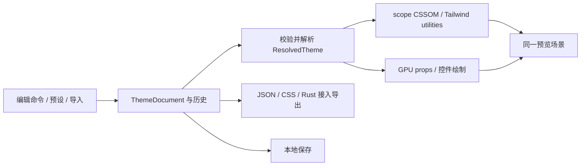

# THEME-STUDIO · Rustify UI · Tailwind v4 主题系统与主题编辑站

> **实施须知：直接依据本计划、仓库规则和当前代码实施或续做。** 先读下方「实施者定位」「实施进度」，核对工作树，再按相关正文与里程碑推进、验证并回写进度；使用 goal 执行时也遵循这些约定。
>
> **计划状态：Proposed**
>
> 调查基线：2026-10-03 · `5bf63423b1e1474df2cbd2b7780c0295e0553458` · 核对开始时工作区 clean；主题兼容与测试契约事实来自该工作树。
>
> 本期交付：**可复用的 Tailwind CSS v4 主题模型、DOM/GPU 同源运行时，以及尽量完整复刻 tweakcn 本地编辑体验的 Rust/Leptos demo site**。
> 本期独特职责：现有目录只演示组件与浅深色切换；本期交付可编辑、可保存、可交换、可直接接入应用的主题。
> **顶层排除：AI、账号、云端同步、社区、支付、外部网站注入预览、第三方设计工具集成与 Tailwind v3。**

## 实施者定位

执行本计划的 agent 是**资深软件工程师**，依据本计划、仓库规则和当前代码实施。

- **表达与源码**：报告用路径、需求/检查/里程碑 ID 定位，不复述计划。源码不放需求编号、agent 标记或规划元数据，注释解释必要原因；追溯放记录或提交说明。
- **完成的定义**：本里程碑退出检查全部通过才能记完成；未运行、失败、环境缺失分别记缺口，不冒充通过。集中到阶段收口的终验由收口里程碑负责，通过前不宣称整期或跨期需求已验收。
- **工作顺序**：需要行为测试的改动先红、再绿、再重构。按实际前置成果及检查推进，不等无关终验，数据、安全、发布及用户分期门不得绕过；稳定契约下可用 fixture 开发，不能替代真实集成。按 §9 执行局部检查与集中验收，同环境走查可合并；相关代码、配置、依赖、输入与环境未变可引用已通过证据，否则重跑受影响检查，收口仍跑必要集成回归。
- **并行交付**：独立任务在收益超过委派/集成成本且工具可用时使用 subagents，模型默认继承。任务说明只给目标/ID、稳定契约、可写与禁改路径、运行资源和检查；共享文件单人负责，数据库、端口、浏览器等隔离或串行。子 agent 返回结果、路径、验证证据与缺口，默认不另写任务文档；主 agent 审查并集成验收。边界变化先回报，失败只阻塞依赖任务；结束对话前收集或停止仍在运行的任务。

## 实施进度（实施期持续更新）

本节是跨对话恢复的**唯一汇总入口**，协议文字不随实施改写，实施期只更新「恢复快照」和「完成记录」。续做时先读仓库规则、本节、当前任务相关正文与依赖，再核对 `git status` 和相关 diff；记录与工作树不符时先查明原因，不凭记录覆盖用户改动，也不凭代码存在推断验收已通过。只有继续未完任务、核验前置验收、排错或审查时，才按链接读取对应记录的相关部分；不要默认加载全部记录或原始日志。

**回写时机**：里程碑完成后立即回写，再报告完成或提交；下游只需部分成果时，所需前置检查通过并在记录保存证据即可推进。实质进展后受阻、暂停、交接、发现偏差或结束对话时也保存成果与缺口；普通子任务切换不单独回写。

**一次回写**：主 agent 更新对应记录，再同步快照变化字段和完成记录一行，不重写无变化内容或追加流水。快照写当前任务、进展与下一步，命令及证据只进记录。首次回写删占位行，每个已记进展的里程碑恰好一行，状态仅「进行中 / 阻塞 / 已完成」；完成时移至已完成行末，最近完成取该行。更新时间带时区，摘要 1–2 句，记录填相对计划的链接（如 `[M1 记录](FEATURE.records/M1.md)`）。范围、决策、接口、数据、风险或退出条件有偏差时，就地修订对应正文，不追加勘误历史。

**独立记录**：按需建 `<计划名>.records/M<n>.md`，头部写计划链接、更新时区、状态及验证基线（commit SHA；未提交写 dirty@起始SHA 与关键改动路径）。正文只写交付行为/路径、必要偏差、未完项与继续动作；验收按 `检查 ID/覆盖范围 | 命令或步骤 | 结果/必要证据` 记录，共同环境和基线在头部写一次，有差异再单列。同一测试组可覆盖多条退出条件，须逐条可追溯；引用原证据与复用依据，不复制断言全文、成功日志或调试流水。未运行、失败、环境缺失明确区分；只有复杂交接、排错或证据需独立保存时才另建任务记录/日志/截图并链接。

**回写后自查**：每次回写后直接核对以下条目：「当前进度 n/N」的 N 等于里程碑总数，n 只计状态为「已完成」的行；「最近完成」对应最后一条已完成记录，不按编号推算；链接指向已落盘文件。上述结构、计数与链接检查不证明验收真实通过。

### 恢复快照

- 最近更新：尚未开始
- 当前进度：0/6 个里程碑完成
- 当前状态：尚未开始
- 最近完成：无
- 下一步：M1 · 固化主题格式、参考数据和兼容基线，通过 V1
- 当前阻塞：无产品范围待决；本机编译及浏览器环境尚未完成体检，执行 M1 时核对
- 代码基线：`5bf63423b1e1474df2cbd2b7780c0295e0553458`

### 完成记录

| Milestone | 状态 | 更新时间 | 简要记录 | 实现与验收记录 |
| --- | --- | --- | --- | --- |
| — | — | — | 尚未开始任何里程碑 | — |

本仓 `CLAUDE.md` 将里程碑证据归入 `docs/validation/`：本计划的独立记录落在 `docs/validation/theme-studio/M<n>.md`，链接相对本计划填写，例如 `[M1 记录](../validation/theme-studio/M1.md)`。首次产生实施事实时再创建记录文件。

## 0. 需求、范围与决策

### 0.1 需求与约束账本

本计划属于 SDK 横向增量与新示例应用。用户在 2026-10-03 确认「尽量完整复刻 tweakcn 的编辑体验」「DOM 与 Makepad GPU 同一套主题」「先完整复刻本地编辑体验，在线服务后续做」。以下拆解为拟定的交付契约，功能细目以 §4 为准。

| ID | 类型／来源 | 内容 | 设计／验收落点 | 状态 |
| --- | --- | --- | --- | --- |
| R1 | 用户要求 | Tailwind v4 主题成为 SDK 可复用能力 | §2–3、§5.1；V1–V3 | 已确认 |
| R2 | 用户确认 | 同一主题驱动 DOM 与 GPU，覆盖颜色、尺寸、字体、阴影 | §5.2–5.3；V2–V3、V6 | 已确认；呈现边界见 §5.3 |
| R3 | 用户确认的本地编辑范围拆解 | 预设、双模式、颜色格式、批量调色、排版、尺寸、阴影、撤销重做和恢复 | §4、§5.4；V4 | 本计划设计 |
| R4 | 用户要求 demo site 的具体化 | 可交互场景、组件能力展示、拾取 token、响应式预览 | §4、§6；V4、V6 | 本计划设计 |
| R5 | 本地编辑闭环 | CSS/JSON 导入、CSS/JSON/Rust 接入导出、本地命名保存和恢复 | §3、§5.5；V5 | 本计划设计 |
| NFR1 | `AGENTS.md` 与既有主题契约 | 作用域隔离、严格 CSP、无外部服务依赖、输入失败不破坏当前主题 | §5、§7–8；V2、V5、V6 | 已知 |
| NFR2 | 编辑器热路径 | 连续编辑不重建 wasm/region；每帧至多提交一个最新主题快照，测量更新延迟 | §5.4、§7；V4、V7 | 机制已定，延迟基线未知 |
| NFR3 | 仓库 UI 规则及现有 contrast tests | 编辑壳、默认主题可用且可键盘操作；用户主题给出对比度诊断 | §6–7；V3、V6 | 已知 |
| C1 | `mise.toml`、`Cargo.toml` | 复用 Rust/Leptos/Makepad 和固定 Tailwind 4.1.13，无 Next.js 运行时 | §0.2、§1.2；V8 | 已确认 |
| C2 | `README.md`、`CLAUDE.md` | 保持现有示例、旧 Theme API、静态托管与无前缀 utility 使用方式 | §3.2、§5.1；V1、V2、V8 | 已确认 |
| C3 | `CLAUDE.md`、`.gitignore` | `ref/` 仅供参考，产物及干净 checkout 不依赖它；证据放 docs/validation | §4、§8；V1、V8 | 已确认 |
| C4 | `AGENTS.md`、`CLAUDE.md` | 不安装缺失服务、不擅自开分支；Playwright 单 project 串行；必须真实浏览器验收 | §9–10；V6、V8 | 已确认 |
| A1 | 推定的使用者 | 主要面向应用开发者与设计人员，首要任务为选主题、调整、验证、导出 | §6；M4 走查主路径，产品负责人可修订文案 | 非阻塞假设 |

### 0.2 决策表

| # | 决策点 | 选择 | 含义与依据 |
| --- | --- | --- | --- |
| D1 | 站点形态 | 新增 `examples/theme-studio`，走现有 wasm 静态构建 | 新站用真实 Rustify 组件和 GPU；现有 component-catalog 保持独立回归入口 |
| D2 | 事实来源 | 版本化 `ThemeDocument` → 一次解析得到 `ResolvedTheme` → DOM/GPU 两个投影 | 保留作者输入与编辑元数据；运行态使用统一数值，禁止 GPU 从 CSS 反查颜色 |
| D3 | 兼容 | 增量 API，保留现有 `Theme`、`ThemePatch`、`ThemedScope` | 旧 Color 是不透明 u32，Theme 是 Copy 且 name 是静态字符串；直接扩成动态文档会破坏调用方 |
| D4 | 颜色 | 支持 HEX、RGB、HSL、OKLCH 与 alpha；编辑值保留，预览统一映射到 sRGB | DOM 与 WebGL2 可比较；超色域给诊断，不让 DOM 显示广色域而 GPU 静默截断 |
| D5 | Tailwind 接入 | 现有 sdk.css 补 token，另加可选 `theme-v4.css`，utility 读取 scope 运行变量并保留旧值 fallback | 一份 CSS 内由 provider 选择尺寸/阴影语义；主题编辑站显式采用新入口，旧应用无需迁移；具体映射见 §5.1 |
| D6 | 场景隔离 | 编辑壳与预览是同一 wasm 内两个并列 scope，共用应用拥有的编辑状态 | 修改预览颜色不会使编辑工具失去可读性；overlay 仍归各自 scope |
| D7 | 本地保存 | 一个版本化 localStorage 文档包，包含当前草稿、命名主题和偏好 | 数据量有界、无需 IndexedDB/服务端；写入失败保留内存和下载出口 |
| D8 | 参考利用 | 移植交互与 token 语义；固化本地内置预设数据，Rust 重写行为 | 不引入 React、Zustand、数据库、支付与在线依赖；来源和差异可追溯 |
| D9 | 视觉方向 | 继承 tweakcn 的工具布局，加入 DOM/GPU 预览切换 | 用户明确要求复刻编辑体验；采用 Operate 工作界面，无额外营销首页 |

### 0.3 ADR-lite

**ADR-1 · 单一 Rust 主题内核，保留旧运行时 API。** 候选 A 是把现有 Theme 扩成完整主题并迁移全部调用方；它入口少，但破坏 Copy、u32 与结构体字面量，且字体和 alpha 引起连带修改。候选 B 是保留旧 API，在同一主题模块增加文档、解析和新 provider；代价是存在两组公共入口，需要明确迁移说明。选择 B：新入口服务新站与后续应用，旧入口通过单向 `Theme → ThemeDocument` 转换升级，禁止有损地把完整文档自动降回旧 Theme。若所有仓内外调用方均迁移且进入明确的破坏性版本，再评估删除旧入口。状态：Proposed。

**ADR-2 · Rust/Leptos 编辑站。** 候选 A 为移植 tweakcn 的 Next.js 前端，嵌入 Rustify 预览；能够复用较多界面，但增加两个框架、跨运行时同步与两套构建。候选 B 为纯 Rust/Leptos 重写本地工作流，直接复用现有组件与 props 流；移植成本更高，但能真实检验 SDK，静态产物沿用现有链路。选择 B。仅在后续要求完整在线产品并有独立 Web 前端团队时重审。状态：Proposed。

**ADR-3 · 统一 sRGB 呈现与显式字体解析。** 候选 A 让 DOM 使用任意 CSS 色域和系统字体，GPU 自行近似；接入快，但同一主题容易表现不同。候选 B 在运行态统一颜色和尺寸，并通过固定字体目录给两端相同资源；保留作者的原始颜色和 font stack，无法准确呈现时显示诊断。选择 B。代价是色域映射、字体目录与 GPU 字距扩展；本期不承诺不同文本引擎逐像素相同。后续新增广色域渲染或任意字体加载需求时重审。状态：Proposed。

### 0.4 职责与事实所有权

| 层 | 拥有 | 边界 |
| --- | --- | --- |
| SDK theme 模块 | 类型、校验、转换、token 解析、CSS/JSON 编解码、两端共用快照 | 不拥有选中预设、撤销栈、保存列表、URL 状态 |
| rustify-components | token 对应的 utility 与组件消费、主题适配 | 不建立第二份运行态主题 |
| GPU 控件／Makepad 文本层 | 应用快照、绘制、字体资源解析和文字度量 | 不读 DOM 样式、不保存另一份可编辑数据 |
| theme-studio | 编辑状态、预设目录、历史、本地保存、示例场景、导出 UI | 不把演示业务、账号或社区模型塞进 SDK |
| xtask／静态 host | 已编译样式、wasm、资源和 manifest 的打包 | 不在浏览器启动 Tailwind 编译器 |

### 0.5 明确不在本期

在线服务按用户确认延期；相应菜单不显示假按钮。外部 URL/任意 HTML 注入预览、Google Fonts 在线目录、Figma/v0/MCP 一键发送另立后续计划。内置场景中的登录、邮件、账单等仅为有状态的本地演示，不接真实业务。完整文档门户、营销站、部署到公开域名及 npm/crates 发布不属于本期交付；本期提供静态可部署目录与接入指南。

## 1. 当前事实与改动面

### 1.1 现状与缺口

- **已核实·足够**：`crates/rustify-ui/src/theme.rs` 的 Theme 有 19 个颜色和 4 个度量/动效属性，`properties()` 输出 23 个 CSS 变量；`ThemedScope` 经 CSSOM 写 scope root，`data-theme` 是模式标记；`ThemeOverride` 只写 patch 指定属性并清除取消项。
- **已核实·缺口**：现有 `ThemePatch` 只有 7 个可覆盖属性；没有完整 light/dark 文档、动态主题名、alpha、chart/sidebar、独立 card/popover 前景、字体族或阴影。新增完整文档和解析模型，避免编辑后信息丢失。
- **已核实·足够**：`crates/rustify-components/css/sdk.css` 使用 `@theme inline`，utility 无前缀；`rustify.tailwind.css` 不带 preflight，显式 `source(none)`；`xtask/src/build.rs` 自动编译示例自带的 tailwind.css。
- **已核实·缺口**：sdk.css 将 Tailwind 间距内联为 0.25rem，scope 的 `--spacing` 是 8px 布局 gap；圆角 sm/md/lg 是 r−2/r/r+2。参考输出则把 spacing 用作 utility 单位，圆角 sm/md/lg/xl 是 r−4/r−2/r/r+4。不得直接覆盖旧定义。
- **已核实·缺口**：`crates/rustify-ui/src/gpu/button.rs` 等以 u32 palette 更新；`gpu/mod.rs` 使用固定字体和部分固定尺寸。`examples/component-catalog/src/catalog_region.rs` 手工把 Theme 字段送给各控件，不是完整主题应用接口。
- **已核实·缺口**：`makepad/draw/src/shader/draw_text.rs` 的 TextStyle 有 font_family/font_size/line_spacing，没有字距；`makepad/draw/src/text/font_family.rs::get_or_shape` 把 letter_spacing 写死为零，底层 `shaper.rs` 已有对应参数和处理。要把主题字距落实到 layout、cache key、shape 与 hit geometry 的同一链路。
- **已核实·缺口**：`crates/rustify-ui/src/overlay.rs::Layer` 通过 Portal 放到 scope overlay root；局部 patch 的 DOM 祖先关系不会随 Portal 保留。新增主题边界必须将有效主题响应式投影到浮层，而不是只验证普通子树。
- **已核实·足够**：ColorField/Draft、NumberField、Slider、Select、Dialog、Tabs、Splitter、文件与剪贴板等已存在，可组合编辑站。ColorField 当前只解析 HEX，格式切换和二维色板需要本期补充。
- **已核实·约束**：`docs/plan/DX-REFINE.md` 仍有未完成的人工走查与收口记录；本计划复用代码能力，不替其宣告验收完成。其 spacing 与测试分层决策继续有效。
- **未实测**：本机工具链与浏览器环境尚未完成当前基线的体检，新站尚无实现。M1 使用既有 doctor 确认工具链激活及依赖，不把源码调查写成运行通过。

### 1.2 拓扑与文件清单

所有带 ★ 的路径均为拟新增，不代表当前存在。

| 路径 | 变更与负责人边界 |
| --- | --- |
| `crates/rustify-ui/src/theme.rs`、★ `crates/rustify-ui/src/theme/` | 保留旧类型；新增 document/color/resolve/codec/provider 分工，导出集中在现有 `src/lib.rs` |
| `crates/rustify-ui/src/gpu/`、`crates/rustify-ui/src/overlay.rs` | 新快照的控件样式入口、alpha、字体、度量、阴影和浮层主题继承 |
| `makepad/draw/src/shader/draw_text.rs`、`makepad/draw/src/text/` | 仅为字距传递、cache key 与测量一致性做必要扩展，默认零保持旧行为 |
| `crates/rustify-components/css/sdk.css`、★ `crates/rustify-components/css/theme-v4.css`、`crates/rustify-components/css/rustify.css` | 语义 token、可选动态尺寸入口和 SDK CSS 再生成 |
| `crates/rustify-components/src/` | 按实际使用修正 card/popover、字体、阴影等 token 消费；不整体重画组件 |
| ★ `examples/theme-studio/` | Cargo.toml、src 下 editor/persistence/presets/previews、index.html/app.js/app.css/tailwind.css；全部为新站 |
| ★ `examples/theme-studio/vendor/tweakcn/` | 归一化预设、原始数据摘录、来源摘要与 LICENSE；正常构建不读 ref |
| `Cargo.toml`、`Cargo.lock`、`crates/rustify-ui/Cargo.toml` | workspace 成员与主题编解码的直接依赖；serde/serde_json 使用锁文件现有版本，按需 feature 化 |
| `xtask/src/sources.rs`、`sources.lock.json` | 登记参考数据与字体来源；沿用现有 vendor 校验结构；Makepad 修改按现有 drift 规则归因 |
| `playwright.config.ts`、`tests/browser/support.ts`、★ `tests/browser/theme-studio-*.spec.ts` | 新 project、共享 page/reset fixture、主题专属回归 |
| `.github/workflows/verify.yml`、`.github/workflows/evidence.yml` | 新站独立构建与测试项，度量进入 evidence，避免重复构建 |
| `README.md`、`docs/quickstart.md`、`docs/architecture.md`、★ `docs/themes.md` | 接入、格式、兼容、启动与导出使用说明 |



## 2. 模块、接口与依赖

以下为新增契约名称，具体 Rust 文件内部拆分可随实现收敛，公共行为不可偷偷缩减。

| 模块 | 接口与不变量 | 调用者／依赖与验证 |
| --- | --- | --- |
| 文档与 token | `ThemeDocument { schema_version, id, name, styles: { light, dark } }`；每种模式是完整的主题值 | SDK 应用、编辑站；纯 Rust，V1 |
| 解析 | `resolve(document, mode, context) -> Result<ResolvedTheme, ThemeError>`；context 含 rem 基准、reduce-motion、可用字体目录；结果包含诊断 | 同一结果给 CSS 和 GPU，禁止各自转换；V1/V3 |
| 颜色 | `parse_color`、`format_color`、`to_srgb`；明确支持格式和 gamut 策略，拒绝非有限数 | 编辑器与导入导出共用；不依赖浏览器 computed style；V1/V5 |
| DOM runtime | 新 `ThemeScope(resolved)` 与 `use_resolved_theme()`；一个 scope 只允许一个主题拥有者 | 不与 ThemedScope 同时驱动同一 root；V2 |
| 局部覆盖 | 新 `ThemeBoundary(patch, children)`，全 token 的稀疏 patch；不切换 light/dark 模式 | patch 解除恢复外层；旧 ThemeOverride 保持原行为；V2 |
| GPU runtime | 各 Rustify GPU 控件增加 `apply_theme` 或等价入口，接收解析后的颜色与度量 | 保留旧 set_palette；新站不逐控件手工凑颜色；V3 |
| 文档编解码 | `import_json`、`import_css`、`export_json`、`export_css`；导入返回候选与告警，用户应用后才替换状态 | SDK 共用、无业务存储；V5 |
| 编辑状态 | `dispatch(EditCommand)`、`begin/update/commit/cancel_gesture`、undo/redo/reset | 仅站内；状态机直接测试，不做通用 command bus；V4 |
| 本地存储 | `load/save` 一个版本化数据包；成功后才显示已保存 | 站内 browser localStorage，单一实现；V5 |

不新增独立主题服务或 adapter 框架。共享主题模块确实集中格式解析、两端投影、序列化和兼容策略；编辑器专属能力留在 example，避免只为一个调用方造公共模块。

## 3. 数据模型与兼容

### 3.1 文档格式与 token

`schema_version = 1` 为本期设计。主题身份 id/name 使用拥有所有权的字符串；模式是独立枚举，不再拿名称作为暗色条件。完整 JSON 要求 light/dark 均存在；部分 CSS/预设在导入阶段补齐，输出记录补齐项。未知 schema version 拒绝，未知 token 列告警，已知字段类型错误拒绝整次导入。

| 类别 | token 与语义 |
| --- | --- |
| 基础颜色 | background/foreground；card/card-foreground；popover/popover-foreground；primary、secondary、muted、accent、destructive 及各自 foreground；border/input/ring |
| 数据与侧栏 | chart-1…5；sidebar、sidebar-foreground、sidebar-primary、sidebar-primary-foreground、sidebar-accent、sidebar-accent-foreground、sidebar-border、sidebar-ring |
| Rustify 扩展 | success/warning，沿用现有语义；body font-size、layout-gap、reduce-motion 为 Rustify 扩展，CSS 导出保留命名空间 |
| 排版 | font-sans/font-serif/font-mono 字体栈；letter-spacing，单位 em；font-size 以 CSS px 表示 |
| 几何 | radius 支持 px/rem；spacing 表示 Tailwind utility 基础单位，独立于 legacy layout gap |
| 阴影 | shadow-color/opacity/blur/spread/offset-x/offset-y；派生 2xs、xs、sm、默认、md、lg、xl、2xl 阴影层列表 |

文档以已校验的作者值持久化，运行态含浮点 RGBA、像素尺寸、字体解析结果与结构化阴影层。原始 OKLCH 值不会因切换显示格式而反复量化。UI 的字体、radius、阴影几何、字距和 spacing 默认同步编辑两种模式，与参考 `COMMON_STYLES` 对齐；shadow-color 与普通颜色按模式编辑。导入的两模式公共值如有差异，保留并标注；用户首次编辑公共字段时明确同时应用，不静默以 light 覆盖 dark。

拟定输入限制：单次 CSS/JSON 256 KiB、主题名 80 字符、本地命名主题最多 100 个、撤销 100 步。这些是本计划的资源边界，不是现有事实。颜色与尺寸拒绝 NaN/Infinity；alpha/opacity 必须在 0…1，radius/blur 不为负，spacing/font-size 为正；任一尺寸解析后的绝对值不得超过 4096 CSS px，字距范围沿用参考控件的 −0.5…0.5em。边界错误保留草稿并显示字段级反馈，不把整个预览变为错误页。

### 3.2 旧 API 与 CSS 的兼容窗口

1. **Expand**：旧 Theme/ThemePatch 的字段、Copy、默认颜色与 `properties()` 契约保持；新增 `ThemeDocument::from_legacy(light, dark)`，不使用泄漏字符串解决动态命名。
2. **默认补齐**：card/popover foreground 继承 foreground；chart/sidebar 使用具名默认方案；新文档新增阴影默认无阴影；字体和尺寸采用旧行为兼容值。语义色新增变量的默认值必须保留旧画面；新尺寸/字体/阴影运行变量只由新入口提供，旧 scope 不写这些变量，utility 使用 §5.1 的旧值 fallback。旧 Dialog 的 shadow-lg 等已有阴影不得变为 none。
3. **显式升级**：新应用改用 ThemeScope/use_resolved_theme 与 theme-v4.css；CSS import 提供映射，ThemeScope 的运行变量才选择新公式，同一份 CSS 内旧 ThemedScope 继续使用旧公式。旧 use_theme/use_theme_values 只服务旧 provider；不伪装完整主题为有损 legacy Theme。接入文档给出两种入口及迁移示例。
4. **保留**：本期不删除旧 API、不强制升级五个既有示例。component-catalog 在同一页面的一份 Tailwind 产物内，以并列的旧 ThemedScope 和新 ThemeScope 增加验收 fixture，原默认路径保持；新 fixture 不另挂同名 utility 产物。
5. **回滚**：应用撤回新入口与 CSS import 可恢复旧主题；保存的主题 JSON 不被清理。localStorage 使用独立版本键，旧站点不读取或覆盖新格式。

## 4. tweakcn 参考矩阵与复刻边界

参考是本地源码快照，不是实时官网功能承诺。M1 将采用文件的内容哈希、来源路径和 preset keys 写入来源记录；不依赖 ref 的 git 历史存在。

| 参考能力与已读源文件 | 本期处理 | 验收 |
| --- | --- | --- |
| `ref/tweakcn-main/components/editor/editor.tsx`：桌面可调双栏、移动编辑/预览 Tabs | 保留结构和快捷操作位置；换 Rustify 身份；新增 DOM/GPU/并排模式 | V4/V6 |
| `ref/tweakcn-main/types/theme.ts`、`ref/tweakcn-main/config/theme.ts`：light/dark、COMMON_STYLES | 覆盖完整 token 集与公共字段编辑语义，保留 Rustify 扩展 | V1 |
| `ref/tweakcn-main/utils/theme-presets.ts`、`ref/tweakcn-main/utils/theme-preset-helper.ts` | 固化当前快照内置预设集；浅色按 default.light → preset.light 合并，深色按 default.dark → preset.light → preset.dark 合并；补 Rustify 现有浅深色预设；搜索/选择/重置/本地收藏 | V1/V4 |
| `theme-control-panel.tsx`、`colors-tab-content.tsx`、`color-picker.tsx` | 颜色分组、格式切换、数值/滑块/二维色板、alpha、逐字段重置、可读性诊断 | V4/V6 |
| `hsl-adjustment-controls.tsx` | 色相/饱和度/亮度批量调整与参考快捷预设；基于手势起点计算，避免累计漂移 | V4 |
| `theme-control-panel.tsx`、`shadow-control.tsx` | 三类字体栈、字距、radius、spacing、六项阴影参数和尺寸示例 | V3/V4 |
| `ref/tweakcn-main/store/editor-store.ts` | undo/redo/checkpoint/reset 的任务体验；采用显式事务合并连续拖动，修正新编辑必须清空 redo 的契约 | V4 |
| `theme-preview-panel.tsx` | Cards、Dashboard、Application、Marketing、Mail、Typography、Color Palette 场景；各自有真实本地交互 | V4/V6 |
| `theme-preview-panel.tsx`、`inspector-overlay.tsx` | 全屏、预览尺寸、DOM/GPU token inspector，点击定位左侧编辑字段 | V4/V6 |
| `ref/tweakcn-main/utils/parse-css-input.ts`、`css-import-dialog.tsx` | 粘贴/文件 CSS 导入，增加结构化诊断与原子应用；JSON 为 Rustify 完整格式 | V5 |
| `ref/tweakcn-main/utils/theme-style-generator.ts`、`ref/tweakcn-main/utils/shadows.ts` | Tailwind v4 CSS 输出与阴影派生；增加 Rustify scoped profile、JSON 与 Rust 接入示例 | V5 |
| `ref/tweakcn-main/store/editor-store.ts` 的 persist、编辑 action bar | 草稿恢复、本地命名保存/复制/重命名/删除；复制与下载反馈 | V5 |
| 在线生成、登录、社区、云分享、外部 Custom/v0/Figma 等 | 依 §0.5 延期；不做无法完成的假流程 | V6 检查无死入口 |

场景不要求每页的所有 DOM 控件再造一份 GPU 对等物；使用能力目录已有的 GPU 控件和新增主题样本板证明全部主题维度。各场景给出 DOM 页面，并在 GPU/并排视图显示该场景的控件、配色、排版和阴影样本；不支持的业务控件显示明确说明及 DOM 版本入口。主题覆盖完整与组件逐个 GPU 化是两件不同的交付物。

## 5. 核心机制

### 5.1 Tailwind v4 与运行时边界

utility 由构建阶段生成；运行时只改变量、模式与 GPU props。所有 class 写成静态完整字符串或有限映射，不拼 `bg-${token}`。引用变量的 utility 使用顶层 `@theme inline`；显式 source 保持仓库扫描边界。依据：[Tailwind theme variables](https://tailwindcss.com/docs/theme)、[source detection](https://tailwindcss.com/docs/detecting-classes-in-source-files)。在线文档会演进，语法最终通过固定 4.1.13 编译验证。

- sdk.css 补齐 token 和 fallback，但不改变旧间距与圆角档位；新增 card/popover foreground 等变量的默认值必须符合旧画面。
- theme-v4.css 是 **opt-in 扩展**，在 sdk.css 后导入。将 utility 的 `--spacing` 内联映射到 `var(--rustify-unit, 0.25rem)`，独立运行变量仅在 scope 内设置；legacy `--spacing` 仍代表 scope gap。新 token 的 layout-gap 映射到该 legacy gap，不能用 utility unit 覆盖它。
- 新入口将有效 radius 解析为像素 r，派生 `--rustify-radius-sm/md/lg/xl`，分别为 `max(0px, r−4px)`、`max(0px, r−2px)`、r、r+4px。theme-v4.css 的 inline 映射为 `--radius-sm: var(--rustify-radius-sm, calc(var(--radius) - 2px))`、`--radius-md: var(--rustify-radius-md, var(--radius))`、`--radius-lg: var(--rustify-radius-lg, calc(var(--radius) + 2px))`；xl 同样读取独立变量，fallback 保留固定 CLI 原有定义，不套用新公式。旧 scope 不写派生变量，即使页面导入扩展，sm/md/lg 仍为 r−2/r/r+2；旧默认 r=6px 时为 4/6/8px，新 scope 同 r 时为 2/4/6/10px。GPU 对应样本使用同一派生函数，不能只收一个原始 radius。
- 字体和阴影 runtime 变量使用独立 `--rustify-*` 名称，映射只放在 theme-v4.css，sdk.css 不把旧 utility 改为新默认。每个字体/阴影档位读取相应运行变量，缺值时 fallback 是固定 4.1.13 原有表达式，不引用映射变量自身。例如 shadow-lg 读取 `--rustify-shadow-lg`，缺值时保留原两层阴影及 shadow-color 覆盖语义；新 ThemeScope 明确写 none 才选择无阴影。映射仍复用 Tailwind 的 shadow/ring 合成，保留 shadow-none 与焦点 ring 行为；语义颜色继续保留标准名字方便交换。
- ThemeScope 通过 CSSOM 写入完整派生变量；ThemeBoundary 在局部 radius/阴影等依赖字段被覆盖时，从外层快照加 patch 重新解析并写相应派生值，外层变化时同步更新，不能继承一份与局部原值不同步的旧派生值。解除 patch 时移除相应局部派生变量，恢复外层继承。Layer 将创建位置的有效快照（含派生值）写到浮层节点并响应更新，不能只写原始 radius；卸载或同一 root 更换主题拥有者时清理该拥有者写入的运行变量。具体值不放入全局或所有 legacy scope 的默认规则。
- preflight 继续由应用决定，新站不引入全局 reset。主题具体值不得写入 documentElement、body 或 SDK 外宿主；theme mapping 允许生成顶层 Tailwind 配置，具体运行值只归 scope。保持一个页面只用一份统一编译的 Tailwind CSS，不能并挂两份同名 utility 产物（现有 docs/architecture.md Styles 契约）。
- CSS export 的「标准 Tailwind v4」profile 才使用 :root/.dark；「Rustify」profile 使用 scope 选择器和上述命名映射，且清楚提示动态应用应加载 JSON 进入 ThemeScope。不能在运行态内联值仍覆盖 CSS 时声称单贴 CSS 即可改主题。

### 5.2 解析、颜色与隔离

输入解析、公共字段更新和校验成功后生成文档 revision；按该 revision、mode、rem 基准和字体目录解析一次，DOM/GPU 消费同一不可变快照。rem 的基准读取页面 root 的真实 computed font-size；换算后的 CSS px 同时提供给 GPU，不假设所有宿主永远 16px。页面缩放/字号变化时重新解析；DOM 编辑壳自身尺寸不跟随预览 spacing。

颜色支持 #RGB/#RGBA/#RRGGBB/#RRGGBBAA、rgb/rgba、hsl/hsla、oklch 的有限 CSS 语法及 transparent；支持百分比 alpha 和常见逗号/空格写法。任意命名色、相对颜色、display-p3、calc/color-mix/var 链不作为 v1 的输入契约，遇到已知 token 的不支持值须报错，不回退黑色。

OKLCH 转换采用有固定测试向量的纯 Rust 数学实现，转换依据 [CSS Color 4 转换示例](https://www.w3.org/TR/css-color-4/#color-conversion-code)。本期 gamut 策略明确为转 sRGB 后逐通道裁剪并发出 out-of-gamut 诊断；alpha 独立保留。DOM 预览输出解析后的 rgb/alpha，GPU 使用同一 RGBA，混合前后与预乘约定在适配层统一。对比度按已合成背景计算，有未知底色时显示无法判定而不是给假通过。

新增 ThemeBoundary 的 patch 只覆盖具名字段，清空恢复继承；两个 preview scope 可同时有不同 mode。嵌套 boundary 不改变 mode，避免祖先 dark selector 穿透局部 light。Layer 捕获创建位置的有效主题 signal，将其写到浮层节点并响应后续更新；关闭后解除 effect/监听，scope 卸载与实例 abort 复用现有生命周期。

### 5.3 GPU 应用与字体、阴影

| 维度 | 本期必须实现 | 可观察的限制 |
| --- | --- | --- |
| 颜色／alpha | 控件与样本板读取 RGBA；实现新入口，保留 legacy u32 palette | 旧 API 本来不含透明度；新预览不能走有损旧接口 |
| 几何 | button/input/tab 等对应度量、radius 派生、间距单位与 focus/hover 状态更新 | 不强行让 switch 的胶囊、radio 的圆变成普通圆角矩形 |
| 字体族 | font slot → 同源字体资源目录 → DOM @font-face 与 GPU FontFamily | 原始未知栈保留在导出；预览两端回退同一个已打包字体并显示 requested/resolved 名称 |
| 字号／字距 | CSS px 与 Makepad point 单位显式转换；字距进入 shaping/layout/cache key | 验证中英文、组合字符与连字；不承诺浏览器与 Makepad 字形抗锯齿完全一致 |
| 阴影 | 同一结构化单层/双层参数投影为 CSS shadow 与 GPU 圆角阴影 shader | 模糊核允许有差异；offset/spread/opacity/radius 及裁剪范围必须正确，无色块假阴影 |
| 动效 | reduce-motion 关闭过渡，静态主题更新后回到 idle | 不做无变化时持续重绘 |

字体目录优先复用 `makepad/widgets/resources/` 与现有 FONT-LICENSES 中资源：提供可离线工作的 sans、serif、mono 槽位，目录只列实际随产物打包且两端验证过的字体。资源不足的类别需在 M3 补入有来源记录的字体资源；不通过网络字体接口扩大本期服务边界。未知字体不是导入失败，但可见告警；选择目录内字体必须两端真正换字体。字体资源由现有 Makepad 资源打包路径带入，DOM 链接到产物中的同一资源，禁止使用本机文件路径。

字距修改需要贯通 TextStyle → layout Style → FontFamily shaping 参数，并纳入 layout/shape 缓存键；直接绘制和测量必须一致。保留默认 0 和旧调用包装，不改无关文本算法。底层目前按 glyph advance 增加间距，实施时必须测试组合簇和连字，避免拆开重音或 emoji 序列；必要修正在同一文本改动内完成。

阴影在 Rustify GPU 图元层新增，优先复用现有 SDF 路径，避免全局改 Makepad 主题。先扩绘制区域再绘阴影和主体，扩大视觉边界不能扩大控件可点击区域；blur=0、负 spread、透明 shadow、边缘裁剪都要有断言。场景 GPU 图形（色板/图表/侧栏）也消费对应语义色，不把 chart/sidebar 只存到 JSON 就算完成。

### 5.4 编辑状态与历史

- 文档、选中模式、编辑分组、预览场景分开；切换模式/Tab/格式不进入主题撤销栈。预设应用替换完整文档；原主题可撤销，模式保留。
- 一个拖动/连续键盘调整是一个事务：begin 保存起点，update 实时预览，commit 入一条历史，cancel 恢复起点。任意新编辑清空 redo；no-op 不入栈。快捷键在文本输入/IME 组合时不抢浏览器的文字撤销。
- 输入中的非法半成品用 Draft 保存，继续展示最后有效主题；blur/cancel 恢复或提示。重复提交同值不 resolve、不写存储。
- HSL 批量调整默认作用于两种模式的颜色，明确标注作用范围；每次手势从起点颜色算，提交后下一次以上次结果为起点。neutral/grayscale 无 hue 的情况明确处理，不生成 NaN。
- 预览更新经可中止的 next_frame 合并为最新状态；DOM 与 GPU 使用同一 revision。GPU props 的更新不重新 mount region；切场景可替换内容，连续拖动不能销毁 canvas。
- checkpoint 用于判断与预设/上次保存的差异；显示「已修改」「已保存到本机」「仅保留在当前页面」等真实状态。重置是可撤销命令；覆盖/删除命名主题使用 DOM Dialog。

### 5.5 导入、导出与本地存储

**导入顺序**：大小/扩展名检查 → 文法解析 → token 白名单和数值校验 → 缺省补齐 → 展示变更与告警 → 应用为一个编辑命令。失败或取消不改文档、历史或已保存数据。

CSS 仅提取标准 :root/.dark 或本站 scoped profile 内的 custom properties；解析器须理解注释、引号、括号和 @layer 包裹，不能照搬参考中的简单正则。允许忽略文件中的正常 Tailwind import、@theme 映射及非主题规则，并列出未处理内容；绝不把原 CSS 注入 DOM、拉取 import/url 或运行脚本。已知主题 token 的 var/calc 等表达式拒绝并定位字段。重复字段遵循同模式最后声明生效并提示，完全没有可导入字段则失败。对 raw shadow-x/y 与文档 offset-x/y 做显式别名映射；仅有任意 box-shadow 字符串且无法恢复参数时告警，不声称无损导入。

导出提供：

1. **Theme JSON**：完整、版本化、保留作者颜色与双模式，是无损往返格式。
2. **Tailwind v4 CSS**：标准 profile 和 Rustify scoped profile，包含所有必要 token、@theme 映射、尺寸/字体/阴影与模式规则。默认颜色来自解析后 sRGB；可切 HEX/RGB/HSL/OKLCH 表达，但等价于同一解析颜色。原始广色域值仍保留在 JSON，并标明 CSS 输出已映射。
3. **Rust 接入片段**：加载导出的 JSON，调用文档解析与 ThemeScope，把 ResolvedTheme 传给 region；片段必须能在真实最小示例编译，不伪造动态数据为静态 Theme 字面量。

字体导出同时列出所需 family、资源文件和 @font-face 接入方式；下载 CSS 不等于字体字节已经嵌入。独立接入 fixture 使用随构建打包的同源字体；未知字体仅保留栈与回退说明，不伪称已打包。

剪贴板不可用时提供选中文本和下载；下载失败不显示成功。不把 Tailwind v3/shadcn registry/Figma 格式混入本期。

存储键拟定为 `rustify-ui.theme-studio.v1`；保存一个 envelope，含 envelope_version、draft、saved_themes、preferences。序列化和校验完成后一次 setItem，成功才更新持久化标志；连续拖动只在 commit 后保存。刷新恢复时先校验 version/内容；坏数据保留供用户导出，另起内存默认状态，显式重置才删除本站键。多标签页收到 storage 事件仅提示有其他版本，不自动覆盖当前草稿；用户选择载入/保留，两者都不进行静默合并。新版本另用键并保留旧键，本期不承担跨版本数据清理。

## 6. 前端与交互设计

### 6.1 页面结构与主路径

采用 tweakcn 已有的双栏工具布局：左侧预设搜索和 Colors/Typography/Other 分组，右侧顶部操作栏与场景 Tabs，下方主要空间展示效果。用户第一屏即可选择预设并编辑 primary；不先经过宣传首页。桌面分栏可拖动，左侧与预览分别滚动；窄屏改为「编辑／预览」切换，操作栏始终可达。

编辑壳继承 Rustify 默认中性表面和语义色，保持稳定的字号、间距、边框和焦点环；预览完整应用当前主题。只在需要分组、对齐或分隔时使用容器，避免把每项控制再包一层卡片。首个强调点是主题样本与真实预览，而不是大标题、装饰渐变或伪造指标。参考源码中的结构是依据；`ref/tweakcn-main/public/og-image.v050725.png` 仅能辅助理解样本卡片风格，不能当作当前编辑器全屏基准。

操作链：选预设 → 切浅/深色 → 调整 token → 在 DOM/GPU/并排视图核对 → 查看对比度/回退提示 → 保存到本机或导出 → 在最小 Rustify 应用使用。

| 区域 | 信息与关键行为 |
| --- | --- |
| 预设区 | 搜索、收藏、内置/本地来源、选中态、修改标记；无结果有清空筛选入口 |
| 颜色面板 | 按前景/背景配对，筛选 token；色板/通道/文本同步，未完成文本不丢焦点 |
| 排版与 Other | 三类 font stack、字距、半径、间距、阴影和 HSL；公共字段标记「浅深色共用」 |
| 操作栏 | undo/redo/reset、mode、保存、导入、导出；不可执行的操作禁用并有说明 |
| 预览区 | 场景、DOM/GPU/并排、宽度预览、全屏；卡片表单可输入、切换可操作、菜单弹层可打开 |
| Inspector | DOM 样本标记语义 token；GPU 报告 hit rect 与 token ids，选中后定位编辑项；Esc 退出 |
| 导入/导出面板 | 代码只读预览、格式/profile 选择、复制/下载、导入差异与错误位置；无实际成功不显示成功提示 |

Inspector 仅检查本站预览，不反编译任意网页或 shader。DOM 节点使用样本自身声明的 token 关系，GPU 使用绘制后报告的矩形与语义角色；滚动、缩放、DPR 和模式切换后更新位置。键盘可以从样本列表选择 token，不要求用户必须精确点击像素。

### 6.2 状态、响应式与可访问性

- loading：静态启动状态提示；GPU/字体初始化可以单独显示进行中，DOM 编辑器可继续操作。
- empty：预设无匹配、本地库为空分别有明确动作；不使用虚构保存内容填充。
- error：字段错误就地呈现；整次导入失败不清空原主题；GPU 不可用时保留 DOM 并标明 GPU 未就绪；存储失败保留导出入口。
- modified/saved：与 checkpoint 及真实存储结果对应，刷新恢复不伪装为云同步。
- 键盘：逻辑 Tab 顺序、可见焦点、原生输入语义、滑块 aria 值与方向键、Tabs 导航、Dialog focus trap/Esc/焦点返回；复用现有 Select，不另造失去可访问性的自绘下拉。
- 低对比度用户主题不污染操作壳；诊断告警不阻止用户导出自己想要的主题。内置 Rustify 默认主题及编辑壳必须通过现有文本/非文本 contrast 检查；参考预设保留原色并如实提示，不为了测试擅自改其颜色。
- 最小走查视口拟定为桌面 1440×900、平板 768×1024、窄屏 390×844；另测 200% 页面缩放。尺寸属于本期验收取样，不是新增设备支持承诺。
- 采用现有 Locale 机制提供中英文编辑壳；CSS token、代码和主题固有名称不翻译。长名称、空名称校验、错误消息和中文 IME 必须可用。
- reduced-motion 下关闭装饰过渡；无动画也必须显示即时状态反馈。浏览器只验证所用 Chrome 环境，不据此宣称完整移动/多浏览器支持。

## 7. NFR、安全与运行保障

| ID | 来源／目标 | 实现与可验证结果 |
| --- | --- | --- |
| NFR1 隔离 | 现有 scope/CSP 契约 | 两个 scope + 宿主未挂载元素同时存在，改主题不改变宿主 computed style；局部主题浮层正确继承；严格 CSP 零新增违规 |
| NFR1 输入 | 用户可导入 CSS/JSON | 不执行 CSS，不加载 url/@import；不允许字体字段闭合声明注入新 CSS；font stack 解析为 family 列表并规范转义；导出通过专用序列化生成而非直接拼用户文本 |
| NFR1 恢复 | 本地编辑不丢失有效状态 | 错误/取消导入、坏缓存、QuotaExceeded、剪贴板拒绝均有提示与可继续路径；只删本站数据 |
| NFR2 热路径 | 新站延迟 p50/p95 目前未知 | 相同 revision 不重复 resolve；每帧合并一次，GPU 不重建，事件 commit 后持久化。M1 建基线，M6 报告连续编辑前后数值 |
| NFR2 测量 | 仓库要求热路径前后数字 | 旧 catalog 与新解析链路的同类颜色更新；页面内记录 input→DOM 提交→GPU draw 确认的时间、resolve 次数、长任务、region 创建次数与 wasm 大小。GPU draw 确认不是显示器实际出光延迟 |
| NFR3 可用性 | 既有 contrast 测试和 UI 规则 | 默认壳普通文本 4.5:1、关键非文本 3:1（沿用 theme.rs 检查）；自定义配色显示诊断；完整键盘路径与错误恢复可用 |
| C1 依赖 | 已有固定工具链 | 不换框架、不升级 major；serde/serde_json 明确直接声明，不借传递依赖；不运行期编译 Tailwind |

本期对交互延迟不编造毫秒 SLO：上线验收至少要求结构约束成立、无持续输入 backlog、最终 revision 必达，且记录测量结果。若测量表明字体/阴影拖动造成明显阻塞，M6 不通过，先定位解析、props、shaping 缓存或重绘范围。新增依赖与字体资源同时报告构建产物尺寸增量；不复用旧小示例的包体数字作为新站阈值。

不引入后端、权限、租户或数据库，本任务也不是 Portal App；Portal 安装、onebox、token、HTTP 业务码不适用。控制台错误与 network/CSP 失败纳入验收证据；用户级诊断留在 UI，不加遥测服务或上传用户主题。

## 8. 失败模式、交付与回滚

| 触发 | 影响／数据后果 | 用户表现与检测 | 恢复与验证 |
| --- | --- | --- | --- |
| CSS 已知 token 无效、JSON 版本未知 | 当前导入不应用，原文档不变 | 字段路径/原因/警告列表 | 修正后再应用；V1/V5 |
| 超色域或未知字体 | 仅预览按统一策略映射，作者文档保留 | 可见 gamut/font 诊断、两端一致回退 | 选择范围内颜色或已打包字体；V3/V5 |
| CSS 默认与 Rust token 不一致 | 组件初始闪变或局部变色 | 默认值一致性测试、浏览器初始/稳定样式对照 | 修正源与生成 CSS 同一提交；V2/V8 |
| 浮层丢主题或选区跨 scope | 当前 menu/dialog 颜色错误，宿主可能受影响 | 双 scope + 局部 patch + overlay 测试 | 浮层应用有效快照，不写全局；V2/V6 |
| GPU 字体请求失败或上下文丢失 | 预览暂不可用，编辑文档仍在 DOM 应用状态 | GPU 单独错误状态，console/network 证据 | 现有 region 恢复链路重新应用最新快照；V3/V6 |
| wasm trap | 同实例编辑壳与 GPU 都终止，未保存内存可能丢失 | 复用 loader fatal/restart 提示 | 重启后恢复最近持久化草稿，明确未提交输入可能丢失；V6 |
| 存储拒绝、容量耗尽或坏版本 | 旧保存保留，新修改只在内存 | 真实失败提示，禁止出现已保存状态 | 下载 JSON、清理本站库或重新授权存储；V5 |
| 多标签页互相写入 | 持久化最后写入者生效，当前内存不自动替换 | storage 事件提示冲突 | 选择载入或另存，不静默覆盖当前草稿；V5 |
| 复制失败或下载取消 | 原主题无变化 | 失败反馈或保留导出面板 | 手动复制/下载；V5 |

交付顺序：文档与参考数据 → 新主题 API/CSS → GPU 适配 → 编辑站/本地交换 → 终验与接入说明。所有新能力经新入口启用，旧示例默认路径保留。示例采用现有 build-web 静态产物，包括 app.js/app.css/index.html、wasm、Tailwind CSS、字体和来源通知。

新增参考数据按 `sources.lock.json` 的 vendor 记录和校验机制纳管；复制或移植的 tweakcn 内容携带所读取快照的 LICENSE 和来源/修改说明，不把全仓许可证笼统改为参考项目的许可证。Makepad 原始来源哈希不为掩盖修改而刷新，drift 归因写在本里程碑记录。

公开部署目标未知，影响域名与缓存配置，不影响本期实现；本期只验证根路径和 `/tools/demo/` 下静态部署。后续真正部署时以同版本 manifest/wasm/CSS/字体为原子目录切换，旧目录保留便于回滚，不将不同版本文件混用。新站回滚不清理本地主题库。

## 9. 验证

### 9.1 检查组

| ID | 覆盖与可观察结果 | 入口与环境 | 执行时点 |
| --- | --- | --- | --- |
| V1 | R1/C2/C3：文档/schema、legacy 转换、全 preset 补齐、颜色向量/alpha/gamut、数值与名称边界；旧默认样式/颜色更新测量基线 | `mbx test -p rustify-ui --lib theme`；新增站点纯 Rust 单测；既有 theme 浏览器 spec 的改前运行 | M1；契约通过即可供后续开发 |
| V2 | R1/R2/C2/NFR1：固定 CLI 编译、token/default 一致、spacing 分离、radius 0、class 覆盖、双 scope、局部 patch 解除、overlay 随主题更新、strict CSP；同一产物下旧/新 sm/md/lg 与新 xl 符合 §5.1，旧浮层 computed box-shadow 保持 V1 基线；更新新 scope、局部 radius/阴影 patch 及解除时派生值/浮层同步，旧 scope 不变 | theme-studio DOM spec + component-catalog 并列旧/新主题 fixture；固定 4.1.13 生成一份 CSS 后实读 computed style；另核对仅 sdk.css 的旧入口 | M2；GPU 视觉无需在此提前通过 |
| V3 | R2：RGBA 实际填色/混合、非 16px root、字体替换与回退、字距缓存/测量、阴影参数与命中边界、GPU 恢复应用最新主题 | SDK/Makepad 单测 + theme-studio GPU spec + 实际截图；GPU 样本板读 draw revision 并核对像素和几何 | M3；最终组合场景在 M6 |
| V4 | R3/R4/NFR2：所有分组编辑、预设搜索/重置、两模式规则、undo/redo 分叉/手势合并、no-op、HSL 无漂移、全部场景交互、Inspector、编辑时 region 未重建 | `mbx test -p theme-studio --bins`（新增）；theme-studio editor spec 使用共享 page/reset | M4；用已稳定 resolver 可先开发，整里程碑退出需真实 DOM/GPU |
| V5 | R5/NFR1：CSS/JSON 导入成功/失败/取消、恶意输入不执行、往返、各导出 profile、保存恢复/覆盖/删除/坏缓存/多标签冲突、剪贴板失败；A 页真实保存后 B 页收到冲突提示，决定前 B 内存草稿不变，覆盖载入和保留/另存分支 | theme-studio codec 单测与 storage/export browser specs；每个持久化用例使用独立 fresh context，跨标签用例在该 context 中创建两个同源 page，共享 localStorage；不能仅人工 dispatch storage 事件代替真实跨页写入 | M5；依赖 V1 与编辑命令契约 |
| V6 | R2–R5/NFR1/NFR3：完整主路径，中英文、浅深色、三视口、200% zoom、键盘、低对比度、GPU/字体失败与恢复、无死按钮及 console/CSP 异常 | 已构建最新站点，Playwright 或现有真实浏览器通道；按 §9.2 记录 | M6 集中终验 |
| V7 | NFR2：页面内更新 p50/p95、合并数/region 数、空闲重绘、包体增量、一次长手势结束最终 revision 一致 | 主题站 evidence spec；真实 GPU 测绘制相关指标，结果与 V1 同环境基线比较 | M6；不在每次 PR 重复完整度量 |
| V8 | C1–C4/兼容：root 与 fork 检查、CSS/catalog/source 校验、全示例 release build、受影响旧例回归、新站根/子路径和导出接入 | §9.3 命令；Playwright project 逐个串行 | M6；中间里程碑跑受影响的局部集 |

### 9.2 浏览器终验与证据

从最新 `theme-studio` build 的首页进入，确认 manifest 对应当前构建。依次完成「选参考预设 → 修改 primary 与 alpha → 改字体/字距/圆角/间距/阴影 → 开预览 menu/dialog → DOM/GPU 并排 → undo/redo → 保存 → 刷新 → 导出 JSON/CSS → 新应用导入」。再在第二 scope 修改不同主题，核对第一 scope 与宿主不变。

至少保留桌面浅/深色的双端对照、窄屏编辑/预览、阴影与字体样本、导入失败以及导出后独立接入的证据。GPU 颜色在纯色内部取样，避开抗锯齿边缘；文字/阴影用同参数几何与人工视觉核对，不用一张全页像素差把不同字体引擎当成错误，也不只测 props 假装验证渲染。

导出验证必须脱离编辑站：在临时最小 Rustify 示例加载 JSON，并使用导出的 Rust 接入片段编译运行；标准 CSS profile 通过固定 Tailwind 编译后，在独立 HTML fixture 验证 light/dark、utility、字体与阴影；scoped profile 验证双 scope 和根/子路径资源。该 fixture 是验收设施，不增加另一个产品站点。

浏览器环境不可用时明确记「未在浏览器中验证」及所缺工具，不以 unit/build 成功替代。测试重用同一新站构建和共享页面；需要刷新、故障或跨标签的用例才用 fresh。基线、浏览器版本、GPU 类型和资源状态随记录保存。

### 9.3 实施期命令与 CI 接入

已有检查入口：

```sh
mbx xtask doctor
cargo fmt --all -- --check
mbx test --workspace --lib --bins
mbx clippy --workspace --all-targets -- -D warnings
mbx xtask sources verify
mbx xtask css --check
mbx xtask catalog --write docs/components.md --check
(cd makepad && mbx test)
(cd makepad && mbx test --manifest-path platform/script/Cargo.toml)
```

修改组件类或 SDK CSS 后先 `mbx xtask css`，再运行 `--check`。测试不能只跑 host：provider 与 GPU 路径受 wasm cfg 控制，需实际 release wasm build。

以下使用现有 xtask 命令形态，但 example/project 名需要本期注册后才可执行：

```sh
mbx xtask build-web --example theme-studio --release
mbx xtask serve --example theme-studio --release --spa
npx playwright test --project=theme-studio
mbx xtask report-size --example theme-studio --release --compressed
mbx xtask build-web --example theme-studio --release --base /tools/demo/
npx playwright test --project=theme-studio-deep
RUSTIFY_TIER=evidence npx playwright test --project=theme-studio --headed
```

开发 serve 省略 port 由现有工具选空闲端口。CI 在 `playwright.config.ts` 新增 theme-studio/theme-studio-deep、server 类型、serversOf 映射和 testMatch；拟分配 4181/4182，实施前核对现有配置及占用，不能只加 project 导致按需 server 失效。共享 fixture 识别 `window.__theme_studio.reset()`；测试用 reset 不删除用户存储，用隔离 browser context 保证持久化测试独立。

现有五个示例均构建一次。旧例浏览器回归最小集包含 component-catalog 的 p2-theme/p2-i18n/p2-a11y/p2-reflow/catalog-inputs、property-workbench 的 m6-theme 与相关表单、fusion-basic 的 m4-overlay、Vellum 的相关文字渲染与已有视觉基线；若 Makepad 字距默认路径发生变化，加跑依赖该路径的文本/编辑回归。新站完整主路径只在 V6 集中走查一次，修复后仅重跑受影响检查；不得并发运行不同 Playwright 命令。

## 10. 里程碑与验收安排

共六个可独立检查的交付切片。顺序优先保证共享契约和默认兼容，再组装编辑站，不以页面完成掩盖底层缺失。

| # | 里程碑 | 前置依赖 | 内容与并行边界 | 验证／退出条件 |
| --- | --- | --- | --- | --- |
| M1 | 主题内核与参考基线 | 本计划；工具链体检 | 文档/schema、颜色与度量解析、legacy 单向转换、固化全预设和来源、建立旧例主题基线；共享公共类型单人负责 | V1 通过，预设与必填 token 可解析，旧基线有记录；回写「实施进度」 |
| M2 | DOM 主题与 Tailwind 兼容 | M1 的类型/解析与 V1 | ThemeScope/Boundary、完整 CSS token、§5.1 的派生变量/旧值 fallback 与 overlay 同步；catalog 同产物旧/新 scope fixture；建立新站最小壳与 DOM 样本，注册 workspace/build/project；CSS/overlay 共享文件单人负责 | V2 通过，同产物旧圆角与浮层阴影保持基线，新站两 scope 可独立换肤；回写「实施进度」 |
| M3 | GPU 主题完整落地 | M1 的解析契约/V1；集成需 M2 最小站 | GPU style 入口、RGBA、半径/间距、字体资源、字距链路及阴影样本；GPU 控件与 Makepad 文本可分工，共享快照与字体目录一人集成 | V3 通过，所有主题维度实际绘制，恢复/回退有证据，Makepad 相关单测通过；回写「实施进度」 |
| M4 | 本地编辑器与场景 | 开发需 V1/V2；退出需 V3 | 预设、全编辑面板、历史、HSL、全部预览场景、Inspector、响应式和中英文；站内 editor 与 previews 可按稳定命令分工 | V4 通过，参考矩阵的编辑/预览行齐备，DOM/GPU 主链可操作；回写「实施进度」 |
| M5 | 主题交换与本地保存 | V1 和 M4 的编辑命令；UI 收口需 V4 | CSS/JSON parser/export、本地库/草稿、导入差异、下载复制和编译可用的接入片段；codec 与 persistence 可独立，保存动作一人集成 | V5 通过，独立应用可消费产物，失败不破坏当前文档，同 context 两个同源 page 的真实保存/冲突处理有证据；回写「实施进度」 |
| M6 | 全站终验与 SDK 交付 | V1–V5 及完整场景 | 最新构建统一浏览器走查、性能证据、兼容回归、根/子路径静态部署、CI 与指南；浏览器/GPU 资源串行使用，主负责人统一收口 | V6/V7/V8 通过，§0.1 与 §4 全覆盖，未验证项不记完成；回写「实施进度」 |

可在 M2 完成前按稳定 ResolvedTheme 契约开发 M3 纯 GPU 控件；不以 mock 样本代替最终浏览器验证。M5 的 codec 可在 V1 后先做，不等待全部场景；历史/保存动作整合必须依赖 M4 的命令约定。共享 Cargo/lock、公共导出、主题注册表、CSS 入口、字体目录、Playwright/CI 和本计划由主负责人单写。只有收益超过协调成本时再委派，不能并行占用同一个 browser 或改同一套 token。

不预填故事点或工期；最大工作量集中在 GPU 字体/字距/阴影和编辑场景迁移，M1 的 baseline 与 M3 的真实渲染证据用于后续排期，不用文件数量推算完成率。

## 11. 风险、开放问题与就绪状态

| 项目 | 影响 | 责任人与解除办法 | 最晚确认点 | 是否阻塞设计 |
| --- | --- | --- | --- | --- |
| 本机工具链与浏览器尚未体检 | 本地编译与 browser 验证可能无法立即执行 | 实施负责人按现有 mise 配置体检；缺服务遵仓库规则联系用户 | M1 开始 | 否；若依赖缺失则阻塞执行检查 |
| GPU 新字体/字距/阴影成本 | 主要实现风险；字体缓存和几何容易不一致 | M3 先做最小双端样本；字段必须进入真实绘制和 cache key，未通过不隐藏控制项假装完成 | M3 退出 | 否，已列明确实现任务 |
| 任意字体与广色域精确还原 | 参考主题可能在本地回退 | 按 §5.2–5.3 保留作者值、统一解析、可见诊断；若要求任意字体完全相同，需扩展资源加载范围 | V3/V5 | 否，本期契约明确 |
| A1 用户画像 | 文案和默认入口可能需要调整 | 产品负责人结合 M4 主路径修订，不改变主题契约 | M4 | 否 |
| 性能绝对 SLO 未提供 | 不能承诺未测的毫秒数 | 实施负责人记录 V1/V7 同机数字，满足帧合并/最终到达/无重建约束 | M6 | 否，不引入远程服务或容量承诺 |
| DX-REFINE 的既有人工缺口 | 旧能力的完整可用性证据并未全部关闭 | 只复用代码；本期相关键盘和主题路径在 V6 重验，原计划自行收口 | M6 | 否 |
| 公开域名/托管方未知 | 影响后续发布步骤 | 用户指定部署时另做部署操作；本期验证静态目录与子路径契约 | 实际发布前 | 否，本期不发布 |

- 最终状态：**Proposed**。
- 定级理由：用户范围已明确，同产物圆角/阴影兼容及跨标签测试契约已明确，当前没有产品范围或关键契约待拍板项；关键实现选择仍作为可评审提案等待非阻塞评审。工具链体检与 V1–V8 是实施门，尚无运行可行性或 UI 验收完成声明。

## 12. 已知坑与历史教训

- Tailwind `--spacing` 与 scope gap 同名，直接照搬参考会整体放大旧布局；依据 sdk.css 注释与 `docs/plan/DX-REFINE.md`，用新变量和 opt-in 入口隔离。
- 参考 `ref/tweakcn-main/utils/apply-theme.ts` 虽接受目标 element，`ref/tweakcn-main/utils/shadows.ts::setShadowVariables` 却写 documentElement；移植必须把阴影也限制到当前 scope。
- 参考 CSS importer 使用正则且会捕获错误后返回部分结果；本期用结构化候选、字段诊断和原子应用，不能带入静默部分成功。
- 参考 CSS 的圆角档位与 Rustify 现值不同；在旧 sdk.css 上原地替换会让全部示例变样。
- `ThemedScope` 用 Theme.name 写 data-theme；新主题显示名必须与 light/dark 模式分开，否则命名主题失去暗色 variant。
- Portal 改变 DOM 继承路径；核对 `overlay.rs::Layer` 的真实节点，而不是只检查 Leptos context 中有主题。
- Makepad 字号在 layout Style 中是 points，DOM 是 CSS px；字距还会影响 cache、换行与命中，不能只改 draw_text 的可见字形。
- `serve` 只服务已有产物，必须重新 build 后验收；依据 README.md 与 CLAUDE.md。
- `ref/` 被 gitignore；没有把预设/字体等必要数据纳入产物来源记录，开发机可用也不代表 CI 或用户 checkout 可用。
- 默认主题的对比度曾由 host tests 抓到问题（`docs/plan/P2-WASM-UI.md` M7）；保留这些行为检查，同时不要把所有参考预设未经测试地标为可访问。
